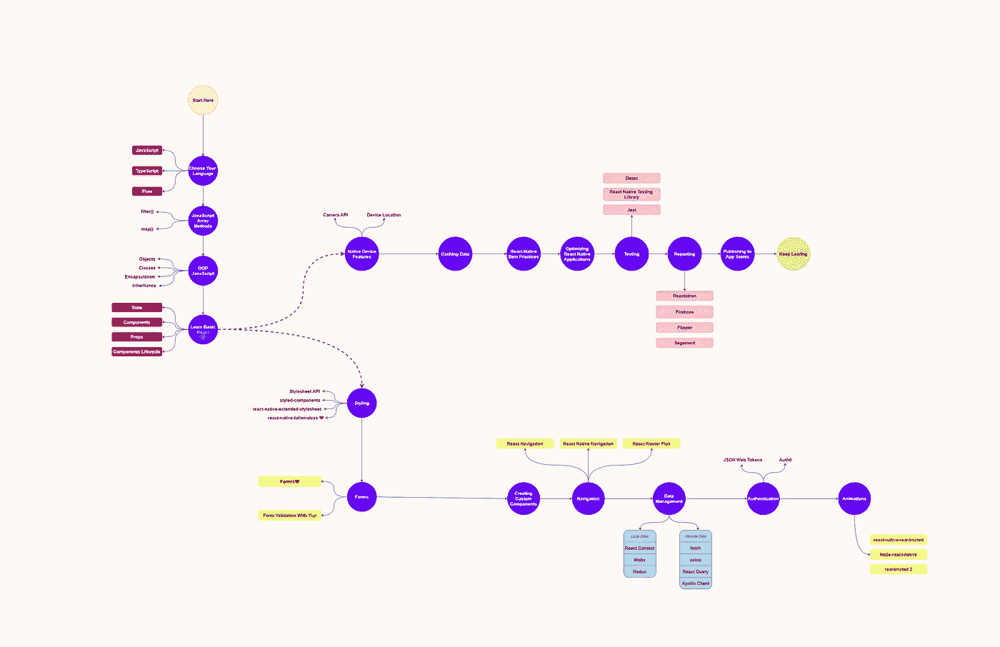
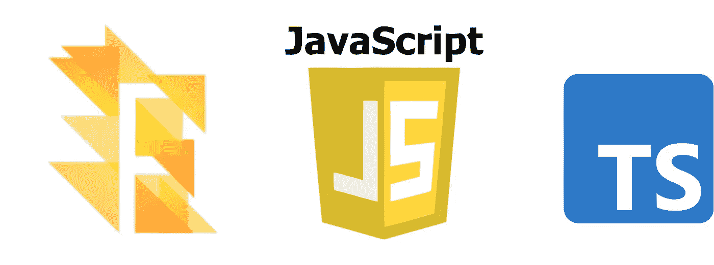
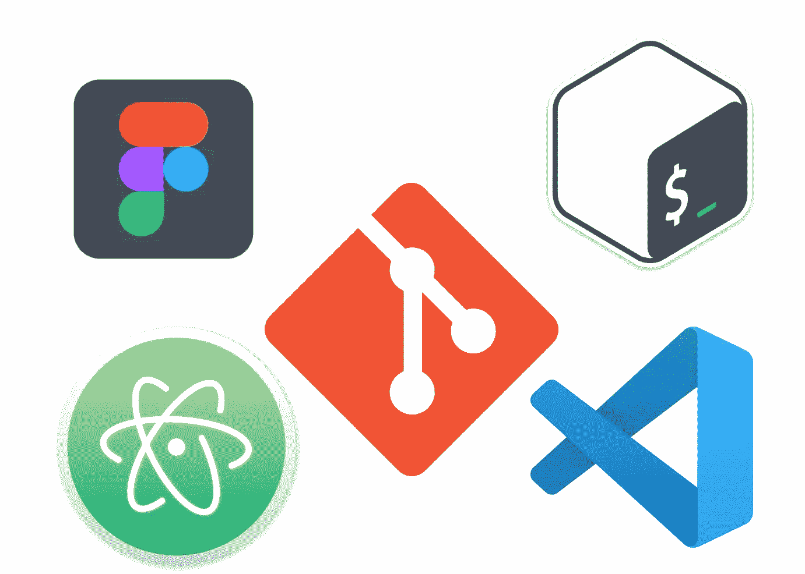

# 2021 年终极 React 原生开发者路线图

> 原文：<https://javascript.plainenglish.io/ultimate-react-native-developer-roadmap-for-2021-a34a2bf49699?source=collection_archive---------1----------------------->

## 从基础到部署跨平台应用

React Native 自发布以来发展速度越来越快，如果没有合适的资源和目标，学习 React Native 会变得非常混乱。如果你是一个完全的初学者，那么这个路线图将帮助你节省很多时间，因为我已经添加了我自己使用 React Native 的经验中的个人技巧，因为如果你是一个完全的初学者，有些时候你最有可能跳过一些重要的概念。

# 选择你的编程语言

## Java Script 语言

如果你是一个完全的初学者，对编程一无所知，建议你花大量的时间来学习 JavaScript。如果没有 JavaScript 的基本概念，您将只是在玩代码，处于一种试一试的状态。首先学习 JavaScript 的基础知识，一旦你完成了这些，我强烈建议你学习一些 JavaScript 的高级概念。

*   功能。
*   箭头功能。
*   模板文字。
*   条件运算符。
*   对象。
*   班级。
*   封装。
*   遗产。

*如果你是一名******JavaScript****的 web 开发人员，你不必投入太多精力，因为你有丰富的经验，一定能写出好的 JavaScript 代码。***

## **以打字打的文件**

**TypeScript 只是一种强类型的、**面向对象的编译语言，**由 *Ander Hejlsberg 设计。如果您是初学者，我不建议您学习 TypeScript，因为在构建企业级应用程序时更需要 TypeScript 来避免任何编译时错误。但是，当您获得了足够的 JavaScript 应用程序经验后，不要害怕学习 TypeScript。***

## **流动**

**简而言之，Flow 将成为 React Native development 的 TypeScript 的替代方案。在 React 项目中，TypeScript 感觉更自然，因为它与 create-react-app 和 **Material-UI** 进行了很好的集成，并对这两者提供了一流的支持。类似地，在 React Native project**中，通过在所有代码库中保持一致的代码样式和林挺规则，流程**在良好的支持下感觉更加自然。然而，Flow 有一些缺点、未记录的特性和版本变化。**

# **JavaScript 数组方法**

**在学习一些基本的 React 之前，一些 JavaScript 概念可以很容易地促进您的学习。我在学习 React Native 的时候，刚开始的时候，缺乏对 JavaScript 数组方法的学习，让学习路径有点千篇一律。这就是我推荐你学习 JavaScript 数组方法的原因，因为你将在 React Native 中大量使用 **Lists** ，掌握这些方法的简明知识可以轻松加快你的学习进度。**

*****学习以下 JavaScript 数组方法:*****

*   ****。map():** 在 React Native 中处理列表时，您会经常使用这个方法，因为这个方法会创建一个新的数组，其结果是为每个元素调用一个函数。**
*   ****。filter():** 这个方法在实现从数组中删除元素时非常有用，因为它创建了一个通过特定应用测试的新数组。**
*   ****。reduce():** 这个方法有时可以成为***map()&filter()***的替代方法，因为它将数组简化为单个值，并对数组的搜索值执行函数。**

# **基本工具**

****

## **1.末端的**

**作为一名开发人员，你应该掌握有助于你工作的工具生态系统，初学者通常会犯不学习终端工具的错误，我强烈建议学习终端如何在不同的操作系统上工作，以成为一名高效的开发人员。**

*   ****WSL:** 在基于 **macOS** 和**Linux**的机器上，我们有一个 **bash** 终端，这是我和开发人员最喜欢的终端之一，因为它提供了最好的内置工具，没有兼容性问题。在 Windows 上，我建议使用 **WSL/WSL2** 安装一个 **UNIX** 工作区，这将使您能够使用虚拟 UNIX 系统来快速完成工作。 [**这里的**](https://www.youtube.com/watch?v=-atblwgc63E) 是一个很棒的安装 WSL 和安装你将要使用的所有基本终端工具的视频。**

## **2.饭桶**

**当你作为一个初学者有更多的机会犯错误时，学习 Git 使一切变得如此容易。万一您弄乱了代码，现在您想恢复更改，Git 将为您服务。**

*   **如果您是初学者，建议您只学习一些 Git 基础知识，因为在真正的生产就绪应用程序之前，您不会使用 Git 的高级功能。**

## **3.设计工具**

*   **拥有设计技能对你来说是一个优势，在开发移动应用程序时，你需要构建线框，为此，你应该在 Figma 或任何制作线框的设计工具中学习一些基本的设计技能。**

## **4.文本编辑器**

*   ****VS Code:** 对于 React Native 来说，VS Code 是一个完美的文本编辑器，具有内置的调试器，是开发人员中使用最多的文本编辑器之一，它通过其扩展生态系统使开发变得容易。成为 React 原生开发者不一定要成为 VS 代码忍者，基本的文本编辑技巧和一些快捷键就绰绰有余了。**
*   **Atom: 我推荐使用 Atom 的唯一原因是因为它内置了包管理器和一个非常简单的用户界面，如果您对 VS 代码不太熟悉，Atom 将是您的最佳选择。**
*   ****Reactide:** 我个人并没有太多地使用 Reactide，但是它的一些特性是为 React 本地开发者指定的，这使得它成为一个很好的替代选择。**

> *****注意:*** *坚持使用一个让你更舒服的文本编辑器，而不是尝试其他所有新的。***

# **学习基本反应**

****

**React 概念的良好知识总是会带来优势，但是要开始使用 React Native，如果您知道下面给出的基本概念，您不必真正掌握 React。并且确保你对这些基本的 React 概念有很好的了解，否则，你将会一直很难使用 React Native。**

*   **状态**
*   **成分**
*   **小道具**
*   **组件生命周期**

# **式样**

**如果你有一些 web 开发方面的专业知识，那么你肯定应该看看 React Native 中的样式是如何完成的，因为 React Native 中的一些属性与 web 中的有很大不同。由于常规 CSS 样式表在 React Native 中无效，所以它与传统 CSS 非常相似。**

*   *****颜色、高度、上、右、下、左*** 等 CSS 基本属性在**样式表**中是相同的。**
*   **而其他属性如**字体大小、背景颜色**则改为**骆驼大小写**符号(**字体大小、背景颜色**)。**
*   **由于移动设备中没有悬停效果，因此 React Native 中不存在 *CSS* 悬停属性。相反，我们有**可触摸的**组件来响应触摸响应。**
*   ****flex-direction:** 行(web 标准)和 **flexDirection:** 列在 React Native 中。**

**一旦完成了 ***样式表 API，*** 就可以开始使用其他库来设计 React 本地应用程序了。**

# **形式**

**在这个阶段，你将能够构建可重用的组件，并用漂亮的颜色来设计它们。因为表单在现代应用程序中几乎无处不在，比如登录页面。React 社区中的开发人员构建了一些非常棒的库，使得轻松构建复杂的表单成为可能。**

## **福米克**

****

**它是一个小型的最轻的库，可以帮助您构建表单中令人讨厌的部分，**

*   **在表单状态中获取值和从表单状态中获取值。**
*   **验证和错误消息。**
*   **处理表单提交。**

**许多大型科技巨头在其网络和移动应用程序中使用 Formik，这使得它成为 React 生态系统中更受信任的库。然而，您可以使用 **React 钩子**构建表单，但是这种方法不适用于具有多个字段的大型表单。因此，建议学习 Formik，因为您将能够像专业人员一样处理表单。**

## **使用 Yup 进行数据验证**

**一旦你用 *Formik* 完成了基本表单的构建，你就必须处理表单中的数据验证。然而，您可以使用基本的 JavaScript 在表单中应用数据验证，但是当涉及到复杂的数据验证时，就不能像您为多个条件编写多行验证那样工作了。**

**有了 **Yup** ，你可以使用 Formik 轻松地在表单中应用数据验证，因为 Yup 拥有使用 Formik 的特殊支持，可以很快完成工作。**

# **定制组件**

**在这个阶段，你可以用不同的组件构建应用程序，有自己的风格，但你不能一直这样下去。随着应用程序的增长，您必须构建更多的自定义和可重用组件，以便您能够在应用程序中的任何地方使用它们。你不需要在这个阶段工作，因为你只需要很好地了解 **props** 如何在 React Native 中工作，这样你就可以构建非常棒的可重用定制组件。**

# **航行**

**你几乎找不到只有一个屏幕的移动应用程序。管理屏幕的显示和它们之间的转换是由所谓的导航器处理的。**

*   ****React 导航:**如果你是初学者，导航入门，那么推荐使用 *React 导航*。它提供了一种非常简单明了的导航解决方案，能够在两个 **Android & iOS 上堆叠导航和选项卡导航模式。****
*   ****react-Native-Navigation:**只有当你想在两个 Android & iOS 上实现原生外观，或者你只是将 React 原生应用集成到已经原生管理导航的应用中，那么使用*React-Native-Navigation*是一个不错的选择，否则你可以使用 *React 导航。***

# **数据管理**

****

**一旦你用 React Native 构建了一些有多个屏幕和导航的小项目，那么你应该学习如何在 React 生态系统中获取和存储数据。注意，如果你来自一个 **React.js** 的背景，那么你不必花太多时间到这个阶段。**

## **地方州**

**React Native 为您提供了许多管理本地状态的选项，您将在 React Native 中大量使用状态来构建真实世界的应用程序。在开始状态管理之前，请确保您对 React 中的**状态**的工作方式有很好的了解。**

*   ****React Context:** 当你没有太多状态需要管理时，它会在小情况下完成工作，React Context 会是你的朋友，因为它需要的代码量更少。但是不建议在真实世界的项目中到处使用 React 上下文。**
*   ****Redux:** 使用 Redux 你可以构建一个一致的应用程序，因为你不必将状态提升到父组件，你可以使用任何你想要的组件的状态。Redux 仍然很棒，但是，请随意搜索其他选项。**
*   ****Mobx:** 这是一个很棒的库，可以自由地管理状态，对于 **Redux** 和 **Mobx** 来说，如果你想使用真实世界的应用程序，你必须花大量的时间，因为这两个都有自己的概念，需要花时间去学习。**

## **远程数据**

*   ****Fetch API:** React Native 为网络部分提供 Fetch API，它提供了一个 JavaScript 接口，可以通过网络异步获取资源，这与用于相同目的的 **XMLHttpRequest** 非常相似。**
*   ****Axios:** 它是 React 开发人员喜爱且易于使用的 API 之一，因为它是一个**基于 promise 的 HTTP** 客户端，可以在 React Native 上使用，并且 React 很容易。**

# **认证和授权**

****

**几乎在任何地方，您都需要在您的应用程序中授权用户，并且不建议您自己构建安全的身份验证服务。对于这一部分，我们有 **Auth0** 来处理用户认证的麻烦。**

****Auth0** 是一个很棒的添加用户认证和授权的嵌入式解决方案，你可以用**用户名** & **密码或者**社交账户 **(** 比如**脸书**和 **Twitter)构建一个具有所有基本认证功能的应用。****

# **动画片**

**动画对于良好的用户体验来说是必不可少的，在 React Native 中，你有大量的选项来处理动画和发挥你的创造力。**

*   ****动画 API:** 它旨在以一种非常简单的方式表达大量的动画和交互模式，它专注于输入和输出之间最具声明性的关系，并在开始/停止方法之间进行可配置的转换，以控制基于时间的动画执行。**
*   ****LayoutAnimation API:** 它允许你全局创建和更新动画，这些动画将用于下一个渲染周期的所有视图。这在处理 ***Flexbox*** 布局更新时非常有用，无需费心计算具体属性。然而，与其他动画库相比，你对使用**layout animation****API**的动画没有足够的控制权。**
*   ****react-native-reanimated:**完全支持，直接在原生线程而不是 JavaScript 线程上执行动画。这个库最好的一点是它是向后兼容的，这意味着您不必为特定的 React 本机核心组件更改大量代码。**
*   ****lottie-react-native:** 如果您正在寻找构建具有完美 UI 的移动应用程序，那么 lottie 就是您的最佳选择。此外，如果你想要一个体积小性能好的东西，那么这是一个完美的选择。**

> *****注:*** *不要试图一下子学会不同的动画，要始终专注于基础，以建立强健的技能组合。***

# **缓存数据**

**缓存是一些应用程序具有良好性能的原因之一，在 React Native 中，有几种方法可以捕捉不同类型的数据。它可以是图像、视频或您的应用程序必须频繁访问的任何资产。**

****图像缓存:**图像组件大部分像浏览器一样处理图像缓存，但是如果你正在寻找更高级的图像捕捉，那么你可以使用 [**FastImage**](https://github.com/DylanVann/react-native-fast-image) 组件。**

# **测试**

**为了测试 React 本机应用程序，您可以使用用于 React 应用程序的类似工具。**

*   ****Jest:** 最广泛使用的 JavaScript 测试框架，有机会你一定很熟悉。您可以使用 Jest 轻松执行**单元测试、** **快照测试**。**
*   ****Detox:**React 原生应用中 UI 测试的快速学习工具，你可以在应用中监控**异步**操作，减少寻找异步元素的碎片。我强烈推荐使用排毒，因为它更快，可以用于任何测试跑步者，如 Jest 或 Mocha。**

> *****注*** *:你可以在这里* ***下载路线图* [***。***](https://drive.google.com/file/d/1HJVrR6DaErU-Hy6N_i9M2iyiVmHcrC7Q/view?usp=sharing)****

** [## 现代 CSS 开发人员路线图

### 掌握 CSS 的关键概念

javascript.plainenglish.io](/the-modern-css-developer-roadmap-1ea112451dde)  [## 2021 年终极网络开发者路线图

### 从基础到部署可伸缩的 Web 应用程序

javascript.plainenglish.io](/ultimate-web-developer-roadmap-for-2021-6758edd0bd3f)  [## Node.js 年开发者路线图

### 成为 Node.js 开发人员的路线图

javascript.plainenglish.io](/node-js-developer-roadmap-for-2021-2ae9c057bff4) 

*更多内容请看*[***plain English . io***](http://plainenglish.io)**