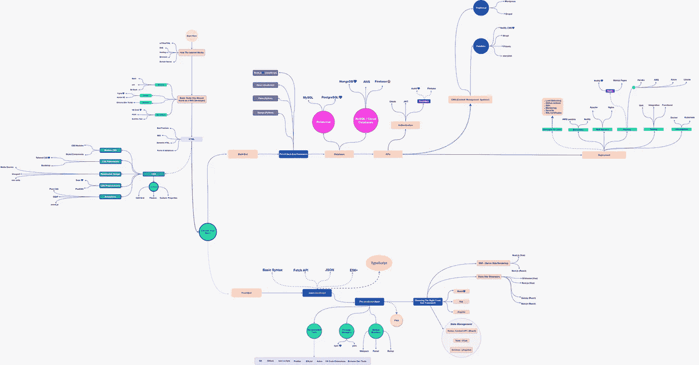
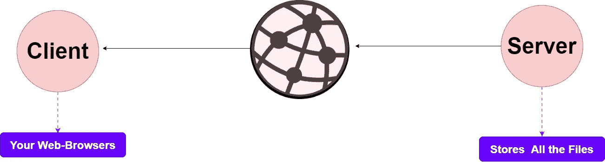
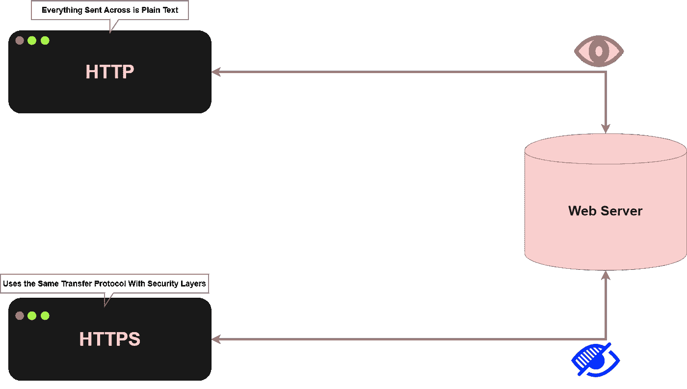
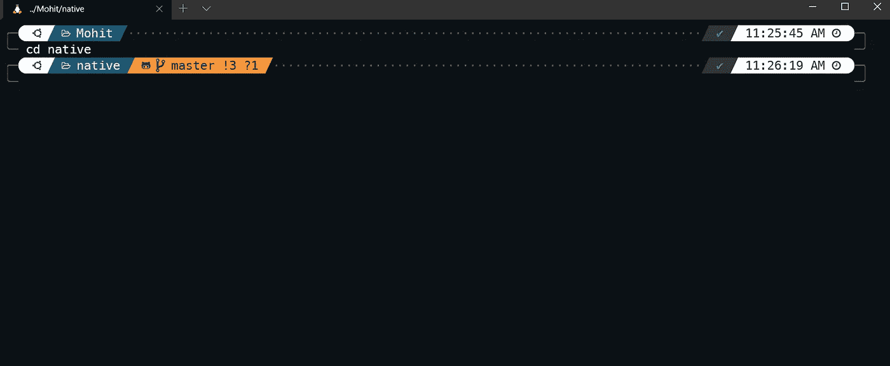
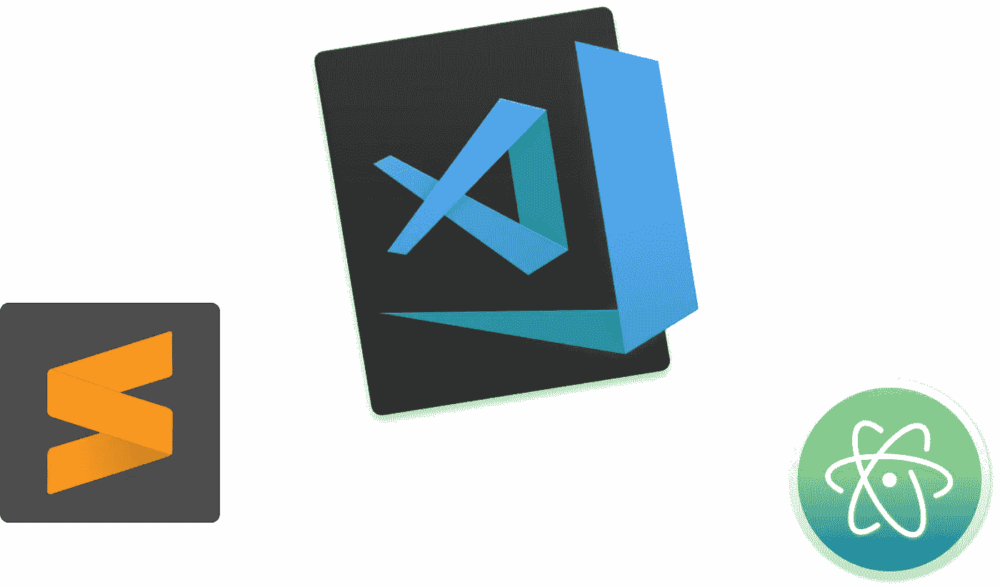
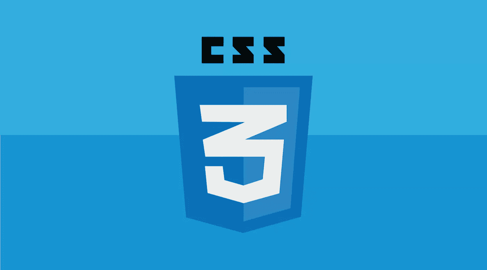
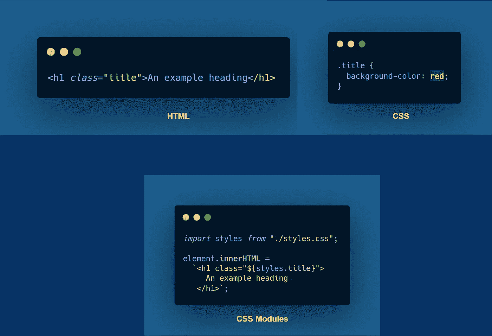
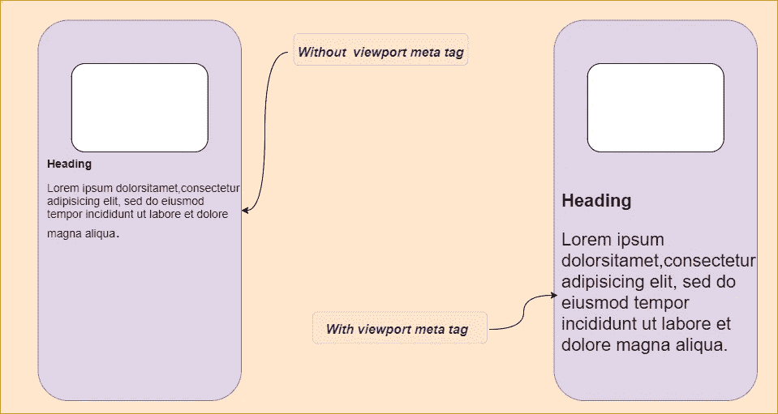
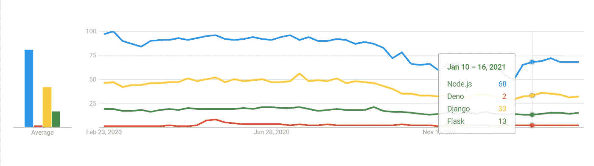

# 2021 年终极网络开发者路线图

> 原文：<https://javascript.plainenglish.io/ultimate-web-developer-roadmap-for-2021-6758edd0bd3f?source=collection_archive---------0----------------------->

## 从基础到部署可伸缩的 Web 应用程序

当我开始我的 ***网络开发*** 之旅时，被如此多的主题淹没是我过去一直面临的问题，总是有一些新的东西我必须学习，但不知道我应该学习什么。我敢保证，如果你开始从事 ***编程*** 或***Web*-*-***开发，你一定会面临这个问题，所以我决定为希望进入 Web 开发的初学者准备一份路线图，从我自己的经验来看，我敢保证，如果你对你需要用你的技能构建什么还没有确定的目标，那会变得更难，所以确保你总是对你想在哪里应用这些技能有一个适当的目标，否则，学习的道路永远不会结束

# 互联网是如何工作的

要成为一名网络开发人员，你不需要深入了解互联网的更深层次的概念，你所需要的只是一个关于事物如何在引擎盖下工作的基本知识，以使你的学习之路更加实用。否则，您编写的代码不知道它在您的应用程序中会如何执行。

你可以把互联网想象成一对 24*7 运行的计算机来提供服务，任何类型的网络应用或网站都必须访问服务器或存储与该应用相关的文件的存储器。

> 注意:还有许多其他术语你应该学习，如 **Ip 地址、网关、Cookies 等。**

*   **HTTP/HTTPS:** 超文本传输协议是通过网络传输网页数据的主要方法。因为网页存储在服务器上，然后在用户访问它们时提供给客户计算机。但是有一个问题是 ***HTTP*** 不太安全，容易让第三方攻击者窃取数据。由于这个安全问题，后来继 ***之后，HTTPS*** 被推出。在 HTTPS 的情况下，它需要来自第三方供应商的安全证书来保护连接并验证该站点是否安全。这个安全证书叫做 ***SSL(安全套接字层)*** 它只是为我们不希望有人轻易访问的敏感数据(大多数时候是第三方攻击者)增加了一层额外的安全保障。

*   **DNS:** 在网络开发者中，DNS 是互联网中最不为人所知的概念之一，了解 DNS 对网络开发者来说非常重要，因为它是将您的域名***【yourwebsite.com】***链接到您托管在互联网上的网站的粘合剂&它代表**域名服务。**

> 简而言之，我们谈论的是用户在你的网址上浏览互联网时，被引导到托管你的网站的服务器的 T2 IP 地址的能力。

*   **虚拟主机:**虚拟主机是提供一个空间的过程，你网站的所有内容都必须存放在一个服务器上，这样世界各地的任何人都可以访问它。你不必深究这些天的托管概念，因为有很多平台，你可以在几个步骤内托管一个网站。
*   浏览器:作为一名 web 开发人员，你应该知道浏览器是如何与 web 应用程序一起工作的，对浏览器有一个很好的了解可以打开更多的方法来优化你的应用程序，这将导致更可靠的应用程序，以便不同浏览器上的用户可以获得最好的结果。
*   域名:你可以称它为你的网站的网址，所以任何时候用户在浏览器中输入这个地址，他们都会被重定向到你的网站。如果你想了解更多关于域名运作的概念，这里有一篇很棒的文章*。*

# *基本工具*

## *1.末端的*

*每个开发人员都应该掌握终端工具的生态系统，当我开始编程时，我曾经面临的最大问题是不知道如何使用终端，所以如果你开始 web 开发，强烈建议你学习终端如何在不同的机器上工作。*

*在基于 **macOS** 和 **Linux** 的机器上，我们有 **bash** 终端，这是开发人员最喜欢的终端，因为它提供了最好的工具包，没有兼容性问题，如果你的机器上有 **Windows OS** ，那么你也可以通过**WSL2(Linux 的 Windows 子系统)**访问 UNIX 的工作区，使用 wsl 2 你可以虚拟地使用基于 **UNIX***

> *根据我个人的经验，你在使用 Windows 操作系统终端时会遇到很多问题，因为有一些工具不支持 Windows 操作系统终端，所以我强烈建议你在开始使用之前安装一个 WSL 环境。*

**

***My WSL2 Environment***

*如果你使用 WSL 环境有很多好处，因为你可以安装诸如 **zsh** 和**自动完成**插件之类的工具。*

*   *bash: 您会发现 Bash 是您最有用的终端，因为它高度可定制并支持令人敬畏的插件，如果您不使用 Bash 终端，大多数时候您会发现没有 UNIX 命令很难工作。*
*   ***Git bash:** 坦白地说，我不怎么使用 Git Bash，但这完全是个人喜好的问题，当我们安装 Git 时，Git Bash 在 Windows OS 机器上提供了一个基于 UNIX 的环境。*

## *2.设计工具*

*   ***Figma & Adobe XD:** 你会使用许多设计工具来制作线框或只是构建应用程序的预览，Figma & Adobe XD 都可以很好地工作，但建议使用 ***Figma*** ，因为你可以在任何设备上访问它&，并且你所有的文件都存储在云上，所以你不必担心你所做的文件和更改。*

## *3.文本编辑器*

**

*在开始之前，你不需要知道太多关于文本编辑器的东西，因为你需要的所有工具和插件只是你学习道路的一部分，也不需要熟悉任何关于文本编辑器的深奥东西，我推荐最受欢迎的文本编辑器 **VS 代码**，因为它提供了最好的工具&它非常轻量级。但是文本编辑器，比如 Atom，Sublime Text，你可以选择 3 个文本编辑器中的任何一个，但是要确保你只使用一个，直到你对 IDEs 足够熟悉。*

# *超文本标记语言*

**

*学习任何技能的根源在编程中是最重要的，如果你不知道 HTML 和它是如何塑造 web 应用程序的，那么这就像带着疑问工作一样，你也不需要完全掌握 HTML 来成为一名 web 开发人员，但这是一项作为 web 开发人员应该知道的技能。学习 HTML 的基本知识和以下概念:*

*   ***表单&验证:**如今，我们在应用程序中不使用核心 HTML 进行表单验证，有大量由开发人员构建的外部库&，我们可以在其中构建漂亮的表单，只需几个步骤和少得多的代码行。但是如果我们的应用程序非常轻量级，我们应该学习 HTML 表单验证。*
*   *语义 HTML:HTML 的一部分，介绍网页的含义，而不仅仅是表示。 ***例如，*** 我们有一个 **< p >** 标签，它表示包含的文本是一个段落。编写语义 HTML 的好处是，它为网页提供了一个驱动目标，给你更多设计内容的机会。*
*   ***最佳实践:**当你完成了 HTML 的基础，确保在你的代码中应用一些规则，比如使用一个有意义的标题 ***标签*** ，并且总是声明一个 ***文档类型*** 。遵循这些实践会让你成为一个更好的开发人员，比任何人都能更好地管理项目。*

# *半铸钢ˌ钢性铸铁(Cast Semi-Steel)*

**

## *1.CSS 基础*

*   ***CSS Grid:** 它是 CSS 中的一个布局系统，允许您快速创建灵活的二维布局，它不是一个框架或库，您可以使用它来轻松地 ***放置、*** 对齐布局，如果没有 CSS Grid，当我们只有 **floats** 和 **flexbox** 时，这是非常困难的。如果你更侧重于前端开发，强烈建议作为初学者学习 CSS Grid。*
*   ***Flexbox:*****CSS3***中的一种布局模式，用于使元素在不同屏幕尺寸下使用时行为负责，Flexbox 在现代 web 应用程序中几乎无处不在，当应用程序以不同方式运行时，它们更有能力处理变化。您可以将 flexbox 视为一个容器，您可以在其中呈现 flexbox 内部有效的任何类型的数据，并使用各种 flex 属性来管理这些容器的位置。*
*   *自定义属性:也称为 CSS 变量，它们是由 CSS 作者定义的实体，包含一些在整个文档中重用的特定值。在 CSS 中使用自定义属性的好处是可以用干净的代码制作更复杂的前端应用程序。*

> ****例如，*** *假设您要构建一个复杂的 web 应用程序，如果您的 UI 包含一些特定数量的颜色，那么您必须在代码中的任何地方定义它们，而不是我们可以使用自定义的 CSS 属性，我们可以全局存储这些值并在任何地方使用它们。**

## *2.现代 CSS*

*一旦你完成了基本的 CSS HTML，我强烈推荐你建立一些网页，强迫你以自己的方式学习 CSS。*

> *总是与较小的项目一起工作，这样你就不必担心通过你的学习路径学习基本概念。*

*   ***CSS 模块:** CSS 模块不是 border 中的正式实现，而是构建步骤中的一个过程，它更改类名和选择器的作用域。*

****例如:***CSS&HTML 通常的工作方式是在 HTML 中应用一个类，因为我们必须将 CSS 应用到 HTML 文档中，而 **< h1 >** 的背景颜色将是**红色**，这种方法在大型 web 应用程序的情况下变得有点难以维护，但是如果您使用 CSS 模块而不是编写普通的 HTML，我们需要在一个 **JavaScript** 中编写我们所有的标记*

**

*   ***样式化组件:**使用 CSS 的一种新方法是样式化组件，在现代的 **JavaScript** 中，你可以称之为 CSS 模块的继承者，在那里你编写的 CSS 是*作用于单个组件*而不是泄漏到页面上的任何其他元素。我建议，只有当你对使用 CSS 没有任何概念的时候，才应该学习样式化组件。*

## *3.CSS 框架*

> *它们为设计一致的解决方案提供了一个基本结构，而不是从头开始*

*   ***Bootstrap:** 在所有的 CSS 框架中，Bootstrap 提供了最有前途的架构和足够的定制选项。仍然在 T21 和 Drupal 用户中广受欢迎。有很多理由选择 Bootstrap 而不是任何 CSS 框架，特别是如果你是一个必须使用前端技术的初学者，那么 Bootstrap 很容易学习，因为它为那些知道如何使用 CSS 的人提供了更少的文件，也为不想使用 CSS 预处理的人提供了普通的旧 CSS。*
*   *Tailwind CSS: Tailwind 与其他框架有点不同，因为它没有默认主题&没有内置的 UI 组件。如果您正在寻找一个带有预设计小部件的框架来构建应用程序，那么它可能不适合您。我个人仍然更喜欢使用 ***Bootstrap*** ，因为它提供了一种更简单的方式来构建漂亮的应用程序。*

## *4.响应式设计*

*作为一名开发人员，最大的问题之一是构建一个响应性用户界面，因为您的应用程序将使用不同的屏幕尺寸，为了解决这个问题，有一个术语叫做**响应性设计**，它专注于构建在所有屏幕尺寸上灵活执行的用户界面。*

> ****要构建一个响应式的 web 应用程序，你必须记住以下三个术语:****

*   *CSS 媒体查询:只有当浏览器和设备环境符合您指定的规则时，它们才为您提供一种应用 CSS 的方法。例如， ***一个视窗宽于 500 像素，*** 媒体查询是响应式 web 设计的一个关键部分，它们也可以用来检测应用程序环境的其他方面。开始使用 CSS 媒体查询所需要的只是基本的 ***HTML*** 和 ***CSS。****
*   ***viewport:** 网页的可视区域称为 Viewport，当时当 web 仅在计算机上使用时，网页被设计为具有固定的大小，但后来当我们开始在移动设备上使用 web 时，开发人员开始在网页中使用 Viewport，以使它们的行为更负责任。*

**

*   ***雷姆单位:***

> *根据 **W3C** 规范，rems 单位是根元素上 font-size 的计算值，当在根元素的 font-size 属性上指定时，rem 单位指的是属性的初始值。*

## *5.CSS 预处理程序*

> *他们编译使用特殊编译器编写的代码，然后用它来创建一个可以被主 HTML 文档引用的 CSS 文件。*

*   ***Sass:** 广泛使用的 CSS 预处理程序之一，**语法上很棒的样式表，**使用 *Sass* 你可以用 CSS 编写自己的代码，这样会更快更容易维护。例如，*通常你必须使用**十六进制**值来表示有很多变化的不同颜色，所以不需要输入那些 ***十六进制值*** 你可以简单地使用 Sass 来存储那些有特定名称的值，之后，你可以在你的构建中的任何地方使用它们。**
*   **作为 CSS 预处理程序的一个很好的选择，PostCSS 更侧重于处理一个空白状态，根据你的需要有很多选项。我个人觉得 ***PostCSS*** 更容易使用，因为它更容易设置并且提供了更多的可扩展性。**

## **6.动画片**

*   ****普通 CSS:** 在钻研 CSS 动画库之前，最好先学习基本的 CSS 动画技巧，比如为动画定义关键帧。( ***关键帧保存元素在特定时间会有什么样式)*** 。学习这些技能不会花太多时间，因为此时你已经非常熟悉 CSS 属性了。**
*   ****GSAP:**green sock 动画平台是在网络上制作动画的流行 **JavaScript** 工具之一，无论你是制作反应灵敏的网络应用，还是游戏:GSPA 总能胜任这项任务。此外，它对初学者非常友好，并提供了专业人员需要的控制，这就是为什么它在超过 800 万个网站上使用的原因。**
*   ****anime.js:** 在你的学习过程中，你总是会发现新的动画库，所以不要专注于新的工具和库，而是使用易于使用的替代品来提供有希望的结果。anime.js 是我最喜欢的网站之一，因为它结构紧凑，方式优雅。**

# **前端开发人员路径**

## **1.学习 JavaScript**

**对 JavaScript 概念有一个好的和适当的了解是成为一个更好的前端开发人员的关键，如果你不熟悉任何编程语言，那么从以下开始:**

*   ****JavaScript 的基本语法****
*   ****JSON****
*   ****ES6/ES7****
*   ****打字稿****
*   ****获取 API****

**如果你有一些使用任何 ***OOP*** 编程语言的经验，那么你应该关注一些最佳实践和工具来提升你的 JavaScript 技能，比如:**

*   ****Axios****
*   ****开发工具****
*   ****ESLint****
*   ****VS 代码扩展****
*   ****npm 脚本****
*   ****版本控制系统(Git)****
*   ****包装经理(npm 或 yarn)****

## **2.选择合适的前端框架**

*   **React: 你不能称 React 为 web 框架，因为当我们用 Angular 和 Vue 这样的框架构建应用程序时，我们的应用程序结构是非常明确的，你可以在 Angular 或 Vue 应用程序中简单地注意到这些结构，但在 React 中，它是一个 JavaScript 库来构建 UI 组件，它不会强迫你遵循这种模式来构建应用程序，这就是 React 最受开发人员喜爱的原因，React 的灵活性比任何 web 框架都好。**
*   ****Angular:**Angular 中的学习曲线非常不同，它是一个成熟的框架，所以如果你想深入了解诸如**TypeScript*****MVC 模式、指令、模块、装饰器、服务、管道*** &依赖注入之类的概念，那么只有在学习 Angular 之后才能进行**
*   **Vue: 它提供了高度的可定制性，这使得它比任何 web 框架都更容易学习，但是 Vue 与 Angular 和 React 在功能上有所重叠，比如组件的工作。用 ***Vue*** 开始构建应用程序会很容易，因为简单和灵活是它最大的优势。**

# **后端开发人员路径**

## **1.选择一个后端框架**

*   **Node.js: 我个人选择了作为后端应用程序，对于缺乏任何后端开发经验的 JavaScript 开发人员来说，这是一个完美的选择，Node.js 也非常适合 **JavaScript** 生态系统，这使它成为开发人员最喜爱的选择之一。此外，Node.js 在快速和可伸缩的应用程序方面提供了最有前途的性能，这也是科技巨头们将后端堆栈转移到 Node.js 的原因。**
*   ****Deno.js:** 我将 Deno.js 添加到这个列表中的原因是，Deno 很有可能在 2021 年赢得后端之战，因为它发布才几年，已经成为快速后端应用程序的选择，与我观察到的任何 web 技术相比，Deno 已经获得了最快的普及。**

> ****注意:** Deno 不是 Node 的一个分支，我们可以称之为基于 JavaScript 现代特性的新实现，它是基于 **Google 的 V8** 的 **JavaScript** 和 **TypeScript** 的安全运行时，与 Node.js 类似，但在 Deno 中使用 **Rust** 构建核心，而在 Node 中使用其 **C++** 。**

*   **Django: 如果你想在你的堆栈中添加更多的东西，那么没有比 Django 更好的了，它使用简单，安全可靠，性能卓越。我个人建议学习 Django，如果你想在提供良好的安全性的同时构建耗时更少的应用程序，Django 由于其内置的安全系统而更加安全。此外，您可以使用内置的模板，这些模板提供了相同的性能，没有任何问题。**
*   ****Flask:**Flask 有很多关键的区别，因为 Flask 是一个 **WSGI** 框架，而 Django 是一个 ***全栈 web 框架*** 。这完全取决于你更喜欢哪种方法，因为 Flask 提供了 **MVC** 模式，作为后端开发人员，无论框架是旧的还是新的，你都应该坚持你的偏好。Flask 虽小但功能强大，但不是 2021 年后端应用程序的最佳选择。**

****

## **2.数据库**

> **关系数据库与非关系数据库**

****关系数据库**主要用于企业场景，它们用**列、行、**和**表**存储信息。其中每列都与一个数据点相关联，一行代表该类别的值。在关系数据库中，每个表只能存储一个对象。**

*   ****MySQL****
*   ****PostgreSQL****

> ****例如**，不能将客户和客户端的数据存储在同一个关系表中。为了做到这一点，您需要两张桌子:一张给顾客，另一张给顾客。**

**但是在**非关系数据库**的情况下，因为数据不局限于同一个表，它们更灵活，它们使用列和行来输入数据类型及其值，并用键来标识对象。在这里，我们可以用一个键来标识对象，并为其分配数据。现在，任何时候您需要为对象分配新的数据时，您只需要输入一个特定的键，而不需要查看和编辑特定的表。**

*   ****MongoDB**-推荐**
*   ****AWS** -易于缩放**
*   ****Firebase** -小型项目的绝佳选择**

## **3.蜜蜂**

**现在，当您使用完数据库后，您需要通过 API 访问前端的数据，想想您家里的供电情况，要使用一个设备，您需要将其插入插座。同样，我们使用高级语言编写的应用编程接口，比如 JavaScript 或 **Python。**作为一个初学者，你应该学习不同的 API 是如何工作的，以及你可以在哪里使用它们来减少你项目中的工作量。**

*   ****身份验证:**如今，几乎所有的 web 应用程序都必须与多个用户一起工作，为了跟踪用户，您需要实现身份验证。您可以选择的最稳定的方式是使用 **OAuth** 或**JavaScript Web token(JWT)，**如果您想稍微轻松一点，有一些很好的替代方法，例如 **Auth0** 或 **Firebase。****

# **部署**

## **要学习的概念**

*   ****负载平衡:**在多台服务器上分配工作负载的过程，其中负载平衡的主要目的是防止任何一台服务器过载。如果不应用负载平衡器，就无法构建可扩展的应用程序。**
*   ****GitHub Actions:** 它们使您能够在您的 GitHub 存储库中创建[定制软件开发](https://asahitechnologies.com/custom-software-development/)周期工作流，并且这些工作流由不同的任务组成，这些任务被称为可以对特定事件自动运行的操作。**
*   ****SSH:** 代表 ***安全套接字外壳，*** 通过不安全的网络访问计算机的安全方式，SSH 提供强大的密码认证和公钥认证，以及通过开放网络连接的两台计算机之间的加密数据通信。**
*   ****监控:**处理大量用户交互的 web 应用程序总是需要监控，以确保应用程序以最佳状态运行。监控的主要目标之一是通过最小化检测时间来实现高可用性&缓解时间。**
*   ****SSL 证书:**它们使网站能够从 **HTTP** 转移到**更安全的 HTTPS** 。SSL 证书是一个托管在网站原始服务器上的数据文件，其中包含网站公钥以及其他相关信息。**

## **无服务器(FaaS)**

**无服务器计算的概念通过无服务器架构，开发人员使用它来部署他们希望在几毫秒内启动的单个功能或一段逻辑，并处理单个请求。计算服务的最佳选择之一如下:**

*   ****AWS Lambda****
*   ****网络生活****

## **虚拟化**

**使用虚拟化，您可以创建需要传统硬件连接的强大 IT 服务，这允许您通过将物理机的功能分配给许多用户来充分利用物理机。**

**你可以使用 **Kubernetes** 和 **Docker** ，这两者的基本区别在于，Kubernetes 运行在 ***集群*** 上，而 Docker 运行在 ***单节点*** 上。大多数开发人员更喜欢将两者结合使用来构建更好的基础设施。**

****注** *:你可以在这里* 下载路线图**

*** [## Node.js 年开发者路线图

### 成为 Node.js 开发人员的路线图

js .平原英语. io](https://js.plainenglish.io/node-js-developer-roadmap-for-2021-2ae9c057bff4)  [## react 2021 年学习路线图

### 学习的路线图 React 我希望我知道

js .平原英语. io](https://js.plainenglish.io/react-learning-roadmap-for-2021-a1c0f7456186)  [## 8 个开源的 React 本地项目

### CRUD 应用程序、音乐播放器等

js .平原英语. io](https://js.plainenglish.io/8-open-source-react-native-projects-to-check-out-1940bb4cc466) 

*详见*[***plain English . io***](https://plainenglish.io/)***