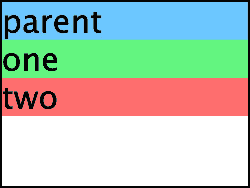
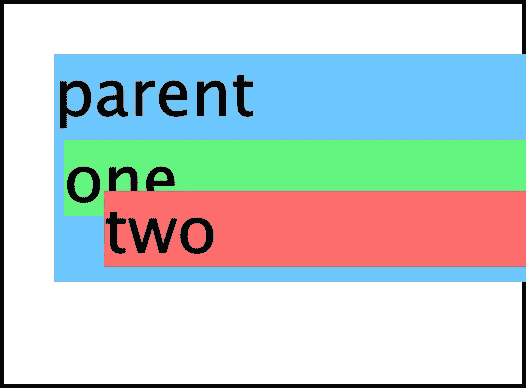
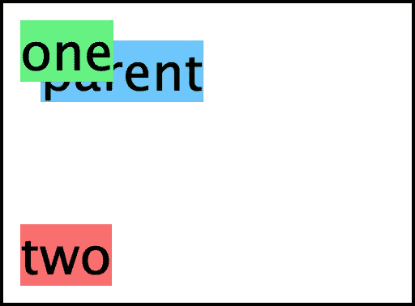
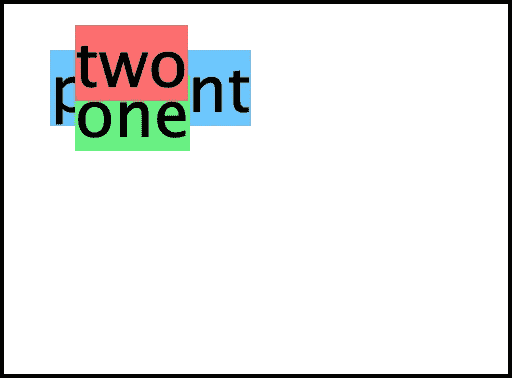
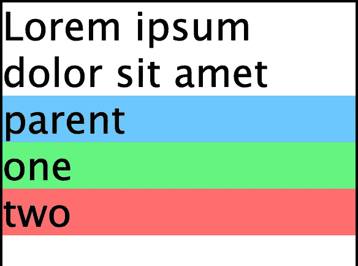
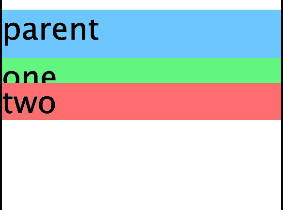

# 每个 CSS 职位是如何工作的？

> 原文：<https://javascript.plainenglish.io/understand-every-css-position-once-and-for-all-2aa0d259ebc5?source=collection_archive---------16----------------------->

## 静态、相对、固定、绝对和粘性位置简明指南


Photo by [Chance Anderson](https://unsplash.com/@chanceanderson?utm_source=medium&utm_medium=referral) on [Unsplash](https://unsplash.com?utm_source=medium&utm_medium=referral)

CSS position 属性决定了不同元素在给定页面上的位置。而 top、right、bottom 和 left 属性将决定这些已定位元素的最终位置。

您可以使用的不同位置值有:

*   `static`
*   `relative`
*   `fixed`
*   `absolute`
*   `sticky`

让我们举一个简单的例子，一个父 div 中有两个子 div，我们将对这些元素应用不同的位置，并查看它们在每个位置的行为。

```
<div class="parent">
  parent
    <div class="one">one</div>
    <div class="two">two</div>
</div>
```

对于这个初始设置，除了背景色之外，我们没有应用任何样式，这就是它的外观。



Output for the initial setup

# 静态

当您向 HTML 文档添加任何新元素时，它的默认位置是`static`。顾名思义，每个位置为`static`的 HTML 元素都有一个文档流，这个文档流就是我们在 HTML 中编写它的位置。

具有静态位置的元素将不受`top`、`right`、`bottom`和`left`属性的影响。

如您所见，我们已经为这些元素添加了`top`和`left`属性，但是它们在文档中的位置仍然没有任何变化。


Output for elements with static position

# 亲戚

当您使用`relative`作为其位置来定位一个元素时，您可以相对于它在文档流中的实际位置来移动它。您可以使用`top`、`right`、bottom 和 left 属性相对移动元素。

正如您在输出中看到的，内容为“one”的 div 元素应该位于“parent”字母之下。由于我们已经给定了`top`和`left`属性，它已经从顶部和左侧相对于其原始位置移动了`10px`。

以“two”为内容的 div 也是如此。它应该在父 div 的底端。由于我们使用了`bottom`和`left`属性，它相对于其原始位置从底部移动了`15px`，从左侧移动了`50px`。

```
<div class="parent">
  parent
    <div class="one">one</div>
    <div class="two">two</div>
</div>
```

上述元素现在看起来如下所示。



Output for elements with relative position

周围的其他元素将不允许填充具有相对位置的 HTML 元素留下的空隙。这是因为具有相对位置的 HTML 元素仍在文档流中。但它只是相对于其原始位置放置了由`top`、`right`、`bottom`和`left`属性定义的数量。

# 固定的；不变的

当一个元素有一个`fixed`位置时，它相对于查看区域而不是实际的网页内容来放置自己。当我们使用一个固定的位置时，该元素会移出它的文档流。因此，即使当我们滚动页面时，默认情况下该元素也将保持在原来的位置。但是实际位置将基于`top`、`right`、`bottom`和`left`属性(如果给定的话)。

正如您在输出中看到的，所有 div 都移出了文档流，并相对于视口(查看区域)本身放置。

父 div 从顶部和左侧放置在`50px`处。第一个孩子将被放置在页面顶部和左侧的`25px`处。第二个孩子将位于底部左侧的`25px`处。

即使你在页面上向下滚动，这些元素也停留在相同的固定位置。

```
<div class="parent">
  parent
    <div class="one">one</div>
    <div class="two">two</div>
</div>
```

具有固定位置和给定样式的上述元素现在看起来如下所示。



Output for elements with fixed position

当固定元素移出其文档流时，它不会在其原始位置留下间隙。因此，其他元素可以移动到页面上固定元素的位置。

# 绝对的

位置为`absolute`的元素相对于其之前最近的父元素放置。

> ***注意:*** 定位元素是指位置不是`static`的元素。

如果 absolute 元素没有其他定位的父元素可以引用，那么它相对于文档体定位自己。并且具有绝对位置的元素也将随着页面滚动而移动。

在下面的输出中，您可以看到第一个 div 没有任何父元素作为引用。因此，它将自己相对于文档正文定位。

第一个子 div 有一个父 div，所以它会以它为参考，将自己定位在从顶部和左侧开始的`25px`处。

第二个子 div 也在同一个父 div 中，所以它将从底部和左侧相对于父 div 定位自己。

```
<div class="parent">
  parent
    <div class="one">one</div>
    <div class="two">two</div>
</div>
```

具有绝对位置和给定样式的上述元素现在看起来如下所示。



Output for elements with absolute position

# 粘的

位置为`sticky`的元素根据页面上的滚动位置放置。

基于用户的滚动位置，该元素在不同的时间表现为相对的和固定的。默认情况下，HTML 元素会按照相对元素的行为保持不变。一旦它们到达视口，根据`top`、`right`、`bottom`和`right`属性，它们将充当固定元素。

现在，让我们看下面的例子。

```
<body>
  Lorem ipsum dolor sit amet consectetur adipisicing elit.
  <div class="parent">
    parent
      <div class="one">one</div>
      <div class="two">two</div>
  </div>
</body>
```

默认情况下，页面的行为会像带有`relative`位置的元素一样，它会像这样。



Sticky position as seen by default

但是，当您开始滚动页面时，父 div 及其两个子 div 将开始表现得像固定元素一样，因为它们接近其定义的`top`属性的视口顶部。

当它位于页面顶部的`120px`处时，内容为“one”的元素将在接近视窗顶部时首先开始粘附。稍后，当父 div 位于页面顶部的`20px`处时，它会粘着。



Sticky position as you scroll down the page

这里需要注意的是，包装在其他元素中的元素只允许在父包装的限制内移动。内容为“two”的元素已经位于父 div 的末尾。因此，它没有任何移动的空间，所以它自己呆在那里，即使它有设置为`180px`的`top`属性。

> **注意:**要使粘性位置工作，您需要至少提供`top`、`right`、`bottom`或`left`属性中的一个。
> 
> **浏览器支持:**粘性位置在 Internet Explorer 中不起作用。Safari 浏览器需要一个`-webkit-`供应商前缀才能工作，如下所示

```
position: -webkit-sticky;
```

## 结论

这些是关于不同 CSS 职位的详细信息以及它们之间的区别。您还看到了它们对于给定的`top`、`right`、`bottom`和`left`属性以及页面滚动的行为。

## 参考

*   CSS 布局在[上**w3schools.com**上](https://www.w3schools.com/css/css_positioning.asp)
*   [**MDN 网络文档上的位置**](https://developer.mozilla.org/en-US/docs/Web/CSS/position)

希望你喜欢这篇文章，谢谢你的阅读！

*更内容于* [***通俗地说就是***](https://plainenglish.io/)