# 在 7 分钟内理解 JavaScript 数组方法

> 原文：<https://javascript.plainenglish.io/understand-javascript-array-methods-in-7-minutes-d8b4e4555788?source=collection_archive---------6----------------------->

# **简介**

数组是 JavaScript 中最强大的数据结构之一。当数据必须以有序的方式存储时，数组是最合适的选择。

使 JavaScript 数组更强大的是一组可用的内置函数，使用这些函数处理数组变得容易多了。一开始，数组方法可能很难理解。但是，不要担心，通过本教程，我将指导您学习重要的 JavaScript 数组方法，并希望使学习过程不那么具有挑战性。

您可能希望在阵列上实施一些操作。例如，插入、删除、复制、连接两个数组、搜索。在 JavaScript 中，每个操作都有多种方法可用。例如，`push()` 和`unshift()`都用于插入。这些方法的不同之处在于它们插入元素的位置，但主要目的(即插入)是相同的。

通过对 JavaScript 数组方法的长列表进行分类来理解是理解这些内置方法的好方法。因此，让我们深入到这些类别中，并理解特定类别中的每个方法的作用。

# **插入/删除元素**

*   **push()** —在数组末尾添加一个元素。插入后，它返回数组的新长度。

insertion in an array using push()

*   **pop()** —移除并返回数组的最后一个元素。

deletion in an array using pop()

*   **unshift()** —在数组的开头添加一个元素。返回插入后数组的新长度。

insertion in an array using unshift()

*   **shift()** —删除并返回数组的第一个元素。

deletion in an array using shift()

# 重复

*   **foreach()** 方法遍历所有元素，并在每个元素上实现给定的函数。当必须对数组的每个元素执行操作时，经常使用它。一个常见的用例是一个接一个地打印数组的元素。下面是一个相同的演示。

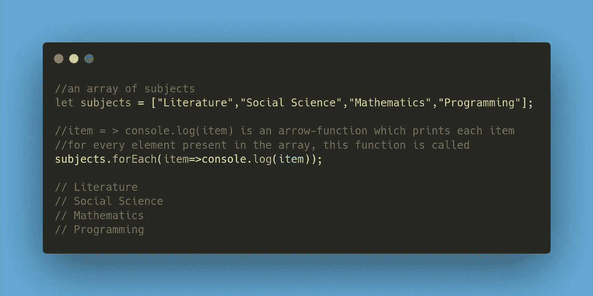

# 复制/连接

*   **slice()** 方法用于制作一个数组的副本。当调用`arr.slice()`时，它返回数组“arr”的一个全新副本。但是，它也可以用于提取指定间隔之间的数组的一些元素。此操作的语法如下:

`arr.slice(start, end);`

它返回一个新数组，将原始数组中从索引`start`到索引`end-1`的元素复制到该数组中。

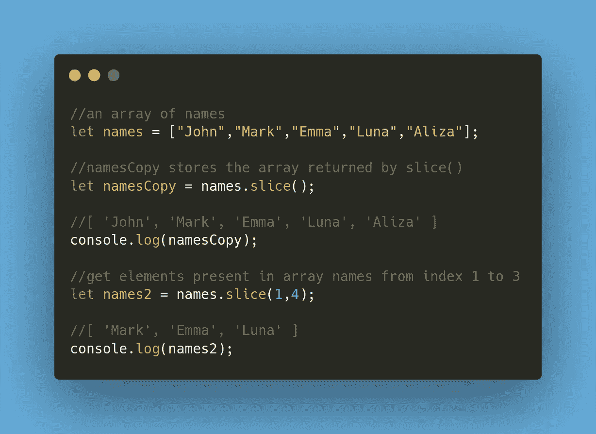

copying an array using slice( )

*   **concat()** 方法用于将新的元素连接到一个已经存在的数组中。如果它作为`arr.concat(arr2)`在现有数组`arr`上被调用，那么它返回一个包含所有`arr` 和`arr2` **元素的新数组。**可以将一个完整的数组或者简单地将原始数组中的值作为参数传递给`concat()`方法。

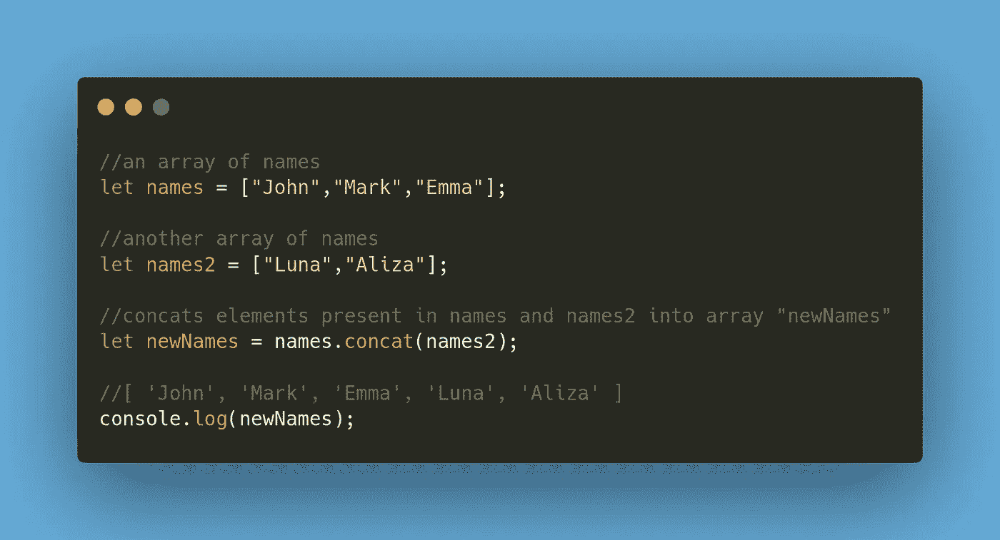

array concatenation using concat()

# 在数组中搜索

*   **includes()** 在数组中搜索给定的项目。如果找到项目，则返回**真**，否则返回**假**。可以称为`arr.includes(item)`或`arr.includes(item, from)`。在后一种情况下，该方法从给定的索引`from`开始搜索。

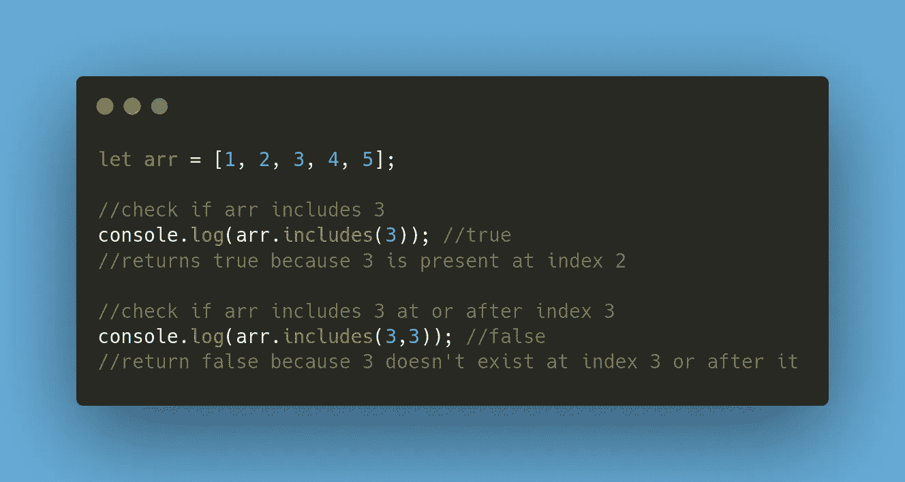

include() array method

*   **indexOf()** 方法用于查找给定项在数组中出现的第一个索引。必须找到其索引的项作为参数传递。如果找到该元素，则返回索引，否则返回-1。

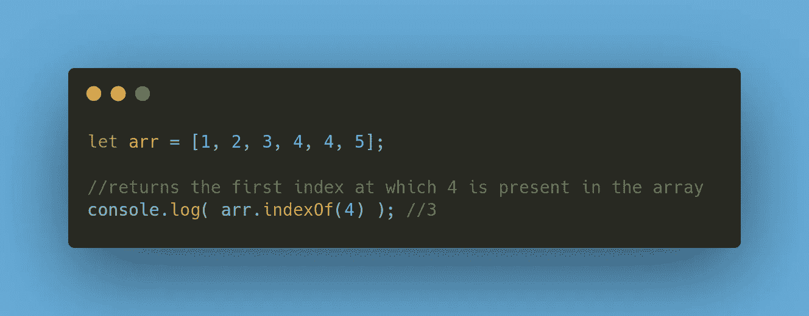

*   **lastIndexOf()** 方法的工作方式与`indexOf()`相同，但是，它会找到给定元素的最后一次出现。它从数组的末尾开始搜索，因此返回给定元素在数组中出现的最后一个索引。

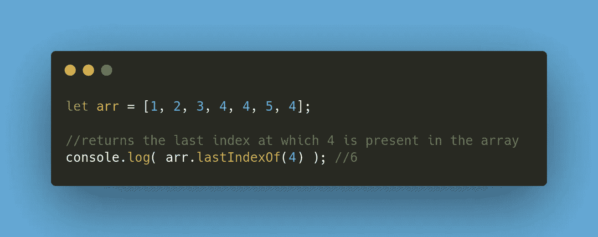

lastIndexOf() array method

*   **find()** 数组方法顾名思义就是在数组中查找给定的元素。但是，`includes(item)`也是如此，那我们为什么还需要`find()`？假设我们有一个对象数组，我们需要根据一个特定的属性搜索一个对象。做那件事的方法是什么？这里就是`find()` 发挥作用的地方！

回调函数作为参数传递给`find()` **。**该函数为数组中的每个元素/对象调用，用于搜索所需的对象。下面是一个演示相同情况的示例。

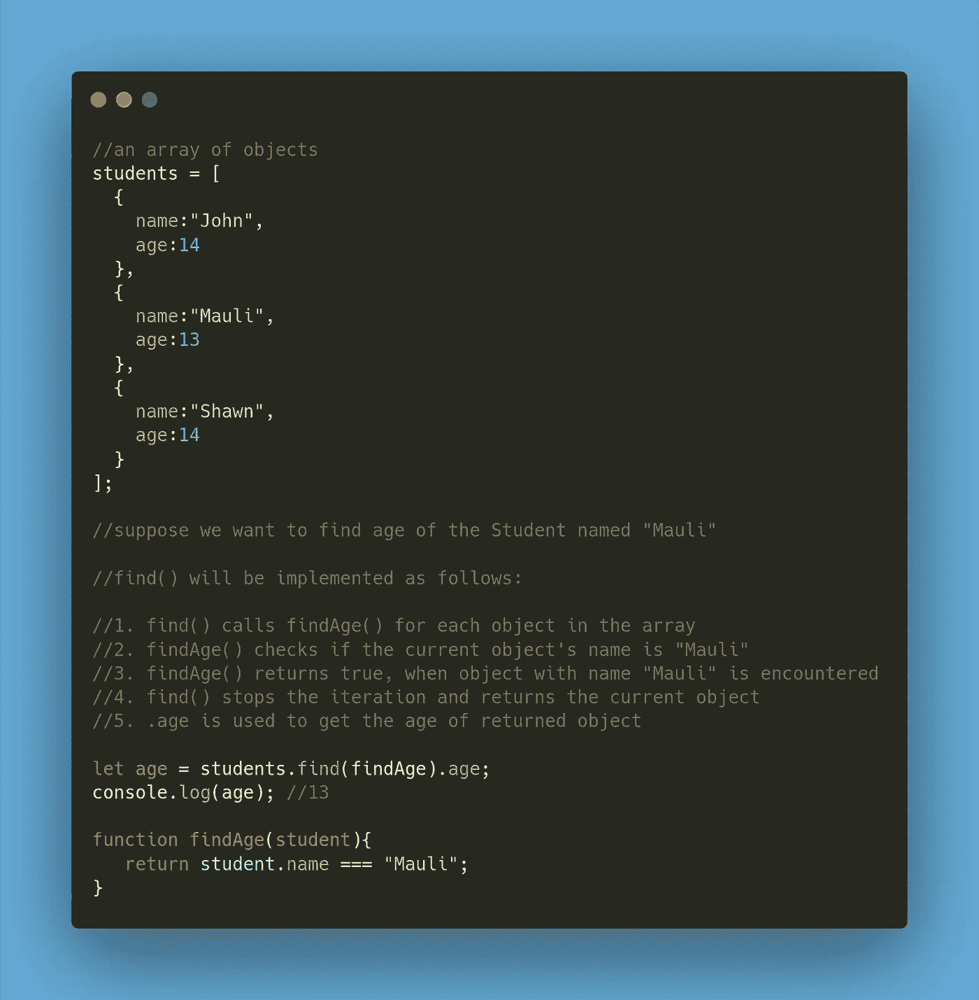

*   **findIndex()** 用于获取给定元素在数组中的位置。如果找到该元素，则返回索引，否则返回-1。此外，它的工作方式与`find()`方法非常相似，因为它也使用回调函数来搜索元素。

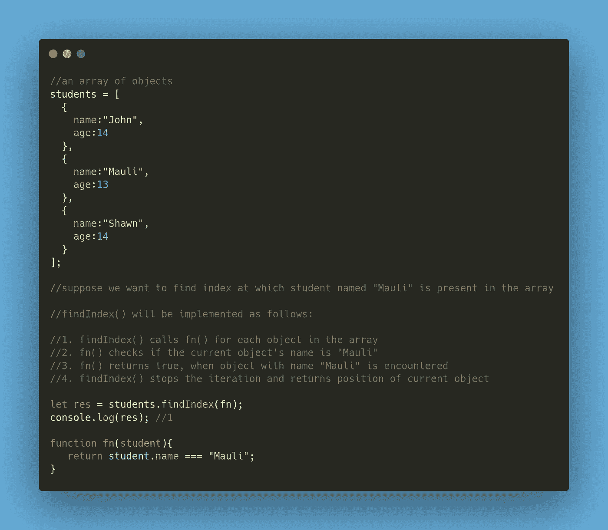

*   **filter()** 对数组元素执行检查，并返回一个全新的数组，该数组由所提供的回调函数返回 true 的元素组成。

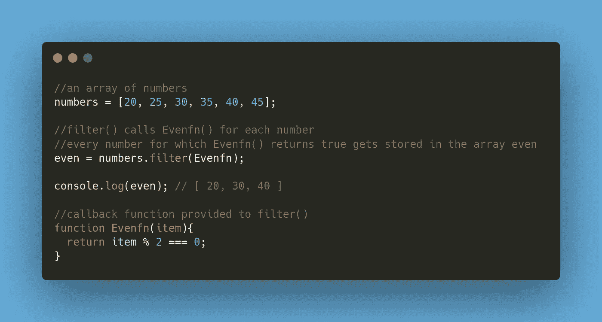

嗯，对你来说，这可能是一次要掌握的大量信息，但是继续下去，我们还有更多要讲的！

# 数组变换

除了上面解释的方法之外，还有一些方法可用于数组转换。转换可以是排序、反转或映射数组。

*   **map()** 方法是 JavaScript 中最有用的数组方法之一。它将一个函数作为参数，然后为每个数组元素调用相同的函数。然后，它以数组的形式返回结果。

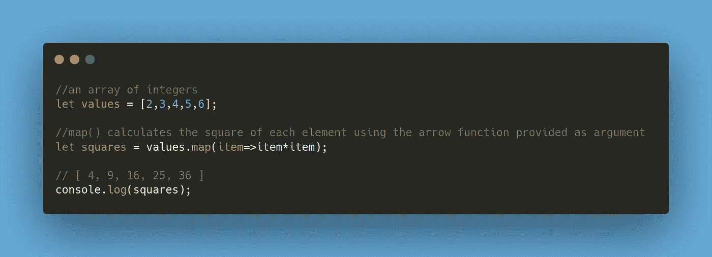

using map() method

*   **sort()** 方法顾名思义对数组进行排序。毫无疑问，它是 JavaScript 中广泛使用的数组方法之一。它就地对数组进行排序。

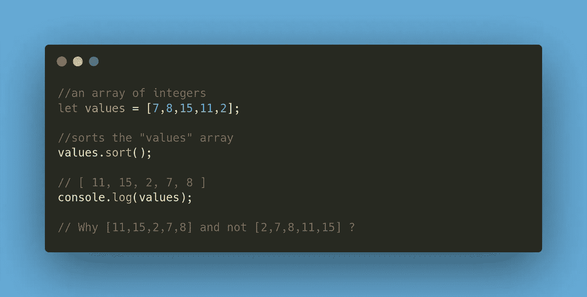

注意到奇怪的事情了吗？数组`values`中元素的排序顺序应该是`[2, 7, 8, 11, 15]`，但结果是`[11, 15, 2, 7, 8]`，显然没有排序。为什么排序功能没有按预期工作？知道吗？

返回的结果是有效的，因为默认情况下`sort()` 方法将项目排序为**字符串**。因此，这些项首先被自动转换为字符串，然后根据它们的字典顺序进行排序。想知道如何对整数项进行排序吗？

为了按照我们自己的排序顺序对元素进行排序，我们需要向`sort()`方法传递一个定制的比较函数。比较函数应该定义如何比较两个项目。这里有一个例子来演示`sort()`方法的实际工作。

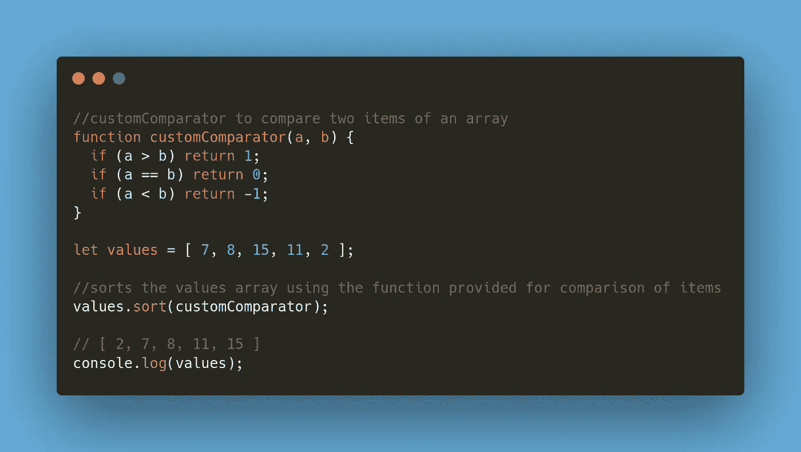

sorting an array using sort()

现在成功了！你能想出缩短这段代码的方法吗？下面是这样做的方法！`customComparator`函数只需要在`a > b`时返回正值，或者在 `a < b`、**、**或`0`时返回负值。因此，在`customComparator`函数中使用语句`return a — b`可以很容易地做到这一点。短，简洁，它的作品！

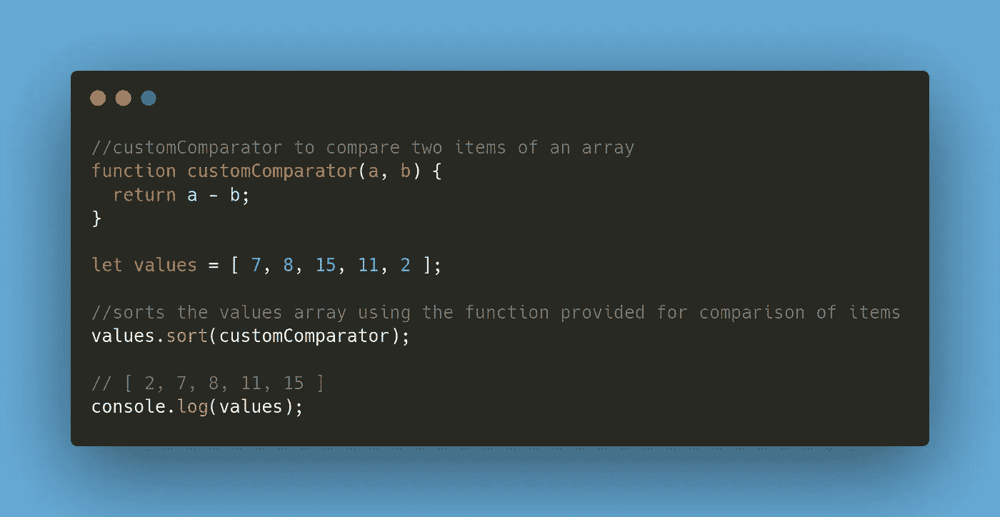

*   **reverse()** 方法反转数组中元素的顺序。它就地执行反转。

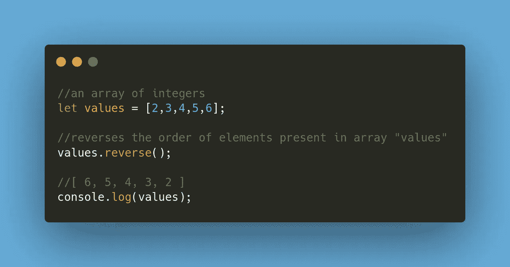

array reversal using reverse()

# splice()-一体成型

splice()方法是最强大的数组方法。它可以做任何事情，从插入，删除，替换数组中的元素。此外，它可以在任何给定的位置执行这些操作—开始、中间或结束。很神奇吧？现在是时候揭开`splice()` 方法的威力了！

其语法如下:

`arr.splice(start, deleteCount, item1, item2, item3,…)`

这里，`start` 是开始执行操作的索引，`deleteCount` 表示要删除的元素个数， `item1`**`item2`，`item3`是要插入的元素。注意，调用`splice()`并不总是必要或强制的，因此可以根据需要调用。**

**以下是如何使用 splice()在数组中插入元素的示例。**

**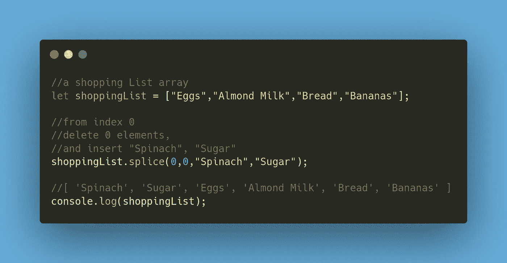**

**insertion in an array using splice()**

**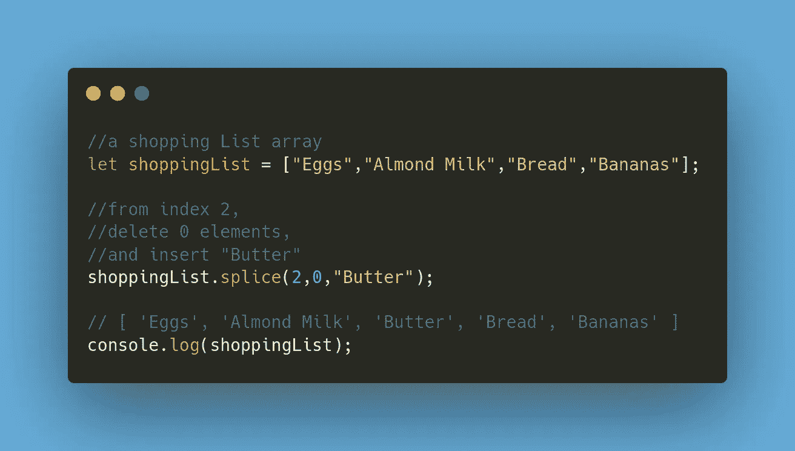**

**insertion in an array using splice()**

**以下示例显示了如何使用 splice()删除数组中的元素。**

**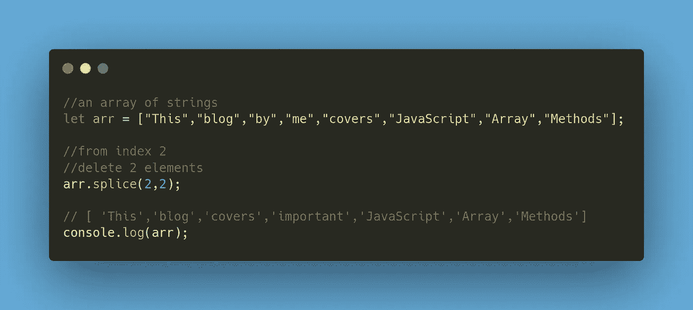**

**deletion in an array using**

**我们不仅可以使用`splice()`进行插入、删除，还可以进行替换操作。难怪它被称为数组的瑞士军刀！**

**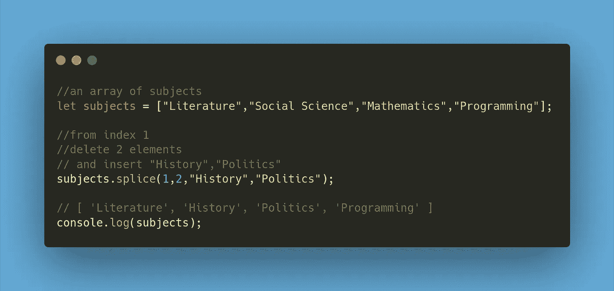**

**replacement of elements in an array using splice()**

**至此，我们已经结束了 JavaScript 数组方法教程。我们讨论了执行插入、删除、转换、复制、连接和搜索等操作的常用方法。**

**不仅有简化的解释，还有实现的例子，我希望这篇博客能帮助你更好地理解这些方法。请注意，JavaScript 中的内置数组方法并不局限于这个博客。如果有兴趣，可以在这里探讨其他方法[。](https://developer.mozilla.org/en-US/docs/Web/JavaScript/Reference/Global_Objects/Array)**

***更多内容请看*[*plain English . io*](http://plainenglish.io/)**