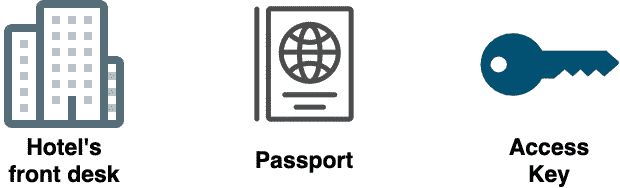
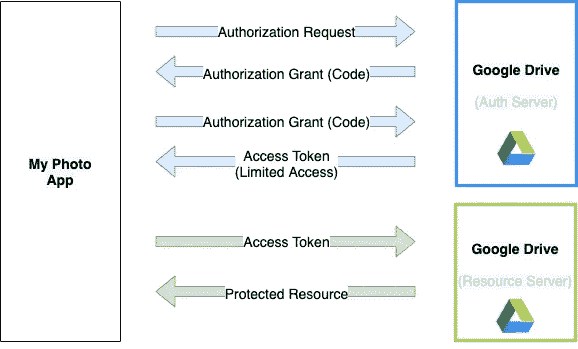
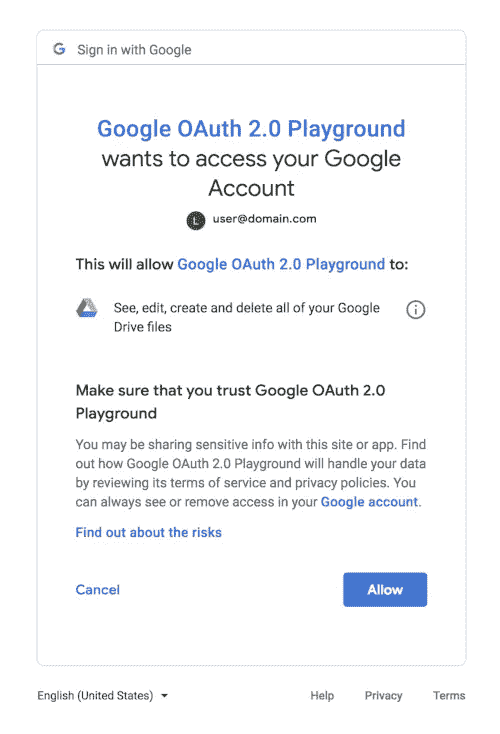

# 在 2 分钟内理解 OAuth 2.0

> 原文：<https://javascript.plainenglish.io/understand-oauth-2-0-in-2-minutes-1448e267d47?source=collection_archive---------14----------------------->

读完这篇文章后，您将了解 OAuth 是如何工作的，并知道您的下一个项目是否需要它。

Fingerprint representing OAuth 2.0

# 先决条件:

在我们进一步讨论之前，您需要理解**认证**和**授权**之间的区别。

*   认证是*你是谁*。
*   授权就是*你能做什么*。

# OAuth 是如何工作的？

在酒店的情况下，你需要去前台拿你房间的门禁卡。为此，你需要出示你的护照。

在本例中，护照是您的身份验证，访问密钥是您的授权(您可以访问酒店的哪个或哪些房间)。

Hotel example for OAuth 2.0

你的个人信息绝不会离开前台，这是 OAuth，前台扮演授权服务器的角色。在这种情况下，访问密钥代表将使您能够访问您的房间(资源)的访问令牌。

正如我们在上面的例子中看到的，OAuth 是一个授权框架。

# 我为什么需要 OAuth？

OAuth 允许服务代表用户互相访问。例如，如果你使用 OAuth 登录，你可以访问一个服务来读取你的 google drive 帐户，或者访问你的 google email 帐户和你的个人资料图片。

简而言之，当你想从脸书、谷歌、Twitter、LinkedIn 等外部服务访问一些信息时，你需要 OAuth。

# OAuth 流程:

为了解释 OAuth 流，让我们假设下面的例子，我们想用我们的照片应用程序从他的 Google Drive 访问我们用户的照片。

OAuth Flow

在**授权请求**(蓝色箭头)期间，用户通过类似的屏幕询问并允许应用程序照片需要使用的权限:

OpenID example for requesting access to Google drive

在这个截图的情况下，用户只允许以下权限:*在 Google drive 中查看、编辑、创建和删除*，其他权限就不打算给了。权限是通过授权令牌(受限访问)给出的。

在绿色箭头的例子中，应用程序正在向 Google 发送令牌。然后，Google 将验证令牌是否有效，并以令牌允许获取的受限访问权限发送数据。

# 想要更多吗？

如果你想玩这个，我会推荐你玩谷歌 OAuth 2.0 游乐场，这里有:[https://developers.google.com/oauthplayground/](https://developers.google.com/oauthplayground/)

如果你想了解更多关于软件工程的知识，欢迎随时关注我。

*更多内容请看*[*plain English . io*](http://plainenglish.io/)