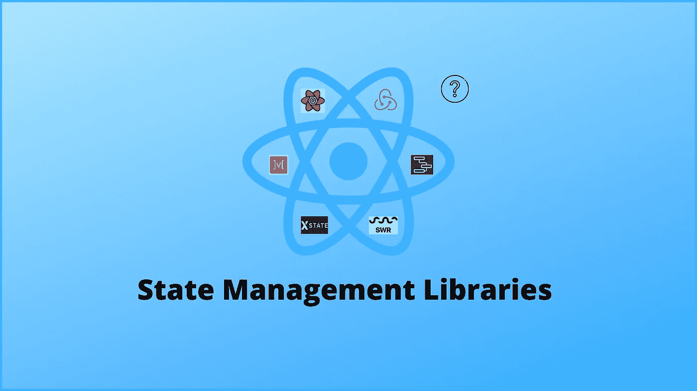

# 了解反应状态管理

> 原文：<https://javascript.plainenglish.io/understand-react-state-management-e2c31f7839f3?source=collection_archive---------5----------------------->

## 我应该使用哪个图书馆？

Photo by Author

React 应该使用什么状态管理库？这是一个我作为 react 开发者听过几百遍的问题。本文将帮助您回答这个问题。首先，我们必须了解一点历史。React 于 2013 年 5 月推出。它的范式转变是你的用户界面是你的状态的函数。给定某个组件的状态，React 可以确定该组件的外观。从一开始，React 就建立在状态的概念之上，但是 React 中的状态管理一直是最难理解的部分之一。

我们在 2014 年首次看到了 Flux 架构。这种模式首先由脸书提出，然后由一个名为 Redux 的库推广。这期间出现了一堆不同的类似 Flux 的库，赢的是 Redux。如果你看看这张 NPM 趋势图，你会发现 Redux 仍然非常受欢迎和广泛使用。

Photo by Author

这张图显然没有涵盖所有内容，但至少让您大致了解 Redux 今天仍在使用。你可能也注意到了，我在比较图中的其他库，其中一些你可能认为相关，也可能不相关。这是因为当 Redux 问世时，它封装了许多不同类型的状态。为了帮助解释这一点，让我们定义两个重要的术语— UI 状态和服务器缓存状态。UI 状态用于控制我们应用程序的交互部分，比如模态，甚至是亮模式或暗模式。服务器缓存状态是指我们调用一些 API，返回一个响应，然后缓存结果供客户端使用。看看下面的图片。

Photo by Author

在这个使用 SWR 的例子中，它是一个做这件事的库，你可以看到你会调用这个 API 用户，获取一些数据，然后响应('/api/user/123 ')被转换为在我们客户端的多个地方使用。

在 React 的早期，很多这种状态管理只是获取一些 API，存储结果，然后在应用程序中的某个地方使用它，主要是服务器现金状态。正因为如此，社区非常依赖 Redux，因为没有专门针对该服务器缓存状态的库，但所有这些都随着 React 挂钩而改变。有了一种简单的方法来封装逻辑并在应用程序中共享，像 SWR 和 React-query 这样的新库出现了，它们允许你只管理服务器缓存状态。服务器缓存状态和 UI 状态是完全不同的问题，当你合并一个库的时候，事情开始变得有点混乱。网络请求的弹性有很多复杂性，最好听从专家的意见，使用专门的库。

React 状态管理历史上的另一个重大转变是 React 上下文。有了 React 16.3，我们有了一个跨多个不同组件共享逻辑的一流解决方案。这防止了从一个组件到另一个组件向下传递值，有些人称之为 prop drilling。请记住，React 上下文本身并不是一个状态管理解决方案。当您将它与像 useState 和 useReducer 这样的挂钩配对时，它就变成了一个完整的状态管理解决方案。React context 只是在许多不同组件之间传输数据的手段。

希望这段历史能让你更好地理解我们如何走到 2021 年的今天，以及 React 的状态管理现状。既然我们已经了解了不同类型的状态，我们就有了针对特定用例的更细粒度的库。第一个是状态机。状态机只是计算机科学的话题。它们不是 React 特有的，但是它们确实帮助我们用 React 解决了现代状态管理问题。

状态机只是您的状态随时间变化的显式模型。把交通灯想成一个真实世界的例子。它从绿色变成黄色，再变成红色，但是它从来没有从绿色变成红色。我认为状态机变得流行的原因是，必须显式地写出你的所有状态有助于你思考边缘情况，并可能发现一些你错过的错误。

我想谈一谈为什么在 React 生态系统中创建了这么多的状态管理库。让我们来看看 Figma，它是浏览器中的一个设计工具，它是复杂状态的一个很好的用例。所以如果你点击屏幕中间的一个元素，你会发现本地状态的概念没有意义。你在右边和左边有工具栏，当你改变这些工具栏中的任何东西时，它也必须更新中间。在这样做的时候，它还需要非常，非常高的性能。

创建像 Figma 这样具有复杂状态管理需求的 web 应用程序，需要开发人员跳出框框思考如何处理状态管理。这导致了一系列不同的库和实验，试图找出处理状态管理的最佳方式。拥有复杂的状态并不一定意味着必须使用第三方库。您总是可以从 React 或 JavaScript 开始。看看这会让你走多远，如果你开始注意到性能问题，那么也许可以选择这些解决方案中的一个来优化。除非有明确的需求，否则不要选择这些库中的任何一个。

状态管理世界中另一个有趣的争论是不可变状态的概念。一方面，你有一个不可变的阵营，说如果你直接改变那个状态，你将会有更多的错误。另一方面，可变阵营认为有一大堆样板文件可以做到这一点。事实上，双方都有点道理。直接操纵总是不如间接操纵安全，但这是便利和风险之间的权衡。所以这真的取决于你的团队。

有趣的是，像 Immer 这样的解决方案，它允许你编写可变的代码，然后不变地执行它。Immer 的基本思想是，你有一个当前的状态，你想做一些改变。

Photo by Author

它产生这个临时的草稿状态，这是你当前状态的一个代理。然后它理解你想要做的改变，并根据这些改变产生下一个状态。实际上，这意味着您以可变的方式获得一个代码，产生一个不可变的结果。

另一种需要快速接触的状态是 URL 状态。假设您正在一家图书电子商务商店搜索一本 React 图书，您希望按四星及以上进行筛选。您会注意到，当您这样做时，该状态会保留在 URL 中。因此，如果你刷新页面并与他人分享，他们将始终看到与你相同的状态——查看通过四星及以上过滤的 React 书籍。

您可能听过人们谈论 React 上下文作为状态管理解决方案的性能问题。他们所谈论的是，如果你有一个非常大的应用程序，并且整个东西都被一个上下文提供者所包围，那么无论何时你对那个状态做出改变，它都会重新呈现嵌套在那个提供者下的所有东西。这可能会使交互感觉很慢，这就是为什么你经常看到人们通过添加像 useMemo 这样的东西来进行性能优化，如果值从不改变，它就不会重新呈现组件。

展望 React 状态管理的未来，React 核心团队提出了一个名为 use selected context 的新挂钩，它将为您处理这种性能优化。我对此感到兴奋，因为我认为 React 标准库中良好的缺省值将对刚刚学习如何使用 React 的人大有帮助。

您应该使用哪种状态管理解决方案？嗯……这要看情况。我知道这是一种逃避，但这是非常复杂的，它需要大量的思考。对于 form state，您可以作为小型项目的初学者使用 useState，或者作为中型项目的初学者使用 Formik。如果你在一个大型团队中工作，我确信技术主管将是这方面的决策者。如果你是一个中级或有经验的开发人员，状态机非常好用。

对于 UI 状态，对于入门级的中小型项目，可以使用 useState、useContext + useReducer。对于中级开发人员，您可以使用 React Toolkit 或者使用 Context + useReducer 来开发中小型项目。对于一个高级开发人员来说，你可以使用 useContext + useReducer、Jotai、Valtio 和反冲来开发大中型项目。如果您正在使用 GraohQL，Relay 也是一个不错的选择。

对于服务器缓存状态，SWR 或 React 查询都是非常好的解决方案。

总而言之，使用你觉得合适的，并且你可以根据自己的水平适当管理的。其中一些状态管理库需要一段时间来学习和应用。慢慢来。一步一步来。我希望这篇文章给了你一些有用的见解，或者帮助你缩小了学习状态管理的道路。

*更多内容看*[***plain English . io***](http://plainenglish.io/)