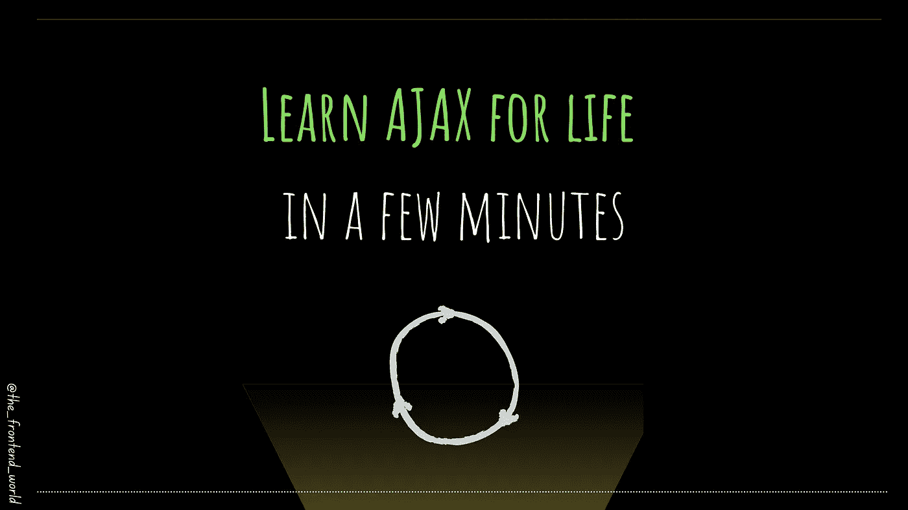

# 让我们来理解 AJAX

> 原文：<https://javascript.plainenglish.io/understanding-ajax-fc9144ef959a?source=collection_archive---------2----------------------->

## 什么是 AJAX，为什么使用它？

By FAM

你听说过 AJAX 吗？你知道我们为什么用它，为什么它在 web 开发中超级重要吗？

我们今天的故事是关于在几分钟内理解 AJAX！我们将涵盖:

*   AJAX 的用例。
*   关于 AJAX 需要了解什么？
*   借助视频，在脑海中勾勒出一幅画面。

# 1.用例

## 没有 AJAX 会怎样？

让我们以媒体主页为例。更准确地说，是搜索功能。让我们想象以下经典场景:

*   我们在搜索栏中搜索特定的东西。
*   浏览器使用您键入的关键字向服务器发出请求。
*   结果被返回，然后页面被刷新以显示它们。

这种做事方式的问题在于**糟糕的用户体验**。对于每次搜索，用户必须等待页面重新加载搜索结果。

## AJAX 会发生什么？

我们能做些什么来防止每次搜索请求都重新加载整个页面呢？解决这个问题的方法可能是只重新加载在页面上显示结果的部分，对吗？这正是 AJAX 的工作。

*   因为我们没有加载整个页面，所以我们不需要重新加载页面资源(JS，CSS，images，…等)。因此，没有浪费时间在重新加载的东西。
*   因为我们只加载页面上特定部分的数据，所以 web 应用程序对用户来说是反应式的。他们甚至不会注意到请求搜索和显示结果之间的时间。

# 2.关于 AJAX 需要了解什么？

*   AJAX 指的是 **A** 同步**J**avaScript**A**nd**X**ML。
*   AJAX 不是一种编程语言。
*   这是 web 开发中的一种技术或模式，使得只在页面上加载一部分成为可能。

## **现实生活中的例子有:**

*   Google 搜索(页面不会每次都刷新，只有结果区会刷新)
*   当你为一个中等的故事鼓掌时
*   当你喜欢一个帖子
*   当你追踪一个账户时
*   …例子不胜枚举

## 现在还在用吗？

采用 Angular、React、Vue 等现代技术。AJAX 正逐渐被在幕后实现相同技术的 JS 函数所取代。

这并不意味着它不再被使用。我仍然在我参与的一些项目中看到 AJAX 调用。

# 3.心理图像

By FAM

> 我今天的故事到此结束，我希望你喜欢它，并从中吸取教训，❤

如果我的作品 ***打动了你*** 如果你 ***喜欢它*** 如果你觉得它 ***值得*** ，请你 [**成为付费会员来支持我，你的一部分费用会寄给我。**](https://famzil.medium.com/membership)

> 对我来说这意味着整个世界，我的触摸创造了这个世界上有价值的小东西…谢谢你，❤

对我来说这意味着整个世界，我的触摸创造了这个世界上有价值的小东西…谢谢你，❤

[如果你喜欢看我的文章…并且想收到我的文章(我不是每天都发表，所以不会垃圾你。你可以随时退订，没有问题)♥️](https://famzil.medium.com/subscribe)

 [## 如果你喜欢看我的文章… ♥️

### 如果你喜欢读我的文章… ♥️，当我的文章发表时，欢迎你第一个得到通知…

famzil.medium.com](https://famzil.medium.com/subscribe) 

亲爱的读者，感谢你在我生命中的存在。让我们在 [**上取得联系**](https://medium.com/@famzil/)**[**Linkedin**](https://www.linkedin.com/in/fatima-amzil-9031ba95/)**[**脸书**](https://www.facebook.com/The-Front-End-World)**[**insta gram**](https://www.instagram.com/the_frontend_world/)**[**YouTube**](https://www.youtube.com/channel/UCaxr-f9r6P1u7Y7SKFHi12g)**或**********

****参见我的关于网络要素和一般文化的电子书。****

*****更多内容请看**[***说白了。报名参加我们的***](http://plainenglish.io/)***[***免费每周简讯这里***](http://newsletter.plainenglish.io/) ***。***********