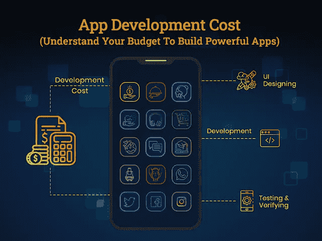
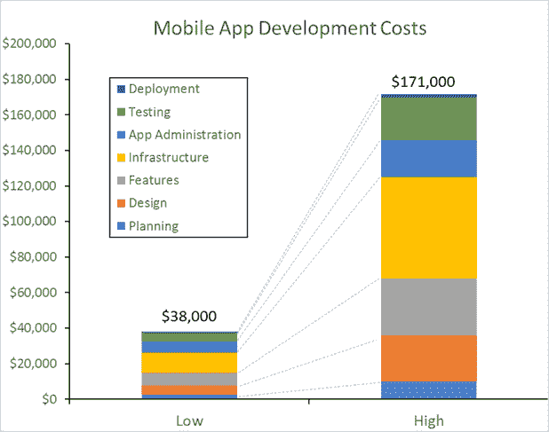

# 了解 2021 年的应用开发成本

> 原文：<https://javascript.plainenglish.io/understanding-app-development-cost-in-2021-de9eac61b1d0?source=collection_archive---------6----------------------->

## 应用程序开发成本:了解构建强大应用程序的预算

计划构建自己的移动应用程序，但不确定为您的企业创建一个应用程序需要多少成本？你们中的许多人更喜欢联系应用程序开发者来确定开发一个应用程序的成本，但不幸的是，他们的回答对回答“视情况而定”最没有帮助。

想一想你最近购买的产品或服务，无论是购买办公室、汽车还是清洁服务——不同的购买都带有某些元素。

现在的核心问题是，到底是什么推动了应用程序开发成本？

例如，假设你买了一处房产。因此，你的参数将落入你想购买的财产的位置，它的大小，家具等等。

同样，移动应用程序开发成本也是如此，这将取决于您的业务应用程序开发理念及其功能需求。

正如你所听到的，你得到了你所付出的。因此，你不能指望只花几美元就能构建一个令人惊叹的应用程序。但是，同样，在移动应用程序开发上投入大量资金也不会转化为成功。

就像花巨资建设一个财富厨房不会让你成为一个没有烹饪技能的专业厨师一样，同样的，要推出一个成功的移动 app，你需要知道怎么做才能获得成功。

所以在你进入开发移动应用程序的过程之前，你需要知道构建一个应用程序的平均成本，以便你可以制定预算来构建一个强大的移动应用程序。

根据 2015 年进行的 [Clutch 调查，移动应用程序的平均开发成本将从低至 3.8 万美元到高达 17.1 万美元以上不等。](https://clutch.co/app-developers/resources/cost-build-mobile-app-survey-2015)

[Image Source](https://clutch.co/app-developers/resources/cost-build-mobile-app-survey-2015)

*但是，有两件事需要注意:*

*   这项调查是在 2015 年进行的— —(一)
*   app 开发成本取决于许多因素。—(二)

*所以我们先详细讨论第二点！*

注意这个图表，突出显示了包括应用程序开发成本(如应用程序类型、应用程序的复杂性、功能和设计、应用程序开发团队及其每小时成本)在内的因素。

考虑到这些因素，让我们根据应用的复杂程度来分离应用开发成本；

*   *简单应用程序开发成本:*单个平台 30，000 美元以上，包括基本功能(例如，计算器)
*   *中等应用开发成本:*单个平台 50，000 美元以上，包括所有必要的功能(例如，优步应用的忠诚度&奖励、GPS)
*   *复杂应用程序开发成本:*起价 75，000 美元以上，包括多种功能(例如，Instagram、脸书)

应用程序开发成本在应用程序开发的时间线上有很大差异。一个简单的应用程序需要大约 3 到 4 个月的时间来完成基本功能，而一个复杂的应用程序可能需要 9 个多月来构建多个功能。但如果你的应用想法既不属于简单的也不属于复杂的应用开发结构，你可以聘请一家 [**应用开发公司**](https://www.xicom.biz/services/mobile-app-development/) 进行实时评估。

估算应用程序开发成本是一项复杂的任务，因为有太多的东西需要分析和评估。因此，本指南将帮助您:

*   *了解基准测试的开发成本*
*   *影响应用开发成本的核心因素*
*   *开发一个手机应用程序要花你多少钱？*
*   *基于流行应用类型的移动应用开发成本*
*   *大幅提高应用程序开发成本的隐藏事实以及如何处理它们*
*   *带走:如何为应用程序开发设定合适的预算*

> 让我们深入了解这些要点，以便做出明智的决定。

## **1。了解基准测试的开发成本**

据预测，移动应用程序开发行业将创造 9350 亿美元的收入，在 2021 年启动应用程序创业是一个明智的决定。

您是否知道移动应用程序用户在一个月内花费 90%的移动时间浏览应用程序并访问近 40 个应用程序？

根据这种说法，很明显，大多数人在日常生活中都使用各种应用程序。由于不同的应用程序开发具有不同的功能和特性，您如何预测该项目的实际应用程序开发成本？

为了帮助您了解应用程序的成本和时间表，让我们考虑由最可靠的领导者进行的各种调查。

*“根据 Goodfirms* *的* [*调查报告，一个简单的应用程序可以在 4.5 周内用 24000 美元的预算完成，而一个复杂的应用程序开发将需要 137000 美元的预算，耗时 26 周以上”。*](https://www.goodfirms.co/resources/cost-to-develop-an-app)

*"一份* [*调查报告 BusinessofApps*](https://www.businessofapps.com/app-developers/research/app-development-cost/) *显示，一个拥有基本用户界面和一套必备功能的简单应用程序的价格从 4 万美元到 6 万美元不等。中等复杂程度的应用程序将花费 61，000 至 120，000 美元，而具有所有现代功能的复杂应用程序将花费至少 120，000 美元，并且可以达到任何程度”。*

如果你已经注意到了，即使是来自领先行业的两个调查也不会同意相同的应用程序开发成本。因此，首先没有固定的应用程序开发成本。

> **这是我们在上面标出的要讨论的第一点————(I)**

其次，随着对 [**移动应用程序开发解决方案**](https://www.xicom.biz/services/mobile-app-development/) 的需求不断增加，各种移动应用程序开发公司在世界不同角落如雨后春笋般涌现，为他们提供了以极具竞争力的价格将您的商业应用程序创意转化为强大解决方案的机会。你所需要的只是理解影响应用程序开发成本的重要因素。

*那么，推动应用开发成本的最关键因素是什么？*

以下是决定 2021 年最终应用开发成本的最具影响力的因素:

*   *项目所需的 App 开发团队及其位置*
*   *应用程序的复杂性、功能性和功能数量*
*   *涉及后端和前端开发的 App 开发*
*   *用户界面/UX 设计的复杂性和你选择开发的屏幕数量*
*   *应用开发方法——本地、混合、跨平台*
*   *有待开发的平台数量(iOS、Android、web 等)*

这些参数中的每一个都会影响你为应用程序开发支付的费用。因此，通过详细确定这些参数，您可以理解在应用程序开发项目上花费 24，000 美元到 120，000 美元之间的巨大差异或这些估计值之间的差异。

# **2。影响应用程序开发成本的核心因素**

*做一个 app 要多少钱？*在 [**雇佣一个 app 开发者**](https://www.xicom.biz/solutions/hire-developers/) 之前，这个问题肯定在你脑海里出现过好几次。根据主要调查结果，开发一个应用程序的成本将从 24，000 美元开始，可能会超过 120，000 美元。既然有很多因素会极大地影响这些估计，为什么不考虑讨论这些因素，以了解 2021 年你的应用程序想法会给你带来怎样的成本。

*为了更好地理解，让我们考虑一下应用程序开发的每个阶段会给你带来怎样的成本，通常移动应用程序开发过程包括这五个阶段:*

*   发现、研究和规划
*   用户界面/UX 设计
*   应用程序开发
*   应用测试和部署
*   维护和支持

以上是 app 开发的几个主要步骤。 [70%的](https://clutch.co/app-developers/resources/cost-build-mobile-app-survey)移动应用程序开发公司都是从研究和发现阶段开始的。

因为大多数领先的 IT 公司都理解这一步的重要性，并从技术和业务的角度识别应用程序的所有细节。所以让我们开始吧。

## **A .发现、研究和规划**

而许多组织忽略了这个开发阶段的重要性，直接从 app 线框化开始。在您直接进入下一步之前，有必要了解发现阶段的好处:

*   验证应用程序开发需求
*   理解业务目标
*   风险覆盖范围和识别陷阱
*   节省时间和成本
*   在客户和团队之间建立互动
*   任务的优先顺序

在应用程序开发的这个阶段，你可以获得的最大好处是知道为你的企业制作应用程序的确切时间和成本。所以在你[为这个项目雇佣一个**离岸移动开发者**](https://www.xicom.biz/offerings/hire-mobile-developers/) 之前，你可以了解一下你需要在这个项目上投资多少时间和成本。

根据发现阶段，应用程序开发人员的核心团队被分配到项目中，可能包括业务分析师、项目经理、UI/UX 设计师、软件架构、质量保证工程师等。

根据项目的复杂性、平台数量、功能和设计，发现阶段的平均时间预计为 2-4 周。根据项目的不同，团队可能会直接进入编码阶段并最终完成应用程序设计。

## **B. UI/UX 设计**

应用程序的可视化表示实际上是在应用程序的实际编码之前设置的。根据调查报告，10 到 12 个屏幕的应用程序设计平均成本约为[5000 美元](https://clutch.co/app-developers/resources/cost-build-mobile-app-survey)。但是如果你的应用程序有复杂的屏幕设计，那么准备好为设计阶段支付更多的费用。

## **C. App 开发**

您计划包含的功能的复杂性和数量将全面影响移动应用程序的最终成本。不管应用程序开发有多复杂，确保你雇佣的应用程序开发公司拥有经验最丰富的专家团队，有能力处理像 pro 这样的项目。

此外，一个具有基本功能的简单应用程序将包括推送通知、用户评级和评论，用户登录将是最便宜的选择。更复杂的功能，如支付系统、门户网站、与原生功能的集成、添加到购物车、GPS、实时监控，将增加最终的应用程序开发成本。

通常，构建一个简单的应用程序的成本将从 20，000 美元开始，而一个现代应用程序的成本将达到 35，000 美元。

## **D. App 测试和部署**

无论你的应用程序开发得多么出色，测试对于决定它是否可以在应用商店上发布都是非常重要的。如果您选择了与知名的 [**app 开发公司**](https://www.xicom.biz/services/mobile-app-development/) 合作，那么将会进行深入的测试。

根据调查，32%的公司表示应用程序测试和部署成本低于 5000 美元。但是，测试一个应用程序的时间和努力将主要取决于应用程序的复杂性。

然而，在与知名的应用程序开发公司合作时，应用程序测试将由他们的团队完成，作为他们服务的一部分。对于他们已经建立的应用程序测试，不会收取额外的费用。

## **E .维护和支持**

您可能拥有具有独特功能的优秀移动应用，但您需要 IT 专家的持续支持，以使您的应用长期完美运行。从适应新的更新到修复问题，您可以发布应用程序维护服务。

通常，应用程序维护费用是临时的。这取决于您想要实现的更新类型以及您想要更新应用程序的频率。

# **3。手机 App 开发花了你多少钱？**

有了上述因素，就很清楚到底是什么促成了 app 的开发成本。但核心问题仍然是一样的:2021 年你到底要花多少钱？

这里有几个元素可以帮助你了解应用程序开发成本，这样你就可以设定价格范围来构建强大的移动应用程序。

## **A .应用程序开发方法——原生与混合**

你选择什么样的方法来发布你的应用将会极大地影响最终的应用开发成本。

根据调查报告，Android 和 iOS 是占据 98%移动应用用户的主要平台。因此，如果你的目标是任何特定平台，其应用程序符合特定操作系统的准则，那么雇佣一名移动应用程序开发人员来构建一个本地应用程序是值得的。但是开发两个本地应用将会非常昂贵，因为它们是使用特定于平台的编程语言开发的。

然而，如果你试图同时瞄准两个平台，那么构建一个混合或跨平台的应用程序是一个合理的决定。此外，一个跨平台的应用程序将比创建两个原生应用程序节省 40%的成本。

例如，构建两个本地应用的成本可能在 40，000 美元之间，包括所有基本到中等的功能。然而，跨平台应用程序开发可能会花费您 25，000 美元，它将无缝地运行在多个平台上。

## **B .原生 Android Vs iOS**

在你们直接进入雇佣应用开发者的流程之前，你们中的很多人都在问，基于平台的应用开发成本有什么区别吗？

Android 和 iOS 的应用程序开发时间表几乎相同。如果你的目标是两个平台，那么你可以通过使用 iOS 和 Android 的 APK 来同时构建，这允许应用程序同时启动。

## **C .关于移动应用开发的神话可能会导致失望**

在开发移动应用程序时，有两个最常见的误解:

*   *期待你的应用创业成为另一个“亚马逊”！*

大多数应用初创公司都在期待他们的应用成果，甚至他们中的许多人都要求建立一个像亚马逊一样的应用。

首先，你必须意识到一个事实，即基于应用的公司除了他们的应用程序之外，还在长期内一点一点地发展。此外，要建立一个像亚马逊或 Etsy 这样的应用程序，你需要投资 100，000 美元来开发成功的应用程序。

万一你期望成为另一个亚马逊，那就相应地投资吧！

专业建议:从领先的应用程序中获得灵感是合理的，但复制他们的成功并不值得考虑。相反，集中精力给市场带来新的东西。

## **D .没有适当的市场调查就获得成功**

如果你也认为使用移动应用程序可以更容易获得成功，那你就错了。要取得成功，评估市场并完成预规划阶段以发现商机并识别市场风险是非常必要的。

***简而言之:*** *要准确估算移动 app 开发服务的成本，只需点击这个公式即可计算 app 开发成本。*

***总 app 开发时间* App 开发者的小时成本=最终 App 开发成本***

还有，在开始一个项目之前，雇佣一个可靠的 [**软件开发公司**](https://www.xicom.biz/) 来讨论你的项目需求，并得到粗略的移动 app 开发成本估算是有意义的。成本估算是基于项目描述提供的，业务和技术需求总是接近真实数字。

*一般来说，知名的应用程序开发公司基于以下选项提供支付应用程序开发服务的设施:*

*   **固定计费:**当你有一个明确的项目想法和工作范围，并清楚地知道你到底想在移动应用程序中得到什么时，那么固定计费是值得的。这意味着应用程序开发公司将收取特定时间表的费用。
*   **按小时计费(Time & Material)** :当你需要资源、专家和现成的基础设施进行应用开发时，建议按小时计费。当你没有移动应用程序开发的想法，也不知道如何将它变成一个强大的解决方案时，你可以聘请一位专家。这种方法在应用程序开发过程中提供了灵活性，适合更复杂和正在进行的项目。

但是，为了让您了解每个应用程序开发的成本，我们在下一部分按类别和应用程序类型列出了成本，供您参考…

# **4。基于流行应用类型的移动应用开发成本**

当谈到移动应用程序开发时，请始终记住，每个项目都是独一无二的，需要不同的特性和功能。因此，翻译任何应用程序的想法，无论其复杂程度如何，总会有不同的成本，因为没有人有相同的业务要求、技术和相关人员。

*   **基础 App 开发成本**

*开发费用估算:1.5 万美元*

*预计时间:6 周*

*最佳示例:相机、本地游戏、文本应用、计算器等*

由于基本应用程序最多由 5 至 6 个屏幕组成，无需背景和网络连接即可无缝处理，因此启动速度很快。这些应用程序的开发目的明确，并提供基本的功能。

*   **数据驱动的应用**

*开发成本估算:1.7 万美元*

*预计时间:7 周以上*

*最佳示例:天气状况、股票、地图、日历等等*

这些应用程序被定制来提供特定的信息，因此在今天的时代并不常见，但仍然存在。例如，谷歌地图使用第三方 API 信息来指导您的路线、热图等。要构建这类 app，可以考虑聘请一家 [**离岸 app 开发公司**](https://www.xicom.biz/services/mobile-app-development/) 。但是，这些应用程序现在被认为是更大软件产品的扩展或包括附加功能。

*   **电子商务 App 开发**

*开发成本估算:2.5 万美元*

*预计时间:9 周以上*

*最好的例子:亚马逊、易贝、阿里巴巴、Etsy 等等*

电子商务应用已经成为这个城市的流行语，因为它鼓励每个零售商迁移到这个平台上，以产生更好的业务收入。通常，电子商务应用程序包括大量功能，如用户注册、用户帐户、社交媒体集成、添加到购物车、产品目录、单独的产品页面、应用内支付集成等。应用程序的结构很复杂，所以它需要一个精心规划的后端，一个管理面板来管理订单，一个产品目录等等。

*   **按需应用开发**

*开发费用估算:2.5 万美元*

*预计时间:9 周以上*

*最佳范例:优步、宁伯、优步等等*

凭借随时在线订购任何东西的广泛便利性和灵活性，按需应用程序已成为应用程序初创公司满足市场特定需求或要求的最大潜在目标。这类应用程序最著名的例子是优步，它用令人瞠目结舌的数据征服了世界。

*   **市场应用开发**

*开发成本估算:3 万美元*

*预计时间:9 周以上*

*最好的例子:Groupon、Esty、Airbnb、优步、易贝等等*

由于市场应用处理着经济的两个方面——需求和供应，所以 [**雇佣一个应用开发者**](https://www.xicom.biz/solutions/hire-developers/) 来创建这个具有良好定义的特性和功能的广泛应用版本是有意义的。构建这种类型的应用程序的成本更高，因为它包含了广泛的特性和功能。

***简而言之:*** *应用程序类型的列表并没有到此为止，因为我们的目的是涵盖从基础应用程序到大多数需求应用程序类别的应用程序，所以如果你的应用程序想法不属于这些类别，那么你可以咨询移动应用程序开发公司来评估你的商业想法和相关参数。*

## **5。大幅提高应用程序开发成本的隐藏事实以及如何处理它们**

为了确定应用程序开发的隐藏成本，深入了解移动应用程序结构非常重要，包括移动应用程序架构的开发、托管和支持平台。

因此，为了便于理解，我们将应用程序的发展过程分成了不同的阶段:

**第一阶段:开发阶段:**应用程序开发架构的第一阶段是实现开发的主要部分，包括设计创作、编码功能、质量保证等。但是为了让你的应用程序工作，你需要各种组件，比如主机、适当的服务器功能、数据库、不同的支持库等等。

**第二阶段:持续的应用程序开发支持:**这一阶段包括应用程序的进一步更新、新功能的实现、应用程序维护、错误修复和测试等。

因此，这里有几个隐藏的应用程序开发成本元素，它们属于应用程序架构和持续开发类别，对客户来说仍然是隐藏的。

*   **服务器:**要托管你的应用，你需要每年花费 12，000 美元的服务器。
*   **数据存储:**为了收集和保存您的应用程序的数据，您需要数据存储，这可能每年需要 3600 美元。
*   **CDN(内容交付网络):**要实现内容的无缝分发，您需要一个 CDN，每年的费用约为 3600 美元。
*   **图像数据:**应用程序中充满了图像，因此您需要有一个地方来轻松下载、处理和交付图像，例如 cloudimage.io、Google 和 ImageX。每年的费用总计可达 4，800 美元。
*   **开发工具:**增加应用的功能，需要付费 app 开发工具和库的支持。根据您的项目需求，这些要素的成本可能在 1，2000 美元到 10 万美元之间。
*   **iOS 和 Android 更新:**两个平台经常会推出新版本，所以你的应用也需要相应的更新。应用程序维护和支持的成本将取决于您希望在应用程序中实现的更新类型。
*   **第三方 API:** 为了让你的应用与其他功能交互，你需要集成第三方 API，其费用可以从 3000 美元起。

# **带走:如何为应用程序开发设定合适的预算**

如果综合考虑，你应该为应用程序开发设定多少预算？考虑到所有这些事实和统计数据，很明显，要雇佣一家 [**移动应用程序开发公司**](https://www.xicom.biz/services/mobile-app-development/) 来启动应用程序，你至少需要投资 17，500 美元，根据应用程序的概念、特性、功能、复杂性、设计和测试，投资可以达到 50，000 美元以上。

*减少应用开发成本:*

*   开始使用 MVP(最小可行产品),它可以帮助您启动具有基本功能的应用程序，并使您能够以最小的投资了解应用程序的范围。
*   跨平台应用程序开发是节省应用程序开发成本的理想方法，因为通过使用相同的代码库，您可以构建在多个平台上工作的应用程序。它们的发布速度更快，成本更低，并且只需要测试一个代码库。
*   使用通用但流行的预构建解决方案来节省预算。

现在，您已经了解了与应用程序开发成本相关的所有观点，因此，如果您心中有任何想要尽早推出的应用程序开发想法，那么您可以 [**联系我们**](https://www.xicom.biz/contact/) 或在下面提出疑问！

====================================

*更多内容请看*[***plain English . io***](http://plainenglish.io/)