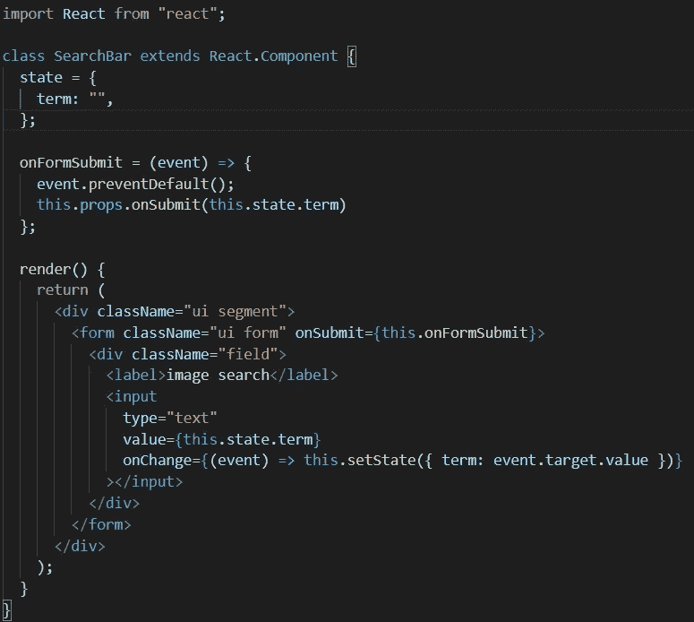
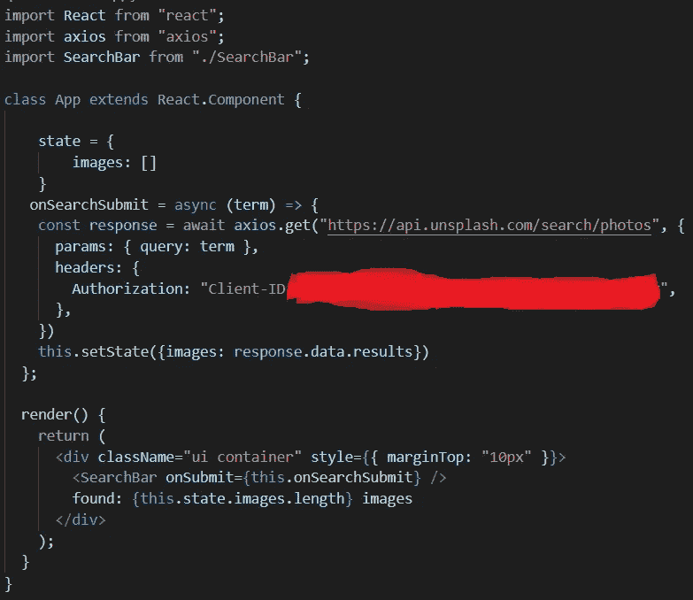
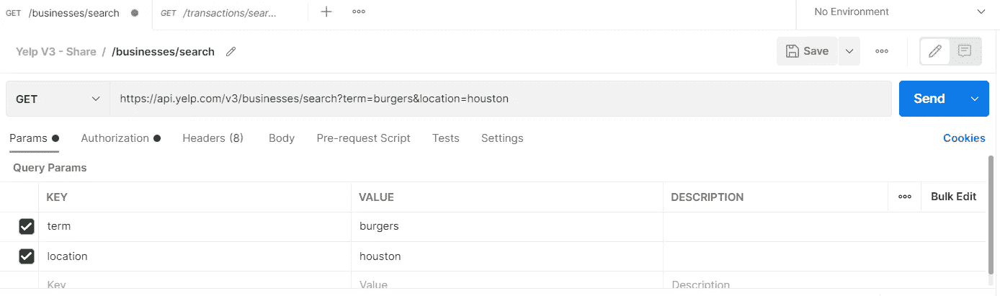

# 直到我了解了 Axios，我才真正理解了如何发出 API 请求

> 原文：<https://javascript.plainenglish.io/understanding-axios-to-send-api-requests-in-react-very-basic-ef8b953a5828?source=collection_archive---------14----------------------->

## 了解 Axios 在 React 中发送 API 请求的基础知识

在我学习编码的大部分时间里，除了拥有一个 db.json 文件和运行一个 json 服务器之外，我从未真正理解如何向 API 发送请求。直到我了解了 Axios，事情才开始明朗起来。因此，如果您想使用 Yelp Fusion API 或 Unsplash，这可能是一个很好的参考。

第一，`npm install axios`。

二、`import axios from 'axios'`在你的 App.js 文件里。

(我将以简单的搜索提交的形式进行演示。)

下面是一个简单的搜索组件:

下面是 App.js 文件:

假设你了解`state`、`setState()`、`props`和事件是如何运作的，理解第一个图像是相当容易的。

现在是时候解释一下这意味着什么了。但是首先，重要的是要注意这些是基于类的组件。因此，由于它们是基于类的语法，由于关键字`this`的复杂性，安全措施最好使用箭头函数。

为了简单起见，`onSearchSubmit`函数接受一个参数`term`，并使用一个名为`onSubmit`的自定义属性传递给`<SearchBar />`组件。从那里，我们从 SearchBar 组件的状态中获取术语。

现在选择你一直渴望使用的 API。为此，我使用 Unsplash，但你可以使用任何。假设您已经选择了一个 API 并创建了一个帐户。如果你要执行一个`GET`请求，那么使用给你的链接来实现你的目标。目前，它将以“搜索”结束。这个链接作为字符串形式的第一个参数放在`axios.get()`中。

如果您在 Unsplashed 上创建了一个帐户，或者如果您正在使用 Postman，您将会在与您的搜索相关的地方看到单词`params`。让我们以邮递员为例。

请注意 URL、“params”选项卡和“query params”表。当我们在上面这个图像的代码中使用`params: {query: term}`时，这实际上就是我们在请求中所寻找的。

但是在您进行任何搜索之前，您需要包含一个标题，其中包含帐户完成时给您的访问密钥的授权。该令牌放在第二个图像的红色标记区域。瞧啊。您提出了第一个 API 请求。从那时起，如何使用这些数据就取决于你了。

*更多内容看*[***plain English . io***](http://plainenglish.io/)