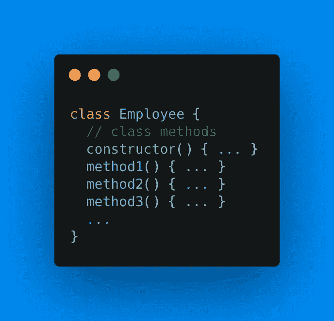
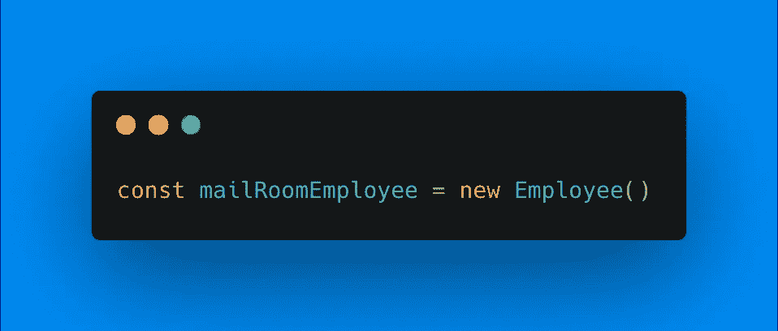
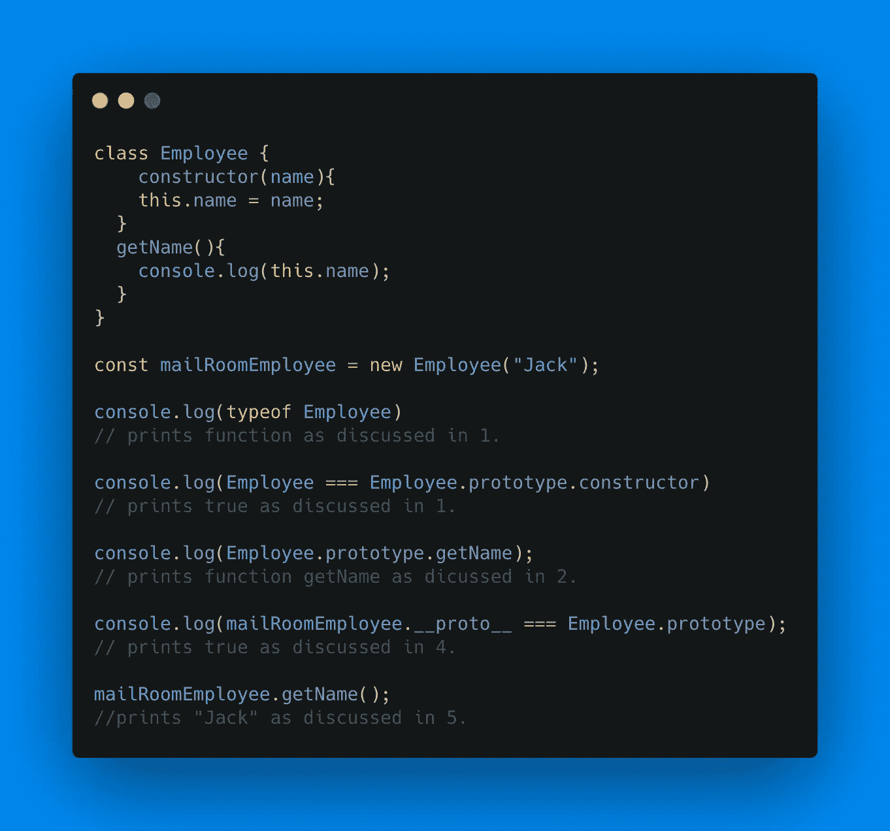

# 理解 JavaScript — JS 访谈系列中的“类”声明

> 原文：<https://javascript.plainenglish.io/understanding-class-declarations-in-javascript-9c623f1fd4ee?source=collection_archive---------14----------------------->

Photo by [Oskar Yildiz](https://unsplash.com/@oskaryil?utm_source=medium&utm_medium=referral) on [Unsplash](https://unsplash.com?utm_source=medium&utm_medium=referral)

类是面向对象编程(OOP)语言的重要组成部分。虽然 JavaScript 包含类(ECMAScript 2015 起)，但 JavaScript 本身并不是一种基于类的语言(此处阅读更多)。事实上，Javascript 是一种基于原型的语言。根据定义，“*基于原型的语言有一个原型对象的概念，一个用作模板的对象，从这个模板中可以获得新对象的初始属性。”*

在本文中，我们将了解 JavaScript 中“class”和“new”关键字的确切工作方式。那么，我们开始吧。

**类:** JavaScript 中的类和任何面向对象程序设计语言中的类有着相同的用途，即创建对象的蓝图。JavaScript 中的类声明如下:

Figure 1\. Declaring a class in JS

如上所示，一个类包含一个构造函数以及与该类相关联的方法。使用“new”关键字创建上述类的对象，如下所示:

Figure 2\. Creating an instance of a class in JS

现在，是时候理解在 JavaScript 中声明一个类和定义一个实例时到底发生了什么。为了更好地理解，我们将考虑图 1 和图 2 所示的代码。

1.  当类 Employee 被声明时，函数 *Employee* 被创建，函数的代码取自类声明中定义的构造函数方法(也可以为空)。
2.  方法(constructor()， *method1()，method2()，..等等。*)存储在 Employee 类的 prototype 属性中。(员工。原型)。
3.  当我们创建如图 2 所示的实例( *mailRoomEmployee* )时，会创建一个名为 *mailRoomEmployee* 的空对象{}。
4.  然后将空对象的原型( *mailRoomEmployee* )设置为 Employee 类(Employee)的原型属性。原型)。
5.  最后，调用构造函数，构造函数的“this”关键字绑定到目标对象( *mailRoomEmployee* )。

为了检查解释，我写了下面的示例代码。请尝试在 [JS Fiddle](https://jsfiddle.net/) 中亲自检查代码结果，以便更好地理解这个概念。

*注:请阅读之间的区别。__proto__ 和。原型* [*此处*](https://stackoverflow.com/questions/9959727/proto-vs-prototype-in-javascript) *。*

请在评论栏留下你的意见或建议。

*更多内容请看*[***plain English . io***](http://plainenglish.io/)