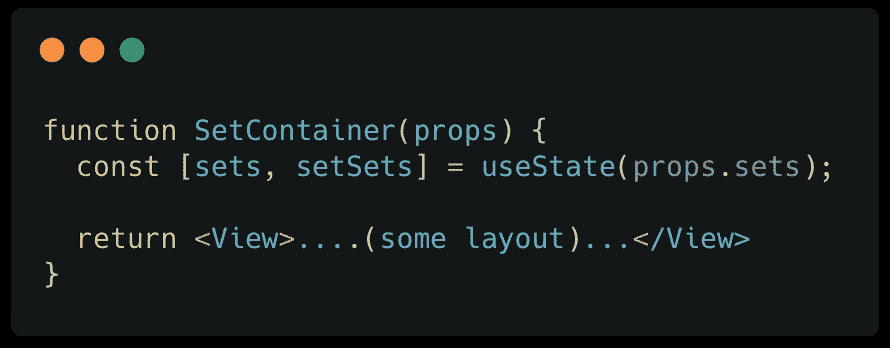
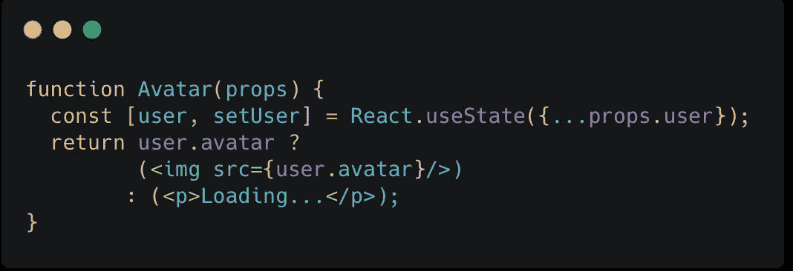
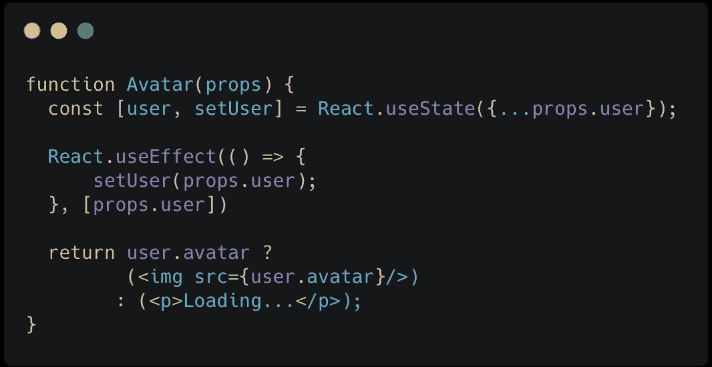
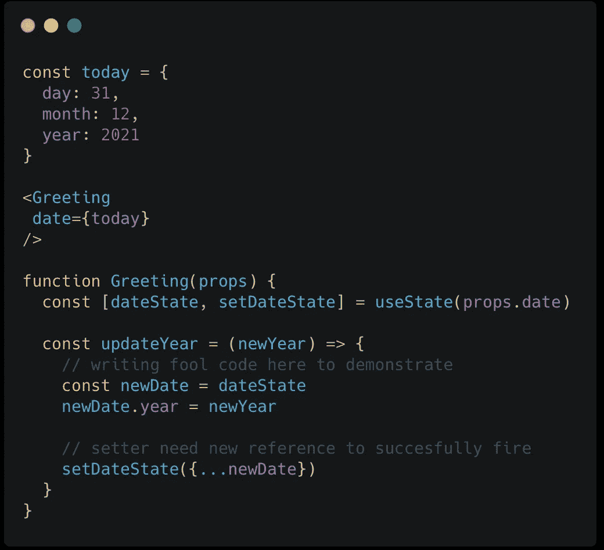

# 了解 React 中的派生状态

> 原文：<https://javascript.plainenglish.io/understanding-derived-state-in-react-1491a9ee3a6b?source=collection_archive---------2----------------------->

## 了解隐藏的风险以及我们如何从了解这些风险中获益。


*Prop* 概念在形成我们令人敬畏的框架——React 中起着重要作用。它是组件之间通信的主要方法之一，向下绕过它，加强父组件和子组件之间的关系。它不仅用于描述组件，有时还播种数据以形成初始状态，这是另一种奇妙的用法，但由于存在隐藏的风险而引起争议，本文旨在指出它们，并让我们看看如何从理解它们中受益。

# 目录:

*   **什么是派生状态？我们为什么需要它？**
*   **真理的两个来源:**它带来了什么问题，以及解决方案？
*   **意外变异道具:**不可预知的虫子
*   **总结**

# **什么是派生状态？我们为什么需要它？**



当一个属性被用来初始化一个状态时，这个状态被称为**派生状态**。我们可以把 prop 看作一个数据依赖，状态用它来形成它的缺省值。像我的`SetContainer`一样，组件有一个名为`sets`的状态，我使用`props.sets`来初始化`sets`。

为什么我们不直接使用`props.sets`呢？为什么要映射到另一个变量(`sets`状态)才能使用？

很棒的问题！简答:暂时突变。

假设我们有一个列表，比如说一个健身锻炼列表，每个锻炼都有自己的细节，就像许多`sets`一样，每组包含不同的持续时间、节奏和休息时间。用户可以选择一个练习并选择编辑细节，在他们编辑后，练习细节必须返回到其原始的`sets`细节。所以整个过程绝对像是`sets`上的临时突变。我们改变集合并把它呈现出来，一旦我们做了，我们就把它放回去。我们需要`SetContainer`来获取原始集合，并且只改变它们作用域内的集合，不影响原始集合。这里的原始集合是`props.sets`，我们要变异的集合是`sets`。通过这种方式，我们确保了通过设置状态进行更改的能力，并且不会影响原始设置。在示例 gif 中，我编辑了一个从 15 到 20 的值，当我退出编辑模式时，它又回到了 15，不要介意应用程序 lol 中的语言。

如你所见，甚至**派生状态**也被称为反模式，有时我们需要它。就我个人而言，我认为反模式一点也不好，它并不完美，它包含了隐藏的风险，但是如果我们意识到这些风险，无论如何它仍然是一个好的方法！我的文章不是要批判**衍生状态**，而是要认识风险，战胜风险！

# 真理两个来源


Who doesn’t love Conan?

为柯南大声呐喊 lol💁

当我们学习 React 时，我们肯定在某个地方遇到过真理的**单一来源**，比如在 Redux principle 中，或者看到其他开发人员在 Twitter 上讨论它，甚至许多博客帖子都提到它。

对我来说，**单一的真理来源**经常被误解，这并不意味着所有的东西都来自同一个地方，这意味着对于每一个特定的数据，都有一个特定的来源。这使得容易跟踪数据流，减轻编程的挫折感。

通过从道具中导出状态，你把一件事情的真相来源一分为二。它原本是一个单独的东西(prop)，派生的状态让它分叉，并可能失去同步，导致类似下面我在 StackOverflow 上发现的问题。

[](https://stackoverflow.com/questions/54865764/react-usestate-does-not-reload-state-from-props) [## React.useState 不从 props 重新加载状态

### 我们使用 useState 为变量设置初始值的功能组件，如果我们通过…

stackoverflow.com](https://stackoverflow.com/questions/54865764/react-usestate-does-not-reload-state-from-props) 

简单解释一下这个问题，他使用一个道具到初始状态，当道具改变时，他期望状态会像它是如何从道具中派生出来的那样更新，但是没有。他的代码:



在函数组件内部，函数内部的几乎所有东西都会重新运行它所调用的每一个(重新渲染)，这是 javascript 的函数行为。这个钩子有点特殊，因为它的创建不会被重复执行，很像在类组件的构造函数中设置状态。这就导致了上面的问题，“useState 不从 props 重新加载状态”。

这样写，他的组件可能会丢失来自`props.user`的未来更新，他的数据流现在被分成两个源，正如我们在这里看到的，它们是不同步的。


在问题跟帖里，别人给他的解决方案`useEffect`:



只要满足第二个参数中的条件依赖，这就可以工作，不像`useState`，`useEffect`在每次渲染后重新执行。现在他有办法同步他的道具和状态，每次他的`props.user`更新时，他为他的`user`状态设置一个新值，但另一个问题出现了，让我给你看。

就像我上面提到的临时突变一样，如果这个`Avatar`组件的唯一目的是显示化身，那么它不需要派生状态。这有点像编辑阿凡达，这样更有意义。

假设我们正在做编辑头像的功能，我们让用户选择他们的个人资料图片，他们想要多少次就有多少次，我们不想更新`props.user`数据或立即向服务器发送更新请求，这是浪费。我们希望对用户的最终决定进行实际更新，比如他选择了 5 次个人资料，在第 5 次选择时，我们向我们的服务器发送更新请求，并在本地更新`props.user`。在我看来，我只是需要，不需要整个`props.user`的数据，但无论如何我只是坚持上面的 StackOverflow 问题。

在选择/编辑头像时，`props.user`突然变化，`useEffect`同步`user`状态和`props.user`。通过设置一个新的状态，我们失去了暂时的突变，我们的编辑。我们必须通过缓存我们的编辑并在`useEffect`中执行条件`setUser`来修复它。

想象我们的数据流要复杂得多，两个真实的来源会导致更大的问题，而且真的很难追踪。

然而，如果你清楚地表明这个属性只是为组件的内部控制状态提供种子数据，那么它就不是一个反模式。

**派生状态**很少使用，最好只在你的组件的内部状态不需要与来自父组件的道具同步时使用，或者甚至当你需要同步时，记住不要做**无条件状态更新**，总是检查你的逻辑，找出它是否需要任何条件。

# **意外变异道具**


每个框架都有自己的生态系统和一套规则。设置这些规则是为了确保开发者不会破坏框架的愿景/生态系统。React 也是如此，它的更新过程主要是异步的。从一开始，我们就被教导不要直接改变状态/道具，进程必须是异步的，React 通过教我们使用`this.setState`或调度`React*.*SetStateAction`(从`useState`返回的元组的第二个值)来教育它，我确实向他们解释清楚了[为什么是异步的](/react-native-the-state-world-59721cbf0521)？在我之前的博客文章中，Redux 也把这作为他们文档中的主要规则之一。这些强调了不直接改变状态/道具的重要性，这是一个必须遵循的规则。

也就是说，每个人至少都会犯一次错误，这可能是因为缺乏知识，或者粗心大意，或者缺乏编程工具的支持。当你的应用程序不能像预期的那样工作，或者你的组件不能正确渲染时，会导致逻辑错误。让我们找出原因！



例如，我们的`Greeting`组件，假设它可以显示一些类似“Hello 31/12/2021”的文本，并使用`props.date`来初始化`dateState` —派生状态。在`updateYear`函数中，我们要更新`dateState`的`year`。通常，我们会对对象的副本进行更改，以便它不会影响对象，但有时，在匆忙中，我们会忘记并执行类似以下操作:

```
const newDate = dateState
newDate.year = newYear
```

这个影响到`props.date`，直接把它变了，而且因为`today`、`newDate`、`dateState`、`props.date`有相同的引用，我们不小心把`today`变了。比方说，我使用其他组件`today`进行一些计算，在一个更新批次后，计算突然产生错误的结果，没有经验，新手会很难发现。

所以记得在使用**派生状态**时对一个对象的副本进行修改，并小心选择如何进行复制，有多种选择，在 Javascript 中在**深层复制**和**浅层复制**之间做出决定。

# 摘要

派生状态是一种反模式，但是当我们需要临时改变数据时，它仍然是一种很好的方法，对于这种情况，我认为它是最简单的方法。

当然，两个真实的来源比一个真实的来源更难管理。当你的组件不会在意来自父级道具(用于派生状态的道具)的更新，或者你真的需要在状态和道具之间同步的时候，使用派生状态是最理想的，切记不要无条件更新。

直接改变道具是有问题的，必须小心地更新衍生状态，特别是当你的状态是物体的时候。

*更多内容看* [*说白了. io*](http://plainenglish.io/) *。报名参加我们的* [*免费每周简讯*](http://newsletter.plainenglish.io/) *。在我们的* [*社区*](https://discord.gg/GtDtUAvyhW) *获得独家写作机会和建议。*