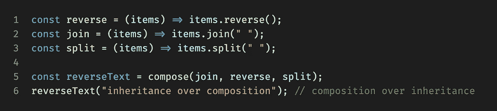

# 理解 JavaScript 中的函数组合

> 原文：<https://javascript.plainenglish.io/understanding-function-composition-in-javascript-1f7d28931d21?source=collection_archive---------4----------------------->

功能编程的一个组成部分— **功能组合**是一种组合多个功能以创建一个新功能的方法。

Example of composing atomic functions (“join”, “reverse”, “split”) to create a new function (“reverseText”), which reverses a text.

# 入门指南

## 理论部分

简而言之，当您组合多个函数时，您会得到另一个函数，当用一些参数调用该函数时，它会依次调用底层函数，并将它们的输出作为输入传递给后续函数，直到得到最终输出。

## 实用部分

让我们看看一个真正的实现:

> 如果您不熟悉 **currying** ，请随意先阅读“[JavaScript 中 currying 的最简单介绍](/the-simplest-intro-to-currying-in-javascript-c36b892f2597)”一文。

这里需要注意几件事:

*   `**compose(...fns)**`-我们正在使用 [rest 参数](https://developer.mozilla.org/en-US/docs/Web/JavaScript/Reference/Functions/rest_parameters) JS 特性，以便支持尽可能多的传递给我们的功能。
*   `**function(...args)**`-与上一点相似，这里我们也使用 [rest 参数](https://developer.mozilla.org/en-US/docs/Web/JavaScript/Reference/Functions/rest_parameters)，这允许我们成为初始参数长度不可知的。
*   `**fns.reducerRight**`——我们使用[array . prototype . reduce right](https://developer.mozilla.org/en-US/docs/Web/JavaScript/Reference/Global_Objects/Array/reduceRight)从最后到第一次调用函数并累加最终结果。此外，请注意，我们正在累加一个具有单个值的数组`[fn.apply(null, result)]`，因为初始值`args`是一个数组，这又迫使我们在返回最终结果时使用`[0]`索引。

> **注:**按照惯例`compose`从**右向左**移动。也可以创建并使用从左到右的**版本，尽管通常会有不同的叫法，比如`pipe`或`sequence`。**

# ****调试****

**有时，我们可能很难理解到底哪里出了问题，我们可能需要检查每次函数调用后发生了什么:**

*   **显然，我们可以使用内置的 IDE 调试器**
*   **或者，我们也可以有一些专用的助手功能，简单地在某一点记录数据**

> **注意:你可能已经猜到了函数的顺序很重要，因为它们是按顺序调用的。**

# **测试**

**此外，您可能听说过函数式编程如何鼓励您使用纯函数，并避免创建具有不可预知副作用的不纯函数。**

**主要原因是:**

*   **纯函数更容易理解和测试**
*   **合成纯函数给你另一个纯函数，上面的观点也适用**

# **摘要**

**函数组合是一种非常强大的技术，它允许我们使用更小的原子函数来构建更复杂的函数。**

**当你用更小的积木建造更高级的建筑时，它可以和乐高相媲美。**

**希望现在你对**函数组合**有了更好的理解，这是**函数编程**的核心特性之一，还有其他类似**的技巧。****

******附言:**如果你觉得这篇文章有趣，可以随时在 [Medium](https://erzhtor.medium.com/) 和 [Twitter](https://twitter.com/erzhtor) 上关注我。****

*****更多内容请看*[*plain English . io*](http://plainenglish.io/)****