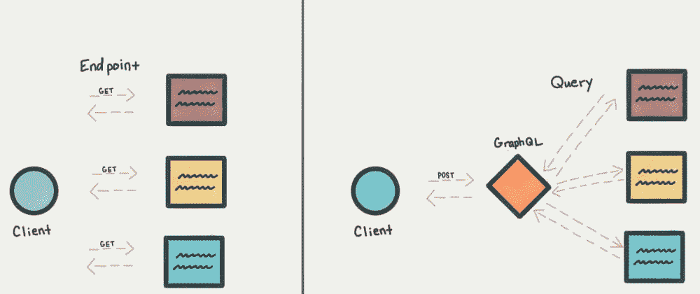
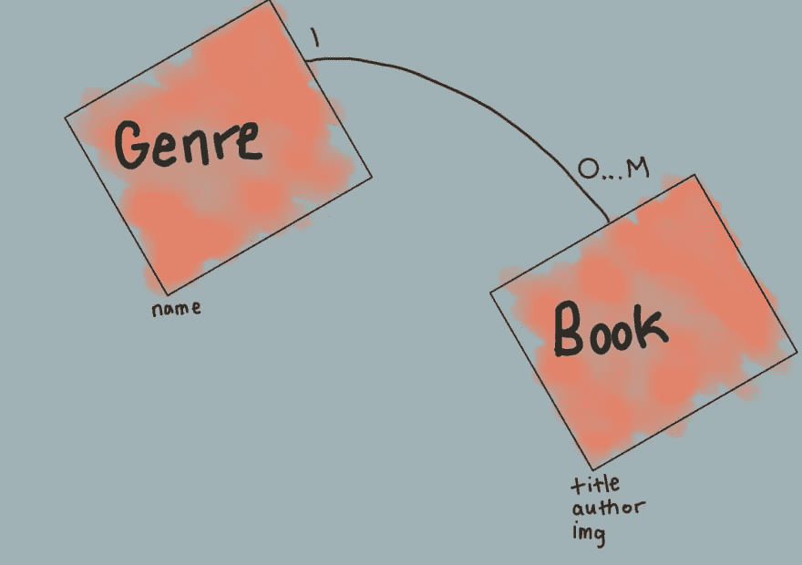
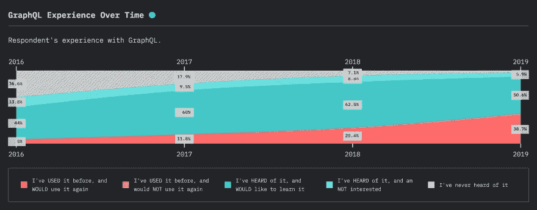

# 通过 REST 了解 GraphQL

> 原文：<https://javascript.plainenglish.io/understanding-graphql-through-rest-a35f58a88d2c?source=collection_archive---------8----------------------->



REST and GraphQL data fetching

## 通过比较两种 API 规范来了解 REST 和 GraphQL。

为了理解为什么 GraphQL 会继续获得关注，理解它打算改进什么会越来越有帮助。软件工程的美妙之处之一是不断地渴望改进提供给我们的东西。GraphQL 试图用 REST 来做到这一点。最后，您将了解 REST API(应用程序编程接口)端点的示例，GraphQL 查询如何与这些 REST 端点相关，以及 GraphQL 存在的原因。让我们开始吧。

# 理解休息

[REST](https://www.codecademy.com/articles/what-is-rest) 代表具象状态转移。

这种架构以`stateless`和能够`separate concern between client and server`而闻名。

## 无国籍的

从这个意义上说，无状态意味着服务器不需要知道客户机的状态来执行一个动作。

## 关注点分离

客户端和服务器分离允许开发人员在不影响客户端代码的情况下更改服务器，反之亦然。

## 沟通

当与其他 API 规范进行比较时，真正使 REST 与众不同的是客户机和服务器的通信方式。REST 是在 90 年代后期与 HTTP(超文本协议传输)1.1 一起开发的。正因为如此，REST 能够利用 HTTP 的优势。为了说明这种交流，我将使用一个包含流派和书籍的通用模型。



Genre and Book Model

我们将回顾通过 REST API 接收和更新数据源。

## 从 REST API 接收信息

得到`/genres`

当客户访问这个端点时，他们将被返回一个流派列表。

```
[
  {
    "id": 1,
    "name": "Mystery"
  },
  {
    "id": 2,
    "name": "Romance"
  }
]
```

类似于流派，书籍也是如此

获取`/books`

```
[
  {
    "id": 1,
    "title": "The lost man",
    "author": "Jane Harper",
    "img": "/img/jh-tlm.png"
  },
  {
    "id": 2,
    "title": "And then there were none",
    "author": "Agatha Christie",
    "img": "/img/ac-attwn.png"
  }
]
```

如您所见，这是一个非常可预测和可扩展的过程。如果我们上面的模型改变为包含另一个模型，比如`Libraries`，我们可以很容易地添加那个端点，继续前进。

## 休息时的 CRUD 操作

在创建处理 CRUD(创建、替换、更新和销毁)操作的服务时，我们将创建以下内容

*   发布`/genres`

创造一种新的风格

*   放`/genres`

更新现有流派

*   删除`/genres`

移除或删除现有的流派

在 REST API 开发中，利用所提供的 HTTP 方法使得与这些可用端点的通信变得非常可预测。

## 摘要

REST API 背后的一般思想是让一切都成为端点。如果您需要在请求中添加或删除一些信息，以减轻客户端浏览器的负担，您可以轻松地做到这一点，而无需向客户端提供太多关于幕后发生的事情的信息。最重要的是，REST 的目标是快速、可靠和可预测，同时利用所有 HTTP。

# GraphQL 是什么？

[GraphQL](https://graphql.org/) 是一种查询 API 的语言。不够？别急，更多的来了。

与 REST API 相反，GraphQL 提供了一个 HTTP 端点和一个从`understandable description of the data available`到`type specification`的端点。这赋予了客户端`request what they need and nothing more`的能力。这种查询语言更接近数据源，使前端开发人员能够更多地访问可用的模型和它们之间的关系。有了这个，他们就能够`get many resources in a single request`。

## 类型规格和自我文档

不同于 REST 端点为每个端点返回不同的返回类型，GraphQL 依靠类型和字段来告诉您的客户端什么是可能的。

```
type Query {
  books: [Book]
  genres: [Genre]
}type Book {
  id: Int
  title: String
  author: String
  img: String
}type Genre {
  id: Int
  name: String
  books: [Book]
}
```

这样，任何需要 API 来开发客户端代码的人都可以参考开发人员工具来查看所有可能的查询，这要归功于类型规范和自文档化。

## 请求所需要的，仅此而已

在我们的流派和书籍数据源中，当我们请求一本书时，我们总是会得到所有可用的关键字。

```
[
  {
    "id": 1,
    "title": "The lost man",
    "author": "Jane Harper",
    "img": "/img/jh-tlm.png"
  },
  {
    "id": 2,
    "title": "And then there were none",
    "author": "Agatha Christie",
    "img": "/img/ac-attwn.png"
  }
]
```

有了 GraphQL，我们可以添加和删除键，只格式化前端需要的数据。比方说，我们正在创建一个只需要标题和图像的页面，我们可以创建一个查询来完成这个任务。

```
query {
  books {
    title
    img
  }
}
```

如果没有`author`和`id`键，这将返回相同的结果。

```
[
  {
    "title": "The lost man",
    "img": "/img/jh-tlm.png"
  },
  {
    "title": "And then there were none",
    "img": "/img/ac-attwn.png"
  }
]
```

## 在单个请求中获取许多资源

在上面的 REST 例子中，如果我们想同时获得流派和书籍，我们有几个选项。

1.  向`/genres`和`/books`发出多个请求

*   这将迫使客户端自己解决这些关系。

2.将图书关系添加到`/genres`端点。

*   唯一的负面影响是，现在任何时候你想获取流派，你都不得不包含书籍，这是上面提到的过度获取的问题。

3.创建一个新的端点或添加一个选项，允许获取流派和书籍。

*   这是最常见的，因为它不会干扰连接到 API 的现有前端应用程序。

GraphQL 的目标是通过类型规范使所有关系可用，而不是为每个端点规划关系和响应。

## 版本控制

前端和后端团队之间的沟通可能会很困难。在更改端点的例子中，您需要与前端团队沟通，以确保他们为任何重大更改做好准备。使用 GraphQL 可以很容易地添加或删除与上述类型相关的字段。

```
type Book {
  id: Int
  title: String
  author: String @deprecated
  authoredBy: Author
  img: String
}type Author {
  firstName: String
  lastName: String
}
```

这可能会减少团队之间需要的沟通，减少下游的突发变更。

# 基础知识

## 查询与突变

到目前为止，上面的例子都是查询。查询和突变替换端点，以全部解析为一个端点`POST /graphql`。这个端点可以更改，但始终一致的是所有内容都是 POST 请求。过了这个时间，你要么发送一个查询变量，要么发送一个变异变量。为了便于阅读，所使用的格式总是隔开的，并且是从经常使用的开发工具(如 GraphiQL)中复制的。[这里的](https://countries.trevorblades.com/)是一个用来查询国家的 GraphiQL 的例子。试试吧！

## 询问

在 REST API 中，查询都与 GET 请求相关。查询是 GraphQL 的主要焦点，也是它的独特之处。不是点击 REST 端点`GET /books`，而是使用单个端点`POST /graphql`并发送一个查询变量。这里有一个例子。

```
query {
  books {
    id
    title
  }
}
```

## 变化

GraphQL 中的 PUT、POST 和 DELETE 端点等价物是突变。

`POST /book?name=Storyteller`

```
mutation {
  createBook(
      {
          name: 'Storyteller'
      }
  ){
      // what you want to return
      id
      name
  }
}
```

上面的一个关键区别是，不管是突变还是查询，我们总是需要解析`// what you want to return`部分中的响应。对我来说，这似乎仍然很尴尬，因为你通常只想知道创作书籍是成功还是失败。例如，由客户端决定如何处理，而不是由 REST 端点返回一个 id。

# 为什么您应该了解 GraphQL

## 简史

GraphQL 由脸书的内部团队制作，但在 2015 年发布到开源社区。大约在 2012 年的某个时候，脸书团队想要解决他们在 REST API 中发现的一些问题。移动应用程序由于大量过度提取数据而变得越来越慢。他们在多个客户端应用程序之间共享 API，改变一个端点会被认为是对一个客户端应用程序的重大改变。

## 它还在增长



在 JS 2019 调查的[状态中，JavaScript 社区中大约 6%的开发者仍然不熟悉它，但其余大多数人表示对它感兴趣。自 2015 年开源社区成立以来，它一直在逐步成长。开源社区真的已经运行了这个 API 规范，并且正在构建更多的工具来进一步发展这个东西。](https://2019.stateofjs.com/data-layer/graphql/#graphql_experience)

## 连接到多个数据源

我习惯于使用直接连接到数据库的 API 创建一个三层应用程序，因此重新启动 API 来利用 GraphQL 的好处可能看起来像是一次大的检修。事实并非如此，事实上，该社区有极好的资源来利用您已经存在的 REST API 来生成 GraphQL 层。因此，使用您的 REST API、数据库或现有的 GraphQL API，您可以为所有应用创建一个统一的端点。

## 支持

脸书哪儿也不去，他们制造了伟大的工具，帮助开源社区创造伟大的东西。如果你是一个 React 开发者，你应该知道这一切！开源也在工具方面大展拳脚，使之成为更好的开发者体验。我最喜欢的一个是 [graphql-code-generator](https://graphql-code-generator.com/) ，我们可以在创建模式后自动生成类型脚本类型和类型-graphql 类型。

# 第二部分。使用 REST API 创建 GraphQL API

如果你有兴趣学习使用 REST API 作为你的数据源来创建一个 graph QL API[请继续阅读](https://medium.com/javascript-in-plain-english/create-a-graphql-api-wrapper-for-your-rest-api-7873c63fcce2)第二部分，在那里你会用 JavaScript 创建你自己的[新冠肺炎 GraphQL API](http://covid-act-now-graphql.herokuapp.com/) 。

# 摘要

REST 和 GraphQL 是共享数据的有用规范。REST 是可伸缩的、无状态的，并且非常擅长分离关注点。GraphQL 试图建立在 REST 的不足之上，REST 需要多次请求来获取客户端、版本控制和手动文档所需的所有信息。我们学习了 REST 和 GraphQL 之间的基本区别，以及它们的各种术语，比如查询和突变。GraphQL 的增长得益于开源软件开发和开发者体验满意度。如果您还没有，请尝试一下。