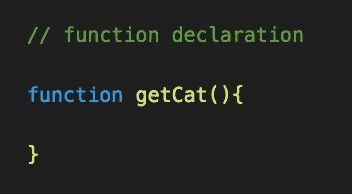
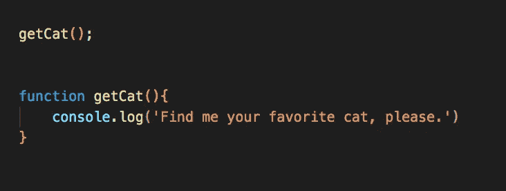
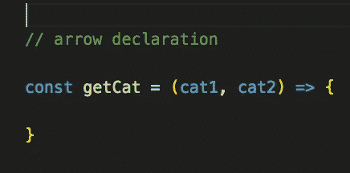
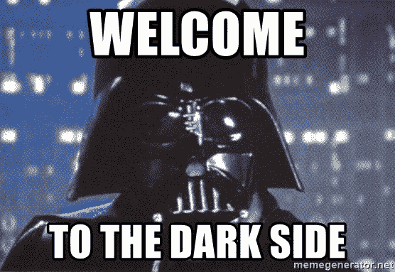

# 理解 JavaScript 中的提升

> 原文：<https://javascript.plainenglish.io/understanding-hoisting-in-javascript-3efe332ec75?source=collection_archive---------7----------------------->

*这毕竟是个小吊装世界。*

Photo by [Tracy Adams](https://unsplash.com/@tracycodes?utm_source=medium&utm_medium=referral) on [Unsplash](https://unsplash.com?utm_source=medium&utm_medium=referral)

任何学习 JavaScript 的开发人员都必然会遇到提升并需要理解它的问题。甚至在最近的一次求职面试中，有人问我这是什么，我希望我能更好地阐述这个话题。在这一点上，让我们探索 JavaScript 中提升的美好世界，并一起了解它！

# JavaScript 中的提升是什么？

提升是 JavaScript 的默认行为，即在任何其他代码执行发生之前，读取作用域顶部所有已定义的变量或函数声明。在 JavaScript 中提升的一个好处是，它允许我们在函数出现在代码中之前调用它们，因此将我们的代码抽象出来一些。

另外，需要注意的是，JavaScript 只提升函数声明，而不是初始化或箭头函数。

# 让我们再深入一点。

**函数声明**:用**函数** *关键字*声明的函数，后跟函数的*名*和一对*括号*:

#function declaration syntax

在程序中，提升的语法如下所示:

#in the console, these lines of code will print: ‘Find me your favorite cat, please.’ While getCat() wasn’t technically defined yet, it is a function declaration, so it’s being hoisted to the top of the scope.

作为参考，不能悬挂的**箭头声明**如下所示:

#arrow declaration syntax

# 吊装有什么好处？

无论在哪里声明一个函数，无论它是全局的还是局部的，它都被移动到其作用域的顶部。所以有人可能会说，使用提升的主要优点是，函数不必为了正常工作而以特定的顺序声明。

# 吊装的黑暗面

提升不一定被认为是伟大的，甚至可能是不好的实践。假设你有许多声明的变量和函数声明都被提升了，这些都将在任何代码被执行之前在浏览器中被读取。所有这些提升很可能会显著降低应用程序的运行时间。

# 结论

在 JavaScript 中，掌握提升非常有帮助，虽然这可能不是你想要实现的，但它是理解提升在 JavaScript 功能中的作用的关键。

我希望这给了你一些清晰的思路，感谢你的收听！现在，快乐编码！

*更多内容请看*[*plain English . io*](http://plainenglish.io/)