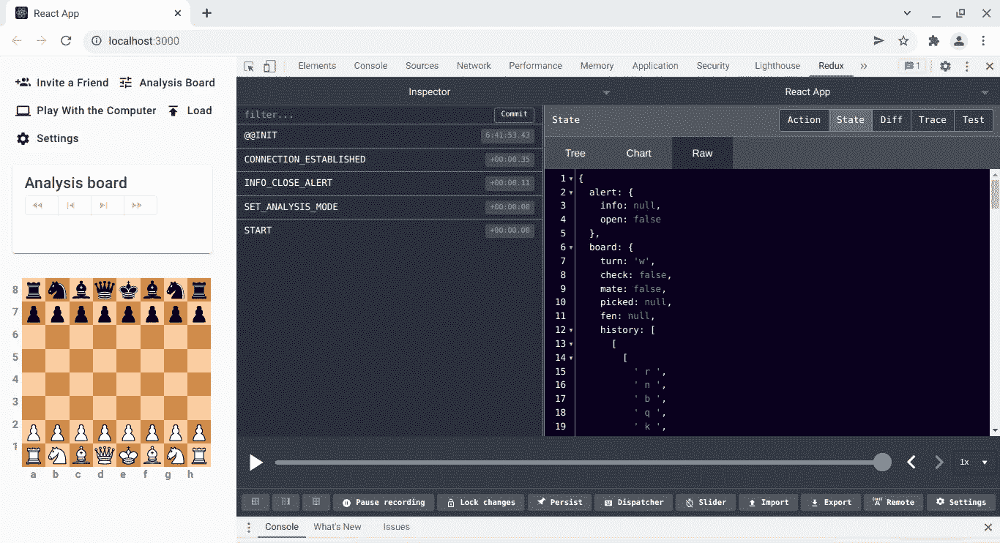

# 复杂反应 Redux 应用程序是如何工作的

> 原文：<https://javascript.plainenglish.io/understanding-how-a-complex-react-redux-app-works-934b3600ad13?source=collection_archive---------5----------------------->

## 一步一步来理解，不要太混乱。


在上一篇文章[准备调试 React Redux 应用程序](/getting-ready-for-debugging-react-redux-apps-a1eefea535)中，简要介绍了用 [Redux 象棋](/what-is-redux-chess-6264c99c1eca)分析一款象棋游戏。正是考虑到这个用例，第一次在浏览器中安装了 **Redux DevTools** 扩展。我们了解到分析板允许你自己下棋——这是 [Redux 象棋演示](/check-out-the-redux-chess-demo-acbea003d710)启动时的默认游戏模式。

然后，我们从分析`1.e4 e5`开始，T0 也被称为开放游戏。

[](https://en.wikipedia.org/wiki/Open_Game) [## 开放游戏-维基百科

### 一个开放的游戏(或双王的棋子开放)是一个国际象棋开始与以下动作:白色已经移动…

en.wikipedia.org](https://en.wikipedia.org/wiki/Open_Game) 

在那种情况下，重点主要放在用户分析游戏时调度的动作上，然后出现一个动作列表。

```
PICK_PIECE
LEGAL_MOVES
LEAVE_PIECE
VALID_MOVE
PICK_PIECE
LEGAL_MOVES
LEAVE_PIECE
VALID_MOVE
FLIP_BOARD
OPEN_GET_PGN_DIALOG
CLOSE_GET_PGN_DIALOG
```

然而，应用程序的状态变化与调度的动作是同步的。因此，在今天的帖子中，我们将检查应用程序的状态，以便熟悉它，还有什么比在 **Redux DevTools** 中检查状态树更好的方法呢？

# 我们开始吧！

`src/reducers/rootReducer.js`中的根缩减器为您提供了一个概念，即如何将状态划分为多个缩减器，每个缩减器负责管理状态的特定部分。

**图 1** 展示了不同的视角。

这是第一次加载应用程序后，即自动调度初始操作后，整个全局状态的快照。

```
@@INIT
CONNECTION_ESTABLISHED
INFO_CLOSE_ALERT
START
```



Figure 1\. Open Redux DevTools, then click on State followed by Raw.

下面是原始的 JSON 对象，作为所有游戏分析的起点。

不过，我们分析象棋游戏时主要关注的是`board`减压器，因为当用户点击棋盘上的方块进行移动时，这个部分会发生变化。点击`e2`后，板卡减速器是如何改变状态的。


Figure 2\. The user clicks on e2.

我再怎么强调也不为过，在这个特殊的案例中，全球状态的变化与调度的行动是同步的:

```
PICK_PIECE
LEGAL_MOVES
```

再次为了更好的可读性，下面是原始 JSON 对象在`board`状态更新后的样子。

```
{
  ...
  board: {
    ...
    picked: {
      i: 6,
      j: 4,
      algebraic: 'e2',
      piece: ' P ',
      legal_moves: [
        'e3',
        'e4'
      ]
    },
    ...
  },
  ...
}
```

基本上,`board.picked` JSON 键已经更新了新的信息。玩家在`e2`上选择了一个棋子，结果是一个棋子 `P`，在`e3`和`e4`上有合法的移动。8×8 矩阵中的索引`i`和`j`也可用于进一步处理。

手头有了`board.picked`信息，突出显示`e2`上的棋子及其合法移动就很简单了。


Figure 3\. e2, e3 and e4 are highlighted.

# 但是数据是从哪里来的呢？

请记住，Redux Chess 旨在“只是一个棋盘”,尽可能地轻量级，这意味着它依赖于国际象棋服务器来满足其大部分处理需求。在过滤 **WS** 流量时， **Chrome DevTools** 中的**网络**选项卡将提供以下信息。


Figure 4\. WebSocket messages sent to the server.

点击`e2`后，网络浏览器向 WebSocket 服务器发送此消息:

```
/piece e2
```

然后服务器做出相应的回应:

```
{"\/piece":{"color":"w","identity":"P","position":"e2","moves":["e3","e4"]}}
```

干得好！现在请花点时间让你的眼睛休息一下。

# 结论

开始使用复杂的 React Redux 应用程序的一个好方法是首先检查它的测试环境，尤其是在第一次提交之前的学习曲线的开始。我们仍然在通过与它的 UI 交互来获得一些关于 Redux Chess 如何工作的直观知识，将它分解成易于管理的理解，一次一步。

使用 Redux 模式，应用程序的状态变化与分派的操作密切相关——按照通用的同步 Redux 流程。然而，目前的 React Redux 应用程序涉及两个应用程序之间的客户端-服务器通信:web 浏览器和象棋服务器。

因此，当棋手在分析模式下点击新棋盘上的`e2`时，浏览器会向国际象棋服务器发送一条 WebSocket 消息，以计算出该方格上的棋子及其合法走法。

所有这一切都归功于 **Chrome DevTools** 和 **Redux DevTools** 扩展。

[](/what-is-redux-chess-6264c99c1eca) [## Redux 棋是什么？

### 嵌入到 React 应用程序中的易于使用的象棋插件

javascript.plainenglish.io](/what-is-redux-chess-6264c99c1eca) [](/check-out-the-redux-chess-demo-acbea003d710) [## 查看 Redux 国际象棋演示

### 请坐下来，享受一杯你最喜欢的啤酒

javascript.plainenglish.io](/check-out-the-redux-chess-demo-acbea003d710) [](/getting-ready-for-debugging-react-redux-apps-a1eefea535) [## 准备调试 React Redux 应用程序

### 一边听有助于你感到平静和快乐的音乐

javascript.plainenglish.io](/getting-ready-for-debugging-react-redux-apps-a1eefea535) 

*更多内容看* [***说白了. io***](http://plainenglish.io/) ***。*****[***免费每周简讯***](http://newsletter.plainenglish.io/) ***。*** *在我们的**[***社区不和谐***](https://discord.gg/GtDtUAvyhW) ***中获取独家写作机会和建议。******