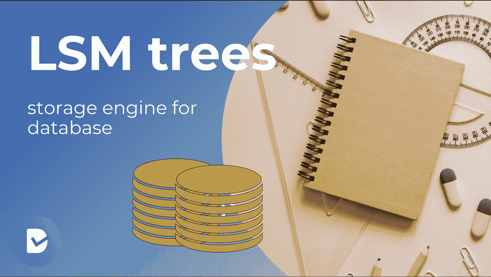
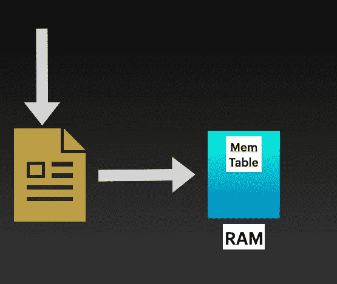
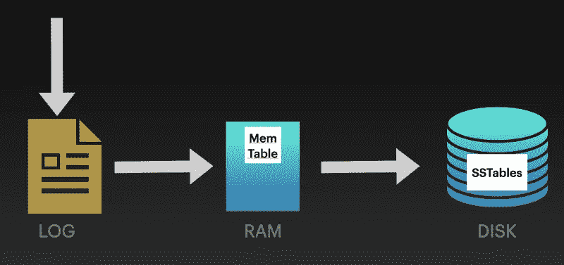
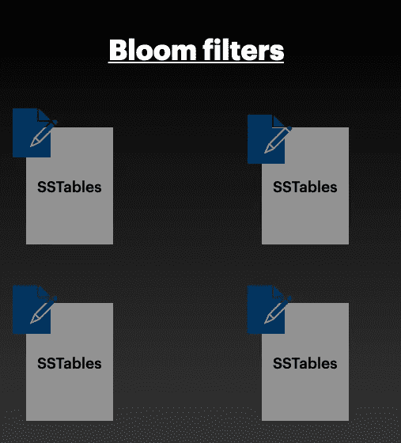
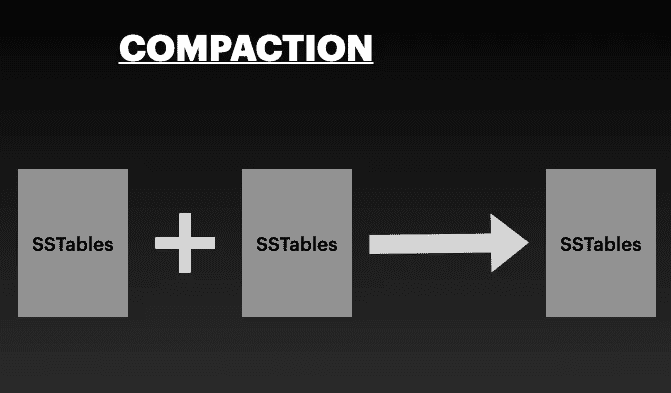

# 了解数据库如何存储我们的数据:LSM 树介绍

> 原文：<https://javascript.plainenglish.io/understanding-how-databases-store-our-data-introduction-to-lsm-trees-ec1c46096570?source=collection_archive---------6----------------------->

“在当今世界，数据是储存在芯片上的黄金。”

我们的生活依赖于数据。我们的社会活动，我们的运动，我们生活的每一个方面都被收集并存储在磁盘上。我们每天都在存储更多的数据。

我们有没有想过，是什么让存储这么多数据变得更容易？显然，这是我们的数据库，但特别是数据库的**存储引擎，它在磁盘上存储数据，现在已经被改变，以处理这种巨大的数据流。**存储引擎是将数据存储到磁盘和从磁盘读取数据的数据库软件层。****

在早期，B+树是用于在磁盘上存储数据的默认数据结构。B+树的写复杂度是 O(n log n ),因为在每次插入时，树会自我平衡以保持节点的正确顺序。但是随着数据接收的持续增长，我们遇到了 B+树的性能问题。B+树不是写密集型应用程序的理想选择。LSM 树**来了**。LSM 树是在一些数据库中实现的数据结构。像 MongoDB，Cassandra 等数据库。使用基于 LSM 树的存储引擎。LSM 树是 B+树的替代树，B+树用于在写入密集型应用程序中将数据存储在磁盘上。

## 但是，是什么让 LSM 树能够吸收海量数据呢？

**LSM 树代表日志结构合并树**。它们的工作原理是，所有要在数据库上执行的写操作都必须首先写在日志文件的底部。由于我们在日志文件的底部追加数据，写操作变得非常非常快，即写复杂度变为 O(1 ),而在 B+树的情况下是 O(n log n)。

## LSM 树如何处理数据库上的写操作？

让我们先从编写器开始，看看读写操作是如何在 LSM 树中执行的。

*   每当数据库有东西要写时，我们就把它附加在日志文件的底部。

All write operations are appended to a log file

*   除此之外，我们还将数据放入内存中的数据结构中，称为 **MemTables** 。 **MemTables 是内存中排序的数据结构**。

Logfile to MemTable data flow

*   随着我们不断向 Memtable 写入数据，Memtable 的大小不断增长，在达到某个阈值后，我们将所有数据从内存刷新到磁盘存储，称为**s tables**。表是存储数据的磁盘数据结构。有多个表存储我们的数据。它们按主键或任何其他索引进行分区。

log file -> MemTable-> SStables

由于表是磁盘上的结构，所以在表中搜索非常慢。因此，SSTables 还维护内存中的数据结构，称为 **Bloom filters** ，这有助于我们在读取数据时加快搜索速度。布隆过滤器为我们提供了以下信息:

1.  特定的键在特定的表上肯定是不可用的
2.  特定的键可以在特定的表中找到

布隆过滤器帮助我们优化跨多个表的数据搜索，因为减少了我们需要扫描的表的数量。

现在，如果我们继续在 SSTables 上写数据，SSTables 的大小也将继续增加，这将减慢我们的搜索结果。因此，每当一个表的大小超过限制时，我们将多个表合并到另一个新的表中，以删除重复的记录。多个表合并的过程被称为**压缩**。

Compaction of SSTables

简而言之，写操作看起来像这样。

我们将指令追加到日志文件中，并将其写入内存中的数据结构(称为 Memtables)。当内存表增长超过某个阈值时，内存表被刷新到表中。表存储在磁盘上，与内存表相比速度较慢。为了加快搜索数据的过程，表包含一个内存数据结构，称为 Bloom filters。

## LSM 树如何执行搜索查询？

当我们搜索一个特定的键时，我们首先搜索 MemTables。由于 Memtables 位于内存中，所以查找速度很快，如果我们在 Memtables 上找到任何数据，我们就将结果返回给客户机。如果 Memtables 上没有这个键，那么我们就在表中搜索这个键，Bloom filters 帮助我们缩小了搜索范围。如果在表中找到了记录，那么我们将该行返回给客户机，否则我们将返回未找到的记录。

这就是在数据库存储引擎中实现的 LSM 树的简介。你也可以浏览我试图详细解释 LSM 树的视频。

*更多内容尽在*[*plain English . io*](http://plainenglish.io/)