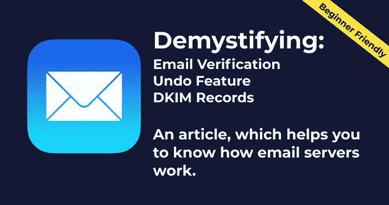
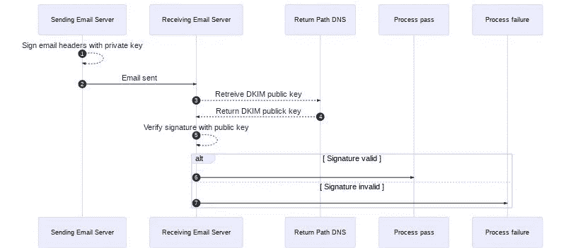

# 理解电子邮件在幕后实际上是如何工作的——初学者友好指南

> 原文：<https://javascript.plainenglish.io/understanding-how-emails-actually-work-behind-the-scenes-a-beginner-friendly-guide-9d129942f617?source=collection_archive---------21----------------------->

你好。今天，我们要看看电子邮件欺骗检查是如何工作的。你们大多数人都见过一些邮件变成了垃圾邮件，或者直接进入了你的收件箱。但是这些东西是怎么工作的呢？

所以我们来解码吧。

我假设你有一个邮件帐户，并积极使用它。

# 为什么我需要了解和学习结果？

如果你正试图构建与电子邮件相关的东西，了解电子邮件在幕后是如何工作的会非常有用。它可以是一个简单的自动化服务或自定义简讯服务。或者你可能只是对题目很好奇，想学习了解一下。

您将了解以下内容:

*   在服务器级发送电子邮件的工作原理。
*   电子邮件服务器中欺骗检查的工作原理。
*   Gmail 如何建立撤销功能。

# 我们开始吧

电子邮件验证基于 DKIM 记录的概念。

**什么是 DKIM 记录？**

*   简单地说，它就像邮件的认证，确保发件人是否真实。
*   域名密钥识别邮件(DKIM)是一种用于防止电子邮件欺骗的身份验证标准。具体来说，DKIM 试图防止用于发送电子邮件的域名被盗用。
*   因此，每当我们发送启用了 DKIM 的电子邮件时(如果您使用 Gmail，则是自动的)，发送服务器会用私钥对邮件进行签名。

如果你有一个自定义域(就像我一样:`abirpal.co`)，作为我发送的所有电子邮件的域所有者，我必须在发送域的 DNS 记录中添加一个 DKIM 记录，这是一个修改的 TXT 记录。该 TXT 记录将包含一个公钥，接收邮件服务器使用该公钥来验证邮件的签名。

现在，域服务器本身自动为您做同样的事情，它只需要一次性配置邮件服务器

所以总的来说，DKIM 是一种验证发送者是否真实的方法。

# 做中学

让我们看看 DKIM verification 是如何工作的，在下面的序列图的帮助下，通过可视化我们发送电子邮件的时候(是的，你可能在软件工程课上听说过术语`sequence diagrams`)。

# 步骤 0:

假设你的邮件是:`awesome@example.com`。所以，当你点击发送时，发送服务器会用一个私钥对邮件进行签名。

**注意:这是 Gmail 向用户展示撤销功能的准确时间。**

# 第一步:

当邮件发出时，接收服务器从用于发送邮件的`example.com`或任何其他`custom domain`的 DNS 记录中获取 DKIM 记录，或者如果邮件是从您的 Gmail 帐户发送的，也可以是`gmail.com`。

# 第二步:

然后，接收服务器使用 DKIM 记录中的公钥来验证邮件的签名。

# 第三步:

如果 DKIM 检查通过，接收服务器可以确信消息是由`return-path`中的地址发送的，并且在传输过程中没有被更改。

**注意:这就是如何通过 DKIM 验证来检查电子邮件欺骗**

# 第四步:

如果 DKIM 检查失败，该消息很可能是非法的，将使用接收服务器的失败进程进行处理。

# 限制

虽然 DKIM 身份验证是电子邮件的最佳实践，但了解 DKIM 签名的范围是有限的，这一点很重要。它不验证内容，也不告诉接收者以任何不同的方式处理消息。它的主要目的是帮助验证发件人身份，这是电子邮件传递时的一个重要因素(尽管不是唯一的因素)。

# 轻拍后背。🎉🎉

## 恭喜你，你刚刚了解了电子邮件的幕后工作原理，包括撤销功能和 DKIM 验证。

*更多内容尽在*[***plain English . io***](http://plainenglish.io/)