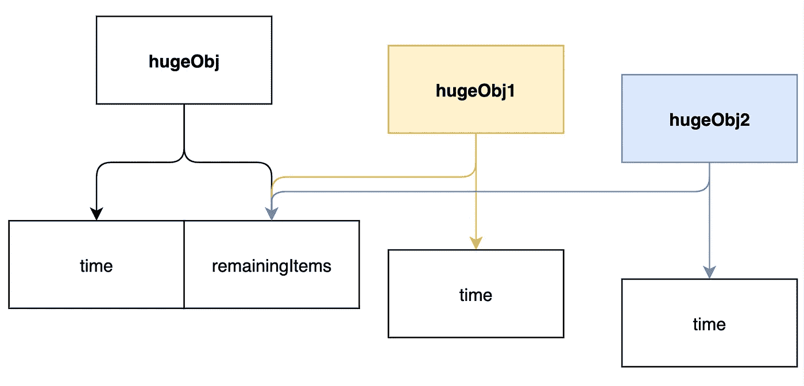

# 让我们来理解不变性。

> 原文：<https://javascript.plainenglish.io/understanding-immutability-d00ed097e020?source=collection_archive---------9----------------------->

> 在面向对象和函数式编程中，**不可变对象**是一个对象，它的状态在创建后不能被修改。这与可变对象不同，可变对象可以在创建后进行修改。— [维基百科](https://en.wikipedia.org/wiki/Immutable_object)

## 为什么是不变性？

想象你在一个仓库工作。


Photo by [Adrian Sulyok](https://unsplash.com/@sulyok_imaging?utm_source=medium&utm_medium=referral) on [Unsplash](https://unsplash.com?utm_source=medium&utm_medium=referral)

我们来看两个案例。

案例 1:仓库有可变的货架来摆放产品。没什么特别的。

*   你把**蓝色棒棒糖**放在架子`#66`里。
*   第二天，你来拿一些蓝色的棒棒糖，却震惊地看到各种颜色的棒棒糖被扔进了一个架子`#66`。
*   当被问及此事时，经理说，'*是的，齿条* `*#66*` *对吗？那个棒棒糖架！*’

经理不知道架子`#66`是专为蓝色棒棒糖准备的！

这种情况在现实生活中经常发生。我们把钥匙放在某个地方。有人把钥匙的位置从架子改成了抽屉。这造成了混乱。

我们对现实生活中的易变性无能为力。但是在软件项目的数字生活中，我们可以让货架不变。

案例二:仓库有不可变的货架摆放产品。一旦创建，没有人可以变异机架包括你！

*   你把**的蓝色棒棒糖**放在`#66`的架子上。
*   66 号货架将继续拥有相同的**蓝色棒棒糖**，直到它被销毁。

不再困惑！

但是等等！

如果我们根本不能改变货架，我们如何访问货架`#66`中的物品？采摘棒棒糖将减少大小，这是一个突变，对不对？

## 我们创造越来越多的货架！

看下面的物体。

```
const **rack66** = {
  bluelollipops: {
    count: 1200
  }
}
```

而且，当我们需要拿出`100`棒棒糖时，我们会做下面的事情。

```
const updatedCount = rack66.bluelollipops.count - 100const **rack66a** = {
  bluelollipops:{
    count: updatedCount
  }
}console.log(rack66a) // will have bluelollipops.count as 1100.
```

> 我们创建一个带有预期突变的新对象，而不是突变一个现有的对象。

`rack66`和`rack66a`将继续具有下面的值，直到它们被垃圾收集。

```
// Object: **rack66**
{
  bluelollipops:{
    count: 1200
  }
}// Object: **rack661**
{
  bluelollipops:{
    count: 1100
  }
}
```

***不再有惊喜！***

## 表演呢？

上面的例子方便地使用了一个平凡的对象。如果我们想用一个巨大的物体会怎么样？看下面的例子。

```
const hugeObj = {
  time: 1635268451
  remainingItems: {// an obnoxious number of properties.}
}
```

而且我们要每毫秒更新一次`hugeObj.time`对象！

```
const hugeObj1 = {
  time: 1635268452
  remainingItems: {// an obnoxious number of properties.}
}const hugeObj2 = {
  time: 1635268453
  remainingItems: {// an obnoxious number of properties.}
}and so on.
```

现在会发生什么？

*   `hugeObj`大小为 1MB。
*   创建对象的频率:每小时 1000*60*60。也就是每小时 3.6 TB。

那么，上述想法是如何理智的呢？

## 结构共享

不可变数据结构支持一种叫做结构共享的技术。

以上`hugeObj`、`hugeObj1`、`hugeObj2`互为版本。因此，我们可以**重用**对象的未更改部分，而不是创建整个对象。



这解决了性能问题。

## 优势

*   **简单调试:**每个变异都有自己的数据版本，而*哪个代码产生了意外数据是罪魁祸首。*
*   **并行执行**:多线程环境可以处理相同的数据。
*   **缓存**:我们可以放心地缓存数据，因为我们知道它不会改变。
*   **快照的时间线**:我们可以创建一个时间线，记录应用程序在一段时间内的状态变化。Redux Devtools 用这个。

这就是永恒性。

继续阅读 immerJS，它使不变性变得更加简单。

[](https://karthickragavendran.medium.com/fix-a-pain-point-like-immerjs-e4a4e4a63441) [## 修复 ImmerJS 这样的痛点

### 通过简单地修改当前的树来创建下一个不可变的状态树——Immer

karthickragavendran.medium.com](https://karthickragavendran.medium.com/fix-a-pain-point-like-immerjs-e4a4e4a63441) 

谢谢你。下次见。

*更多内容看* [***说白了. io***](http://plainenglish.io/)