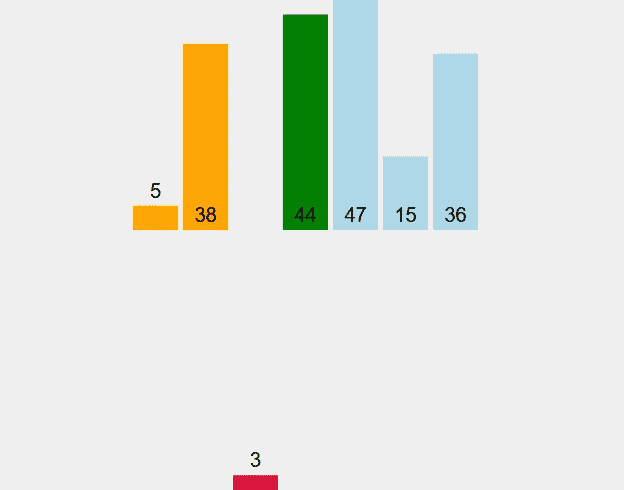
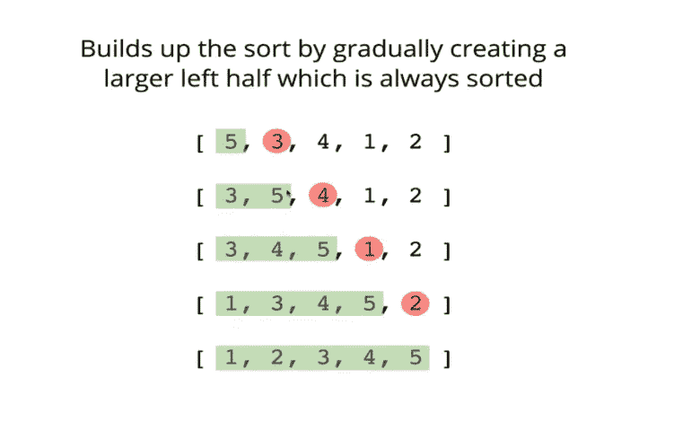
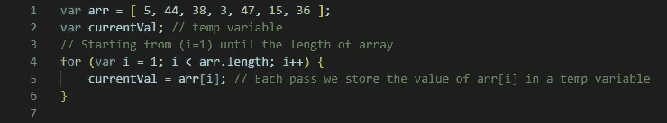
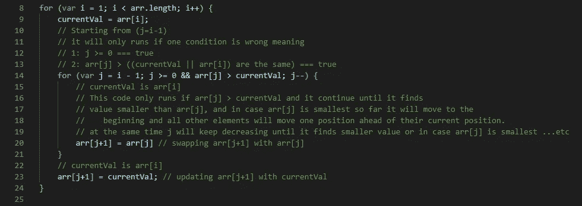
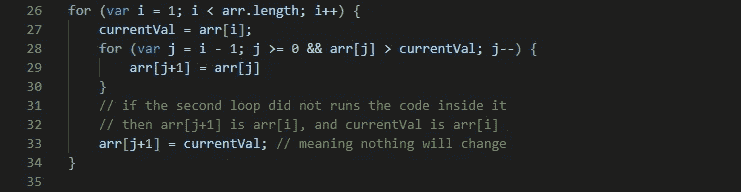
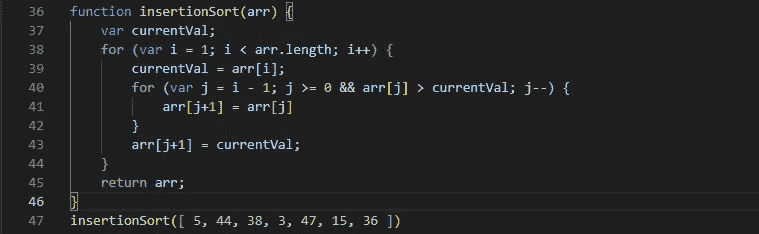

# 理解插入排序非常好，你可以把它教给别人

> 原文：<https://javascript.plainenglish.io/understanding-insertion-sort-so-good-that-you-could-teach-it-to-others-6f81abb84aa0?source=collection_archive---------11----------------------->



Insertion sort

**插入排序**是一个简单的[排序算法](https://en.wikipedia.org/wiki/Sorting_algorithm)，它一次一个项目地构建最终的[排序数组](https://en.wikipedia.org/wiki/Sorted_array)(或列表)。它在大型列表上的效率比更高级的算法低得多，例如[快速排序](https://en.wikipedia.org/wiki/Quicksort)、[堆排序](https://en.wikipedia.org/wiki/Heapsort)或[合并排序](https://en.wikipedia.org/wiki/Merge_sort)。

但是，插入排序有几个优点:

*   简单的实现。
*   对(相当)小的数据集有效，很像其他二次排序算法。
*   在实践中比大多数其他简单的二次[](https://en.wikipedia.org/wiki/Big_O_notation)****(*n*2)**算法更有效，如[选择-排序](https://en.wikipedia.org/wiki/Selection_sort)或[冒泡排序](https://en.wikipedia.org/wiki/Bubble_sort)。**
*   **[自适应](https://en.wikipedia.org/wiki/Adaptive_sort)，对于已经基本排序的数据集高效:当输入中的每个元素距离其排序位置不超过 *k* 位时，[时间复杂度](https://en.wikipedia.org/wiki/Time_complexity)为[**O**](https://en.wikipedia.org/wiki/Big_O_notation)**(*kn*)****
*   **[稳定](https://en.wikipedia.org/wiki/Stable_sort)；不改变具有相等键的元素的相对顺序。**
*   **[到位](https://en.wikipedia.org/wiki/In-place_algorithm)；只需要恒定数量的 **O(1)** 的额外存储空间。**
*   **[在线](https://en.wikipedia.org/wiki/Online_algorithm)；可以在收到列表时对其进行排序。**

**当人们在桥牌手动排序卡片时，大多数使用类似于插入排序的方法。**

## **循序渐进的例子**

```
***Each Pass***
( 3* **7**  4  9  5  2  6  1 ) → ( **3**  7  4  9  5  2  6  1 )
( 3  7* **4**  9  5  2  6  1 ) → ( 3  **4 ** 7  9  5  2  6  1 )
( 3  4* 7  **9**  5  2  6  1 ) → ( 3  4  7  **9 ** 5  2  6  1 )
( 3  4  7  9* **5**  2  6  1 ) → ( 3  4  5  7  9  **2**  6  1 )
( 3  4  5* 7  9  **2**  6  1 ) → ( 2  3  4  5  7  9  **6**  1 )
( 2* 3  4  5  7  9  **6**  1 ) → ( 2  3  4  5  6  7  9  **1** )
( 2  3  4  5  6* 7  9  **1** ) → ( 1  2  3  4  5  6  7  9 )
( 1* 2  3  4  5  6  7  9 )Starting at index 1 each time we check if the previous value is smaller, and keep continue growing the list until we find value smaller then we check where should we put it see here:
( 3  4  5 7  9  **2**  6  1 ) → ( **2** 3  4  5  7  9  6  1 )**Extra Step-by-step example**
[ 3  7  4  9  5  2  6  1 ]
**#(i=1)** 7 will remain at its position as all previous elements in, are smaller than 7
( 3  **7**  4  9  5  2  6  1 )
**#(i=2)** Since 4 is smaller than 7, move 7 and insert 4 before 7
( 3  4 **7**  9  5  2  6  1 )
**#(i=3)** 9 will remain at its position as all previous elements in, are smaller than 9
( 3  4  7  **9 ** 5  2  6  1 )
**#(i=4)** Since 5 is smaller will check with previous value and keep checking (j-1) until we find a smaller value than 5 and move it
( 3  4  **5**  7  9  2  6  1 )
**#(i=5)** Since 2 is smaller will check with previous value and keep checking (j-1), and in this case 2 is smallest value so far so will move to the beginning and all other elements will move one position ahead of their current position.
( **2**  3  4  5  7  9  6  1 )
**#(i=6)** Since 6 is smaller will check with previous value and keep checking (j-1) until we find smaller value than 6 and move it
( 2  3  4  5  **6**  7  9  1 )
**#(i=7)** Since 1 is smaller will check with previous value and keep checking (j-1), and in this case 1 is smallest value so far so will move to the beginning and all other elements will move one position ahead of their current position.
( **1**  2  3  4  5  6  7  9 )
```

## **另一个循序渐进的例子**

****

**Insertion sort — example**

## **现在有了代码**

****

**Step 1**

****

**Step 2**

****

**Step 3**

****

**Insertion sort implementation**

## **表演**

**最好的输入是已经排序的数组。在这种情况下，插入排序具有线性运行时间 **O( *n* )** 。在每次迭代中，输入的第一个剩余元素只与数组中排序后的子部分的最右边的元素进行比较。**

**最简单的最坏情况输入是一个逆序排序的数组。所有最坏情况输入的集合由所有阵列组成，其中每个元素是其前面的最小或第二小元素。在这些情况下，在插入下一个元素之前，内循环的每次迭代都将扫描并移动数组的整个已排序的子部分。这给了插入排序二次运行时间 **O( *n* 2)** 。**

**一般情况下也是二次的 **O( *n* 2)** ，这使得插入排序对于大型数组来说不切实际。然而，插入排序是对非常小的数组进行排序的最快算法之一，甚至比快速排序还要快。事实上，好的[快速排序](https://en.wikipedia.org/wiki/Quicksort)实现对小于某个阈值的数组使用插入排序，当出现子问题时也是如此；确切的阈值必须通过实验确定，并且取决于机器，但是通常在 10 左右。**

## **奖金**

**这里有一个思考排序的好例子。想象你正在玩一个纸牌游戏。你手里拿着的是牌，这些牌是经过排序的。庄家给你一张新牌。你必须把它放到正确的位置，这样你手里的牌仍然是分类的。在 selection-sort 中，添加到已排序子数组中的每个元素都不小于已排序子数组中的元素。但是在我们的卡片例子中，新卡可能比你已经有的一些卡片小，所以你继续下去，比较新卡和你手中的每张卡片，直到你找到放它的地方。你把新卡插入正确的位置，你的手又一次握着完全分类的卡片。然后庄家给你另一张牌，你重复同样的过程。然后是另一张牌，另一张牌，如此类推，直到庄家不再给你牌。**

## **结论**

**最好的输入是已经排序的数组。这就是**插入排序**背后的想法。从索引 1 开始，循环遍历数组中的位置。每个新位置就像是添加给你的新值，你需要把它插入到排序后的子数组中该位置左边的正确位置。**