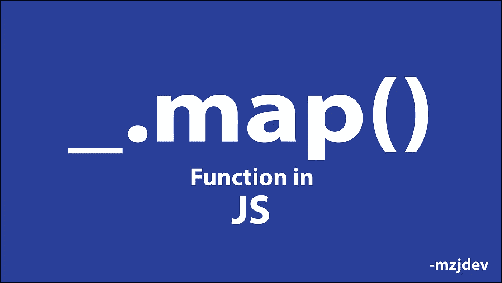
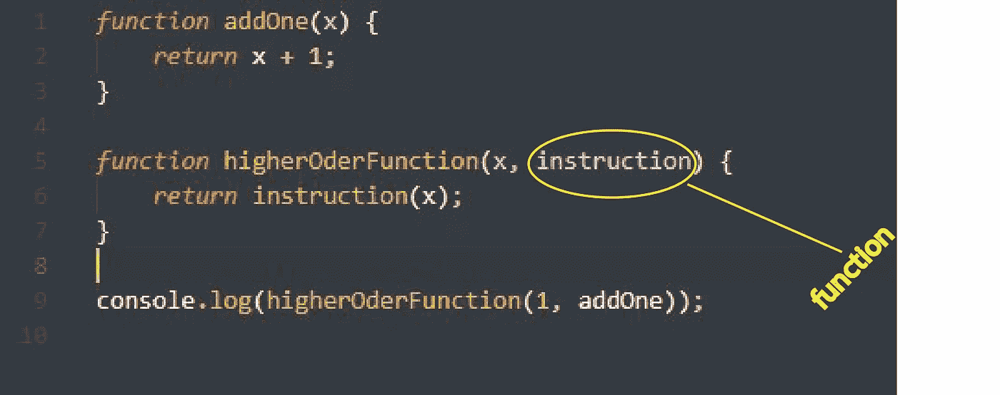
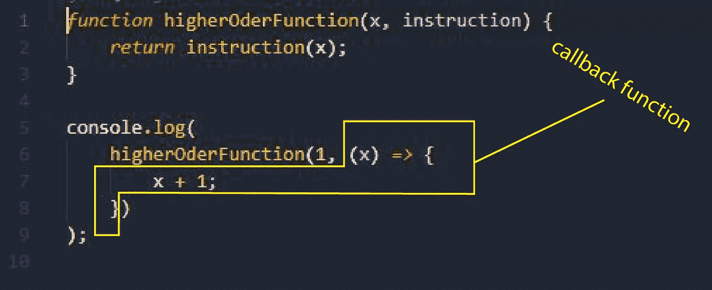
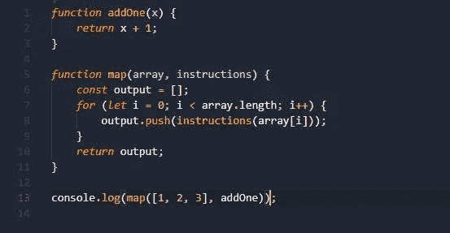

# 理解 JavaScript _。深度映射()函数

> 原文：<https://javascript.plainenglish.io/understanding-javascript-map-function-in-depth-6c8c987fcd6e?source=collection_archive---------14----------------------->

在本文结束时，您将对以下内容有一个很好的理解:

1.  高阶函数
2.  复试
3.  _.map()函数

_。JavaScript 中的 map()函数是一个强大的工具。您可以调用 _。map()函数，并使用 _ 对数组中的所有元素进行某些更改。地图()。

_。map()函数以一个函数作为参数，也就是说每次使用 map()的时候，都需要给它提供一个函数。这就是为什么 _。map()更强大。在映射函数中，您应该提供一些关于如何修改数组中元素的说明。

通常，开发人员将箭头函数传递给 map()，因为箭头函数在语法上更简洁。

我们来看看 JavaScript 中什么是高阶函数。

高阶函数是以函数为自变量或返回函数的函数。函数 map()和 filter()是高阶函数的示例。

Image 1 — Higher Order Function

在上图中，“higherOrderFunction”是一个高阶函数，因为它将一个函数作为参数。

为什么我们要用高阶函数？

嗯，正如你所看到的，当你使用一个高阶函数并向它传递一个回调函数时，你可以在你的函数(高阶函数)内部为一些代码创建一个空间，而不是使用普通的函数。

在“图像 1”中，“higherOrderFunction”用于将数字加 1。您可以让“higherOrderFunction”将一个数加 2 或将一个数乘以 2，只需传递一个相关的函数。

所以，你不必仅仅为了执行上述操作而编写一个新的函数。它遵循干(不重复自己)原则。这就是高阶函数极其强大的原因。

现在，让我们看看什么是回调函数。

回调函数是作为参数传递给另一个函数的函数。

Image 2 — Callback Function

正如“图 2”中指出的，箭头函数作为回调函数传递。

现在，我相信你已经理解了高阶函数和回调函数。

现在让我们来探索 _。map()函数。

_.map()是高阶函数。我们将相关的回调函数传递给 _。map()函数和 _。map()函数返回一个新的数组，其中包含了它所调用的数组的修改后的元素。

现在我们来看看 a _。map()函数在幕后工作。

Image 3 -_.map()

“图 3”展示了 a _。map()函数已实现。在上图中，函数 _。map()接收一个数组和一个函数作为参数。它遍历数组中的所有元素，并根据我们提供的回调函数修改它们。在这种情况下，它向数组中的所有元素加 1，并将它们推入一个新数组，然后，它返回新数组。

就是这样。我希望你喜欢阅读这篇文章，并且现在对 _。JavaScript 中的 map()函数。

*更多内容看*[***plain English . io***](http://plainenglish.io/)