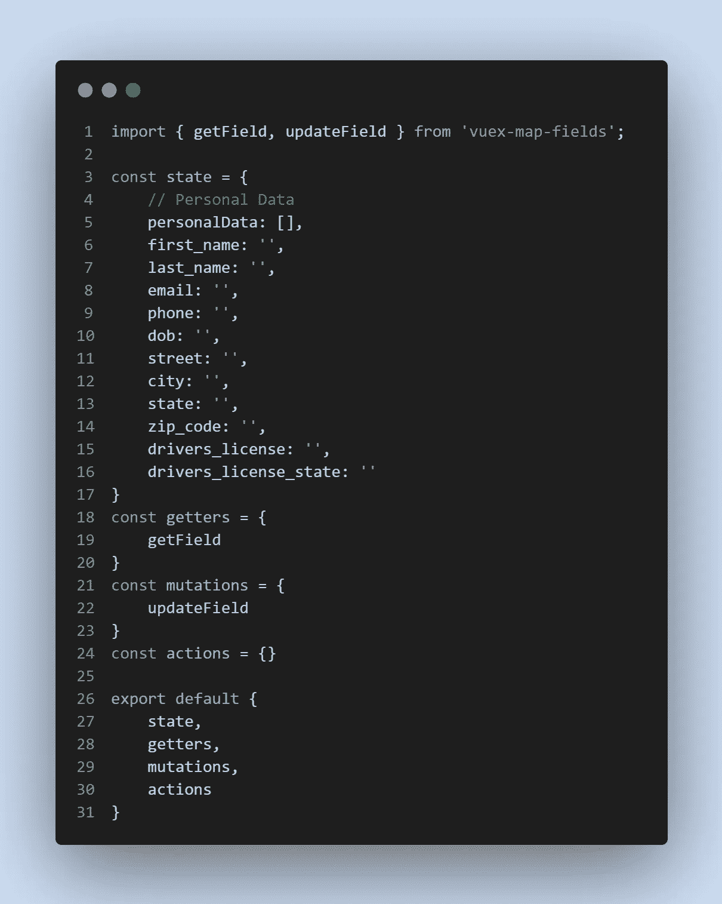
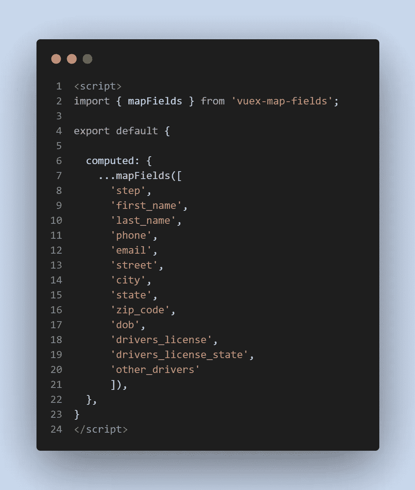

# 了解 Vuex 中的映射字段

> 原文：<https://javascript.plainenglish.io/understanding-mapfields-in-vuex-94182d51bd4?source=collection_archive---------13----------------------->

嘿，你好！欢迎来到我的博客，我在这里发布了我作为一名自学成才的开发人员的历程。点击 [***这里***](https://github.com/Jclewis1989) *可以找到我的 GitHub。*

[cottonbro](https://www.pexels.com/@cottonbro) — [pexels](http://www.pexels.com)

国家管理！让我们深入了解这对开发人员来说意味着什么，以及为什么它是有价值的。我们对温泉很熟悉，对吧？使用 JavaScript 框架的好处之一是我们可以创建有很多好处的单页面应用程序！

SPA 或单页应用程序非常强大，因为一旦浏览器加载，就不再需要刷新页面。所有的 HTML、CSS 和 JavaScript 都被一次加载并保持加载状态。

每个单页应用程序都有一些被称为状态的东西。我更喜欢用应用程序中的变量来表示状态。

那么，我想通过这篇文章达到什么目的呢？假设我们有一个多步骤的表单，涉及很多领域。个人数据(步骤 1)、车辆数据(步骤 2)、覆盖范围和选项(步骤 3)、日期和时间(步骤 4)、查看订单(步骤 5)、支付(步骤 6)、成功和下载政策(步骤 7)。

你可以想象点击下一个和上一个，改变组件和步骤。显然，您希望您的数据在整个体验过程中保持不变！否则，如果我们碰巧将该组件留在 Vue 应用程序中，我们将需要反复输入个人数据部分的所有字段。

使用映射字段在 Vuex 中输入双向数据绑定**！让我们看看下面的一些截图来展示它的实现。**

Screenshot by Author

您会注意到，我们用键值对为一个对象设置了一个常量(状态)。这就是 VUEX 的功能。它将状态对象作为从存储中导出的四个主要对象之一。

现在，mapFields 需要我们将 getField 和 updateField 导入到我们的 Vuex 存储中，如上所示。下面，你会看到我们是如何在组件中使用它们的！

Screenshot by Author — James Lewis

这就是我们要让 mapFields 工作所要做的一切。然后，我们能够在 HTML 中利用 v-model 来保存我们的应用程序状态！让我们以多步骤的形式直观地了解一下保存状态的真正含义！下面来看看吧。

Video by Author — James Lewis

你看到我们的成就了吗？通过将状态字段添加到 Vue.js 中计算对象的 mapFields 中，我们可以将这些字段映射到输入文本字段中的 v-model，以保存表单状态！即使我们更改了 Vue 应用程序中的组件或页面，状态也保持不变！

Vuex 很棒，一个非常强大的工具。而且 **mapFields** 也非常有用，在为客户和我现在的雇主构建真实世界的应用程序时，它给了我很大的帮助！

希望这篇帖子对某人有所帮助！我热爱编码和学习，现在我要分享我过去几年作为开发人员的一些发现。享受吧。

编码快乐！

*更多内容尽在*[*plain English . io*](http://plainenglish.io/)