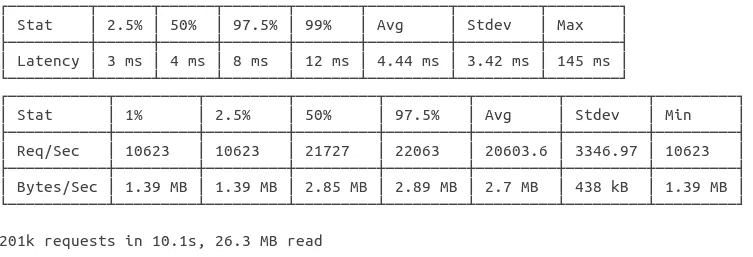
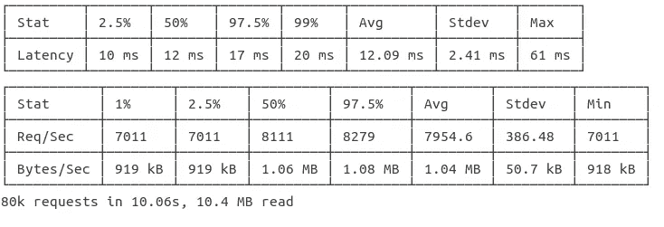
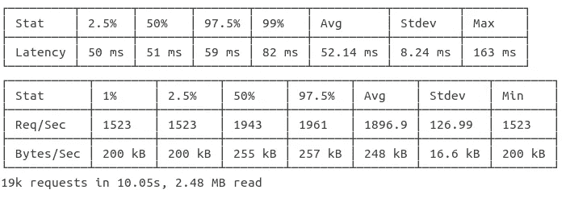
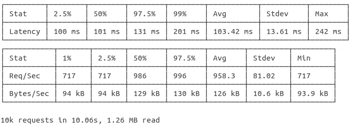
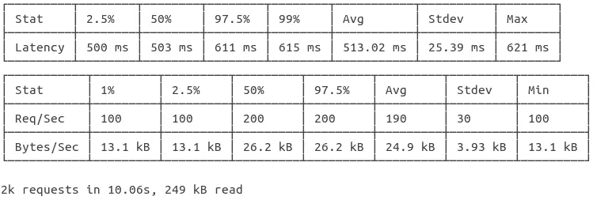
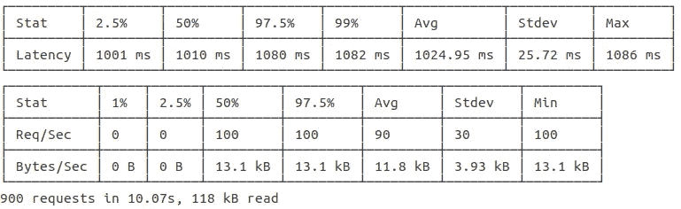
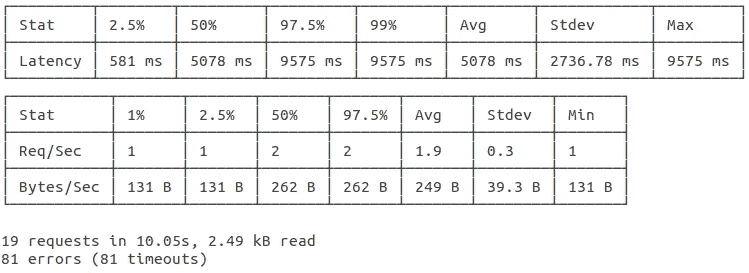
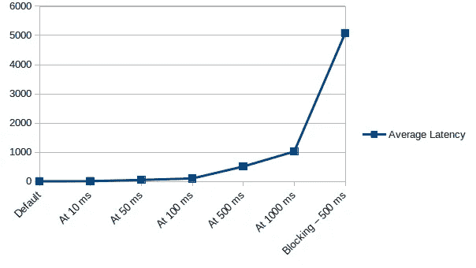
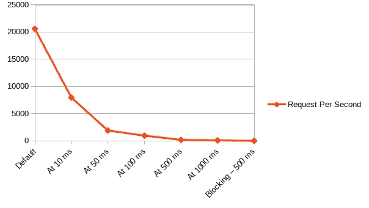

# 了解 Node.js 性能

> 原文：<https://javascript.plainenglish.io/understanding-nodejs-performance-dc9f2673455e?source=collection_archive---------3----------------------->


GSLV-F08 liftoff © [https://www.isro.gov.in/](https://www.isro.gov.in/)

许多开发人员和架构师在听说了令人难以置信的速度和它的异步 IO 之后，都投身于 NodeJS。他们中的大多数人对 NodeJS 的工作原理没有清晰的理解。理解事件循环是如何工作的有助于产生更好的 NodeJS 解决方案。

我不打算深究事件循环。一个简单的搜索应该提供丰富的资源。对于我们的讨论，让我们假设事件循环负责处理 NodeJS 中的异步 I/O。事件循环使单线程 NodeJS 运行时处理并发。

对于本文的其余部分，我们将采用一个简单的 HTTP 服务，分析回调处理时间和阻塞代码对 NodeJS 运行时的响应处理能力的影响。

## **闭锁代码**

根据定义，任何阻止事件循环选取其队列中的下一项的代码都是阻塞代码。阻塞代码的一个例子是大型 for 或 while 语句。

## **一个简单的 HTTP 服务器**

神奇的三线 HTTP 服务器。是不是很美？

```
const http = require(‘http’)http.createServer((req, res) => {
    res.writeHead(200)
    res.end(‘Hello, World!’)
}).listen(8888)
```

我们将使用自动扫描。让我们在全球范围内安装

```
npm i -g autocannon
```

测试服务器的基本性能，让我们使用 100 个连接和默认的 10 秒持续时间来生成流量。

在我的机器上，这是得到的结果。



## **带异步回调的 HTTP 服务器**

```
const http = require('http')
const getResponse = async () => {
    return new Promise((resolve, reject) => {
        setTimeout(() => {
            return resolve('Hello, world!')
        }, 10) // Simulate a 10 ms delay for the data fetch
    })
}// Our server is using the get response to fetch the 'Hello, World!' string. This is to simulate a DB requesthttp.createServer(async (req, res) => {
    const result = await getResponse()
    res.writeHead(200)
    res.end(result)
}).listen(8888)
```

让我们模拟一个可能的用例，比如从数据库获取数据。对于这个测试，让我们将响应持续时间保持在 10 毫秒。这个迭代的结果是



At 10 ms per request

让我们重复测试 50、100、500 和 1000 毫秒的延迟。

这是结果。

**50 毫秒时**



At 50 ms per request

**100 毫秒时**



At 100 ms per request

**在 500 毫秒时**



**在 1000 毫秒时**



## **阻塞事件循环——大罪**

让我们调整一下第一个例子。我们将引入睡眠功能。据我所知，没有原生睡眠。我们的睡眠功能阻塞了事件循环，非常适合这个演示。

```
const http = require('http')const sleep = (delayInMs) => {
  const start = Date.now()
  while (true) {
    if (Date.now() - start >= delayInMs) {
      break;
    }
  }
}http.createServer(async (req, res) => {
  // Sleep for 500 ms
  sleep(500)
  res.writeHead(200)
  res.end('Hello, world!')
}).listen(8888)
```

结果就在这里，而且是惨淡！只需查看每秒请求数和错误数。



## **观察结果**



Latency with request callback time — Y-Axis Latency in ms



Request per second with request callback time — Y-Axis RPS

图表非常清楚地显示，更短的回调响应时间可以显著提高性能。

# **课程**

## 缩短您的请求处理时间。

较短的处理时间可以显著提高性能。理想情况下，尽量将其保持在 10 ms 以下。如果这不可能，请尽量将其保持在最低水平。请求处理时间和所需的服务器数量直接相关。更短的请求处理时间具有显著的成本节约优势。

## **千万不要阻塞事件循环。**

正如我们所见，阻塞事件循环甚至 500 毫秒都是灾难性的。后台你所有的阻塞呼叫队列和工人。

## **工具**

使用以下工具来理解您的 NodeJS 代码并对其进行调优

1.  https://github.com/mcollina/autocannon(作者马特奥·科里纳)
2.  https://github.com/davidmarkclements/0x 的 0x—
3.  诊所—【https://clinicjs.org/doctor/ (来自近表单)

## **附加阅读**

一些关于节点性能的有用文章和视频

1.  保持 Node.js 快速运行:制作高性能 Node.js 服务器的工具、技术和技巧—[https://www . smashingmagazine . com/2018/06/nodejs-Tools-Techniques-Performance-Servers/](https://www.smashingmagazine.com/2018/06/nodejs-tools-techniques-performance-servers/)
2.  让你的 HTTP 服务器达到可笑的速度[I]——[https://www.youtube.com/watch?v=gltzZjKYK1I](https://www.youtube.com/watch?v=gltzZjKYK1I)

https://www.isro.gov.in/ GSLV-F08 升空