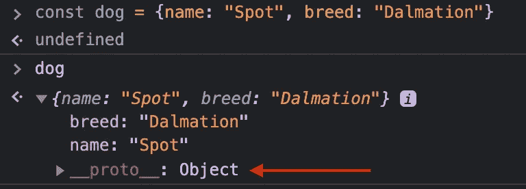

# 理解 JavaScript 中的原型继承

> 原文：<https://javascript.plainenglish.io/understanding-prototypal-inheritance-in-javascript-cb1139c7cb8?source=collection_archive---------10----------------------->

旨在帮助您理解原型继承的基本概念的简要概述。


Photo by [Samuel Ferrara](https://unsplash.com/@samferrara?utm_source=medium&utm_medium=referral) on [Unsplash](https://unsplash.com?utm_source=medium&utm_medium=referral)

# 什么是原型继承？

简单地说，原型继承指的是对象*从其他对象继承*属性和方法。这些被继承属性的对象被称为*原型*。JavaScript 是一种基于原型的语言。它不是基于**类的。**

但是等等！JavaScript 没有类吗？如果你熟悉 JavaScript，很可能你已经写了类似这样的东西。

```
class Dog {
  constructor(name, breed) {
    this.name = name;
    this.breed = breed;
  }
}
```

不要让这个愚弄你！ES6 中引入了类语法，但它只是简单的语法糖。上面的`Dog`类同下面。

```
function Dog(name, breed) {
  this.name = name;
  this.breed = breed;
} 
```

# 到底什么是原型？

在 JavaScript 中，对象从其他对象继承。记住函数也是对象。这可以用`typeof`来确认。

```
function dog {}typeof dog // “function”
```

当在 JavaScript 中创建一个对象时，它将自动拥有一个名为 **prototype** 的属性。这是连接物体的链接，原型链中的*链*。

# 原型是如何使用的？

当您访问一个对象的属性时，JavaScript 引擎将首先搜索对象内部的属性。如果搜索失败，它将转移到对象的**原型**。这个过程将一直重复，直到找到属性或到达原型链的末尾。

如果你继续沿着原型链向上，最终你会到达顶端。最末端是基础对象。所有对象(包括函数和数组)都是从基对象创建的。例如，如果你使用 object literal 创建一个对象，然后检查`__proto__`属性，它将指向基类`Object`。



# 运行中的原型链

下面我们来分解一下代码片段。

1.  首先，我们定义我们的构造函数，`Dog`。顺便说一下，构造函数只是一个普通的旧函数，但是按照惯例，它是以大写字母命名的。
2.  接下来，我们向`Dog`原型对象添加一个函数`bark`。这意味着`Dog`的所有实例都可以访问`bark`。因为`bark`应用于**原型** *而不是*实例，`bark`只在内存中存储一次，减少了重复。
3.  在第 10 行，我们创建了新的`Dog`实例`spot`。最后，我们援引`spot.bark()`。在幕后，JavaScript 引擎正在检查我们的`spot`对象是否有一个名为`bark`的方法。它不会找到的。因此，它将沿着原型链向上移动到`spot.prototype`，在那里它可以找到方法并调用它。