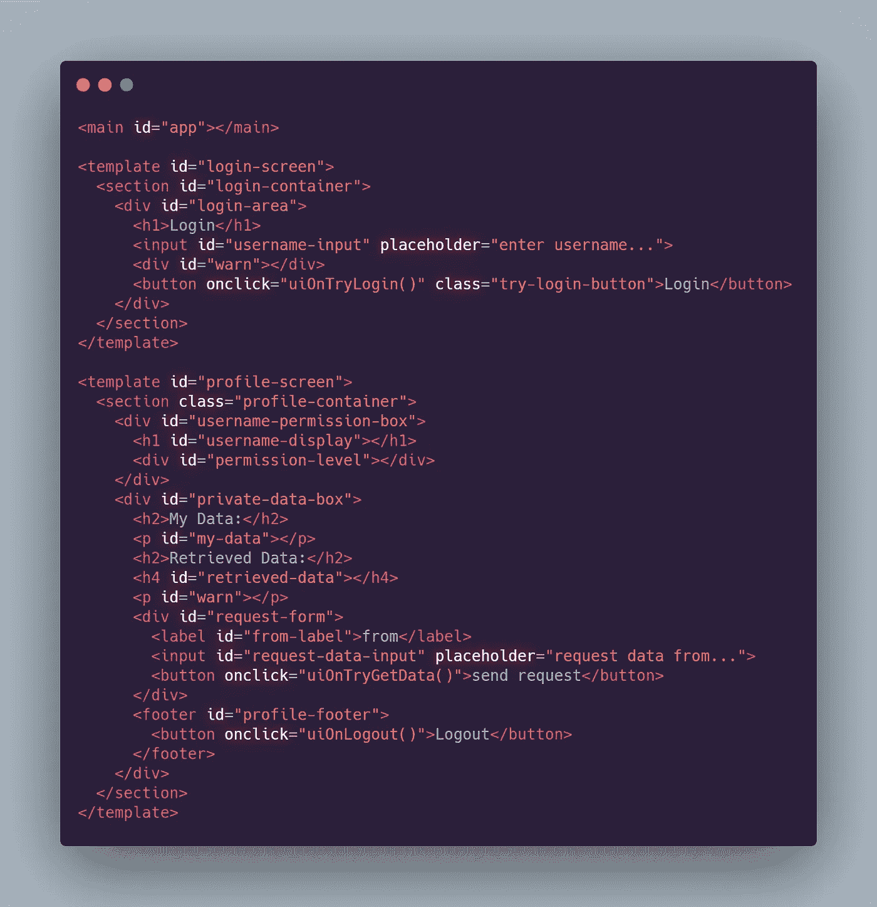

# 通过实现了解 Redux

> 原文：<https://javascript.plainenglish.io/understanding-redux-through-implementation-pt-2-20707b3ef3f5?source=collection_archive---------10----------------------->

## 第 2 部分:更有效地使用中间件


Photo by [Grant Durr](https://unsplash.com/@blizzard88?utm_source=medium&utm_medium=referral) on [Unsplash](https://unsplash.com?utm_source=medium&utm_medium=referral)

## 一个评论和一个难题

我的这两部分的最后一次迭代引起了 Mark Erikson 的注意，他是 Redux Toolkit(又名 RTK)背后的大师之一，也是一名普通的 Redux pro。他的 [reddit 评论](https://www.reddit.com/r/javascript/comments/l3em00/reduxflux_the_bigger_picture/)结合另一个场景让我认为我的中间件实现不够健壮。

首先，Mark 和我在 Twitter 上进行了一个简短的社区讨论，讨论 RTK 使用的真实中间件和我的天真中间件之间的区别。他指出了他的 reddit 评论，并解释说真正的中间件是构建逻辑管道的预处理器，而我的实现使用后处理，没有规定的顺序。其次，我在为`[olive.js](https://github.com/arlenner/olive)`(我的一个宠物项目)的 showcase 站点工作，我意识到使用后处理技术的一个缺点——我不能使用我的中间件来隔离路由的副作用。这是因为在我的中间件被处理之前，我的模型已经被创建了。这意味着我不能使用中间件来授权导航，这是中间件的一个很好的用例。因此，我决定扩展我的中间件处理系统，这样我就可以处理更广泛的用例。

## 我们离开的地方

除了`deepCopy`助手函数，这里是我们在上一篇文章末尾写的全部内容:

这确实是一个小商店。我们将会大量改变它的足迹。我们要做的第一件事是定义一种创建函数管道的方法。这样，我们可以将中间件划分到不同的域中(比如出于调试目的的日志记录、处理内容授权或尝试登录您的帐户)。我们的管道有几个要求:

1.  我们的管道功能必须能够接收任意数量的中间件，并按顺序将它们连接在一起。
2.  在处理程序返回 null 的情况下，必须删除结果操作。返回 null 的处理程序意味着我们已经“吃掉”了分派的操作，它不会传播存储状态的变化。

这是我想到的:

这个管道函数遍历提供的中间件，将结果传递给每个处理器。它将通过简单地返回空值来停止对空结果的传播。现在，我们将有一个体面的方式来声明我们的中间件作为一个单一的功能，正如我们的`tinyStore`目前所期望的。

然而，回到`tinyStore`函数，我们将需要做一些重大的修改。

这里发生了很多事。总的想法是这样的——为了处理复杂的影响，我们需要能够在派单中对未来的派单进行排队。为此，我添加了一个数组`queue`，以将我们未来的派单推入其中。我已经声明了一个标记变量`dispatching`，来指示我们的调度器何时执行它的中间件循环。在`dispatch`功能中，事情有点不同。首先，如果我们已经处于调度循环中，我们会将我们的操作反弹到未来的调度队列中。然后，如果我们没有发送，我们将我们的标记`dispatching`设置为真，表示我们现在正在循环。最后，我们运行我们的中间件(如果它们存在的话),并重新分配我们的`store`。如果我们已经排队采取行动，我们现在就会循环查看他们的派单。然后我们结束我们的循环，结束我们的调度逻辑。

这个系统将允许我们对我们的行为进行前处理和后处理，以产生任何数量的副作用。让我们现在探索一些可能性。

## 记录

出于调试目的的日志记录是一个交叉问题。这意味着它影响并依赖于应用程序的许多领域。长期以来，有效隔离交叉关注一直是软件开发中的一个问题。幸运的是，我们的中间件是隔离这些交叉问题的好方法。首先，我们需要一些样本材料。这里有一个存储区，我们希望为其记录我们的操作:

我们目前没有这个商店的中间件。让我们现在通过编写一个中间件来改变这种情况。这个中间件有一个简单的目的——记录在管道中移动时处理的动作。

首先请注意，该`logger`功能是一个必修功能。我们可以为其预加载一个标签。这将在以后派上用场，因为每个记录器将只能捕捉到之前中间件的派单。因为我们依赖于将动作传递给管道中的下一个函数，所以我们也必须用我们的`logger`返回接收到的动作。让我们探索如何使用它:

不需要做任何特殊的事情，我们的调度员现在就知道将动作传递给记录器中间件，在将我们的动作传递给减速器之前记录它的数据。有一些常见的模式，我们会在处理副作用时一次又一次地发现。让我们讨论一下。

## 常见效果模式

有四种主要的模式在我的脑海中非常突出，它们可以描述我们正在创建的通量副作用循环中，您想要做的大部分事情。

1.  **转换**——这是将一个动作加入到你的管道功能中，并让一个不同的动作作为过程的结果出现的行为。通过处理带有副作用的行为，我们把它变成了一个新的行为(因此转变)。
2.  **取消** —这是采取一个已分派的动作，并在它有机会到达缩减者之前将其从队列中移除的行为。
3.  **传递** —传递动作意味着我们将把它原封不动地传递给减速器。
4.  **扇出/再调度** —有时一个派单可能包含来自内部的派单。这不同于任何其他模式，其他模式消耗它们被输入的动作。为了按顺序处理新的动作，我们必须分别通过中间件管道传递它们。这就是我们需要那个`queue`的原因。这有一个额外的好处，即在效应回路之间使用减压器。这意味着如果你想在下一个状态运行效果，你可以通过重新调度。

我将通过例子介绍每一种模式。现在让我们设想一个场景，我们想要为用户实现权限。

## 是时候建造一些东西了

比方说，用户可能会在我们的 web 应用程序上保存一些私人数据。用户需要特定级别的权限(管理员权限)才能查看其他用户的私人数据。让我们设想我们的应用程序数据有这样一个目的:

这些是我为几种情况设想的行动:

*   登录并查看您自己的个人隐私数据。
*   跟踪与您的帐户相关联的权限级别。
*   请求查看他人的私人数据，前提是您有这样做的权限级别。

我们还需要一些用户数据:

## 纯粹的部分

现在，让我们为我们的应用程序的纯部分设想一个缩减器:

关于 Redux/flux，看起来令人生畏的事情是，你可能正在编写许多起初看起来不相关的小代码和样板文件。但是仔细看。这里的代码是非常模块化的。每个缩减器都包含在它自己的函数中，并且实际上可以在它自己的文件中。我们通过主减速器(这里是`rx`)分割减速器的方式很容易理解。它看起来像来自 Rust 或 Elm 等其他函数式语言的模式匹配语句。我们可以清楚地看到与其动作相对应的描述性命名的函数。

当事情变得复杂时，你会感激有这样的代码可以回溯。在一个企业应用程序中，您可能有一百个这样的操作，每个操作都有自己单独的文件，用于减少和副作用。在这种情况下，拥有不依赖于不可靠的全局或高度耦合的系统的高度模块化的代码是非常有用的。

## 特殊效果

我们应该实现的第一个副作用是允许我们的用户实际登录。我们将使用转换模式来匹配我们的目标动作`TRY_LOGIN`。所有其他行动我们都会通过。

这是基本的，缺乏任何形式的认证，但是如果帐户存在，它将转换我们的输入`TryLogin`动作，返回一个输出`LoginSuccess`动作，然后沿着管道函数链向下传递。在现实世界的应用程序中，您将接受更健壮的凭证(或 google ),并在`tryLogin`函数中运行您的授权解决方案

现在我们有了一个模型、我们的缩减器和一个副作用，让我们构建商店并测试我们的第一个效果。像这样创建我们商店的一个新实例:

如果我们现在分派一个动作，它应该被记录下来。让我们来试试:

```
----IN-----> dispatch(TryLogin('Ross'))----OUT-----> "<Initial Dispatch> is processing action [Try Login] with data: Ross"
> "<Login Processor> is processing action [Login Success] with data: [object Object]"
```

`state()`也应该揭示我们的减速器的变化:

```
----IN-----> state()----OUT----> Object {
    loggedOn: true,
    myPrivateData: "",
    permission: 2,
    retrievedPrivateData: "",
    username: "Ross"
  }
```

现在让我们来充实一下。在您成功登录后，我希望页面获取您的个人数据。我们可以通过在我们的管道中排队分派来做到这一点:

`tryRestricted`从“数据库”中获取用户。如果我们的用户存在并且拥有成员权限，我们可以通过调度一个新的动作发回他或她的数据。请注意这与返回动作有什么不同。返回动作会改变管道中下一个处理程序的响应方式。派单将在该派单完成后*才开始一个全新的派单。*意味着在这个效果循环结束时，reducers 所做的更改将被应用，所以我们的下一个循环将知道我们当前循环的结果。

我们将它添加到我们的管道中，如下所示:

现在，当我们分派我们的登录动作时，我们将得到一个 *lot* 日志。这是因为我们正在接收两次派单的日志。最后，我们将检索到与我们的帐户对象相关联的私有数据。当我们现在检查状态时，它将包括我们的个人数据和其他项目。我们的模型中还有一个字段需要填充——用于查看其他概要文件数据的字段。幸运的是，使用我们已经建立的模式，这将很容易:

这看起来很熟悉。就像我们的其他效果一样，我们采用了`(Model, Action) => Action`的形式。在这种情况下，我们返回一个`PrivateDataSuccess`或`PrivateDataFailed`动作。我们使用当前登录用户的权限级别来确定这是否是一个有效的操作。

到现在为止，您应该开始看到这种模式了。主要的框架使用这种模式来使企业应用程序更容易管理。使用这种模式将纯粹的应用程序状态变化与副作用分开的最大好处之一是，每段代码都是一个模块。无论是减压器还是副作用，我们都可以轻松地从主减压器或效果管道中插入和拔出每个部件。这会让你的生活轻松很多。当您在模块中进行更改时，模块之外的任何内容都不会受到影响。这意味着您不会在每次尝试修复某个东西时都破坏代码。

## 它还活着！

这个例子中缺少了一样东西——UI！我不打算解释这个，但这里有一些 HTML。



> 旁注:我为图片道歉，而不是一个常规的嵌入。Medium get 对嵌入式 HTML 很挑剔。没有脚本标记通常没问题，但是我认为模板标记是罪魁祸首。

我今天想尝试一些新的东西，我想模块化。所以我使用了`<template>`标签来存放我们的 HTML 组件。使用模板有点傻——它们隐藏在页面上，除了`id`或`getElementsByTag`之外无法查询。要实例化它们，我们必须克隆它们的内容:

我制作了这个助手函数的小集合，让我在使用普通 DOM 函数时更加轻松。`elem`是`document.getElementById`的别名。我喜欢用`$`用`document.querySelector`做自己的小假装 jQuery(而且我一般别名`querySelectorAll`到`$$`)。最后，我们实际的模板助手，`template`。这是一个非常简单的函数——它所做的只是克隆一个提供的 DOM 模板对象的`content`节点字段。

现在使用它:

我们利用我们的`elem`助手来获取模板和根元素。然后我们附加初始 UI 状态`loginTemplate`，它将代表我们应用程序的登录视图。

这就是我们 UI 的样板文件。现在我们可以在副作用中使用*中的所有这些好东西。我们只需创建另一个副作用函数来处理 UI 更改，并将其放入我们的`pipe`中。首先，UI 主分割器。*

就像以前一样，我们可以分离出我们在每个效果中定义的特定功能。我们使用一个主 splitter 函数来进一步模块化我们的代码，所以我们只需要处理收到的每条消息的一小部分。还应该注意这种方法的可扩展性。刚才我们没有 UI 代码。现在，我们已经编写了所有的 UI 代码，没有涉及任何其他领域，我们没有破坏任何东西来进行这些更改。我们所做的更改并不是特定于领域的——UI 更改是另一个横切关注点，它跨越了典型应用程序的大多数领域。然而，使用这种模式，我们可以毫不费力地做出重大改变。这也给了我们更多的实验自由和简化的测试。

这里有一支笔可以玩。我添加了注销功能来说明扩展的一个例子。向其中添加数据，尝试不同的东西，使用权限值，无论你喜欢什么。

希望你喜欢另一个(功能？)JavaScript 冒险。当然，读者们，FP on！

> 嘿雇主们！
> 
> 本文作者目前正在求职中！如果你认为有机会，你可以联系 arlenross02@gmail.com[的罗斯。](mailto:arlenross02@gmail.com)
> 
> 感谢您的宝贵时间！