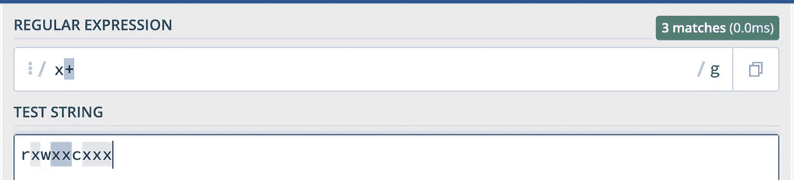

# 让我们来理解 JavaScript 中的 Regex

> 原文：<https://javascript.plainenglish.io/understanding-regex-in-javascript-42b695ac5252?source=collection_archive---------8----------------------->

虽然这是一个不太有趣的话题，但是 Regex 是开发人员需要学习的最重要的话题之一。这个博客是关于 JavaScript 中的正则表达式的。


## 什么是正则表达式？

正则表达式是用来匹配字符串中字符组合的模式。JavaScript 认为这是一个对象。它们只是定义搜索模式的一系列字符。这些主要用于在前端开发中定义输入表单的验证。

## 在 JavaScript 中我们在哪里以及如何使用 Regex？

在 JavaScript 中有两种方法可以创建正则表达式。

1.  **使用正则表达式文字:**
    正则表达式由一个包含在斜线`/`之间的模式组成。举个例子，

```
let regularExp = /dune/;
```

**2。使用** `RegExp()` **构造函数** :
你也可以通过调用`RegExp()`构造函数来创建一个正则表达式。举个例子，

```
let reguarExp = new RegExp('dune')
```

## 如何构建模式？

现在让我们深入学习如何构建正则表达式。我用 regex101.com T21 来测试我的表情。您可以从这里复制粘贴/键入来测试表达式。

只需确保在开始前选择 flavor 中的 JavaScript 选项并取消选中所有标志。


让我们首先举一个简单例子来理解正则表达式是如何工作的。假设我想匹配字符串“medium”。我会写下如下内容。

```
/medium/
```

如果我在字符串的任何地方键入单词 medium，我将得到一个匹配的单词。


现在我们来看看`/g`对表达式做了什么。


注意，`/g`在我们每次写字符串`medium`时都会给我们匹配。如果我删除了`/g`标志，即使我的字符串`medium`出现了两次，我也只能得到一个匹配。


需要注意的是，正则表达式 ***区分大小写*** 。如果我们想要匹配不区分大小写的字符，我们需要使用不区分大小写的标志`/i`。它忽略大小写并匹配精确的字符串。


仅此而已。我们构建了第一个正则表达式。让我们继续学习关于正则表达式字符集和范围的更多内容。

## 字符集:

我们可以使用这个正则表达式搜索字符集。让我们来学习如何做到这一点。

让我们以搜索字符串`fan`和`pan`为例。我们可以像下面这样搜索两者。我们在`[]`中包含了我们想要搜索的字符。

```
/[fp]an/
```


这个正则表达式匹配`p`和`f`，后跟一个。

看下面的例子。它匹配`p`或`f`


如果我们在`[]`中使用`^`，它将不会包含字符串第一位的字符(这更像是一个否定)。


## 范围:

我们已经学习了字符集。现在让我们来了解一下范围。假设我想将我的第一个字符串匹配到许多字符，如下所示。我可以像这样列出字符，或者我可以使用范围来表示我想要使用的字符。

```
/[abcdefghijk]an/g
```

注意上面的正则表达式可以用范围来写，

```
/[a-k]an/g
```

同样，我们可以对数字做同样的事情。

```
/[012345]10/g
```

相当于

```
/[0–5]10/g
```

我们可以使用字母和数字中间的范围，如下所示。

```
[b-j]am
```

现在，让我们继续使用我们到目前为止所学的知识为 10 位数的电话号码编写正则表达式。

```
/[1-9][0-9][0-9][0-9][0-9][0-9][0-9][0-9][0-9][0-9]/
```

## 重复字符:

让我们学习一下重复字符。我们可以这样写 10 位数的手机号码。(而不是在前面的例子中)

```
/[0-9]{10}/g
```


让我们为一个包含 5 个字符的单词构建一个正则表达式。我想匹配所有 5 个字符的字母。

```
/[a-z]{5}/g
```

# 元字符:

*   `.`——例如:`/./`——这个。字符匹配任何字符，除了换行符或其他行终止符。


*   `/\d/`—JavaScript 中的 **RegExp \d 元字符**用于查找数字字符。它与[0，9]相同。


*   `/\w/` —JavaScript 中的 **RegExp \s 元字符**用于查找字母字符、数字字符和 _。


*   `/\s/`—JavaScript 中的 **RegExp \s 元字符**用于查找空白字符。空白字符可以是空格/制表符/新行/垂直字符。


*   **注:**

1.  `/\S/` —匹配除空格以外的单个字符。(与`/\s/`相反)
2.  `/\D/` -匹配非数字字符。(与/\d/)相反
3.  `/\W/` —与(/\w/)相反

# 特殊字符:

1.  `+` —例如:`/x+/g`—x+量词匹配任何包含至少一个 x 的字符串。



2.`*` -例如:`/x*/g`-x *量词匹配任何包含零个或多个 x 的字符串。


3.`?` —例如:`/n?/` —即 *n* ？量词匹配任何包含零个或一个出现的 *n* 的字符串。


4.`^` -例如:`/^h/` —*^h*量词匹配任何以 h 开头的字符串。


# 第一个和最后一个字符:

`^`和`$`:行的开始和结束:这对于编写验证非常有帮助。假设我想写一个 6 位数的密码。我只想匹配 6 位数。在这种情况下，你用这个。


# 替代字符:

`|`好比条件运算符。(x|y)表达式用于查找任何指定的替代项。


这是理解 JavaScript 中正则表达式的简单快速的教程。我在这张表中列出了最常用的正则表达式，供任何想快速检查的人使用。如果我错过了什么，请在评论中告诉我。感谢您的阅读。


感谢您的阅读。

*更多内容看* [***说白了就是 io***](http://plainenglish.io/) ***。*** *报名参加我们的* [***免费每周简讯点击这里***](http://newsletter.plainenglish.io/) ***。***