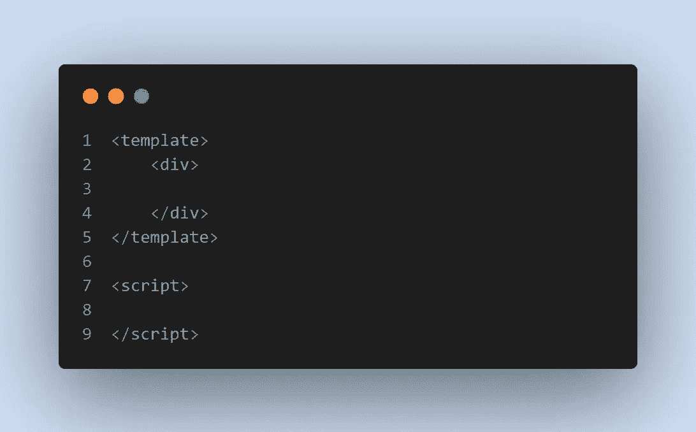
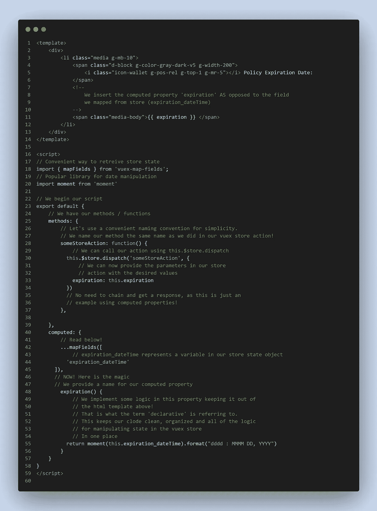
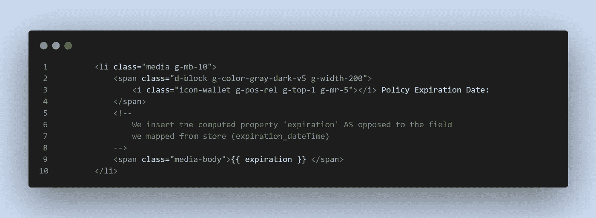
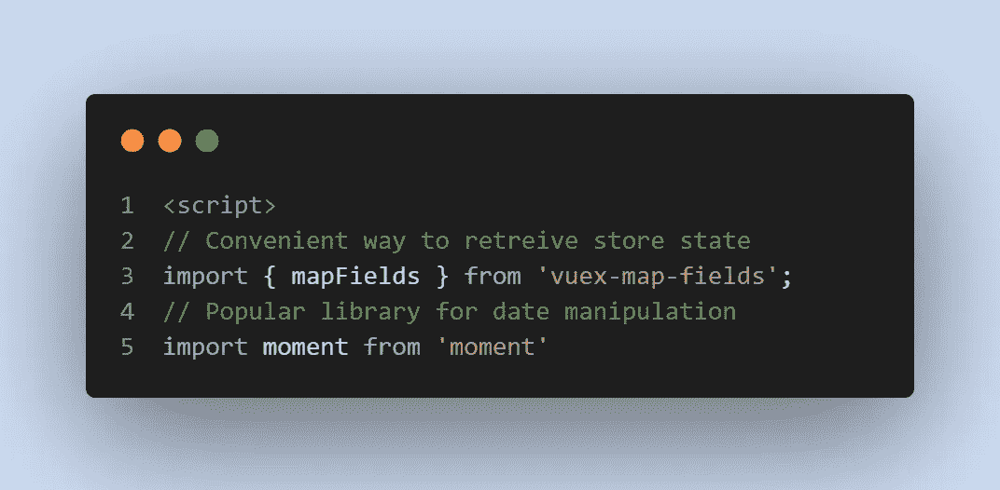
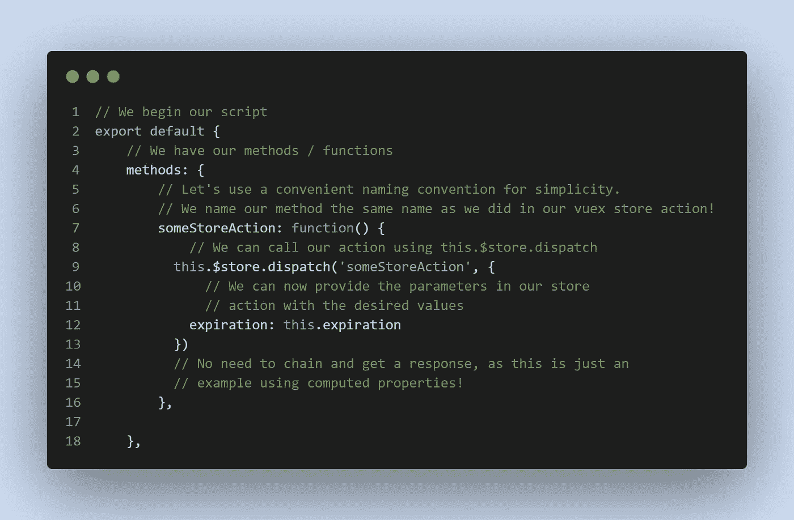
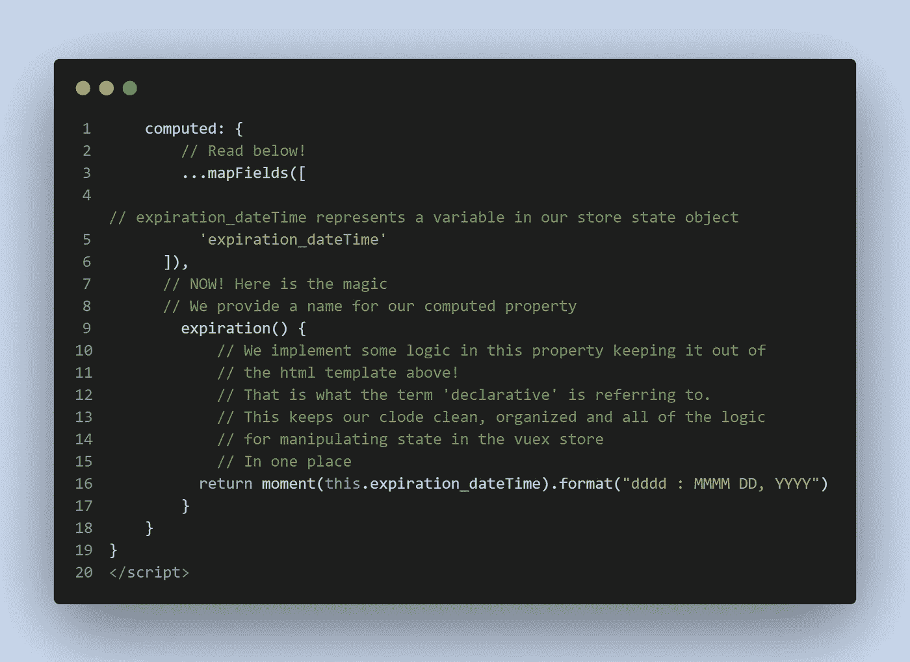

# 了解 Vue.js 中的 Computed 属性

> 原文：<https://javascript.plainenglish.io/understanding-the-computed-property-in-vue-js-421c83319113?source=collection_archive---------24----------------------->

Author [Eric Anada](https://www.pexels.com/@eric-anada-280222) — [Pexels](http://www.pexels.com)

这篇快速的帖子将讨论保持 Vue.js 模板简单的好处，在 html 中使用最少的逻辑。这个想法也被称为**‘宣示’**。而且是在 [**这里讨论的**](https://012.vuejs.org/guide/computed.html) 。

但是如果没有例子，定义又有什么用呢？所以让我们创造一些。

基本 Vue 组件支架:

Screenshot from Author — James Lewis

下面代码完整！检查一下，让我们过一遍。

Screenshot from Author — James Lewis

好了，从上面的代码片段中我们可以收集到相当多的信息。

Screenshot from Author — James Lewis

正如注释所建议的，我们需要在模板中使用 computed 属性。为什么？在 Vue.js 中，当逻辑变得有点冗长或复杂时，使用计算属性是一个建议和最佳实践。

计算属性是简化和创建开发人员易于阅读的优雅代码的一种方式。html 保持干净，没有膨胀，操作逻辑保存在 Vue 组件的脚本标记中，在计算对象内部。

Screenshot from Author - James Lewis

mapFields 真的很棒。用它！你的 vuex 商店需要更多的设置，尽管实现起来非常简单。我们还使用 moment.js，因为这个例子涉及日期操作。

Screenshot from Author — James Lewis

接下来，我们有了 Vue 中的导出对象。嵌套我们为我们的方法(函数)提供了一个生存的空间。

我们创建了一个与存储操作同名的函数。这是我的偏好，因为它更容易记住逻辑和我的函数做什么，特别是当我维护一个更大的代码库时。

这篇文章的这一部分对于理解计算属性的概念并不完全必要，但是我大部分时间都在使用 Vuex，动作是模块化代码的一个很好的方式。如果您没有使用 Vuex 状态管理，现在开始使用也不迟！

Screenshot by Author — James Lewis

好了，让我们跳到这篇文章的主题！

我们将一个计算属性命名为 **expiration** 。这将采用**到期日期时间**状态。

因为有了 **mapFields** ，我们可以从我们的存储中访问状态值。我们使用关键字**“this”**将 **expiration_dateTime** 分配给计算属性**“expiration”**。

这可以通过**返回**计算属性**“到期”**内的一个操作值来实现。在我们的例子中，我们正在调整 **expiration_dateTime** 的存储状态的格式化方式！Moment.js 帮助我们做到了这一点。

现在，当组件被呈现时，在我们的 html 中，来自我们的存储的新格式化的值代替计算的属性“expiration”被显示。

我希望这能帮助到一些人，并阐明为什么在 Vue 的计算属性中实现逻辑很重要！您的代码将看起来不那么臃肿，并且更具声明性！更容易阅读 html 和定位逻辑。

编码快乐！

*更多内容看*[***plain English . io***](http://plainenglish.io)