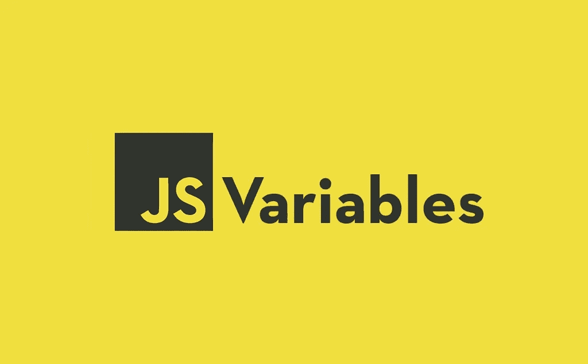
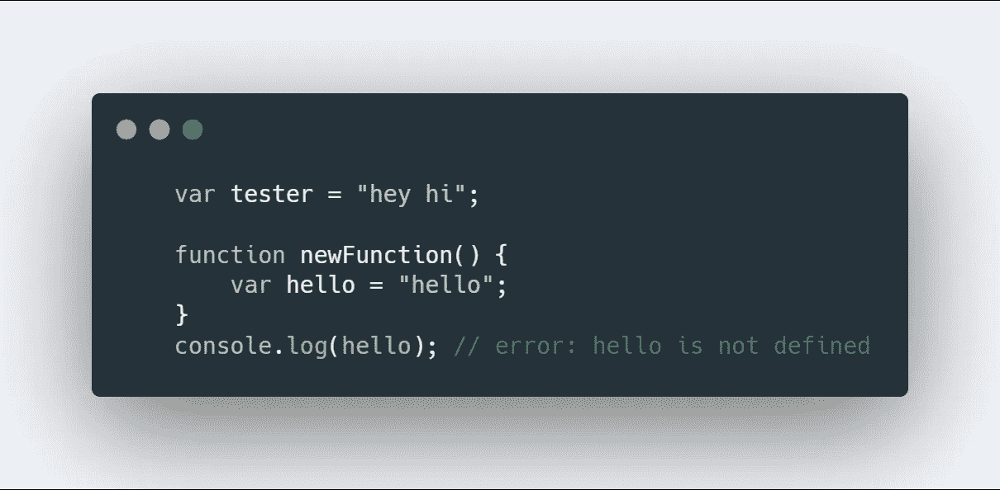
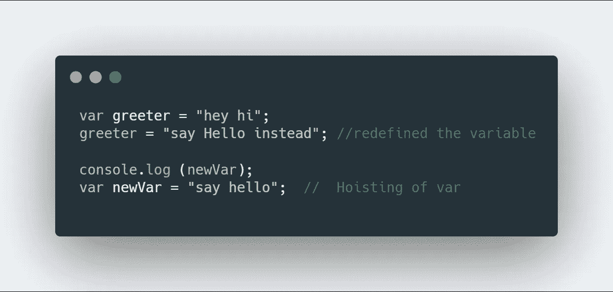
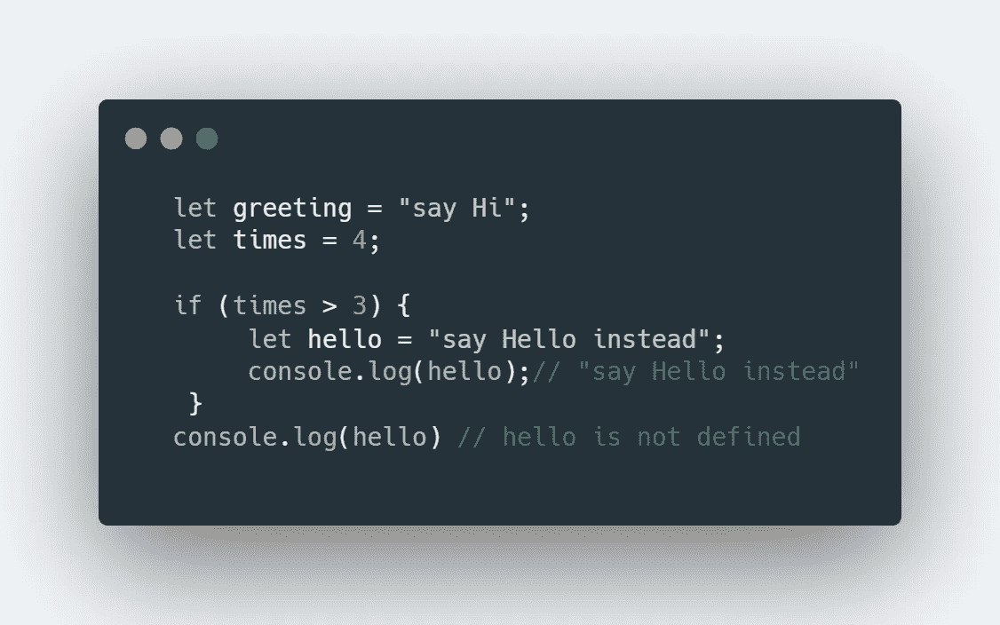
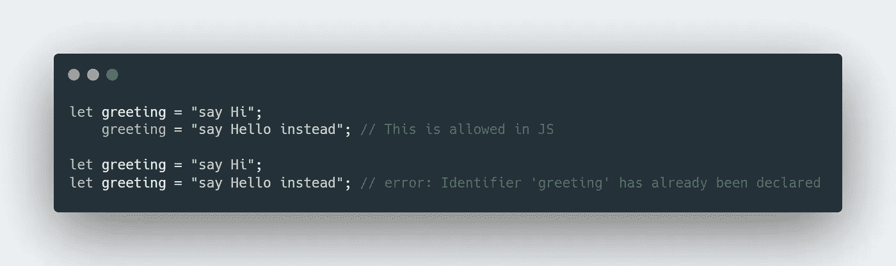
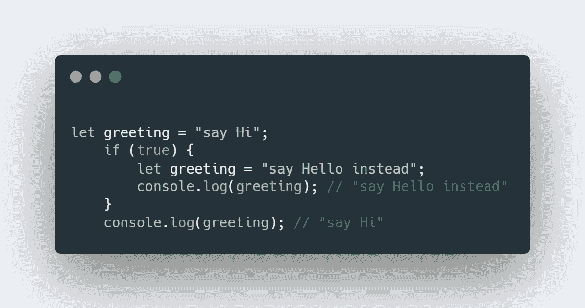
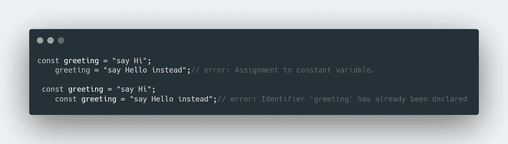

# 理解 JavaScript 中 Var、Let 和 Const 的概念

> 原文：<https://javascript.plainenglish.io/understanding-the-concept-of-var-let-const-in-javascript-b979357e8b65?source=collection_archive---------12----------------------->

**ES6** 的特性之一是添加了`**let**`和`**const**`，用于变量声明。问题是——它们与我们一直使用的老式`**var**`有何不同？如果你还不清楚这一点，那么这篇文章是给你的。

在开始之前，让我简单介绍几个话题:

# **范围:**

它本质上意味着这些变量在哪里可用。你可以假设它是工作区域。

# **块-范围:**

块是由{}限定的代码块。块住在花括号里。花括号内的任何内容都是块。

# **重新声明并更新:**

这意味着我们可以重新声明变量或者更新变量的值。

# 吊装:

提升是一种 JavaScript 机制，在代码执行之前，变量和函数声明被移动到它们作用域的顶部。

# Var:

1.  **变量**声明是*全局作用域或函数作用域*。
2.  **Var** 变量可以在其作用域内*更新和重新声明。*
3.  **Var** 变量被*提升到其作用域*的顶部，这些变量用`**undefined.**`初始化
4.  **Var** 变量可以不用初始化就声明。

**Scoping of Var**

**Re-define & Hoisting of Var**

# 让:

1.  **设**为*块作用域*。
2.  **让**变量可以被*更新但不能被*重新声明。
3.  **让**变量不被初始化。
4.  **让**变量可以不用初始化就可以*声明。*

**Scoping of Let**

**Redefined and declaring of let**

但是这在 JavaScript 中是允许的:

# 常数:

1.  就像 let 一样，**常量**是块范围的。
2.  **常量**变量既不能更新也不能重新声明。
3.  **常量**变量未初始化。
4.  **常量**变量必须在声明期间初始化。

非常感谢你一直读到最后。如果你需要帮助，可以联系我。

**Web:**[https://ankandas.netlify.app/](https://ankandas.netlify.app/)
insta gram:[https://www.instagram.com/](https://www.instagram.com/ankan_designer/)*ankan _ designer/*
**GitHub:**[https://github.com/](https://github.com/Ankan982)*ankan 982*

*更多内容请看*[*plain English . io*](http://plainenglish.io/)