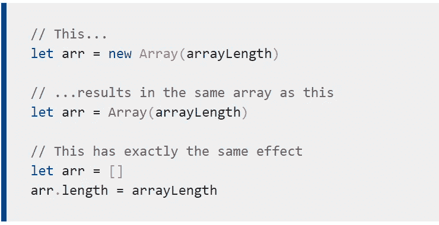
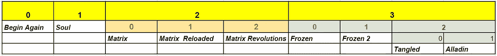
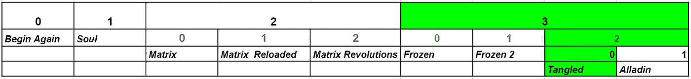
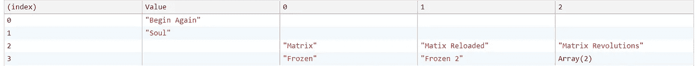

# 理解 JavaScript 中的嵌套数组

> 原文：<https://javascript.plainenglish.io/understanding-the-nested-arrays-fbf3ab13c2b4?source=collection_archive---------6----------------------->

数组是值的有序集合:每个值称为一个**元素**，每个元素在数组中有一个数字位置，称为其**索引**。

JavaScript 让我们在名为 ***嵌套数组的数组中创建数组。*** 嵌套数组有一个或多个数组作为一个数组的元素。这在定义上可能有点令人困惑，但一旦我们深入研究，就会发现这非常有趣。



# 创建嵌套数组

JavaScript 中有三种语法来 [*创建数组*](https://developer.mozilla.org/en-US/docs/Web/JavaScript/Guide/Indexed_collections#Creating_an_array) 。让我们使用这三种方法来创建嵌套数组，以了解嵌套数组的概念。

这一个仅仅是 ***将*** 变量等同于*数组*。

```
var favMovies = ['Begin Again', 'Soul', ['Matrix', 'Matix Reloaded', 'Matrix Revolutions'],['Frozen', 'Frozen 2', ['Tangled', 'Alladin']]]
```

第二种是使用数组方法`new Array()`。

最后一种是使用类似于`new Array()`的`Array()`。

请注意，所有这些方法都产生相同的结果。现在我们知道了如何创建嵌套数组，让我们看看如何访问嵌套数组的元素

# 了解如何将索引分配给元素

这些数组是根据索引列出的。下图解释了如何将索引分配给嵌套数组中的元素。



假设我们想要访问值**‘Tangled’**，我们可以使用这个表导航到它。



```
console.log(favMovies[3][2][0])
```

同样，我们可以借助索引来访问任何元素。



Output from the console (console.table(favMovies))

# 展平嵌套数组

有多种方法可以展平嵌套数组。我们可以用下面的方法把它变成普通的数组。

## 1)使用 Array.flat()方法

[**Array.flat()**](https://developer.mozilla.org/en-US/docs/Web/JavaScript/Reference/Global_Objects/Array/flat) 方法通过将所有子数组递归连接到您指定的深度来生成一个新数组。

简单地说，如果你有一个数组的数组(也许里面有更多的数组)， **flat()** 将帮助你把所有的条目连接到一个数组中。

## 2)使用 Array.toString()和 String.split()方法

我们可以将数组转换为字符串，并使用`.split()`方法将其拆分。这样我们就得到了数组。

## 结论

我们做到了！我希望你觉得这很有用。谢谢！