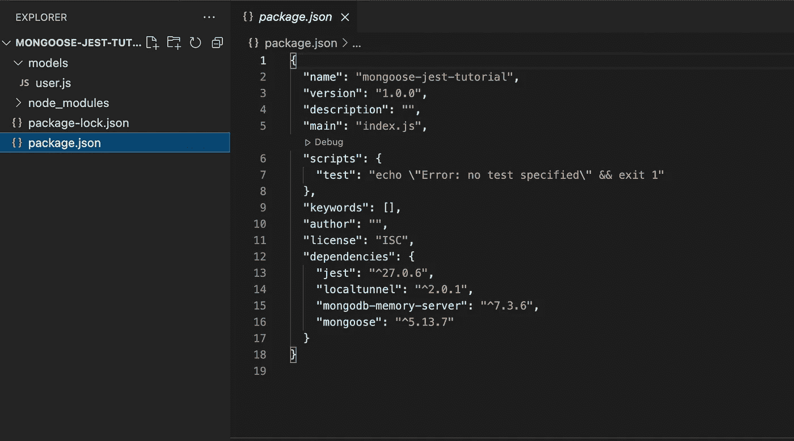
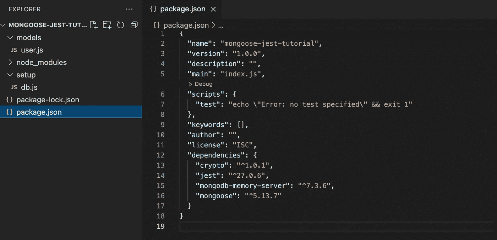
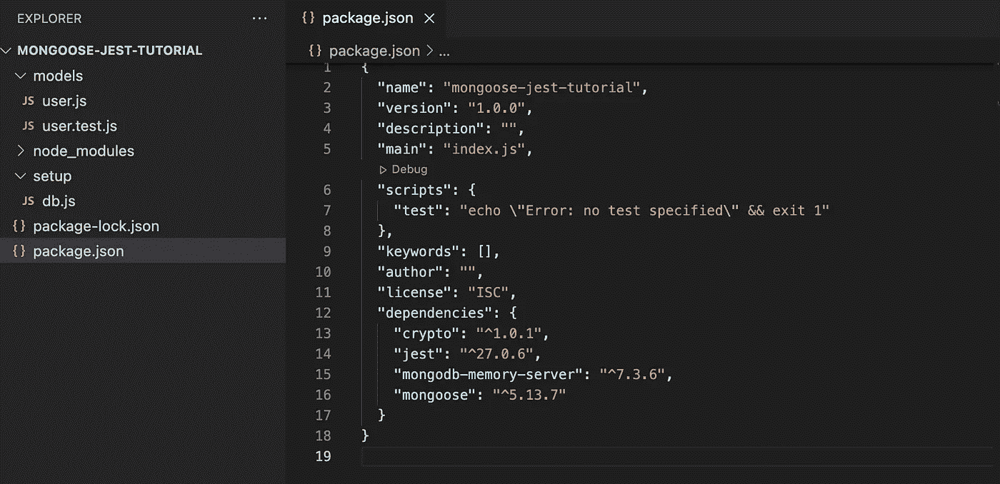
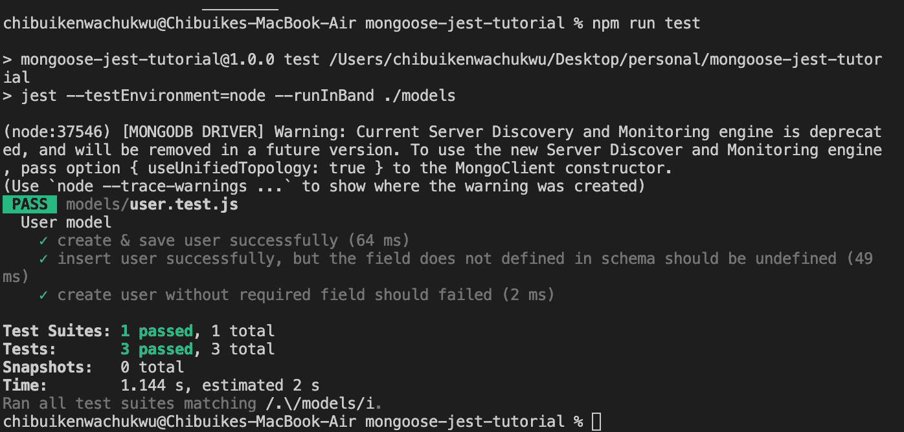

# 使用 Jest 对你的 Mongoose 模型进行单元测试

> 原文：<https://javascript.plainenglish.io/unit-test-your-mongoose-model-using-jest-2daf2303c4bf?source=collection_archive---------1----------------------->


Photo by [Sigmund](https://unsplash.com/@sigmund?utm_source=medium&utm_medium=referral) on [Unsplash](https://unsplash.com?utm_source=medium&utm_medium=referral)

通常，我们创建 mongoose 模型，启动我们的服务器，却从来不去测试这些模型是否像它们应该的那样独立于服务器工作。

> 本文将展示如何使用 Jest 对您的 Mongoose 模型进行单元测试。

# 安装依赖项

我们将建立一个包含模型和测试文件的基本项目。我们初始化一个节点项目并安装所有必要的依赖项。

```
npm init -y
npm i mongoose crypto jest mongodb-memory-server
```

那么我们这里有什么？

mongose:我们将使用[mongose](https://mongoosejs.com/)与我们的 mongo 数据库接口。

**crypto** :我们用它来散列我们的密码，你会在教程的后面看到它的用法。

Jest :我们将要使用的测试库。如果你想了解更多关于 jest 的信息，看看它的特性，请查看[这个](https://jestjs.io/)。

**mongodb-memory-server** :这是我们将使用的 mongo 数据库的内存版本。这将我们从必须建立一个真正的 mongo 数据库的压力中解救出来。这也连接到*设备的主存储器，而不是物理存储在磁盘上，因此测试起来更快更好。*你可以在这里阅读更多关于这个包的信息[。](https://github.com/nodkz/mongodb-memory-server)

# 项目结构

接下来，我们继续创建我们的代码结构。由于我们只关注于测试 mongoose 模型，我们将创建我们的模型和其中的一些方法。

对于这个例子，我们将只创建一个模型:用户模型。

创建一个名为 **models 的新文件夹；**然后在它下面创建一个名为 ***user.js.*** 的文件，你的代码结构应该看起来像这样:



Project structure

# 用户模式

在新创建的 ***user.js*** 文件中，我们添加以下代码:

在上面的代码中，我们在 mongoose 中设置了一个用户模式，并创建了两个方法: ***setPassword*** 和***validate password***。我们分别使用这些方法来生成散列用户密码和验证用户密码。

# 设置测试环境

在编写测试之前，我们需要将 mongo 内存服务器集成到我们的项目中。为此，我们在项目的基础上创建一个名为 ***db*** 的新文件夹，然后在该文件夹中创建一个名为 ***setup.js.*** 的新文件

我们的新代码结构应该如下所示:



project structure with db.js

接下来，打开 db.js 并添加这段代码。我会很快解释这里发生了什么:

## **解说**

我们首先导入两个依赖项，分别是***mongose***和***MongoMemoryServer***。

接下来，我们创建 3 个方法，分别是 ***设置*** 、 ***dropDatabase、*** 和***drop collections***。

在 ***设置*** 方法中，我们使用 MongoMemoryServer 包连接到数据库。

***drop database****方法用于完全删除数据库，关闭并停止连接。*

***drop collections***方法用于从我们的 db 中删除所有集合。

最后，我们导出这 3 个方法，因为我们在测试文件中需要它们。

# 编写我们的测试

> 我们期待已久的时刻终于到来了。我们要写一些测试！

我个人喜欢把我的测试和要测试的文件放在同一个文件夹里，这是我个人的选择，不是强制性的。

也就是说，我们将在保存有 ***user.js*** 文件的同一个文件夹中创建一个名为 ***user.test.js*** 的新文件。

我们的新项目结构现在应该是:



Project structure with user.test.js

现在将下面的代码添加到新创建的 ***user.test.js*** 文件中。

## 说明

看起来很多，对吗？好吧，让我们开始吧。

在第一部分中，我们导入我们的 db 安装文件、用户模型和 mongoose。

接下来，我们创建虚拟数据并将其存储在 userData 中，我们将在该文件的后面使用它来执行我们的测试。

接下来，我们添加三个方法，即 beforeAll、afterEach、afterAll，这些方法在笑话中是允许的。

所有 之前的 ***将在我们的测试套件运行之前执行。在这种情况下，我们只有一个描述块。在这个方法中，我们调用 ***db.setUp*** 来设置我们的 db 连接。***

每个 之后的 ***在每个测试套件之后运行。如果我们有多个 describe 块，我们将使用这个方法来防止每个 suite 影响另一个 suite 的结果。发生这种情况是因为我们调用了***db . drop collection***，它从 db 中删除了所有集合。***

所有测试套件完成后的 ***afterAll*** 。这是我们删除数据库并使用***db . drop database***方法关闭连接的地方。

接下来，我们创建了一个测试套件，并在其中编写了三个测试。

**第一个测试块** : *创建&保存用户成功，*我们创建一个新用户，然后检查是否确实创建了一个用户。如果您还记得在我们的模式中，用户有 email、phone 和 salt 属性，那么我们检查这些属性是否存在于返回的用户数据中，对于 phone 和 email，检查返回的内容是否确实是我们保存的内容！。此外，由于 mongoose 将一个 _id 属性附加到一个模式，我们检查它是否同样存在。

**第二个测试块** : *成功插入用户，但是模式中没有定义的字段应该是未定义的，*我们创建了一个新用户，但是这次我们传递了一个模式中不存在的属性。我们期望创建用户，但是没有添加这个属性，因此我们测试以确保它不在返回的数据中，期望它是未定义的。

**第三个测试块** : *创建没有必填字段的用户应该失败*，我们创建了一个新用户作为之前的测试，但是这一次我们没有传递 email 属性，因为它在我们的模式中是必需的，mongoose 不应该创建那个特定的用户。我们将 save 方法包装在一个 try 和 catch 中，检查得到的错误是否确实是一个 mongoose 验证错误，并进一步检查这个验证错误是否是由缺少 email 属性引起的。

# 运行测试

要运行我们的测试，我们需要更新我们的 package.json 文件，并向脚本部分添加单个脚本命令。这个脚本告诉 jest 如何运行我们的测试以及在哪里可以找到我们的测试文件。

```
"scripts": {"test": "jest --runInBand ./models"},
```

**runInBand** 标志只是告诉 ***jest*** 在当前进程中连续运行我们所有的测试，而不是创建子进程的工作池。对调试非常有用。

**。/models** 简单地告诉 ***jest*** 运行在 models 文件夹中找到的所有测试文件。

点击查看 Jest CLI 文档[，查看更多可用选项。](https://jestjs.io/docs/cli)

为了运行我们的测试，我们运行 package.json 文件中的测试脚本:

```
npm run test
```

如果您按照正确的步骤操作，您应该会看到这些可爱的绿色记号，终端显示如下:



Test success

沃拉。你刚刚做了测试，他们都通过了！

我迫不及待地想看看你构建和测试了什么！去抓你猫鼬模型里的虫子吧。

完整的代码可以在这里找到[。玩得开心点！](https://github.com/chyke007/mongoose-jest-tutorial)

*更多内容请看*[***plain English . io***](http://plainenglish.io)