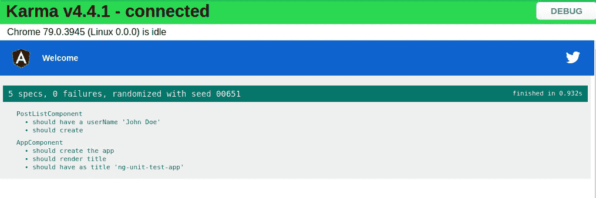
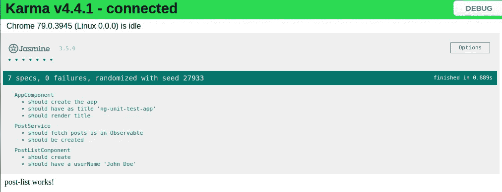

# 使用 Jasmine & Karma 示例的单元测试角度应用程序

> 原文：<https://javascript.plainenglish.io/unit-testing-angular-application-using-jasmine-karma-example-ee4b754b521a?source=collection_archive---------4----------------------->

在任何编程语言中，单元测试都是对一组单独的源代码进行测试以检查它们是否适合使用的过程。一组单独的源代码或单元是最小的可测试组件。当新的功能被添加到一个有效的功能应用程序中时，单元测试扮演了一个非常重要的角色，在这里，它减少了由于最新的变化而对其余功能产生错误的机会。

在本文中，我们将看到在一个非常流行的 Javascript 框架 Angular 中的单元测试。本文将逐步解释如何使用 Jasmine 测试框架和 Karma 开始为 Angular 应用程序中的组件和服务编写单元测试用例。

# 茉莉是什么？

Jasmine 是 JavaScript 的开源测试框架。它的目标是在任何支持 JavaScript 的平台上运行，不干扰应用程序和 IDE，并且具有易读的语法。它深受其他单元测试框架的影响，比如 ScrewUnit、JSSpec、JSpec 和 RSpec。

Jasmine 提供了几个有价值的函数来编写测试。以下是主要的茉莉方法:

*   **it():** 特定测试的声明
*   **描述():**这是一系列的测试
*   **expect():** 期待一些真实形式的价值

# 什么是因果报应？

一个简单的工具，允许你在多个真正的浏览器中执行 JavaScript 代码。Karma 的主要目的是让你的测试驱动开发变得简单、快速和有趣。

如果我们谈论功能测试的类型，那么主要有 3 种类型的测试。

A.单元测试

B.集成测试

C.端到端测试

我假设节点、NPM 和 Angular CLI 已在您的系统中正确配置。

# 我们开始吧

# 创建基本的角度应用

运行以下命令，使用 Angular CLI 创建基本角度应用程序

ng 新的 ng 单元测试应用程序

一旦您在终端/命令提示符下看到成功安装的消息。

现在使用 **cd /ng-unit-test-app** 移动到项目文件夹，并使用 **ng serve 运行应用程序。**

# 测试角度分量

这里我们将使用 angular CLI 命令创建一个名为 post-list 的组件，稍后我们将使用 dummy API 来显示帖子列表。

使用下面的命令创建一个组件。

ng 生成组件后列表

在生成的组件中，创建一个名为 userName 的变量，其中包含值。这样就可以在这个变量的基础上创建测试用例。现在 post-list.component.ts 文件将如下所示:

从“@angular/core”导入{ Component，on init }；

@组件({

选择器:“应用程序-发布-列表”，

templateUrl:“”。/post-list.component.html '，

样式 URL:['。/post-list.component.css']

})

导出类 PostListComponent 实现 OnInit {

构造函数(){ }

用户名:String = " John Doe

ngOnInit(): void {

}

}

当我们用 Angular CLI 创建一个 Angular 组件时，会创建一个文件夹，其中包含 4 个不同的文件。

*   组件样式的 CSS 文件。
*   组件模板的 HTML 文件。
*   组件类名为 dPostListComponent 的 TypeScript 文件。
*   PostListComponent 类的测试文件。

以上列表中的最后一个文件**post-list . component . spec . ts**负责在 Angular 应用程序中执行测试相关任务。

默认情况下，测试文件如下所示。

从“@angular/core/testing”导入{ async，ComponentFixture，TestBed }；

从“”导入{ PostListComponent }。/post-list . component '；

describe('PostListComponent '，()=> {

let 组件:PostListComponent

让夹具:组件夹具<postlistcomponent>；</postlistcomponent>

beforeEach(异步(()=> {

testbed . configuretestingmodule({

声明:[ PostListComponent ]

})

。compile components()；

}));

在每个(()=> {

fixture = testbed . create component(PostListComponent)；

component = fixture . component instance；

fixture . detect changes()；

});

它('应该创建'，()=> {

期望(组件)。tobe truthy()；

});

});

下面是 describe 函数中的一个简单测试用例。

它(`应该有一个用户名' John Doe ' `，async(() => {

fixture = testbed . create component(PostListComponent)；

component = fixture . debug element . component instance；

期望(component.userName)。to equal(' John Doe ')；

}));

现在添加完上面的代码后，保存它并运行下面的命令开始测试角度组件。

ng 试验

**ng 测试**命令在手表模式下构建应用程序并启动 karma。

成功编译应用程序后，会打开一个新的弹出窗口，显示成功案例和失败案例的详细信息。

# 测试角度服务

现在，我们将对 Angular 应用程序中管理 HTTP 请求的服务执行单元测试。使用以下 Angular CLI 命令创建服务:

ng 生成服务 _ 服务/post

上面的命令在提供的路径中创建了两个不同的文件

*   _ 服务/售后服务.规格
*   _services/post.service.ts

我们将在这里使用 post 列表的 [JSON 占位符](https://jsonplaceholder.typicode.com/)虚拟 API。创建 postList()方法从第三方服务器获取文章列表。

请参见下面更新的 post.service.ts 文件:

从“@angular/core”导入{ injective }；

从“rxjs”导入{ Observable }；

从“@angular/common/http”导入{ http client }；

导出界面发布{

userId:数字；

id:数字；

标题:字符串；

正文:字符串；

}

@可注射({

providedIn:“根”

})

导出类邮件服务{

API _ URL:String = 'https://jsonplaceholder.typicode.com/posts'；

构造器(

私有 http: HttpClient

) { }

postList():可观察的 <post>{</post>

return this . http . get<post>(` $ { this。API_URL} `)</post>

}

}

Angular 的新 HttpClient 有一个测试模块，HttpClientTestingModule，它可以很容易地对 HTTP 请求进行单元测试。

在本文中，我们将借助 HttpTestingController 服务，为使用 HTTP GET 请求创建的 post 方法编写一个单元测试。

下面是文件 **post.service.spec.ts** 的更新代码

从“@angular/core/testing”导入{ TestBed，async，inject }；

从“@angular/common/http/testing”导入{ HttpClientTestingModule，HttpTestingController }；

从'导入{ PostService }。/post . service '；

describe('PostService '，()=> {

let service:post service；

let http mock:HttpTestingController；

在每个(()=> {

testbed . configuretestingmodule({

进口:[

HttpClientTestingModule，

],

提供商:[

邮政服务

]

});

service = testbed . inject(post service)；

http mock = testbed . get(HttpTestingController)；

});

它('应被创建'，()=> {

期待(服务)。tobe truthy()；

});

它(`应该以可观察的方式获取帖子`, async(inject([HttpTestingController，PostService]，

(http client:HttpTestingController，postService: PostService) => {

const postItem = [

{

“用户标识”:1，

【产品 id】:1、

" title ":" sunt aut face re repellat provident occasati except uri optio reprenderit "，

"身体":"对我们来说，这是一种必然的结果，是一种必然的结果，也是一种必然的结果"

},

{

“用户标识”:1，

【产品编号】:2，

【标题】:“qui est esse”，

"身体":"这是一份临时的简历，其中没有任何文字说明，也没有任何文字说明"

},

{

“用户标识”:1，

【产品编号】:3，

"标题":"骚扰者的准运动被排斥在外"，

"身体":"有时，所有的天才和痛苦的志愿者都被要求观看录像、工作和表演"

}

];

postService.postList()

。订阅((帖子:任何)=> {

expect(posts.length)。toBe(3)；

});

let req = http mock . expect one(' https://jsonplaceholder . typicode . com/posts ')；

expect(req.request.method)。toBe(“得到”)；

req . flush(postItem)；

http mock . verify()；

})));

});

现在再次运行 **ng test** 命令来运行为 Angular service 创建的测试用例。

成功编译后，将打开一个弹出窗口，显示以下信息。

# 结论

在本文中，我们学习了如何开始为 Angular 应用程序编写测试用例。

如果你是 Node.js 的新手，那么找到 [Angular Sample 项目](https://jsonworld.com/demo/angular-sample-projects)来启动这个企业级应用程序。

*更多内容请看*[***plain English . io***](https://plainenglish.io/)*。报名参加我们的* [***免费周报***](http://newsletter.plainenglish.io/) *。关注我们关于*[***Twitter***](https://twitter.com/inPlainEngHQ)[***LinkedIn***](https://www.linkedin.com/company/inplainenglish/)*[***YouTube***](https://www.youtube.com/channel/UCtipWUghju290NWcn8jhyAw)*[***不和***](https://discord.gg/GtDtUAvyhW) ***。*****

*****对缩放您的软件启动感兴趣*** *？检查* [***电路***](https://circuit.ooo/?utm=publication-post-cta) *。***