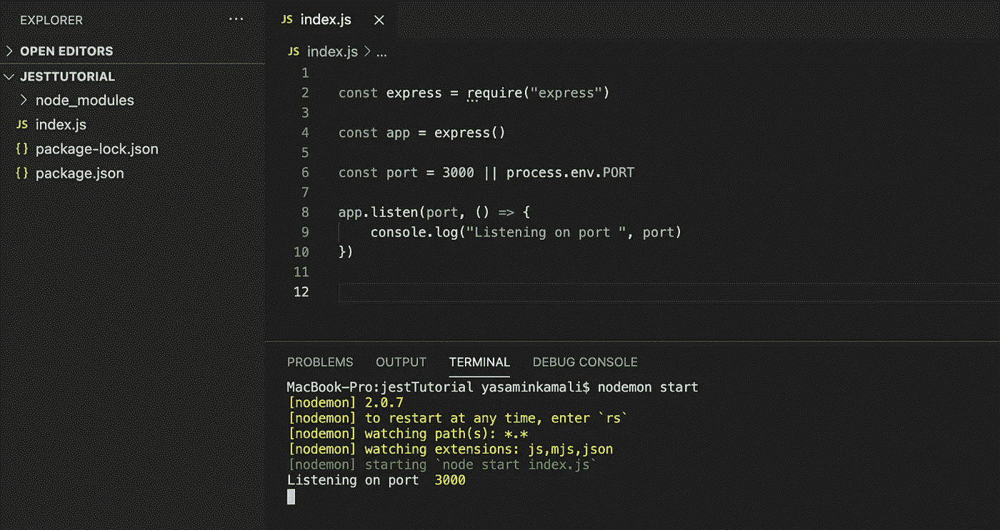
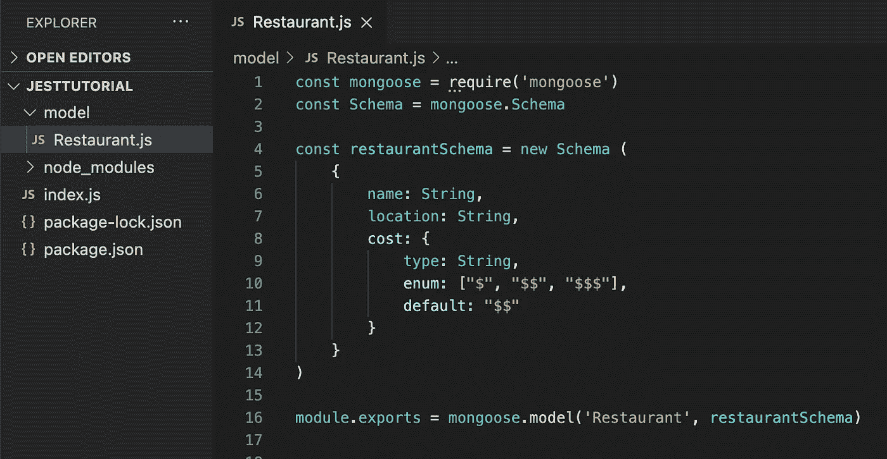
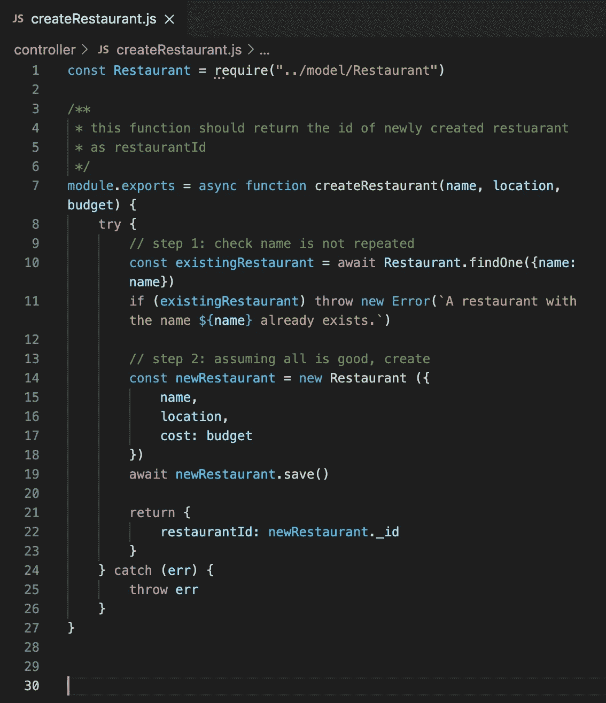
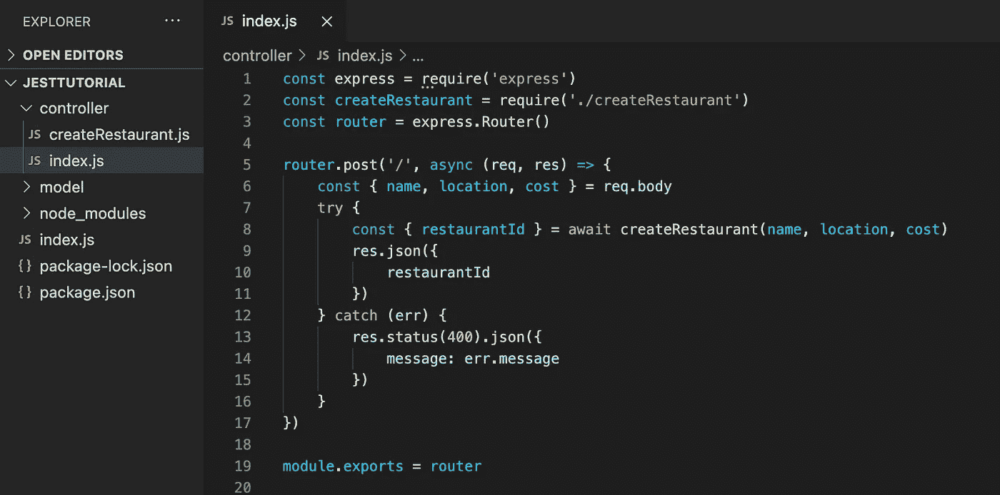
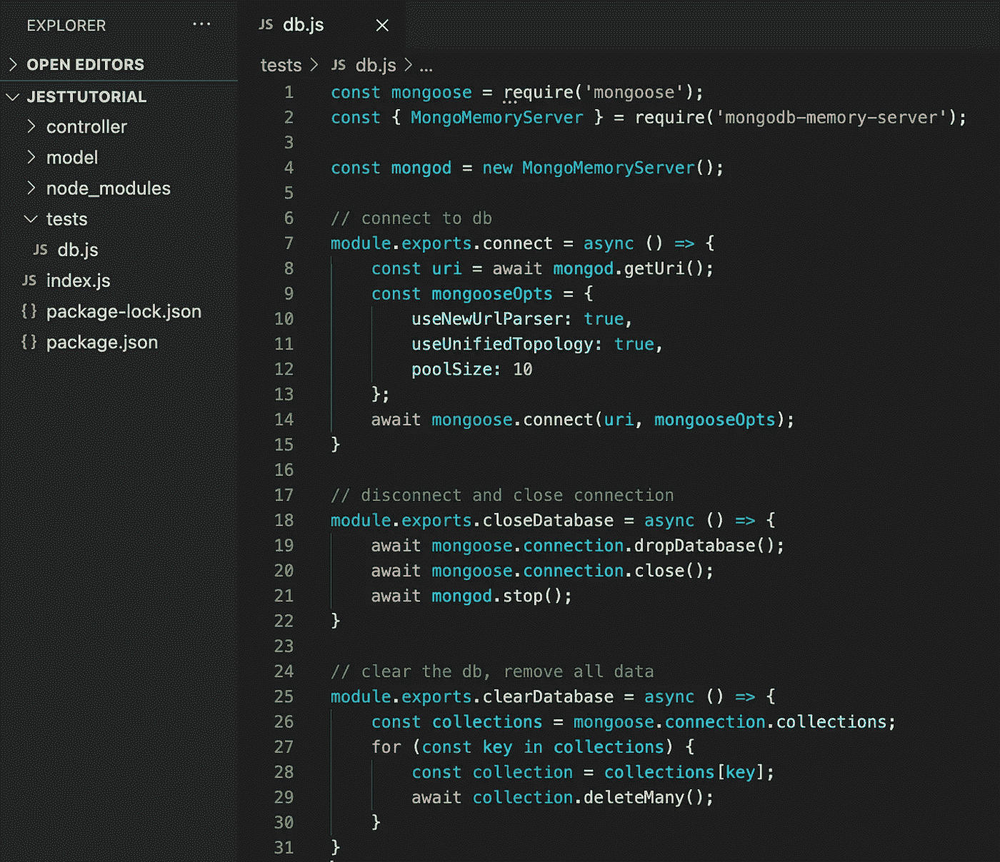
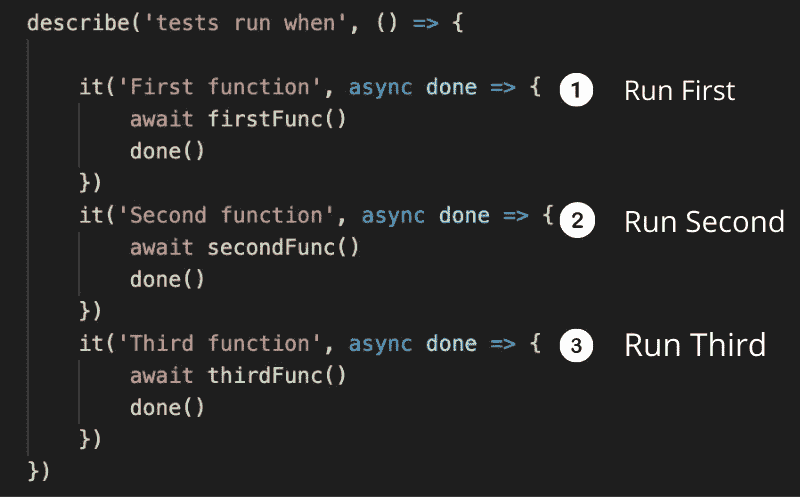
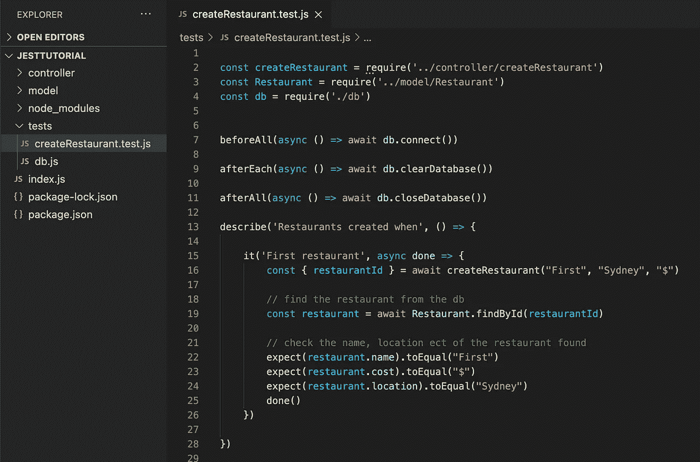
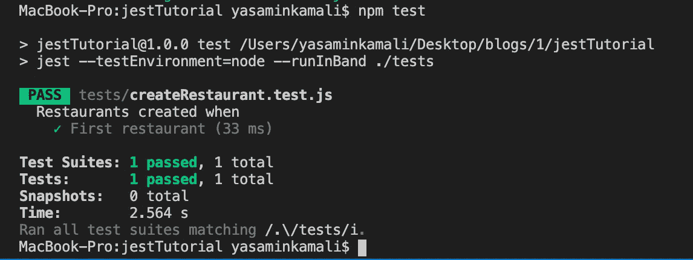
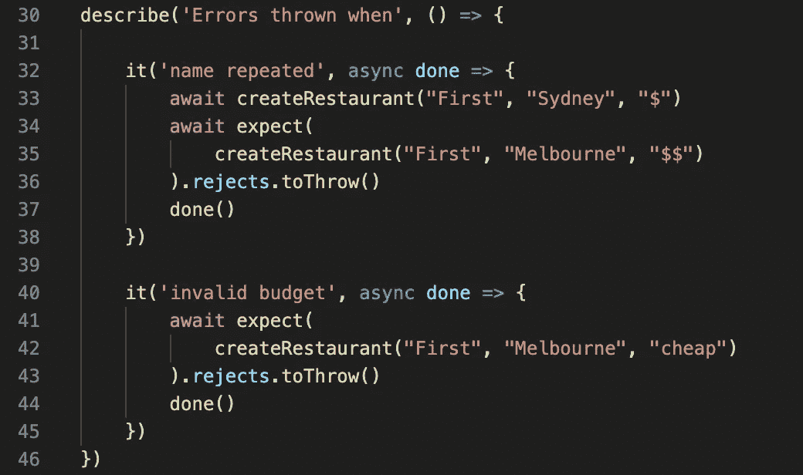
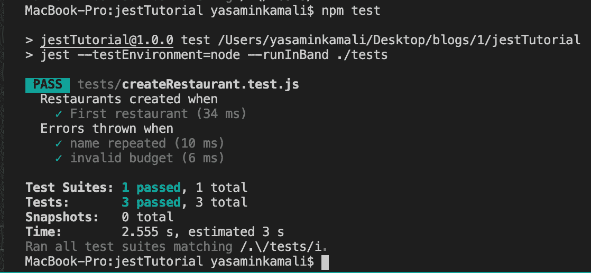

# 使用 Jest 单元测试 node . js+mongose

> 原文：<https://javascript.plainenglish.io/unit-testing-node-js-mongoose-using-jest-106a39b8393d?source=collection_archive---------0----------------------->


单元测试不是所有事情的答案，但是它确实可以避免一些尴尬和麻木的情况。有时候，无论你在编程时多么小心，有些错误还是会被忽视，而在其他人之前发现它们的最简单的方法就是单元测试。

在本指南中，我将向您展示如何使用 Jest 对 MERN 堆栈的后端进行单元测试。具体来说就是 Node.js 和 Mongoose。

如果你对 Node.js 有经验，那么你可以跳到第 2 步，这一步详细描述了如何测试你的函数。

# **第一步。设置快递后端**

对大多数人来说，这一步应该很简单。你真正需要做的就是设置`npm`，安装几个包，确保你可以成功启动你的服务器。我正在使用`nodemon`，但也可以随意使用`npm`。

```
npm init -y
npm i express mongoose nodemon
```

到目前为止，您的项目应该是这样的:



basic set up in index.js

由于我们只关心应用程序的测试，我们只需要一个非常简单的 API，既然每个人都喜欢食物，我想为什么不制作另一个*餐馆 API 呢！*

**餐厅模式**



Restaurant model in model/Restaurant.js

这应该不是什么新鲜事，但是成本的枚举可能会让一些人感到困惑。

enum 的简单设置是为每个餐馆对象添加一个额外的验证步骤，这与它们的成本属性有关。这意味着“餐馆的成本必须是一个字符串，并且只能是值“$”、“$$”和“$$”中的一个。如果没有提供值，则给餐馆一个成本' $$ '。很简单，对吧？

我们的一个测试将涵盖这样一种情况，即传入的 cost 字符串不是 enum 中的一个字符串。此时，数据库将无法保存新对象，我们将看到如何处理这种错误。

## **创建餐厅功能**

我们的第一个功能将是创建一个给定名称，位置和预算的餐厅。

除了数据库错误之外，创建餐馆失败的唯一原因是另一家餐馆已经有了给定的名称(参见第 10-11 行)，或者餐馆的成本不是前面提到的枚举中的字符串之一(参见 model/Restaurant.js)。



helper function to create a new restaurant in controller/createRestaurant.js

如果成功，它将返回新创建的餐馆的 id。

## **创建餐厅过帐方法**

这一步对于测试来说是不必要的，但是以防你不习惯使用帮助函数，我想包括你如何将它们融入到你的代码中。



controller/index.js

正如您在上面的图片中看到的，我们之前创建的`createRestaurant(name, loc, cost)`在 post 请求中被调用，所有这些都被包装在一个 try catch 语句中，这样如果出现错误(例如，相同的名称使用了两次),我们就可以处理它。

# **第二步。安装 Jest 和 mongodb-memory-server**

正如文章标题中提到的，我们将使用 Jest 来运行我们的测试。

Jest 提供了创建、组织和运行测试的方法。它是最受欢迎的测试框架之一，因为它关注简单性，所以您可以关注测试背后的逻辑。

> " Jest 是一个令人愉快的 JavaScript 测试框架，专注于简单性."

我们必须安装的第二个包是`mongodb-memory-server`。如果你已经熟悉 mongo 的工作方式，你会知道你创建了一个集群来存储你所有的应用数据。大多数应用程序都会定期写入/查询/更新数据库，因此，确保您与数据库的交互产生预期的结果是很重要的。

> mongodb-memory 服务器创建一个“集群”,它只存在于设备的主内存中，并没有物理存储到磁盘上。

因此，一旦应用程序终止，数据库实例将不再存在。这种方法也比模拟与数据库的交互要快。

现在我们已经了解了这个理论，让我们安装两个包:

```
npm i mongodb-memory-server jest
```

# **第三步。处理内存服务器**

为了确保我们不重复代码并保持良好的风格，最好创建并导出用于处理内存数据库的函数，然后调用这些导出的函数，因为项目的其余部分都需要它们。

我们之前安装的 mongodb-memory-server 包有一个非常有用的 github 页面，解释了如何连接和创建一个 db 实例:

[](https://github.com/nodkz/mongodb-memory-server#simple-server-start) [## nodkz/MongoDB-内存-服务器

### 在内存中运行 mongod 进行快速测试。如果您并行运行测试，这个库有助于提升专用的 mongodb…

github.com](https://github.com/nodkz/mongodb-memory-server#simple-server-start) 

如果您不想通读文档，那么下面的代码将足以让您开始单元测试。

特别感谢 [Paula Santamaría](https://dev.to/paulasantamaria) 在她的文章中提供了这个模块。我将在本教程的最后链接到她的文章。



Handling interactions with in-memory database: tests/db.js

connect 和 closeDatabase 方法应该很容易解释，但是，您可能想知道为什么我们还需要一个 clearDatabase 函数。

说到单元测试，每个测试都应该在一个空白的画布上开始，这意味着当我们开始一个新的测试时，数据库中应该没有现有的数据。所以每次测试结束，我们都会调用 clearDatabase 函数。

# **第四步。设置测试文件**

首先，在我们的测试文件夹中，我们将保存包括测试在内的所有文件。在命名文件时，确保以这种方式命名是很重要的:`fileName.test.js`

在运行任何测试之前，我们需要连接到内存数据库。幸运的是，我们已经在`tests/db.js`中创建和导出了一个方法。类似地，一旦所有测试运行完毕，我们需要断开连接并删除数据库。最后，在每次单独测试之后，我们必须清空数据库。

现在，我们需要做的就是将它添加到每个测试文件的顶部:

```
const db = require('./db')beforeAll(async () => await db.connect())afterEach(async () => await db.clearDatabase())afterAll(async () => await db.closeDatabase())
```

# **第五步。剖析一个玩笑式的测试**

设置好一切后，我们现在可以专注于对`createRestaurant`函数的第一次测试。

Jest 提供了一种组织测试的方法。考虑以下测试异步函数的示例，该函数接收整数并以整数和字符串的形式返回数字:

```
describe('First Group Of Tests', () => { it('First Test', async done => {
        const result = await numberFunc(10)
        expect(result.word).toBe("ten")
        expect(result.number).toBeGreaterThan(10)
        done() })
    it('Second Test', async done => {
        const result = await numberFunc()
        expect(result).toBeNull()
        done() })})
```

其中的要点是:

*   `describe`块是一种将相似的测试放在一起的方法。例如，如果您正在测试`createRestaurant`函数，并希望确保它能够处理各种名称长度，那么您可以将所有这些测试放在同一个 describe 块中。
*   `it` 块代表每个单独的测试。
*   对于异步测试来说，`it`块最重要的部分是确保在测试结束时包含`done()`。否则，测试将在任何异步调用完成之前完成，您的测试将会失败。Jest 解释异步函数中`done()`重要性的方式是:

> " Jest 会等到`done`回调函数被调用后才完成测试."

*   `expect`和其他语言的`assert`很像。这是我们可以检查的方法，以确保我们的函数正在检索/创建我们希望它们检索/创建的对象。虽然有许多不同的方式来使用`expect`，我在这里只显示了 3 个选项。更多信息，请查看[https://jestjs.io/docs/en/expect](https://jestjs.io/docs/en/expect)

# **第六步。测试** `createRestaurant()`

由于测试是自顶向下运行的，所以最好将最简单/基本的测试放在文件的顶部。我的意思是这样的:



example test suite to show order of tests running in Jest

基本上，文件中测试的顺序很重要。

因此，在进入更复杂的情况之前，最好从测试一个函数的最基本需求开始，以确保它能正常工作。

所以回到测试`createRestaurant()`，最基本的测试用例是创建一个具有有效名称、位置和预算的餐馆。



example unit test for a success case in tests/createRestaurant.test.js

这是我们第一次测试的测试文件！如果这三个`except()`中的任何一个失败了，那么测试就会失败，我们就会知道函数中的某些东西被破坏了。现在，让我们运行测试，看看它是否会工作。

# **第七步。运行测试**

在您的`package.json`中，添加一个测试脚本:

```
"scripts": {
    "test": "jest --testEnvironment=node --runInBand ./tests"
}
```

`--runInBand`是为了让测试一个接一个地运行。

`--testEnvironment=node`就在那里，因为我们处在一个节点环境中。

这里真正重要的是给出测试文件夹的正确路径。对我来说，那就是`./tests`。

现在，当您在终端中运行`npm test`时，您应该会看到类似这样的内容:



Successful jest test

这是一个成功测试的例子。我将向您展示如何编写错误测试。

## **错误测试**

在同一个文件中，您可以创建一个新的 describe 块，以防我们无法创建新的餐馆。回头看看我们的模式和函数，只有在名称重复或者与餐馆相关的成本不在枚举值中时，它才会失败。



example testing for exceptions in tests/createRestaurant.js

在第一个测试中，我们检查如果名称重复，是否会抛出错误。我们已经成功测试了一家餐厅的案例，因此我们可以放心，33 号线将顺利运行。

然而，第 35 行应该抛出一个错误，因为名称“First”已经属于另一个餐馆。由于这是一个异步函数，意味着抛出一个错误，我们需要在 expect 后面添加`rejects.toThrow()`。

在第二个测试中，我们检查当第三个参数`createRestaurant()`不是 cost enum 中的字符串值时是否抛出了错误。

如果您再次运行测试，您应该会看到以下内容:



Running all tests successfully

恭喜你！您已经使用 Jest 成功地对 Node.js 和 Mongoose 后端进行了单元测试。

感谢您的阅读，如果您有任何不确定的地方，请留下您的评论。这是我的第一篇文章，所以我可能做得不完美，所以如果你发现任何问题，请让我知道😌

如果你想用`jest`做更多的事情，比如用**模仿**外部函数的行为，请阅读[🥳的博客](https://yasaminkamali.medium.com/jest-mock-for-unit-testing-mern-backend-983c1e3fef83)

# 参考

[https://dev . to/paulasantamaria/testing-node-js-mongose-with-an-in-memory-database-32np](https://dev.to/paulasantamaria/testing-node-js-mongoose-with-an-in-memory-database-32np)