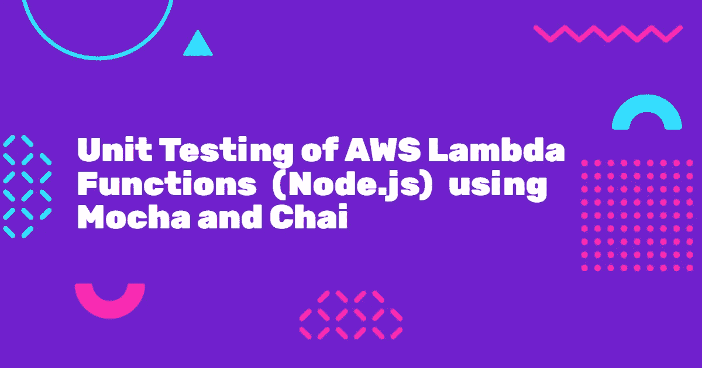
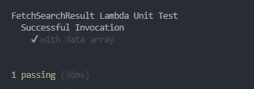

# 使用 Mocha 和 Chai 对 AWS Lambda 函数(Node.js)进行单元测试

> 原文：<https://javascript.plainenglish.io/unit-testing-of-aws-lambda-functions-node-js-using-mocha-and-chai-317353f8d60?source=collection_archive---------0----------------------->

单元测试是测试一段代码或模块并识别其中任何问题的过程。在单元测试中，我们用一些测试用例来测试一段代码/模块。在基于 JavaScript 的应用程序中，我们通常使用 Mocha 和 Chai 来编写测试用例。

让我们学习如何使用 Mocha 和 Chai 为 AWS Lambda 函数编写单元测试用例。

## 什么是 AWS Lambda？

> AWS Lambda 是一种无服务器、事件驱动的计算服务，允许您为几乎任何类型的应用程序或后端服务运行代码，而无需配置或管理服务器。

AWS lambda 函数的单元测试也很重要，因为它有助于我们发现 lambda 代码中的任何问题。在本文中，我们将学习更多关于 lambda 函数的单元测试。

让我们开始吧。

## λ代码

让我们首先来看一个样例 Lambda 函数，它根据搜索输入和过滤器从数据库中获取搜索结果。该功能有两个输入— `searchText`和`filterBy`T5。

*   `searchText`将有我们要在数据库中搜索的文本
*   `filterBy`将具有我们希望对搜索结果进行排序所基于的字段名称。

Lambda function

## lambda 函数的单元测试

现在让我们通过编写测试用例来测试上面的 lambda 代码。对于单元测试，我们将使用下面的包。

*   [Mocha](https://mochajs.org/)——用于创建测试套件和运行测试用例。
*   Chai -断言库，用于验证给定代码是否正确运行。
*   [proxy quire](https://www.npmjs.com/package/proxyquire)——一个可以通过覆盖内部函数来代理依赖关系的包。
*   [Lambda Tester](https://www.npmjs.com/package/lambda-tester) —可以帮助在本地运行 Lambda 函数的包。

现在让我们深入研究一下。

## Lambda 函数执行

为了测试 lambda 函数，我们需要一种从本地执行/调用 lambda 函数的方法。为此，我们可以使用名为 [lambda-tester](https://www.npmjs.com/package/lambda-tester) 的第三方软件包。Lambda-tester 可以接受一个`event`对象并执行 Lambda 函数来返回结果。

Test case with lambda invocation using lambda-tester

## 覆盖和模仿依赖关系

现在我们知道了如何在本地调用/执行 lambda 函数。让我们学习如何模仿 lambda 函数内部的依赖关系。这些依赖项可以是任何第三方库或 DB 调用，甚至是 API 调用。为了覆盖和模仿这些依赖，我们可以使用 [proxyquire](https://www.npmjs.com/package/proxyquire) 包。

Proxyquire 将帮助我们在不调用 lambda 函数的情况下导入它，并帮助我们模拟 lambda 函数内部使用的依赖关系。

在下面的例子中，我们有两个依赖项— *utils* (实用函数)和 *dataService* (数据库函数)。我们将覆盖一个名为 *query* 的数据库函数，并添加我们自己的逻辑来返回模拟结果。然而，我们不会覆盖实用函数文件( *utils* )，因为它有独立的代码，没有任何第三方依赖。

Mocking dependencies using proxyquire

## lambda 函数的测试用例

既然我们已经学习了如何使用模拟依赖在本地调用 lambda 函数。现在让我们编写一个简单的测试用例。

Unit test case for the lambda function

现在让我们使用命令`mocha`运行测试用例，并检查它是否通过。

Unit test results

您可以在 [this](https://github.com/SyedAfrozPasha/node-lambda-unit-test) repo 中找到本文讨论的所有代码。

这就是我今天的全部内容。希望你喜欢。😉

谢谢你的来访。如果你喜欢的内容，请支持我，并关注我更多这样的内容。

在 [LinkedIn](https://www.linkedin.com/in/syedafrozpasha/) 、 [Twitter](https://twitter.com/SyedAfroz_Pasha) 和 [GitHub](https://github.com/SyedAfrozPasha) 上与我联系。

*更多内容看* [***说白了就是***](http://plainenglish.io/) ***。*** *报名参加我们的* [***免费每周简讯这里***](http://newsletter.plainenglish.io/) ***。***