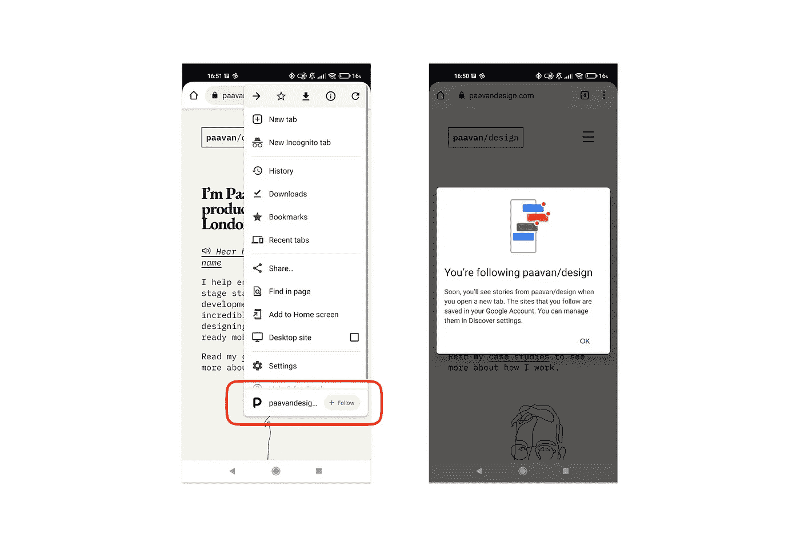
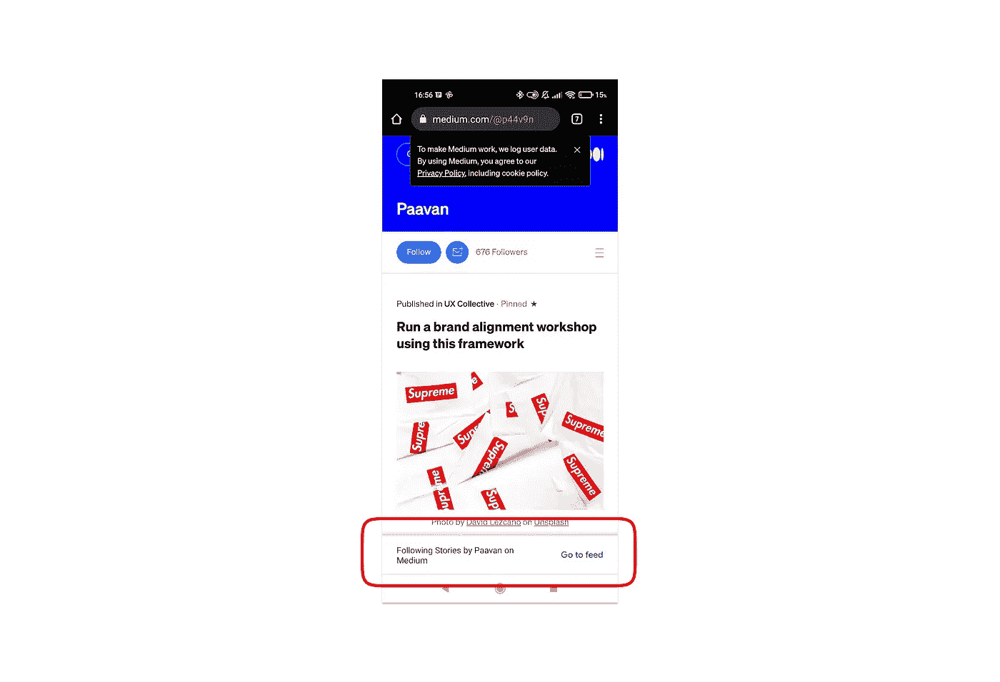

# 更新你的网站，使用 Chrome 新的“关注”按钮

> 原文：<https://javascript.plainenglish.io/update-your-website-to-use-chromes-new-follow-button-35a091b6f08?source=collection_archive---------11----------------------->

## RSS 提要的新未来已经到来

几周前，谷歌 Chrome 的工程总监之一阿德里安娜·费尔特(Adrienne Felt)宣布了稳定版 Chrome 的一项新功能。**网站访问者可以点击*跟随*按钮**来接收 Chrome 新标签页的更新。

(据推测，这些更新也会出现在他们手机上谷歌应用的主页提要中，以及其他一些地方)。

**这利用了 RSS 提要**。RSS 代表*真正简单的联合*，是一种使内容分发变得容易的 XML 格式。回想一下 2000 年代末，那时我们都在用谷歌阅读器更新自己最喜欢的博客和网络漫画。这些都是由 RSS 驱动的。

这样做的好处是，用户会被动地找到你的内容。用一些营销术语来说，**它能让你从事“拉动式营销”，**读者的兴趣以一种自然、平静、**被动的**方式被吸引到你的品牌或网站上。这与“推送营销”形成对比，在“推送营销”中，你可以用邮件列表或类似的东西将内容推送到访问者面前。

这一功能已经在 Chrome 的 Android 应用程序上推出，并且[很快将进入桌面和 iOS](https://twitter.com/__apf__/status/1446555070892429316) — **因此值得让你的网站准备好**来利用它，并且**利用另一种方式来保持你的用户参与**并对你的内容感到兴奋。

# 它是如何工作的

没有特殊的方法来启用 follow 按钮。相反， **Chrome 会自动检测页面上是否存在带有** `**<link>**` **标签**的 RSS 提要。所以你所需要做的就是确保你已经设置了一个 RSS 提要，然后 Follow 按钮就会出现。

为了测试它，你需要在 Android 上使用 Chrome 94——如果它还没有出现，你可以通过导航到`chrome://flags`并切换选项`Web Feed`来提前启用它。你还需要登录你的谷歌账户。

# 在您的媒体配置文件中启用“关注”按钮

每个媒体配置文件都有自己的 RSS 提要—您可以通过将`/feed/`添加到任何媒体 URL 来找到它的 RSS 提要，如下所示:

`[https://medium.com/feed/@p44v9n](https://medium.com/feed/@p44v9n)`

这意味着，如果你在介质上书写，你已经有了一个跟随按钮。用户可以通过他们的谷歌账户轻松关注你的故事，甚至不需要一个中型账户。你完了！

# 在 Squarespace 网站上启用关注按钮

像中型简介一样， [Squarespace 网站已经内置了](https://support.squarespace.com/hc/en-us/articles/215761717-Using-RSS-feeds)RSS 提要。RSS 提要是自动链接的，它会拉入 20 个最新的条目(博客文章、产品或事件)或 300 个最新的播客。所以没别的事可做了，你完了。

# 启用 Tumblr 上的关注按钮

Tumblr 网站也已经内置了 RSS 提要。对于任何 Tumblr 任何网站，你都可以通过在 URL 后面加上`/rss`找到它(例如`yoursite.tumblr.com/rss`)。这意味着没有其他事情要做，你已经有了一个关注按钮。

# 在 Shopify 网站上启用关注按钮

Shopify 也是如此——RSS 提要已经内置。然而，Shopify 网站使用一种叫做 Atom 链接的东西，所以格式是这样的:

`[https://yourshopifysite.com/blog.atom](https://yourshopifysite.com/blog.atom)`

Atom 是一种 XML 布局，在大多数浏览器中单击 Atom 链接会将您带到该提要的 FeedBurner 页面，而不仅仅是显示原始内容。但所有这一切意味着，再一次，你不需要担心为 Shopify 网站做什么 follow 按钮会自动显示给登录的 Chrome 用户。

# 在静态生成的站点上启用关注按钮(Eleventy/Jekyll/Hugo)

几乎所有适用于任何静态站点生成器的 starter 模板都会包含一个 RSS / Atom 提要——但是有必要在您生成的 HTML 中检查一下，在您的`<head>`中是否有一个`<link>`指向它，或者在您的配置文件中检查一下它是如何生成的。通常可以在`/feed.xml`找到。

关于为流行的 SSG 设置提要的更多细节如下:

*   [Eleventy 有一个插件](https://www.11ty.dev/docs/plugins/rss/)，您可以在配置文件(`eleventy.js`)中启用它
*   [Jekyll 也有一个插件](https://github.com/jekyll/jekyll-feed)，你可以通过你的 Gemfile 添加并在你的配置文件中启用它(`_config.yml`)
*   用 Next 构建的静态站点。JS 稍微复杂一点，但是你可以[使用](https://phiilu.com/generate-rss-feeds-for-your-static-next-js-blog) `[feed](https://phiilu.com/generate-rss-feeds-for-your-static-next-js-blog)` [包](https://phiilu.com/generate-rss-feeds-for-your-static-next-js-blog)并用 RSS、JSON 或 Atom 提要实例化它。

# Carrd 站点不起作用

Carrd 是我最喜欢的网站建设者([以下是如何使用 Carrd 制作个人写作作品集](https://writingcooperative.com/how-to-build-a-free-writers-portfolio-website-with-carrd-8be7e770c6bb))——但每个 Carrd 网站都被设计成最小化的单页网站。因此，即使你正在黑掉可以定期更新博客的东西，你也无法制作 RSS 提要，因此你也无法在你的网站上启用“关注”按钮。抱歉。

# 还有吗？

有没有一种类型的网站建设者，我还没有谈到？请在评论中告诉我，我会确保报道它。

感谢您阅读这篇简短的指南。希望你觉得有用！

*更多内容请看*[***plain English . io***](http://plainenglish.io/)