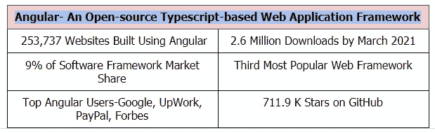
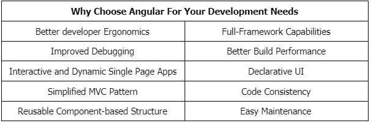

# 从角度 10 更新到角度 11

> 原文：<https://javascript.plainenglish.io/updating-from-angular-10-to-angular-11-ea8c8c79a8ab?source=collection_archive---------4----------------------->

## 开发人员应该了解的新特性

Image By: Author

如果没有提到 Angular 或[**AngularJS 应用程序开发**](https://www.suntecindia.com/angularjs-development-services.html) &网站开发元素、演示用户界面、自定义指令、MVC 架构、方便的测试，这些天来围绕前端框架的任何讨论都是不完整的——Angular 框架因其能力和品质而闻名。

> 更因为 Angular 从不回避修改。

2020 年，Angular 获得了三个稳定的更新(版本 9、10 和 11)，每个都引入了一些重大的变化。在这个空间中，我们将重点关注最后两个， **Angular 10 和 Angular 11** ，它们最强大的方面，以及 Angular 的未来路线图。

Image By: Author

# Angular 10 带来的最具影响力的更新

Image By: Author

## 1.编译器中的 TypeScript 3.9 支持

Angular 版本 9 支持 TypeScript 3.7。Angular 9.1 支持的 TypeScript 3.8。为了顺应这一趋势，Angular 10 支持 TypeScript 3.9 以及 TSLint 和 TSLib。

这也意味着更好的性能、更快的构建、精细的配置以及更大但更高效的项目。

## 2.增量程序重用优化

之前的一个 Angular 提交引入了增量程序重用，通过在编译器中填充引用标记来进行模板类型检查。然而，增量的不令人满意的性质导致了无意的性能退化。

Angular 10 更新中增加了一项优化，以完善增量程序重用并防止不必要的类型检查。

## 3.NGCC 编译器兼容性工具

在更新之前，ProgramBasedEntryPointFinder 将解析每个入口点，无论是已处理的还是未处理的，只要程序引用它来获取依赖关系。Angular 10 更新重定向了这个过程，并加强了 EntryPointManifest 的使用，以加载依赖关系，从而避免在调用 ngcc 时继续解析。

## 4.Bazel 构建工具中的 NG 模块规则

Angular 10 在 Bazel 构建工具的 ng-module 规则中增加了 LinkablePackageInfo。理想情况下，这可以让链接器在 Node.JS 中实现无阻碍的 ng 模块目标链接。

然而，该规则目前面临着一些问题，尤其是对于像@angular/core 这样的包。开发人员应该等待另一个次要版本，或者下一个主要的稳定版本，以获得该功能的固定版本。

## 5.诊断工具中的静态评估洞察力

10.1 的升级允许静态解释器跟踪被识别为动态的节点。到目前为止，DynamicValues 的踪迹对开发人员来说是不可用的，但现在是了，从而使调试静态评估错误变得更加容易。

## 6.常见 JS 导入警告

CommonJS 最初是为服务器端模块构建的，通常会产生大量的代码，降低应用程序的速度。Angular 10 引入了对 CommonJS 依赖关系的警告，给了开发者分析和解决问题的时间。

## 7.绝对 URL HTTP 支持

最初的 Angular 版本 10 提供了绝对的 URL 支持，只要基于服务器的 HTTP 请求的初始配置带有完全解析的 URL。然而，这给使用拦截器的用户带来了一个问题。Angular 10 允许用户选择退出，确保他们的拦截器在 URL HTTP 支持逻辑之前运行。它还修复了运行相对 URL 的障碍，现在包括端口(如果绝对 URL 在端口上。)

## 8.路由器形式性能改进

Angular 中的 CanLoad Guards 是类实现的一个接口，用于确定是否应该加载一个子级。当所有保护返回真时，导航恢复，如果任何保护返回假，导航中断。在 Angular 10 中，CanLoad 保护通过 PrioritizedGuardValue 运算符进行优化。

## 9.其他逻辑变化

*   更新了日期格式的逻辑(以防日期跨越午夜)。
*   派生类修饰的更新逻辑
*   Terser 内联错误解决方法
*   导航逻辑修复了当任何解析器返回空时取消进程的问题。
*   旧版浏览器支持已弃用(Internet Explorer 9、Internet Explorer 10 和 Internet Explorer Mobile。)
*   一种新的 CLI 消息提取工具

# 您需要关注的主要角度 11 更新

## 1.字体自动内联

Angular 11 更新使 CLI 能够自动处理应用程序字体、下载它们并内联它们，只要机器在构建期间具有活动的互联网连接。目前这是一个可选的特性，这个特殊的升级将很快成为默认选择。

## 2.更好的报告

Angular 11 引入了改进的构建器阶段报告，具有全面的日志和简化的报告。该更新旨在帮助开发人员节省时间，同时提高从日志中提取的整体效率。

## 3.所有部件的线束

组件测试工具最初是在 Angular 版本 9 中引入的，它通过终端用户交互的方式简化了测试。在 Angular 11 中，每个组件都可以有线束——这是一个显著的改进，因为它将导致更健壮和有效的测试用例创建和测试套件实现。

## 4.更新的 Angular 语言服务

Angular 11 中的 Angular 语言服务旨在像 TypeScript 编译器一样工作，并推断模板中的泛型类型。然而，这个特性需要更多的改变，预计很快会有更多的版本。

## 5.TypeScript 4.0 支持和更快的构建

Angular 11 已经完全放弃了对 TypeScript 3.9 及其以下任何版本的支持。它现在专门支持 TypeScript 4.0。这一升级也有助于提高构建速度。

## 6.更新了热模块更换(HMR)支持

HMR 机制支持完整的浏览器刷新和模块替换。它是在早期的 Angular 版本中引入的，有代码和配置先决条件。然而，Angular 11 HMR 通过一个简单的 CLI 命令减少了开发人员的工作量。

***ng 服——配置 hmr***

## 7.Webpack 5 支持

Webpack，用于将文件群编译成包，在 Angular 11 中获得了第 5 版。现在，它为小捆绑包创建、持久磁盘缓存、更快的构建和更好的分辨率提供了实验性支持。预计它将很快变得更加稳定。

## 8.林挺

Angular 11 不推荐使用 Codelyzer 和 TSLint，这使得 ESLint 成为默认设置。开发人员需要添加相关的依赖项，运行转换命令，并撤销 TSLint 配置，以便毫无问题地使用 ESLint。

## 9.其他逻辑变更

*   管道的固定日期和类型编号
*   CollectionChangeRecord 替换为 IterableChangeRecord
*   视图封装的移除。带有自动 ng 更新的本机
*   惰性加载具有命名插座的模块的功能
*   增加了柔性布局角度模块
*   用于解析防护的角度 CLI 生成器

# 在哪里/如何在您的机器上下载 Angular 11

到目前为止，从角度 10 到角度 11 不需要改变你当前的系统。您需要运行***ng update @ angular/core @ angular/CLI。*** 它会把你推到角度 11 更新。ng update 部分将自动将您迁移到 TypeScript 4.0。在迁移过程中，您将失去对 IE9、IE10 和 IE Mobile 的支持。

当然，这是解释从角度 10 到角度 11 转变过程的最基本方式。这中间有几个细节是 Angular/AngularJS 开发公司或开发人员会更好理解的。

> 例如，

*   选择加入或选择退出 Webpack 5
*   启用或禁用严格模式(用于类型检查)
*   更新路由器模块配置
*   设置初始导航的字段
*   在构造函数中指定指令参数
*   监控切片管道行为
*   检查日期管道行为
*   验证更改检测设置

所有这些，以及更多，通常都是由开发者决定的。因此，如果您没有时间研究 Angular/AngularJS 应用程序开发的复杂性，并为此选择 [**雇佣网站开发人员**](https://www.suntecindia.com/hire-web-developers.html) ，您最显著的优势将是复杂性最小。他们会知道如何将您的项目推向更好的角度版本，而不会丢失任何数据、功能或规格。

# Angular 的未来/建议更新——2021 年的路线图

作为一个开源框架，Angular 经常为其系统的未来计划做广告。目前的包括-

*   简化、更有效的角度错误信息
*   更好的调试能力
*   消除渲染阻塞资源，引入内联关键 CSS 以提高页面加载性能
*   仪表板的现有基础架构升级
*   升级的 E2E 测试策略
*   Angular 语言服务向 IVY 过渡

Android 11 是一个大发布。它有许多有趣的特点。它大力支持方便的网站开发，服务于各方面的开发人员，并为每个稳定版本带来一些引人入胜的升级。现在 Angular 12.0 已经在桌面上，预计将于 2021 年年中发布，我们正在考虑广泛的定制，包括 Nrwl NX 的 Angular 11 支持，等等。

# 想用 Angular 让你的网站功能更多、更智能、更快？

Angular 的快速发展令人印象深刻，在科技行业也很有优势，但这是一个复杂的混合体。一方面，它因消除了不必要的编程、引入了更轻的构建和简化了测试而受到称赞。另一方面，创建、管理和维护项目的复杂工作最好留给 Angular & AngularJS 应用程序开发服务。

当然，你可以 [**聘请 AngularJS 开发人员**](https://www.suntecindia.com/hire-angularjs-developers.html) ，外包几个流程或者整个项目，或者请一个顾问帮你了解框架。

有几种方法可以使用这个框架，并且做得很好。请记住它在每个新版本中引入的多个新特性和升级，以及它们对您的项目的影响。而且，万一你打算放下那些复杂的事情[**在印度雇佣软件开发人员**](https://www.suntecindia.com/hire-dedicated-developers.html) ，(可能我会建议)，在着手做之前做好外包的准备。

祝 Angular 好运！