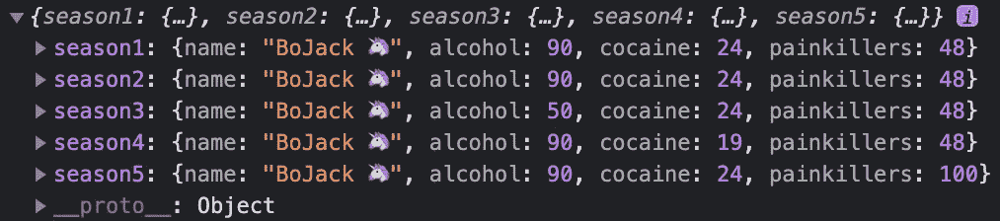

# 用这 6 种现代编码方式升级你的传统编码风格

> 原文：<https://javascript.plainenglish.io/upgrade-your-legacy-coding-style-with-these-6-modern-ways-of-coding-6a9db753a574?source=collection_archive---------9----------------------->

## 以及这三部著名的电视剧如何让你写出优秀的 JavaScript 代码


Image made by the [Author](https://www.udemy.com/user/arnold-abraham-3/)

JavaScript 曾经是前端混蛋们讨厌的工具。人们创造了应用程序**到*瑞克滚*到**你。

Video by [Official Rick Astley](https://www.youtube.com/watch?v=dQw4w9WgXcQ)

以今天的眼光来看，它的发展可谓相当不错。现在是 2021 年，坚持传统的编码风格会导致代码缺陷和问题。相反，我会告诉你如何处理我最喜欢的电视剧中的例子，比如《好汉两个半》[](https://en.wikipedia.org/wiki/Two_and_a_Half_Men)*[*阿彻*](https://en.wikipedia.org/wiki/Archer_(2009_TV_series)) 和 [*波杰克骑士*](https://en.wikipedia.org/wiki/BoJack_Horseman) 。*

# *1.异步的锤子在等待*

*你有没有在没有锁住你的解决者的情况下，与承诺一起工作过？*

*很难相信你没做过。实际上，等待不同的服务器响应会让您自动链接整个解析器链。你就是这样等几个回复的。*

*在我的例子中，我有一个通用的情节生成器用于一集 TAAHM。这实际上是糟糕的代码。它总是首先出现，然后才是该做什么。*

*检查`episodePlot`对象的代码。它很长，有多个链接`.then`语句，阅读起来很麻烦。*

**

*Console.log from line 28 of X0_Promises.js*

*让我想起了《老兄，我的车在哪》中的著名场景。*

**

*Picture from [memegenerator.net](https://memegenerator.net/instance/73000476/no-and-then-and-then-no-and-then)*

## *取而代之做什么*

*使用关键字`asnyc`和`await`，你不仅可以大幅减少代码量。*

*您也能够连接读起来像同步的异步代码。*

*在应该异步的函数前加上`async`。下一步是将`await`放在函数前面，等待一个承诺被解决或拒绝。*

**

*Console.log from line 13 of X0_AsnycAwait.js*

*就是这样。考虑使用这种方法将 11 行代码减少到 3 行。*

*如果你还不服气，[仔细看看](https://medium.com/nerd-for-tech/why-you-immediately-should-use-javascript-async-b6557fdecb14)。*

# *2.张开你的 L***，嗯..操作员*

**

*Image by [Flickr](https://www.flickr.com/photos/94915094@N06/34561936044)*

*spread 语法可用于对象和数组。例如，如果您想将两个或多个合并为一个。*

*拿我们可爱的`BoJackHorseMan`和物体`addictionLevels`来说。*

*就结合它们而言，您可以得出以下结论:*

*如果你看过这个系列，你就会知道他的上瘾程度会随着季节的变化而起伏。将每个季节作为一个独立的对象来反映牧马人滥用毒品的情况是一个更好的主意。*

*可以用`Object.assign()`函数，一点都不差…*

## *取而代之做什么*

*…但更好的方法是扩展运算符。*

*现在，使用 spread 语法，这已经很简洁了。这意味着创建一个新的对象`season3 — season5`,将我们现有的对象从左到右组合成一个新的对象，并在前面放置三个点。*

**

*Console printout of season1 — season5*

*这只是语法上的好处，但是编写更棒的代码而不是偶然发现复杂和难以理解的代码总是更好。👊*

# *它也适用于数组*

*用`push()`的方法给杰克骑士系列的角色添加元素…*

*…不是一种方便的方法:重复的代码，多次调用。*

## *取而代之做什么*

*为了方便地添加我们喜欢的字符，您再次使用了 spread 语法。*

# *3.圈是给 Noobs 的*

**

*Image from [makeameme.org](https://makeameme.org/meme/noobs-596219)*

*经典的`for`循环是丑 AF。偶然发现一个并不是什么好感觉。你知道的。几个条件、命名迟缓的变量和大量代码，仅仅是为了迭代一个数组或其他一些常识性的动作。*

****for 循环不够有表现力。除了长得丑，我提到过吗？****

*我打赌你认识斯特林·阿彻。斯特林·阿彻几乎在任何一集里都习惯尖叫“拉娜”。让我们用这个短语来演示如何区分好的和坏的 JavaScript 代码。*

*将所有“拉娜”的喊声串联成`concatenated`字符串。*

*此外，将这个词重新措辞为将俄罗斯汽车称为“拉达”，并将其存储到`phrasing`。*

*最后，每当 Archer 强调人声并且单词长于 4 个字符时，就将其推入`longest`数组。*

**

*The output of the three variables concatenated, phrasing, and longest for both ways of coding*

## *取而代之做什么*

*不要使用`for`循环，而是使用内置的数组原型函数。*

*   *对于`concatenated`，你所做的就是将数组元素缩减为一个值，分别使用`reduce()`。*
*   *对于`phrasing`你变异数组的每个元素，分别用`map()`。*
*   *`longest`的结果只是通过一个过滤器推动所有元素，分别使用`filter()`。*

*输出保持不变，但是您去掉了难看的`for`循环，并将 7 行代码减少到 3 行。除了更能表达我们的意图。*

*读一下`reduce`、`map`、`filter`的名字，你马上就会明白打电话的原因。*

# *4.解构*

**

*Image from [Moviepilot](https://www.moviepilot.de/news/charlie-sheen-fordert-nach-roseanne-absetzung-two-and-a-half-men-reboot-1107725) (All Rights Reserved)*

*这种技术可以让我们消除重复。*

*将一个对象传递给一个真正只需要几个属性的函数从这种方法中获益匪浅。*

*函数`feedSoul`被定义了两次。第一个定义有两个参数，所以你必须通过`character.name`和`character.enjoys`来满足需求。*

*在第二个定义中，将参数减少到只有`character`。在函数内部，您仍然需要多次调用`character`对象并访问其属性。*

*对于较大的对象，这变得重复，并变成一个沉重的键盘堵塞会话。*

## *取而代之做什么*

*破坏！你有权力把论点放进`{...}`。这使得该函数只接受您实际想要使用的属性。*

*该函数负责，并且您传入了`character`对象。*

*如果你不喜欢参数中的花括号，你可以在函数体的第一行创建一个析构对象。*

```
*const {name, enjoys} = character;*
```

*对你来说可能看起来更干净。在这两种情况下，都将对象作为参数传递。*

# *5.模板文字*

**

*Image from [Imgur](https://imgur.com/gallery/lWFRpLO) by [Schwiegerknecht](https://imgur.com/user/Schwiegerknecht) (All Rights Reserved)*

*这个例子基于 BoJack 主演的最好的电影。 ***秘书处*** 。*

*串联一个字符串，描述演员的`name`、`actingRole`和`actingDays`。*

*打印出这样一句话:“ ***BoJack 扮演着秘书处的角色，要 220 天不停地执行。”****

*您可能会得到如下代码:*

*这个字符串是通过访问一组属性并使用`+`符号连接字符串而构建的。*

****比 for loops 还要难看。他们是可怕的。我提到过这个吗？****

## *取而代之做什么*

*将对象析构语法与反斜线``${castingRole.name} is playing the role...``结合使用。*

*打印出来的句子是一样的，但是你要处理的东西要少得多。此外，你或你的队友更容易理解这里发生了什么。*

*如果你想让它更上一层楼，开始使用模板文字而不是常规参数。它将使用你的参数在函数上组成字符串。*

*这种技术对于模板化来说很有吸引力。*

*功能`rolePressure`决定角色是*重*还是*中*重。*

*不要传递参数，而是调用不带括号的函数`()`，传入带反勾````的字符串和`${...}`的析构语法。该函数会为您完成剩下的工作。*

# *6.像专业控制台用户一样调试*

**

*Image by [ew.com](https://ew.com/article/2014/08/06/best-tv-character-poll/)*

*常见的调试做法是`console.log`。*

*我敢打赌，你不知道这提出了一个关于不引用包含要打印的属性的对象名的问题。*

**

*Console printout of lines 5–7 from X5_ConcoleCrap.js*

*您只能看到值，但看不到它们属于哪个对象。想象一下，在您的整个代码中有三个以上的日志语句，并尝试重新分配它们。 ***梦魇*** 。*

## *取而代之做什么*

*要获得正确命名的控制台打印输出，请使用*计算属性名*。*

*通过将`console.log`参数放在花括号`{...}`中来实现。*

**

*Console printout of line 5 from X5_ConsoleGoody.js*

*这款游戏机还能提供更多功能。例如:*

*   *彩色打印输出*
*   *测量时间*
*   *跟踪(从哪里调用函数，哪里是被调用的已定义函数)。*

**

*Colored printouts, timers, and tracing.*

*这篇文章已经够长了。是时候打开您最喜欢的 IDE 并开始编码了。*

**还有更多 JavaScript* [*控制台的命令来探索*](https://medium.com/nerd-for-tech/10-unknown-commands-of-console-log-in-javascript-3-minute-guide-05-2303a7d35ef1) *。**

# *结论*

*编写可读和可维护的代码并不需要花费太多精力。只需要一些见解和方法来提高你的编码质量。*

1.  *使用`async await`到**排除长承诺**链，增加编写异步代码的便利性*
2.  *使用扩展运算符(`...`)来**减少重复代码**和**消除**对`array.push()`、`array.shift()`、`array.unshift()`的调用*
3.  ***通过使用`array.map()`、`array.filter()`、`array.reduce()`等函数，从您的工具集中踢出循环***
4.  *使用析构来**移除** **对函数内部对象属性和方法的多次调用***
5.  *模板文字使用**函数参数在功能上组成字符串***
6.  *像专业开发人员一样用大多数未知的`console.log()`语句调试*

***现在就去学习你自己的代码吧。我相信你会发现许多需要改进的地方。或者更好的是，研究队友的最后提交，做查理一直对艾伦做的事情。😁***

****我不应该在一周内看完所有 8 部值得一看的电视剧……****

***节省你自己大量的时间，专注于重要的主题。***

******

***Arnold Code Academy 26 Web Developer Cheatsheets***

****更多内容请看*[***plain English . io***](http://plainenglish.io)***