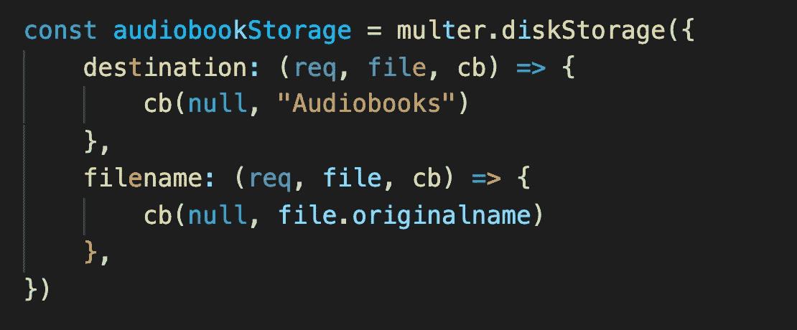
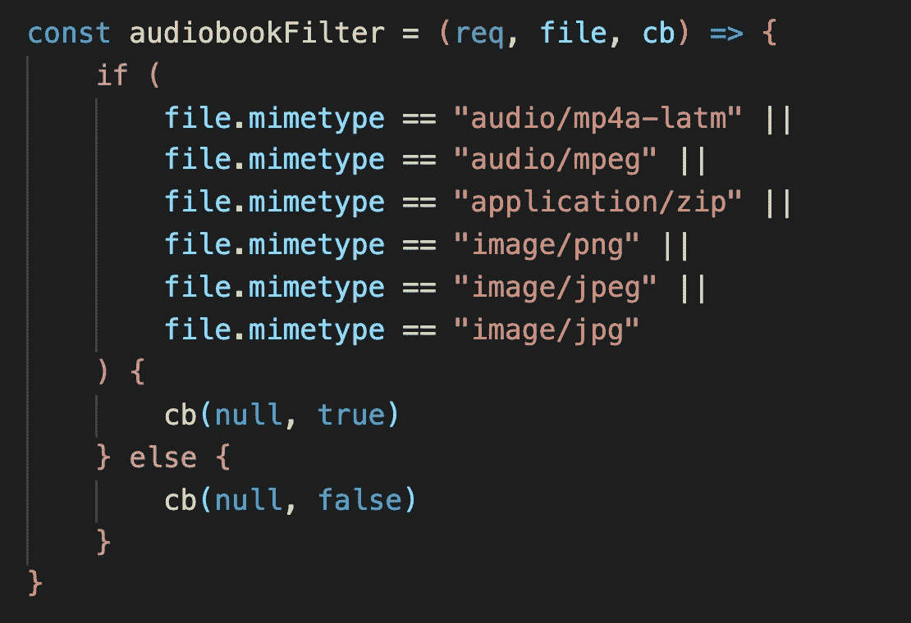
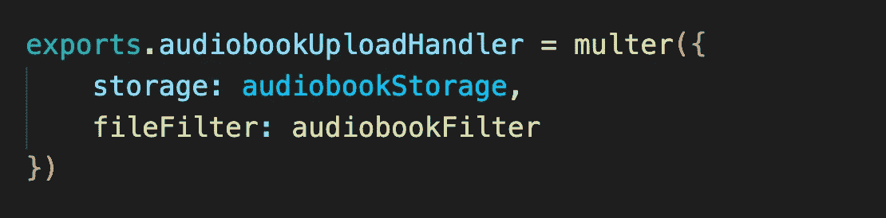
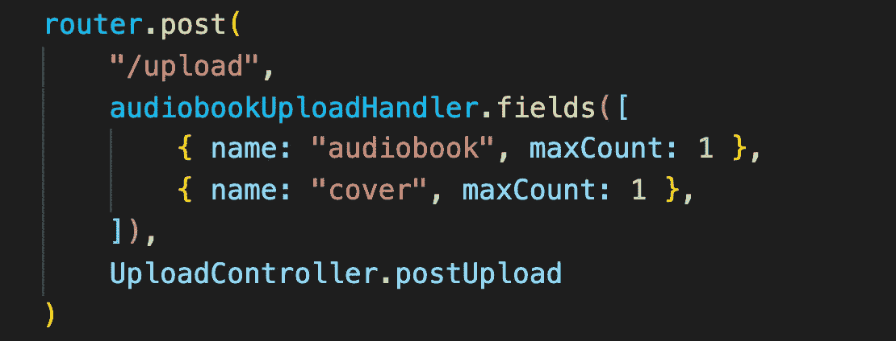

# 使用 Multer 从多个字段上传文件

> 原文：<https://javascript.plainenglish.io/upload-files-from-multiple-fields-using-multer-ee9a28d0f57c?source=collection_archive---------0----------------------->


Photo by [James Harrison](https://unsplash.com/@jstrippa?utm_source=medium&utm_medium=referral) on [Unsplash](https://unsplash.com?utm_source=medium&utm_medium=referral)

所以有一天，我开始了一个小项目，作为对 everything React 和 Node.js 的复习。这个想法是制作某种网络应用程序来免费获得有声读物。为此，我知道我需要将有声读物上传到服务器，以便人们下载。简单吧？至少我知道我的项目在原始水平上会是什么样子，以及我希望它具有的功能。

当我开始制作上传有声读物的页面时——对于管理员，也就是我，我面临着一个挑战:从多个领域上传文件并保存在服务器中，然后将需要保存的内容发送到数据库。使用 multer 上传单个文件非常简单，文档也非常好。

以下是我所做的，我想我会与你们分享，这样下次像我这样的人开始建造一些东西时，他们可以立即找到他们需要的帮助。

如果您想实现从多个字段上传文件，您可以简单地使用下面的代码。

**第一步:安装依赖关系**

```
npm install multer --save
```

步骤 2:通过需要这些模块来导入 express 和 multer。你可以在你的入口点文件中包含(`server.js`或`index.js`)或者创建一个单独的`multer-config.js`。我采取了第二种方法。

`const multer = require("multer")`

步骤 3:为了使用 multer，必须首先配置它。它以一个对象作为选项，包含`storage`和`fileFilter`。

**3.1 定义存储**

```
const storageEngine = multer.diskStorage({destination: (req, file, cb) => { cb(null, “YourStorageFolder”) },filename: (req, file, cb) => { cb(null, file.originalname) }, })
```



Defining the storage option — destination and filename to be used when saving the uploaded file

3.2 定义 fileFilter(如果你需要，但我认为你会):我只允许音频(. mp3，. m4a)，图像(。png，。jpg，。jpeg)和。压缩文件。因此，会检查所有的 MIME 类型。

```
const audiobookFilter = (req, file, cb) => {if ( file.mimetype == "audio/mp4a-latm" || file.mimetype == "audio/mpeg" || file.mimetype == "application/zip" || file.mimetype == "image/png" || file.mimetype == "image/jpeg" || file.mimetype == "image/jpg") {cb(null, true) } else { cb(null, false)}}
```



Defining fileFilter option — which files to upload, based on MIME type of the file.

**第 4 步:最后，创建一个 multer 中间件！**

我将中间件命名为`uploadHandler`,这样我就知道它的确切用途了。你可以用任何你想要的名字。通过上面定义的存储和 fileFilter，我们的中间件就可以用在我们想要的任何路径上了。只有一件事我在这里错过了，这将是我的路线直接照顾。这使得中间件更加灵活，可以用来处理不同的上传场景。

```
exports.uploadHandler = multer({ storage: audiobookStorage, fileFilter: audiobookFilter })
```



Exporting the middleware

**第五步:现在就用！**

当要处理来自单个字段的单个文件、来自单个字段的多个文件以及来自不同字段的单个/多个文件时，该部分会有所不同。对于单个文件/单个字段上传，我们使用

`.single(“field-name-of-type-file”)`

但在这里，我们需要接受不同领域、不同数量的文件。因此我们使用，

`.field([{fieldName: String, maxCount: Int},])`

并传递一个对象数组，该数组包含字段名和可以使用该字段作为参数上传的文件数。

```
const { audiobookUploadHandler } = require("../Utils/multer-config")router.post("/upload", audiobookUploadHandler.fields([
{ name: "audiobook", maxCount: 1 },
{ name: "cover", maxCount: 1 },]), UploadController.postUpload)
```



Using the middleware in the upload route with .fields( ) to allow files from the specified fields to be uploaded.

就这样，一切都结束了。现在，如果您的 UI 中有两个 file 类型的输入字段，您可以通过每个字段上传一个文件，并相应地处理`req.files`。此外，如果一个字段应该是`multi-select`类型，只需将 maxCount 值更改为所需的数字，就可以了。

希望这对你有帮助。谢谢你检查这个。我很感激。

无论你在做什么，我都祝你一切顺利。干杯！

*更多内容看* [***说白了。报名参加我们的***](https://plainenglish.io/) **[***免费周报***](http://newsletter.plainenglish.io/) *。关注我们关于*[***Twitter***](https://twitter.com/inPlainEngHQ)*和*[***LinkedIn***](https://www.linkedin.com/company/inplainenglish/)*。加入我们的* [***社区***](https://discord.gg/GtDtUAvyhW) *。***