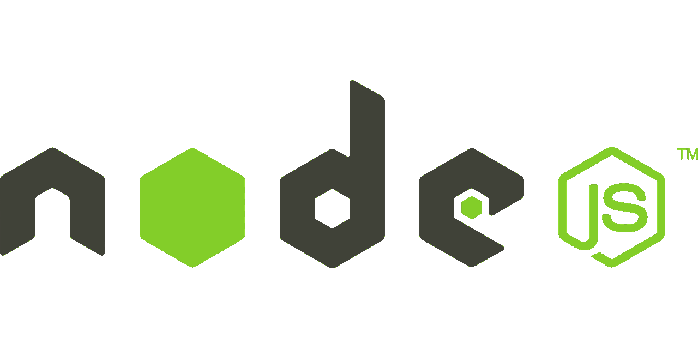
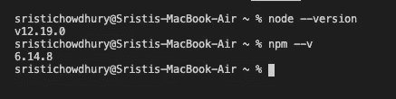
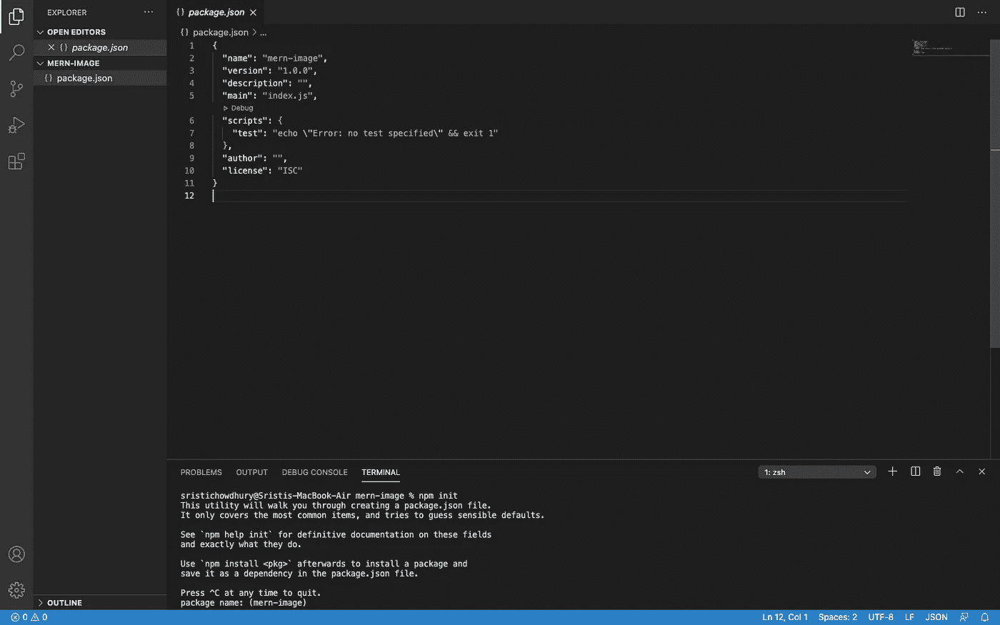
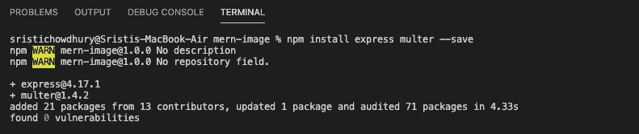
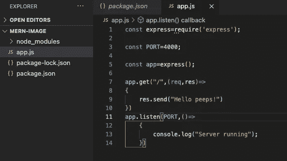
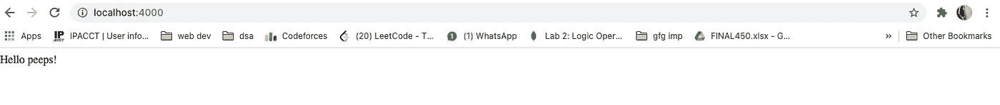
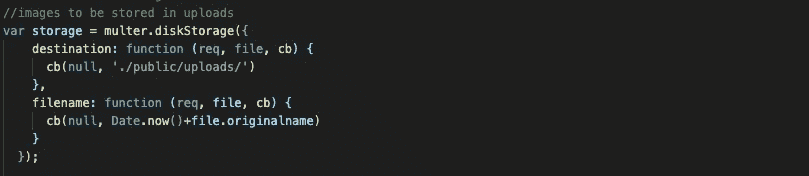
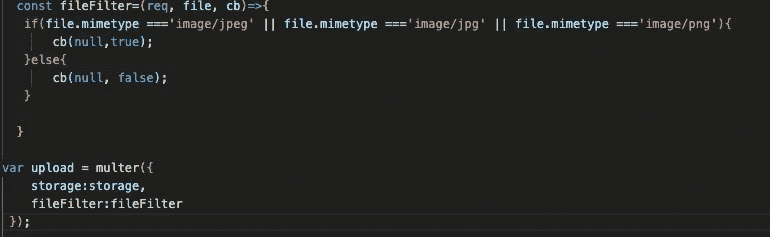
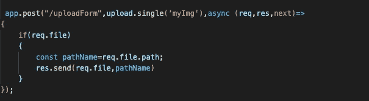
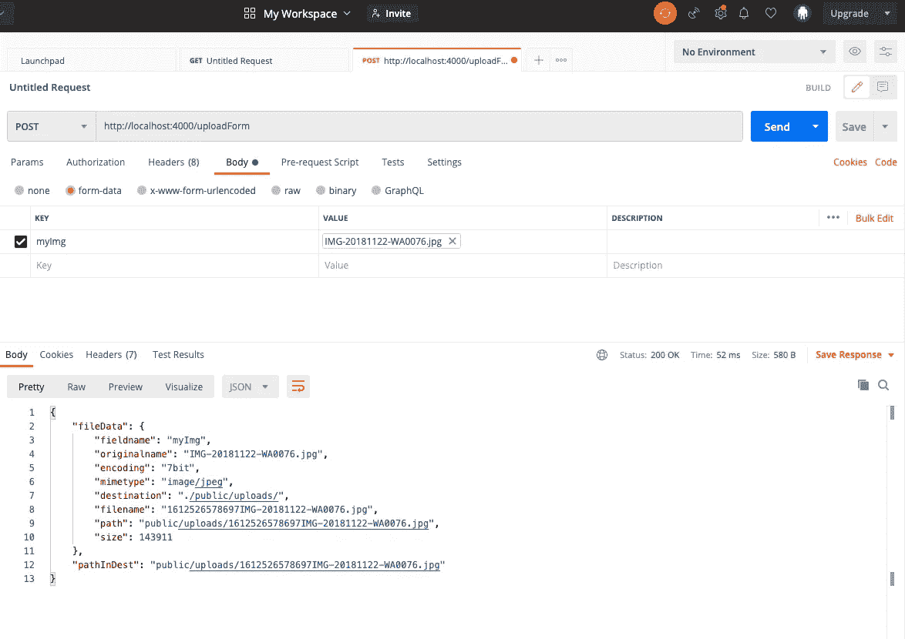

# 在 Node.js 应用程序中上传图像

> 原文：<https://javascript.plainenglish.io/upload-images-in-your-node-app-e05d0423fd4a?source=collection_archive---------1----------------------->



您知道使用 Multer 存储和检索图像非常容易吗？

> " [Multer 是处理`multipart/form-data`的 Node.js](http://expressjs.com/en/resources/middleware/multer.html) 中间件，主要用于上传文件。它写在[勤杂工](https://github.com/mscdex/busboy)的上面，以获得最高效率。”

我构建了一个应用程序，向您展示如何在前端使用 multi 和 Node.js 上传图像。

要在您的本地机器上使用 Node，前往**nodejs.org**和**根据您的操作系统安装它。**

什么是节点程序包管理器(NPM)？NPM 是自动安装到您的本地机器与节点。js。NPM 是世界上最大的注册软件。开源开发者广泛使用它来共享软件。它充当节点 JS 的包管理器。它管理依赖项，依赖项在 package.json 文件中定义。

安装后，使用以下命令检查版本:



现在，让我们开始使用我们的第一个节点应用程序:

在你的机器上创建一个文件夹，用 VS 代码打开它。

你输入 VS 代码后~

**第一步:** *运行* `npm init`

*该命令在您的文件夹中创建一个新的 package.json 文件。*

这是我的文件夹结构现在的样子-



**第二步:** *运行*`npm install express`**在你的终端* ***。****

*这将安装 **node_modules 文件夹并创建一个 package-lock.json 文件**。*

***模块**在**节点。js** 是组织在单个或多个 JavaScript 文件中的简单或复杂的功能，这些文件可以在整个**节点中重用。js** 应用。**节点中的每个**模块**。js** 有它的上下文，所以不能干扰其他**模块**。*

***步骤 3:** 安装依赖项*

**运行命令**

**

***第四步**:创建 app.js*

*打开 app.js 并将以下代码粘贴到那里。*

**

***步骤 5** :使用`node app.js`运行你的服务器端代码*

*打开浏览器，键入 localhost[http://localhost:4000/](http://localhost:4000/)*

*你将会看到 **Hello peeps！屏幕上……瞧！***

**

***步骤 6:** 将 multer 添加到您的应用程序中*

```
*var multer = require(‘multer’);*
```

*让我们为 multer 创建一个目的地来存储图像，并创建一个自定义名称设置器来命名它们。*

***第 7 步:**在第 6 步的代码行下面添加以下代码*

**

*Multer 配有存储引擎`DiskStorage`和`MemoryStorage`。我们将使用如图所示的磁盘存储器。*

*磁盘存储引擎让您可以完全控制在磁盘上存储文件。*

***注意:**如果没有给出`destination`，则使用操作系统默认的临时文件目录。*

*当作为一个功能提供`destination`时，您负责创建目录。当传递一个字符串时，multer 将确保为您创建目录。*

*`Filename`用于确定文件夹内的文件应该命名为什么。如果没有给定`filename`，每个文件将被赋予一个不包含任何文件扩展名的随机名称。*

***注意:** Multer 不会为你附加任何文件扩展名，你的函数应该返回一个带有文件扩展名的文件名。*

***第 8 步:**创建一个名为 public 的新文件夹，并在其中创建另一个文件夹来上传保存您的图像。*

*在这里，我将使用一个函数来控制文件上传，因为我只想要这个应用程序的图像。*

***步骤 9:** 继续将下面的代码粘贴到您的 app.js 中*

**

***文件过滤器**是控制文件上传的功能。*

*只有 ***。jpg，。jpeg、*、T24、**、T26。允许使用 png** 。***

*现在将**存储属性设置为存储**并将 **fileFilter 属性设置为 fileFilter 函数。***

*Multer 支持单次上传和多次上传。`upload.single`用于上传单个文件。*

*如[文档](http://expressjs.com/en/resources/middleware/multer.html)所述~*

> *Multer 将一个`**body**` **对象**和一个`**file**` **或** `**files**` 对象添加到`request`对象中。`body`对象包含表单文本字段的值，`file`或`files`对象包含通过表单上传的文件。*

*在这里，我将只处理一个文件！*

***步骤 10:** 让我们创建端点。*

**

*让我们和**邮递员**核实一下*

*所以，在这里，它工作得很好…我们得到了上传文件夹中的文件名，也得到我们上传的文件的数据。*

**

*试试这个吧！*

*在 Node.js 中使用文件上传的最佳方式…*

*另外，我将把它与一个 **React 客户端**应用程序连接起来。我将很快发布这个故事！*

*参考资料:*

*[](https://www.npmjs.com/package/multer) [## 穆尔特

### Multer 是一个用于处理多部分/表单数据的 node.js 中间件，主要用于上传文件。这是…

www.npmjs.com](https://www.npmjs.com/package/multer) 

这是我的 GitHub 简介！

[](https://github.com/Sristi27) [## srist 27-概述

### 对 Web 开发和机器学习领域感兴趣的编程爱好者。- Sristi27

github.com](https://github.com/Sristi27) 

此应用程序的 Git 存储库:

[](https://github.com/Sristi27/react-img) [## GitHub-srist 27/react-img:用你的 MERN 应用上传和预览图片。

### 使用你的 MERN 应用程序上传和预览图像。在前端用 React 创建，在后端用 Node 创建。这个回购是…

github.com](https://github.com/Sristi27/react-img) 

喜欢的话别忘了给它一颗星！希望你喜欢。

*更多内容看* [***说白了就是***](http://plainenglish.io/) ***。*** *报名参加我们的**[***免费每周简讯这里***](http://newsletter.plainenglish.io/) ***。*****