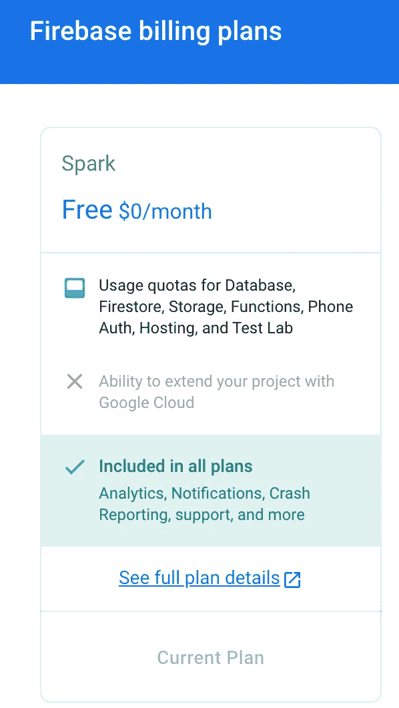
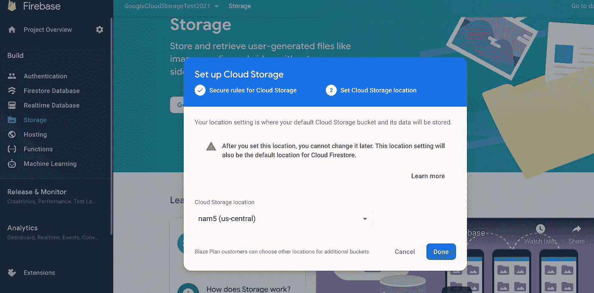
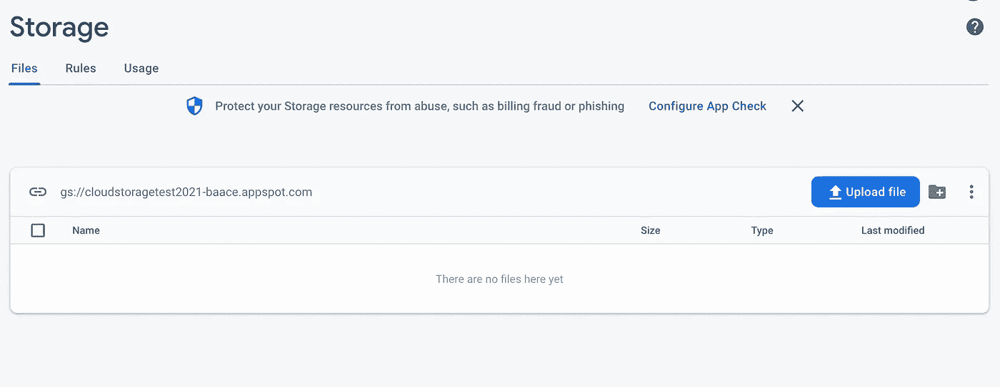
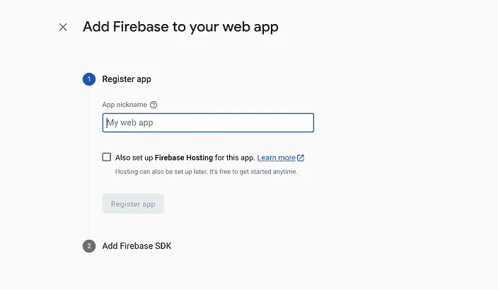
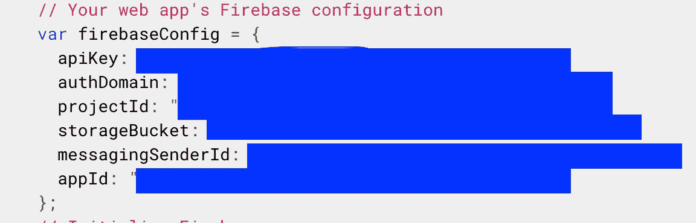

# 上传图像到 Firebase 云存储并返回 URL

> 原文：<https://javascript.plainenglish.io/uploading-an-image-to-firebase-cloud-storage-and-returning-url-with-express-nodejs-713daac7a5d4?source=collection_archive---------0----------------------->

天啊，文档太疯狂了。让我帮你省点时间吧！

让我告诉你，Firebase 文档是很特别的。这看起来简单明了，但实际上，你需要去天涯海角寻找那些微小的东西来让它工作。但是我们开始了。我们开始吧！:-)

# 步骤 1:创建一个谷歌云应用程序


Psst 不要担心帐单。根据星火计划，这些都是免费的。



# 第二步:在 Firebase 的左侧，单击存储并开始。

在指定区域设置新的云存储空间。



一旦你设置好了，它应该是这样的，当然是空的，没有文件。:(



# 步骤 3:导航到“规则”选项卡，并允许公共写访问。

bucket 不允许未经身份验证的用户上传到它，我们可以通过改变规则来改变这一点。

因此，在“规则”选项卡中，将规则更新为以下内容:

```
rules_version = ‘2’;
service firebase.storage {
 match /b/{bucket}/o {
  match /{allPaths=**} {
   // Allow access by all users
   allow read, write;
  }
 }
}
```

# 第四步:注册你的网络应用程序，获取你的 firebase 证书

点击>网络图标开始。



复制这些以备后用。我们会用这些连接到你的火焰基地。不要在您的存储库上共享或发布这些内容。



# 步骤 5:用 Firebase 创建 Node.js Express 应用程序

*   我们将使用 Express 创建一个 Node.js 后端来支持我们的 API
*   您可能需要 Multer(或者一个替代的中间件)从前端的表单数据中获取文件
*   您需要在项目中设置 Firebase 和云存储
*   您将需要在您的项目中安装以下软件包作为依赖项，因此 **npm 安装**这些坏小子:

```
[@google](http://twitter.com/google)-cloud/storage": "^5.8.5",
    "body-parser": "^1.19.0",
    "cors": "^2.8.5",
    "dotenv": "^10.0.0",
    "express": "^4.17.1",
    "express-fileupload": "^1.2.1",
    "firebase": "^8.6.8",
    "firebase-admin": "^9.10.0",
    "multer": "^1.4.2",
    "xhr2": "^0.2.1"
```

对于 Firebase 设置，我们需要从步骤 4 中获取 Firebase 配置。

在一个 **config.js 文件**中，你可以导出 Firebase 配置。从第 4 步中取出 firebase 钥匙，放在这里。更好的方法是从。env 文件(或者您可以直接将它们粘贴到这里——但是如果您在任何地方发布这些文件，这是一个不好的做法..)

```
const {
    API_KEY,
    AUTH_DOMAIN,
    DATABASE_URL,
    PROJECT_ID,
    STORAGE_BUCKET,
    MESSAGING_SENDER_ID,
    APP_ID,
} = process.env;module.exports = {
    firebaseConfig: {
        apiKey: API_KEY,
        authDomain: AUTH_DOMAIN,
        projectId: PROJECT_ID,
        databaseURL: DATABASE_URL,
        storageBucket: STORAGE_BUCKET,
        messagingSenderId: MESSAGING_SENDER_ID,
        appId: APP_ID
    }
}
```

然后我们可以创建一个 **db.js** 文件，用从我们的配置文件导入的配置来初始化我们的 Firebase 应用程序。

```
// Requiring firebase (as our db)
**const firebase = require('firebase');**// Importing our configuration to initialize our app
const config = require('./config');// Creates and initializes a Firebase app instance. Pass options as param
**const db = firebase.initializeApp(config.firebaseConfig);**module.exports = db;
```

现在我们可以在应用程序的其他部分使用 Firebase，就像这样

```
**const firebase = require(‘../db’); // reference to our db**
```

因此，在您的 **index.js** 文件中，让我们用基本配置来配置我们的 express 应用程序，并在我们的 RestAPI 中设置一条路线。

```
'use strict';const express = require('express');
const cors = require('cors');
const imageRoute = require('./routes/image-route');// import our current configuration
const config = require('./config');// set up our app using express
const app = express();// express setup
app.use(express.json());
app.use(cors());
app.use(express.urlencoded({ extended: true }));// routes (for uploading images to storage)
app.use('/api', imageRoute.routes)app.listen(config.port, () => {
console.log ("app is listening on port:", config.port);
})
```

您需要指定上传图像的发布路径。您还需要在您的请求中将 Multer 配置为中间件，以使文件对您可用。

例如，在一个 **image-route.js 文件中:**

```
const express = require('express');
**const multer = require('multer');**const {
 addImage
} = require('../controllers/imagesController');const router = express.**Router**();*// Setting up multer as a middleware to grab photo uploads* **const storage = multer.memoryStorage();
const upload = multer({ storage: storage }).single('file');***// POST - Add Image to Cloud Storage* **router.post('/upload', upload, addImage);**module.exports = { routes: router}
```

然后在您的 **controller.js 文件**中，您将实际更新存储并返回下载 URL，如果成功的话。

*   首先，您需要 firebase 和 Firebase 存储
*   使用 **firebase.storage()创建对存储的引用。ref()**
*   使用文件名创建一个引用(作为预备步骤)
*   您将文件缓冲区上传到该引用中(这实际上将它上传到 google cloud)
*   您使用 **getDownloadURL()获得下载 URL**

```
**const firebase = require('../db');  // reference to our db** const firestore = firebase.firestore(); // if using firestore**require("firebase/storage"); // must be required for this to work****const storage = firebase.storage().ref(); // create a reference to storage****global.XMLHttpRequest = require("xhr2"); // must be used to avoid bug**// Add Image to Storage and return the file path
const addImage = async (req, res) => {
    try {
        // Grab the file
        const file = req.file; // Format the filename
        const timestamp = Date.now();
        const name = file.originalname.split(".")[0];
        const type = file.originalname.split(".")[1];
        const fileName = `${name}_${timestamp}.${type}`; // Step 1\. Create reference for file name in cloud storage 
 **const imageRef = storage.child(fileName);** // Step 2\. Upload the file in the bucket storage
 **const snapshot = await imageRef.put(file.buffer);** // Step 3\. Grab the public url
 **const downloadURL = await snapshot.ref.getDownloadURL();**        
        res.send(downloadURL); }  catch (error) {
        console.log (error)
        res.status(400).send(error.message);
    }
}module.exports = {
    addImage
}
```

这应该就是你所需要的！希望这是有帮助的。如需进一步阅读，请参阅官方文档:

[T3【https://firebase . Google . com/docs/storage/web/upload-files # we B- V8 _ 1](https://firebase.google.com/docs/storage/web/upload-files#web-v8_1)

哦，如果您想知道前端客户端 API 调用会是什么样子，这里有一个使用 Axios 的示例:

```
// Uploads a single photo to the DB, returns imageURL
  const uploadPhoto = async(photo) => {
    const imageUploadAPIUrl = `${process.env.REACT_APP_API_SERVER}/api/upload`
    const formData = new FormData();
    let imageUrl = '';
    formData.append('file', photo);
    try {
      const response = await axios.post(imageUploadAPIUrl, formData);
      imageUrl = response.data;
    } catch(error) {
      console.error (error);
    }
    return imageUrl;
  }
```

*更多内容请看*[***plain English . io***](http://plainenglish.io/)