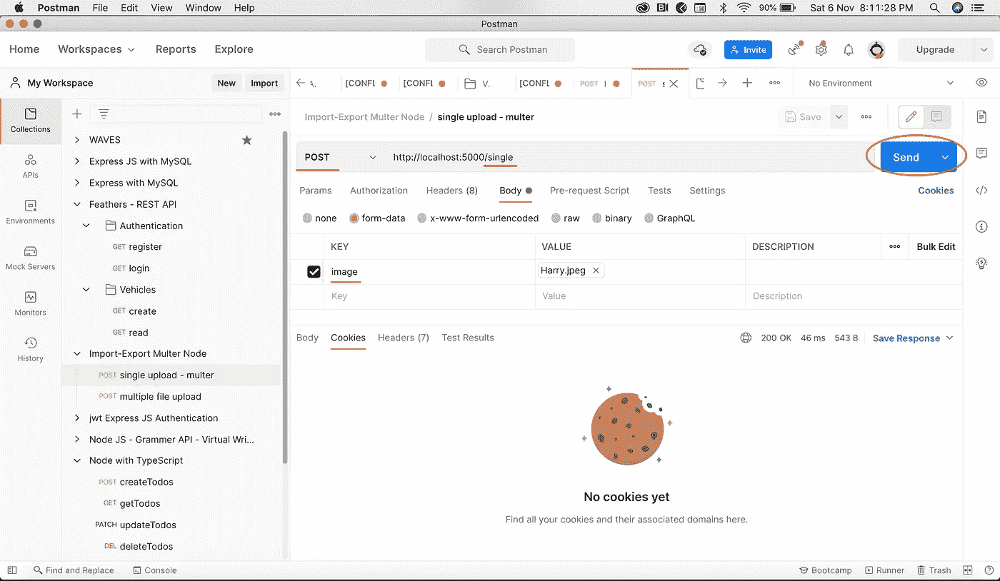

# 如何使用 Multer 上传 Node.js 中的文件

> 原文：<https://javascript.plainenglish.io/uploading-files-in-node-js-using-multer-754526aa6817?source=collection_archive---------0----------------------->


在 Node.js 应用程序中，如果需要将文件上传到服务器，Multer 是一个不错的选择。它可以在任何 JavaScript 后端使用。对于本文，我们将使用 Express。

[Multer](https://www.npmjs.com/package/multer) 是一个 Node.js 中间件，用于处理`multipart/form-data`

# Multer 的使用方法:

使用 Multer 有多种方式:

1.我们将文件直接上传到节点服务器(在服务器中)

2.在数据库中保存文件数据或 base64 数据

3.保存 AWS S3 存储桶以保存和管理文件(使用服务)

在本文中，我们将把文件直接保存到服务器。

# 设置快速应用程序:

→我们需要使用以下命令安装基本快速设置

```
express <your_app_name> --view=ejs
```

→在 express 根目录下运行以下命令安装 Multer:

```
npm i multer
```

步骤 1:创建路线:

我们可以上传单个文件以及多个文件。

```
var express = require("express");
var router = express.Router();const upload = require("../common");/* GET home page. */
router.get("/", function (req, res, next) {
  res.render("index", { title: "Express" });
});// Single file Upload - image key should be passed postmanrouter.post("/single", upload.single("image"), (req, res, next) => {
  console.log(req.file);  // UPLOADED FILE DESCRIPTION RECEIVED
  res.send("uploaded successfully");
});// Multiple files Upload - images key should be passed in postmanrouter.post("/multiple", upload.array("images"), (req, res) => {
  console.log(req.files); // UPLOADED FILE DESCRIPTION RECEIVED
  res.send({
    status: "success",
    message: "Files uploaded successfully",
    data: req.files,
  });
});module.exports = router;
```


**common.js(处理上传功能)**

→这里我们写上传文件的逻辑

```
const multer = require("multer");
var fs = require("fs");var dir = "./public/images/nov";   // PATH TO UPLOAD FILE
if (!fs.existsSync(dir)) {  // CREATE DIRECTORY IF NOT FOUND
  fs.mkdirSync(dir, { recursive: true });
}const fileStorageEngine = multer.diskStorage({
  destination: (req, file, cb) => {
    cb(null, dir);
  },
  filename: (req, file, cb) => {
    cb(null, Date.now() + "-" + file.originalname);
  },
});const upload = multer({ storage: fileStorageEngine });module.exports = upload;
```


→使用以下命令运行节点服务器

```
npm start
```

→我们将使用 Postman 导入文件。你可以按照下面的截图和视频为邮递员

> 路线:[http://localhost:5000/single](http://localhost:5000/single)
> 
> 类型:邮政
> 
> 正文:表单数据，选择关键字作为类型文件的图像



→我们得到保存文件的文件名和路径。现在让我们转到代码库中的以下路径。

→我们已成功上传文件


→现在让我们使用第二条路线进行**多次上传**:

> 路由:[http://localhost:5000/m](http://localhost:5000/single)multiple
> 
> 类型:邮政
> 
> Body: form-data，选择键作为类型文件的**图像**


→我们得到一个带有文件名和路径的图像数组


→让我们检查代码库中的文件


# 视频:

[https://secure . vid yard . com/organizations/1904 214/players/QR 56 rbg 9 fmt qb1 sretx 2 ut？edit = true&npsRecordControl = 1](https://secure.vidyard.com/organizations/1904214/players/EkWR8TTLuNCPL6vnsV6hTU?edit=true&npsRecordControl=1)

# 存储库:

[https://github.com/AmirMustafa/export-to-excel](https://github.com/AmirMustafa/upload_file_nodejs)

# 结束语:

我们已经学习了如何在 Node.js 中直接上传文件。我们还可以在 AWS S3 存储桶中上传文件，以及在数据库中上传 base 64 数据。

> 谢谢你一直坚持到最后🙌。如果你喜欢这篇文章或者学到了新的东西，请点击下面的分享按钮来支持我，让更多的人了解我和/或在 [Twitter](https://twitter.com/amir__mustafa) 上关注我，看看我在那里学到和分享的其他技巧、文章和东西。

[](https://twitter.com/amir__mustafa) [## 关注 Amir Mustafa 的 JavaScript、TypeScript 和 AWS 内容。

### twitter.com](https://twitter.com/amir__mustafa) 

*更多内容尽在*[***plain English . io***](http://plainenglish.io/)