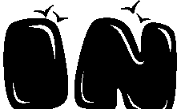

# 什么是 URL 编码？

> 原文：<https://javascript.plainenglish.io/url-encoding-fb8e6ea4a1a4?source=collection_archive---------17----------------------->

 在 我的一篇[上篇](/url-components-and-its-meaning-ececbaf018ba)我讲过什么是 URL。在这篇文章中，我将更进一步，以简单易懂的方式谈论什么是 URL 编码，以及为什么它对 URL 编码如此重要。

Photo by [NASA](https://unsplash.com/@nasa?utm_source=medium&utm_medium=referral) on [Unsplash](https://unsplash.com?utm_source=medium&utm_medium=referral)

URL 被设计成尽可能的有用和可互操作。因此，互联网标准定义了所谓的“不安全字符”。

不安全字符的例子有:
空格" "，因为它们在打印时似乎消失了，或者你不知道空格字符是怎么出现的。
池塘/尖角字符“#”，因为它是为片段保留的(我们已经在这里介绍了什么是[)。
脱字符号“^”，因为并非所有网络设备都能正确传输该字符。](http://pleasefindencoded.blogspot.de/2015/02/post-25-url-components-and-its-meaning.html)

在 [RFC 3986](https://tools.ietf.org/html/rfc3986) 中定义了什么是安全字符，什么是不安全字符。RFC 代表征求意见。这是 IETF(互联网工程任务组)提出的建议。尽管它只是一个正式的建议，但它被认为是一个事实上的标准。

RFC 3986 将安全字符定义为 US-ASCII 中的字母数字字符和一些特殊字符，如冒号“:”和斜杠“/”。

如果你想传输这些不安全的字符之一，那么你必须“百分编码”或也称为“网址编码”他们。例如，如果您想在服务器 foo.com 上存储文件“^hello 世界. txt”，那么有效的 URL 应该是这样的:“http://foo . com/% 5e hello % 20 world . txt”

如您所见，脱字符号“^”和空格“”分别被替换为“%5E”。"%20".百分号“%”后面的字符代表 US-ASCII 字符表中相应的十六进制数，即“5E”和“20”分别代表“^”。" "在 US-ASCII 表中。

完整的 US-ASCII 表可以在[这里](http://en.wikipedia.org/wiki/ASCII)找到。

一旦这些字符作为请求到达服务器，服务器就会通过 URL 解码器对其进行解析。URL 解码器基本上逆转了 URL 编码的过程。因此，您将再次使用脱字符号“^”或空格“”字符，而不是“%5E”或“%20”。

你以前用过网址编码吗？是什么样的项目？你有什么问题吗？在下面评论，让我知道。

你关注或订阅我们了吗？我们每周都会多次发布关于 JavaScript 和软件开发的文章。请确保不要错过我们的任何精彩内容。