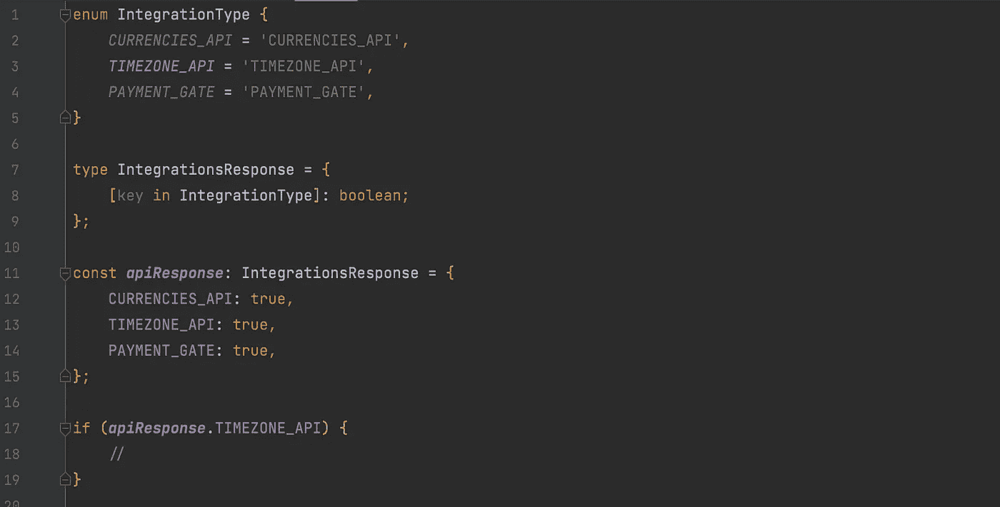

# 如何在 TypeScript 接口和类型中使用枚举键

> 原文：<https://javascript.plainenglish.io/use-enum-keys-in-typescript-interfaces-and-types-4f7e8753b8d9?source=collection_archive---------0----------------------->


Photo by [Arnold Francisca](https://unsplash.com/@clark_fransa?utm_source=medium&utm_medium=referral) on [Unsplash](https://unsplash.com?utm_source=medium&utm_medium=referral)

# 接口中重复的枚举键

让我们假设您已经有了一个集成列表，并存储在一个枚举中:

```
enum IntegrationType *{
    CURRENCIES_API* = '*CURRENCIES_API*', *TIMEZONE_API* = '*TIMEZONE_API*', *PAYMENT_GATE* = '*PAYMENT_GATE*',
*}*
```

您已经有了一些 API，它只返回关于可用集成的布尔信息:

```
*{
*    *CURRENCIES_API: true,
*    *TIMEZONE_API: true,
*    *PAYMENT_GATE: true,* }
```

当然，您可以为该响应编写一个接口，使用您之前在 enum 中声明的键。

```
interface IntegrationsResponse *{
    CURRENCIES_API: boolean;
    TIMEZONE_API: boolean;
    PAYMENT_GATE: boolean;*
*}*
```

但是它们不会被连接。如果 enum 或 API 响应发生了变化，您必须记住在所有地方更新它们。

如果你有**多得多的**集成类型或一些其他的，更*大规模的*数据量呢？如果您想将它们的键存储在 enum 中，以便在其他地方使用它们，您必须将它们添加到 enum 和 API 响应接口中。然后，它们中任何一个发生的任何变化都会导致你重新检查一切，以确保它们仍然相互匹配。

# 有解决的办法！🥷

老实说，这很明显——您只需要在接口中使用枚举键。您可以使用`[key]`语法:

```
const { *CURRENCIES_API, TIMEZONE_API, PAYMENT_GATE* } = IntegrationType;interface IntegrationsResponse *{
    [CURRENCIES_API]: boolean;
    [TIMEZONE_API]: boolean;
    [PAYMENT_GATE]: boolean;*
*}*
```

这很好地完成了任务。但是你猜怎么着——**还有更多**。您可以使用所有的枚举键一次创建一个映射类型，而不是使用 enum 中的每个键来创建接口。你甚至不需要枚举析构。

```
type IntegrationsResponse = *{
    [key in* IntegrationType*]: boolean;*
*}*
```

很整洁，不是吗？



The usage is pretty simple :)

我们在 evonica[中使用了这样一个解决方案，同时获取关于与一些外部服务集成的信息。干净、安全且易于扩展的解决方案。希望，你觉得有用。](https://evionica.com)

*~ Dawid Witulski @ evonica—2021*

*更多内容请看*[***plain English . io***](http://plainenglish.io/)