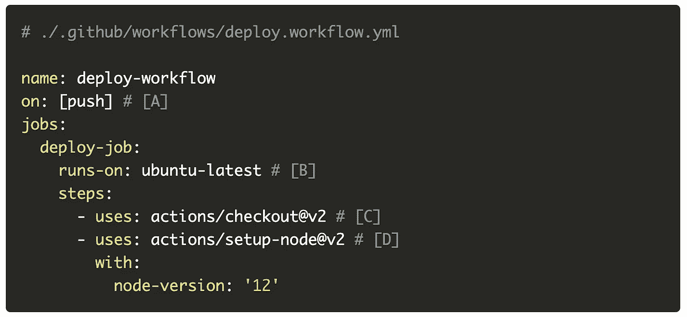
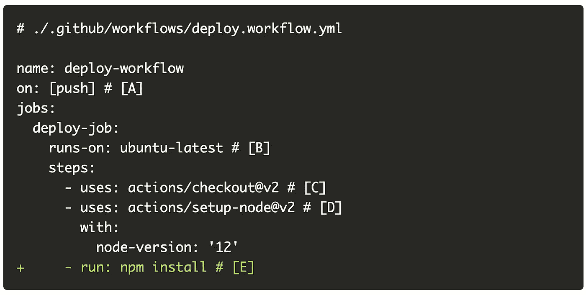
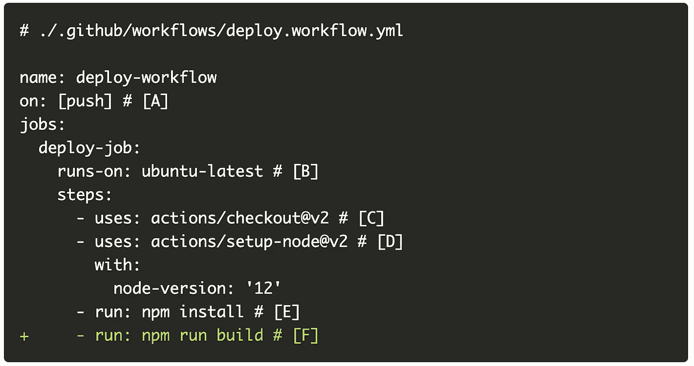
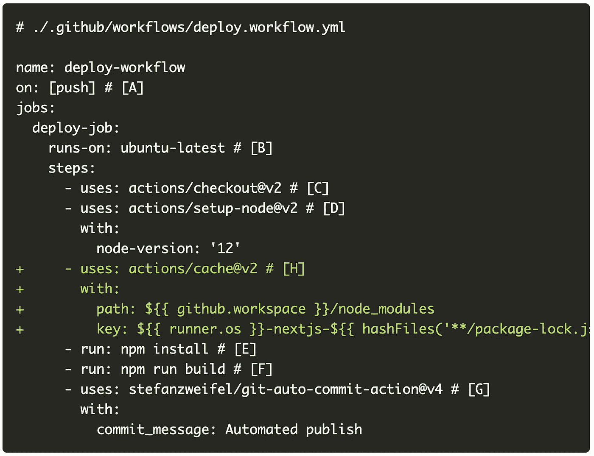
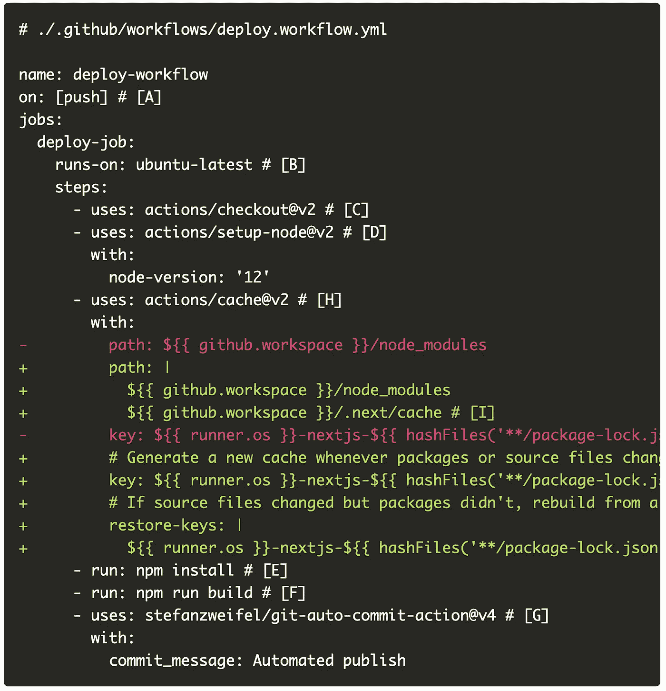

# 使用 GitHub 操作部署 Next.js SSG 站点

> 原文：<https://javascript.plainenglish.io/use-github-actions-to-deploy-a-next-js-ssg-site-412f24c676ee?source=collection_archive---------14----------------------->

## 自动化所有的事情！


Source: [Reddit](https://www.reddit.com/r/ProgrammerHumor/comments/f0ag3i/automation/)

让我们使用 Github 操作为 GitHub 页面上托管的 Next.js SSG 站点创建一个基本的部署管道。

作为参考，这里是本文中使用的代码的 [Github repo](https://github.com/suhanw/suhanw.github.io) 。

# 可选读物

本文将重点介绍如何设置 GitHub 操作，所以我可能会忽略我认为是辅助性的技术细节。如果你感兴趣，这里有一些背景资料:

*   [文档](https://nextjs.org/docs/advanced-features/static-html-export)介绍了如何使用 Next.js 构建 SSG 站点。对于本文，AYNTK 将使用`next build`和`next export`命令来生成静态站点的文件。
*   关于如何在 GitHub 页面上发布静态站点的[文档](https://docs.github.com/en/pages/getting-started-with-github-pages/configuring-a-publishing-source-for-your-github-pages-site)。对于本文，AYNTK 将提交并推送项目根目录下的`docs`文件夹中的构建文件来部署站点。
*   GitHub 动作管道不同组件的[定义](https://docs.github.com/en/actions/learn-github-actions/understanding-github-actions#the-components-of-github-actions)。

# 特种宽银幕电影

让我们创建一个 GitHub 操作管道来自动化以下步骤:

1.  查看 GitHub 回购
2.  设置 Node.js
3.  安装依赖项(如果没有更改，则使用缓存)
4.  为静态站点构建文件(如果没有更改，则使用缓存)
5.  缓存依赖项和源文件
6.  提交构建文件并将其推送到存储库

# 创建工作流

GitHub Actions 使用 YAML 语法来定义事件、作业和步骤。这些 YAML 文件存储在代码库中，在一个名为`.github/workflows`的目录中。因此，让我们创建一个 YAML 文件来定义部署工作流。



上面代码注释的注释:

**【A】**将提交推送到 GitHub repo 是触发工作流的事件。
**【B】**将作业配置为在 GitHub(又名 Runner)托管的全新 Ubuntu Linux 虚拟机上运行。
**【C】**[动作](https://github.com/actions/checkout)检出回购并将代码下载到 Runner 中。
**【D】**[动作](https://github.com/actions/setup-node)在 Runner 中安装 Node.js，并允许我们运行`npm`命令。

接下来，添加在运行器中安装项目依赖项的步骤，其中包括`next`包。



啊，我们的老朋友。

既然已经安装了依赖项，让我们添加构建静态文件的步骤。



**【F】**你问的`build`是什么鬼？这是一个在`package.json`中定义的脚本，它运行:

```
next build && next export -o docs
```

参见[文档](https://nextjs.org/docs/advanced-features/static-html-export)。TL；DR，这些是 Next.js 命令，用于构建 SSG 站点的文件，并将它们导出到`docs`文件夹。

最后，添加提交步骤，并将对`docs`文件夹的更新推送到 repo。


**【G】**这个[动作](https://github.com/marketplace/actions/git-auto-commit)将提交在 Runner 环境中所做的更改，并将提交推送到 GitHub repo。默认提交消息将是“自动发布”。

现在，对回购协议进行修改会自动将我的 SSG 站点部署到 GitHub 页面。🎉

我现在可以在我的 GitHub repo 的[操作选项卡中查看管道了。](https://github.com/suhanw/suhanw.github.io/actions)

# 贮藏

我意识到每次我提交时，作业都会运行一次新的`npm install`。所以让我们引入缓存，这样只有当`package-lock.json`改变时才会进行全新安装。



**【H】**这个[动作](https://github.com/actions/cache)跨构建缓存`node_modules`文件夹，只要`package-lock.json`不变，就让 Runner 使用缓存。

此外，注意到`next build`发出了以下关于缺少缓存的警告。

```
warn  - No build cache found. Please configure build caching for faster rebuilds. Read more: [https://err.sh/next.js/no-cache](https://err.sh/next.js/no-cache)
```

警告链接到[答案](https://nextjs.org/docs/messages/no-cache#github-actions)来修复它。爱死了。



**【I】**next . js 将其缓存存储在`.next/cache`目录中。这将跨版本保持缓存，以便更快地重新构建应用程序。例如，如果我只更新了我的代码库而没有更新依赖项，这避免了重新捆绑依赖项。

部署时间缩短约 30%！🥰

# 阅读更多

*   [将 React SSR 部署到生产中](https://www.suhanwijaya.com/posts/deploy-react-ssr-to-production)
*   [React 服务器端渲染简介](https://www.suhanwijaya.com/posts/intro-to-react-server-side-rendering)
*   [用 React 钩子将数据从 UI 解耦](https://www.suhanwijaya.com/posts/decouple-data-from-ui-with-react-hooks)

📫*我们连线上*[*LinkedIn*](https://www.linkedin.com/in/suhanwijaya/)*或者*[*Twitter*](https://twitter.com/suhanw)*！*

*更多内容请看*[***plain English . io***](http://plainenglish.io/)