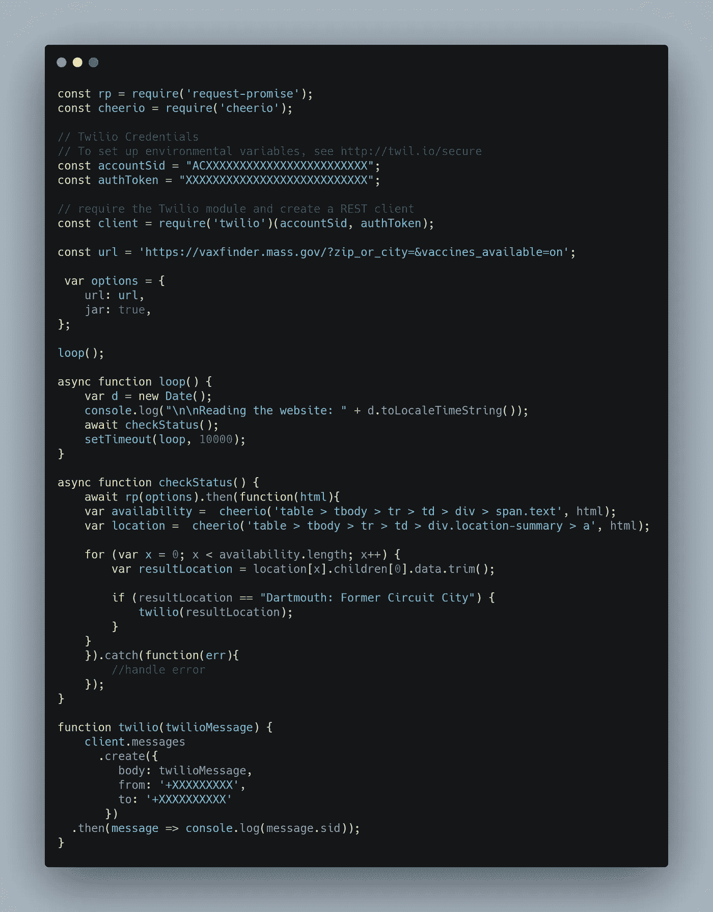

# 使用 Node.js 抓取并发送 Twilio 通知

> 原文：<https://javascript.plainenglish.io/use-node-js-to-scrape-and-send-twilio-notifications-e9c0193adde4?source=collection_archive---------13----------------------->

## 创建您自己定制的 web scraper 和通知服务指南


Photo by [Clay Banks](https://unsplash.com/@claybanks?utm_source=medium&utm_medium=referral) on [Unsplash](https://unsplash.com?utm_source=medium&utm_medium=referral)

# 目的

你是否讨厌刷新一个网页一百次才能看到某个产品是否有货？

如果你有一个程序能在你的产品上市时通知你，那不是很好吗？

更重要的是，如果**你**自己编程定制程序**自己** *岂不是很棒？*

嗯，这是给你的指南。您将学习如何:

*   使用 **Node.js** 编写一个 web 应用程序来抓取你想要的网站。
*   使用 **Cheerio 在 HTML 中扫描您想要的商品。**
*   最后，配置您自己的 **Twilio** 账户，以便在您的产品上市时接收通知。

我们开始吧！

# 设置

首先，你需要安装 Node.js，可以在他们的网站上[下载](https://nodejs.org/en/download/)。

接下来，您需要运行 web scraper 所需的三个主要包。它们是:

*   [请求-承诺](https://www.npmjs.com/package/request-promise)
*   [再见](https://www.npmjs.com/package/cheerio)
*   [Twilio](https://www.npmjs.com/package/twilio)

假设已经安装了 Node.js，运行这个命令一次性安装所有必需的包。

```
npm install request-promise cheerio twilio
```

# 决定你想刮哪个网站

对于本教程，我决定刮马萨诸塞州疫苗网站。他们的网址是:[https://vaxfinder.mass.gov/邮政编码 _or_city= &疫苗 _ 可用=在](https://vaxfinder.mass.gov/?zip_or_city=&vaccines_available=on)

我决定选择每 10 秒钟抓取一次网站，看看什么时候有疫苗网站可用，而不是刷新可用疫苗的网页。

# 把所有的放在一起

现在你已经安装了包，并且决定了要抓取哪个网站，让我们开始编程吧。

# 创建您的 JS 文件

打开您的文本编辑器，创建一个名为 ***scaper.js*** 的新文件(或任何其他名称)。

# 包括适当的包

接下来，导入 3 个必需的包。

# 定义你想点击的网址

像这样设置你的 URL 来调用适当的网站。

> ***注意:*** *以防你得到可怕的****" maxlistenerseceded warning:可能检测到 EventEmitter 内存泄漏。向[请求]添加了 11 个管道侦听器。使用 emitter.setMaxListeners()增加 limit"*** *，需要设置你的选项包含 jar 并设置为****true****。这里详细解释了*[](https://github.com/request/request/issues/1809)**。**

# *配置您的 Twilio 帐户*

*对于这一部分，如果您还没有 Twilio 帐户，您需要注册一个。这很容易做到，你可以注册一个免费层，免费使用 15 美元。对于这个练习来说已经足够了。*

*在您的 Twilio 设置中，找到您的 **accountSid** 和 **authToken，**并记录下来。*

*你也可以看看 Twilio [提供的](https://www.twilio.com/docs/libraries/node)解释整个过程的很棒的教程。*

# *创建您的循环()*

*接下来，您需要创建一个异步函数，它将在主循环被调用时被触发。因为您将每 10 秒钟调用一次网站，所以将超时设置为 10，000 毫秒。*

*在本例中，我决定记录控制台中发生的事情，并显示时间戳，只是为了调试目的。*

*接下来，您将实现 **checkStatus()** 。*

# *实现 checkStatus()*

*这是代码的核心。checkStatus()所做的是调用所需的 URL。在 URL 被调用并且包含 HTML 的响应被返回之后，您将使用 **Cheerio** 扫描返回的 HTML。参考他们的[网站](https://www.npmjs.com/package/cheerio)获取文档。*

*你应该在 HTML 中寻找什么？嗯，那要看你刮的是什么了。*

*在我的例子中，我正在寻找一个“达特茅斯:前电路城”的实例。如果有这样的匹配，我将调用 **twilio()** 函数，它将通过文本通知我。*

*接下来您将实现 **twilio()** 。*

# *实现 twilio()*

*您需要配置 **twilio()** 函数，以便它接受一个 ***主体*** ， ***从*** ，以及 ***到*** 参数。这很简单，但是如果您需要进一步的说明，请根据需要参考他们的文档。*

# ***运行您的应用***

*要运行该应用程序，只需键入:*

```
*node **testing.js***
```

*如果一切配置正确，您将看到应用程序运行，并每 10 秒钟在控制台中记录一次结果。恭喜你！*

# *结论*

*现在你知道了。你现在有了一个 web scraper 的工作示例，它不仅每 10 秒钟抓取一次你想要的网站，还会给你发送一个定制的通知。*

*干杯！*

**更多内容看*[***plain English . io***](https://plainenglish.io/)*

**

*Final completed code to run the scraper and notification service*