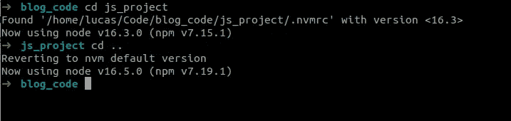
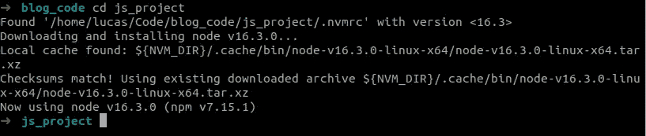
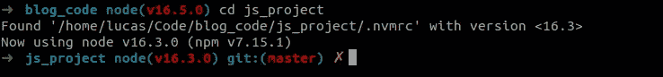

# 使用 nvm 实现多项目成功

> 原文：<https://javascript.plainenglish.io/use-nvm-for-multi-project-success-a93e8abd1306?source=collection_archive---------6----------------------->

## 如何为 Node.js 设置开发环境，以控制 Node.js 版本

Photo by [James Harrison](https://unsplash.com/@jstrippa?utm_source=medium&utm_medium=referral) on [Unsplash](https://unsplash.com?utm_source=medium&utm_medium=referral)

在我的职业生涯中，我有幸与一些非常聪明的工程师一起工作并向他们学习。他们的一个共同特点是，即使在管理多个项目时，他们都知道如何管理不同的环境。而且他们在日常工作流程中的开销几乎为零。那么，我们如何设置我们的工具来照顾项目环境，并清理我们的头脑来关注实际的编码呢？

作为起点，我们在本地机器上有几个 Node.js 项目，它们都是 git 存储库。我假设您熟悉 bash 或 zsh 这样的 shell，并且您将在 Linux 或 Mac 上工作。我没有使用 Windows 的经验，但同样的原则也适用。

对于任何节点项目，都有两种依赖关系需要考虑:项目期望的节点版本，以及所有必需节点模块的列表。为了管理第一个模块，我们将使用`nvm`和模块`npm`。本文集中讨论前者，因为`npm`在处理后者方面已经做得很好了。

# 使用 nvm 管理 Node.js 版本

要在笔记本电脑上运行任何 JavaScript，你需要一个运行时环境来执行你的代码，而 [Node.js](https://nodejs.org/en/) 是目前最流行的。您可以将它安装在您的开发机器上，这样您的第一个节点项目，甚至第二个节点项目都可以正常运行。但是，如果您想在第三个版本中使用较新版本的 node，或者您正在处理一个需要旧版本的现有项目，您该怎么办？您是否更新以前的项目以使用新版本，或者您是否接受您可能无法再运行旧项目？

我们希望每个项目都有一个全球版本，而不是一个。这里`[nvm](https://github.com/nvm-sh/nvm)`来救援了。`nvm`代表节点版本管理器，具体做法是:你先安装`nvm`(这里的说明是)，然后用它来安装你需要的节点版本。确保当你安装`nvm,`时，它会添加一个代码片段到你的`~/.bashrc`(或者等效的文件)中。如果没有，您可能需要手动执行此操作，并重启您的 shell 来使用它。

这里列出了最有用的`nvm`命令。

现在我们可以安装我们需要的所有版本，并根据需要在它们之间切换。不幸的是，我们必须记住哪个项目需要什么版本。但我承诺零开销，所以我们可以做得更好。

# 自动切换节点版本

如果我们不想记住我们为哪个项目使用哪个节点版本，我们必须将它存储在某个地方。为此，我们为每个项目创建`.nvmrc`文件，例如通过运行`echo "v16.3" > .nvmrc`。这个文件应该被签入到版本控制中，并且在协作项目中，它可能已经存在。现在我们可以运行`nvm use`，它将从这个文件中获得正确的版本。

更好的是，`nvm` README 提供了代码片段，供您添加到您的`~/.bashrc`(或等效物)中，在进入目录时，将检查是否有`.nvmrc`文件并切换到该版本。当您离开目录时，它也会切换回来。

nvm switching node version when you cd into a project with a .nvmrc file

如果没有安装节点版本，它会帮你安装！

nvm installing a node version when not present

现在我们知道了:当我们在不同的项目之间切换时，我们自动切换到项目需要的正确的 Node.js 版本，零操作开销。

# 蛋糕上的视觉樱桃

我使用带有 oh-my-zsh 的 zsh 作为 shell，它有很多不错的特性，比如显示当前的 git 分支。所以下一步也是最后一步就是:它还能显示当前的节点版本吗？答案是肯定的，可以！有几种方法可以做到这一点，这取决于您希望您的 shell 看起来是什么样子。

*   [https://gist . github . com/Lucas-sonna bend/FDA 98 ed 191 c 69 BC 44 e 811 D1 B4 aeb 0 DCA](https://gist.github.com/lucas-sonnabend/fda98ed191c69bc44e811d1b4aeb0dca)
*   [https://github.com/ohmyzsh/ohmyzsh/wiki/Themes#bureau](https://github.com/ohmyzsh/ohmyzsh/wiki/Themes#bureau)
*   [https://www.npmjs.com/package/pure-prompt-nvm](https://www.npmjs.com/package/pure-prompt-nvm)

我选择了第一个选项，这是最终的外观:

# 替代品怎么样？

另一种方法是[将你的申请](https://nodejs.org/en/docs/guides/nodejs-docker-webapp/)归档。在 docker 文件中定义节点版本，并在 docker 容器中运行应用程序和任何测试。如果您将应用程序部署为 docker 容器，这很有用，但会增加一些开销。在 Mac 上有一个性能开销，我发现在 docker 中运行测试和林挺有点烦人。

编辑:文章发表后有人提到了 [Volta](https://volta.sh/) ，它的工作原理非常类似于 nvm，但是是用 rust 编写的。我自己没有试过，但它保证很快，并且可以跨操作系统工作，包括 Windows。

# 最后的想法

理解和使用`nvm`会让你变成 [10x 开发者](https://medium.com/ingeniouslysimple/the-origins-of-the-10x-developer-2e0177ecef60)吗？很可能不是。但是它会带你向它迈一小步，因为它会自动执行一些小步骤，并且，在一些初始设置之后，解放你的思想，永远不再想这个问题。

在开始，我谈到了聪明的工程师使用这种设置。我想到的人不一定是 JavaScript 或节点开发人员。一旦你环顾四周，你会发现这个问题以不同的方式存在:使用 [pyenv](https://github.com/pyenv/pyenv) 管理 python 版本，使用[dotenv](https://github.com/ohmyzsh/ohmyzsh/tree/master/plugins/dotenv)/[direnv](https://github.com/ohmyzsh/ohmyzsh/tree/master/plugins/direnv)管理环境变量，或者使用 [tfswitch](https://tfswitch.warrensbox.com/) 管理 terraform。当然，伟大的软件工程师会发现这种模式:)

*更多内容请看*[***plain English . io***](http://plainenglish.io)