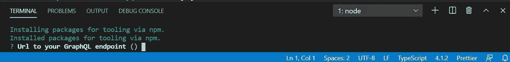
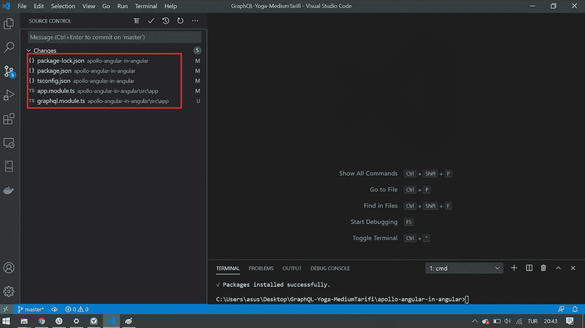
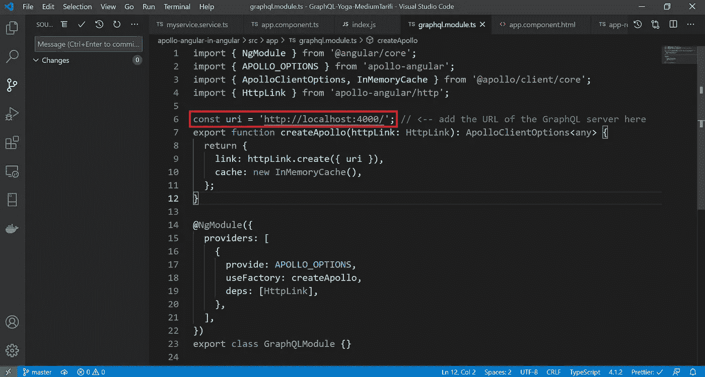
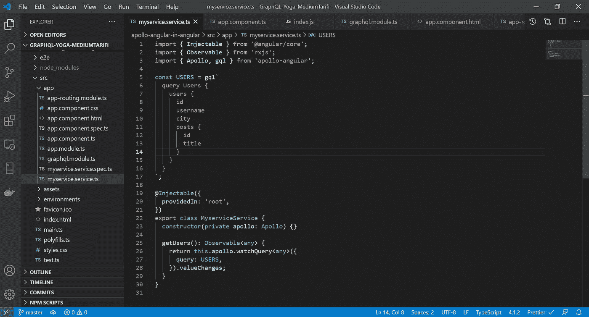
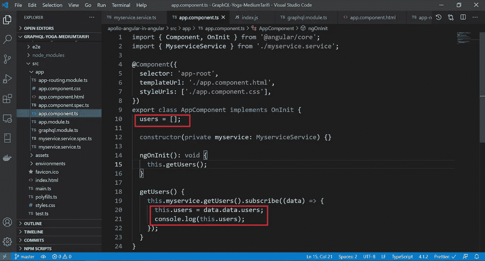
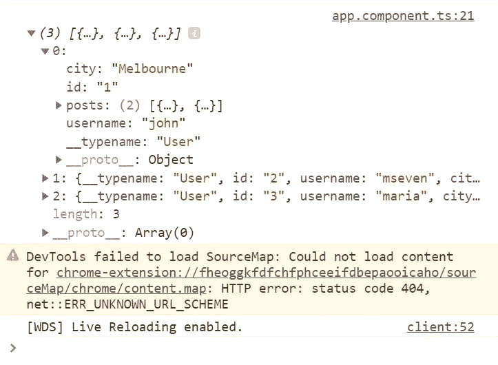

# 如何配合 Angular 使用 Apollo GraphQL

> 原文：<https://javascript.plainenglish.io/use-of-apollo-angular-with-angular-522bcebf7bc8?source=collection_archive---------4----------------------->


**Apollo-Angular** 是一个灵活的 *GraphQL* 客户端，你可以使用它从前端客户端项目或本地平台向使用 *GraphQL* 构建的服务器发送查询。我们也可以说，它是一种能够在我们的客户端项目和 *GraphQL* 服务器之间传输信息的结构。

在本文中，我将谈谈*阿波罗 Angular* 在 *Angular* 项目中的安装、结构和使用。

我将解释它们，假设你熟悉 *Angular* 和 *GraphQL* 结构，并且熟悉使用 *Visual Studio 代码*。

作为前端，我更喜欢*棱角* ( *棱角 11)* 。不过 *Apollo Angular* 可以用在其他 JavaScript 框架和原生平台上。

作为服务器，我将使用我之前在 *Node.js* 中创建的 *GraphQL* -server。你可以从[这个链接](https://azizkale.medium.com/building-graphql-server-with-node-js-c31ee3f54761)访问关于这个服务器的设置和机制的文章，如果你愿意，你可以从[这个 github 链接](https://github.com/azizkale/Web-Server-in-NodeJS-with-GraphQL)下载服务器代码作为一个项目。

让我们首先创建一个*角度*项目。

```
ng new apollo-angular-in-angular
```

稍后，我创建一个名为`*myservice*`的*服务*，在这里我将定义向服务器发送查询的函数。

```
ng g s myservice
```

## 将 Apollo Angular 加入项目

用**角度示意图**很容易设置。为此，在命令提示符或终端中导航到项目目录*Apollo-angular-in-angular*，并编写以下命令。

```
ng add apollo-angular
```

安装将自动完成。在安装过程中，它会询问您要连接的服务器的 URL。



因为我在本地运行服务器，所以我输入 **http: // localhost: 4000 /** 。众所周知，4000 是 *GraphQL* 的默认端口。

通过此设置，*阿波罗角度*作为**独立模块**添加到项目中。这个文件可以在 */src/app/下找到。*在 VS 代码的源代码控制标签中，你可以看到安装时添加了哪些文件和依赖项。



我们在安装过程中输入的服务器 URL 在 **graphql.module.ts** 文件中。需要时，您可以手动更改该文件的 URL。



您也可以使用 **npm 安装**手动安装，无需*角度示意图*。但我不想在这里提及，以免文章拉长。你可以在它的[官方网站](https://apollo-angular.com/docs/get-started/#installation-without-angular-schematics)获得关于这个的进一步信息。

## Angular Apollo 中的查询函数

查询函数是在 *GraphQL* 中*解析器*下定义的函数，对应*C****R****UD 运算*的 **R** ead】。

我将名为 *Apollo* 的包包含到名为 **myservice.service.ts** 的*服务*文件中，并将*注入到*构造器*中。然后我写下下图中的代码。*



由于我们将在 *Angular* 侧使用的函数，其参数和类型已在 *GraphQL* 服务器上预先指定，因此除了该函数，我们不能使用任何其他 API。

名为 **USERS** 的变量是函数 **users** 的模式，该模式在 *GraphQL* 中*解析器*下定义。因为它是一个查询函数，我们用一个**查询**关键字创建了它的模式。这个功能是一个带给所有用户的功能。我们可以随意调用或不调用函数的字段。

**gql** 是一个标签，它将客户端的函数模式解析成 *GraphQL* 文档。

在 *getUser* 函数中，我们用 **watchQuery** 方法调用数据。该方法返回一个 **QueryRef** 对象，该对象的 **valueChange** 属性是一个**可观察的**。

*GraphQL* 中查询函数返回的结果也可以用**调用。查询**方法而不是**。watchQuery** 方法。**。查询**方法只调用一次数据。但是这个**。例如，如果另一个查询导致对象在 Apollo 客户端的全局缓存中更新，那么 watchQuery** observable 也可以更新。

现在让我们将我们调用到客户端的数据作为***my service . service . ts***文件中的 *Observable* 分配到***app . component . ts***文件中的数组中。



Note that we need to write data.data.users to access the array in the object that returned from the server. Here users is the name of the Query function in GraphQL. It has nothing to do with the array’s name in the component.

在组件中，我们得到了数据，这些数据在*服务*中被称为可观察的，我们订阅了这些数据，并将其分配给一个*数组*。同样，为了不拉长文章，我将数据带到组件并在控制台上观察结果。我不编辑 app.component.html 文件**。为此，我在 **app-routing.module.ts** 文件中将 **AppComponent** 设为默认值。这样，每次我更新在 **http://localhost: 4200** 运行的 *Angular* 项目的网页时，我都能在控制台上看到结果。**



## Apollo Angular 中带参数的函数

现在，我们将向服务器发送一个查询，其中包含一个需要参数的函数。在服务器上定义的名为 **user** 的函数，根据用户的 id 调用用户，适合于此。首先，让我们在***my service . service . ts***中定义它的模式，并将其赋给一个变量:

```
const USER = gql`
  query User($id: ID!) {
    user(id: $id) {
      id
      username
      city
      posts {
        id
        title
      }
    }
  }
`;
```

既然是查询，我们再次使用了**查询**关键字。与另一个不同，我们看到这个模式中有参数。首先写参数的类型，然后(在最后一行)写它们自己。

现在让我们编写用这个模式构建函数:

```
getUser(id: any): Observable<any> {
  return this.apollo.watchQuery<any>({
    query: USER,
    variables: {
      id: id,
    },
  }).valueChanges;
}
```

与前面的函数不同，这个函数也有一个参数。另一个不同是**变量**对象。我们将这个对象的参数发送给服务器。

让我们将我们调用给*服务*的数据赋给***app . component . t****s*中的一个变量:

```
getUser(id: any) {
  this.myservice.getUser(id).subscribe((data) => {
    this.user = data.data.user;
    console.log(this.user);
  });
}
```

我将来自*服务*的数据分配给我在*组件*中定义的用户变量。因为我没有使用接口来触发函数，所以我将它们写入 **ngOnInit()** 。在这里，我给出了参数所需的值。我再次观察控制台上的结果。在最后一种情况下， **ngOnInit()** 应该是这样的:

```
ngOnInit(): void {
  this.getUsers();
  this.getUser(1); // it gets the user whose id equals 1
}
```

## 角阿波罗中的变异函数

*创建*、*更新*和*删除*功能 **CRUD** 在*graph QL*中的*突变*类型中定义。让我们看看如何从*角度*侧发送这种类型的查询。我就举一个*创造*的例子。

首先，我在***my service . service . t****s*文件中定义了模式和函数:

架构:

```
const ADD_USER = gql`
  mutation addUser($id: ID!, $username: String!, $city: String!) {
    addUser(id: $id, username: $username, city: $city) {
     id
     username
     city
   }
  }
`;
```

功能:

```
addUser(id: any, username: string, city: string): Observable<any> {
  return this.apollo.mutate({
    mutation: ADD_USER,
    variables: {
      id: id,
      username: username,
      city: city,
    },
  });
}
```

现在，我转到 *app.component.ts，然后*调用服务中的函数:

```
addUser(id: any, username: string, city: string) {
  this.myservice.addUser(id, username, city).subscribe((data) => {
    console.log(data.data.addUser);
  });
}
```

为了触发该函数，我再次将其写入 **ngOnInit()** ，并在此处输入该函数的参数值:

```
ngOnInit(): void {
  this.getUsers();
  this.getUser(1);
  this.addUser(5, 'aziz kale', 'ankara');
}
```

当您运行该函数时，它将返回添加的用户。您也可以在控制台上看到这一点。

## 包扎

我们看到了如何从使用**的 **Angular** 向使用 **GraphQL** 构建的服务器发送查询。我们已经完成了两个带参数和不带参数的**查询**函数示例和一个**变异**函数示例。**