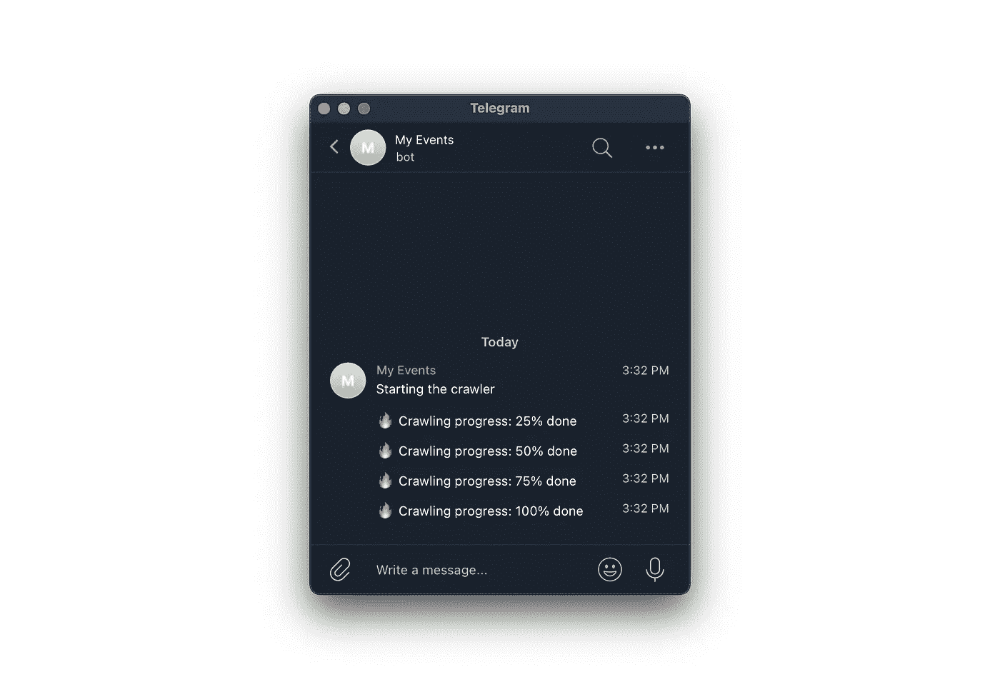
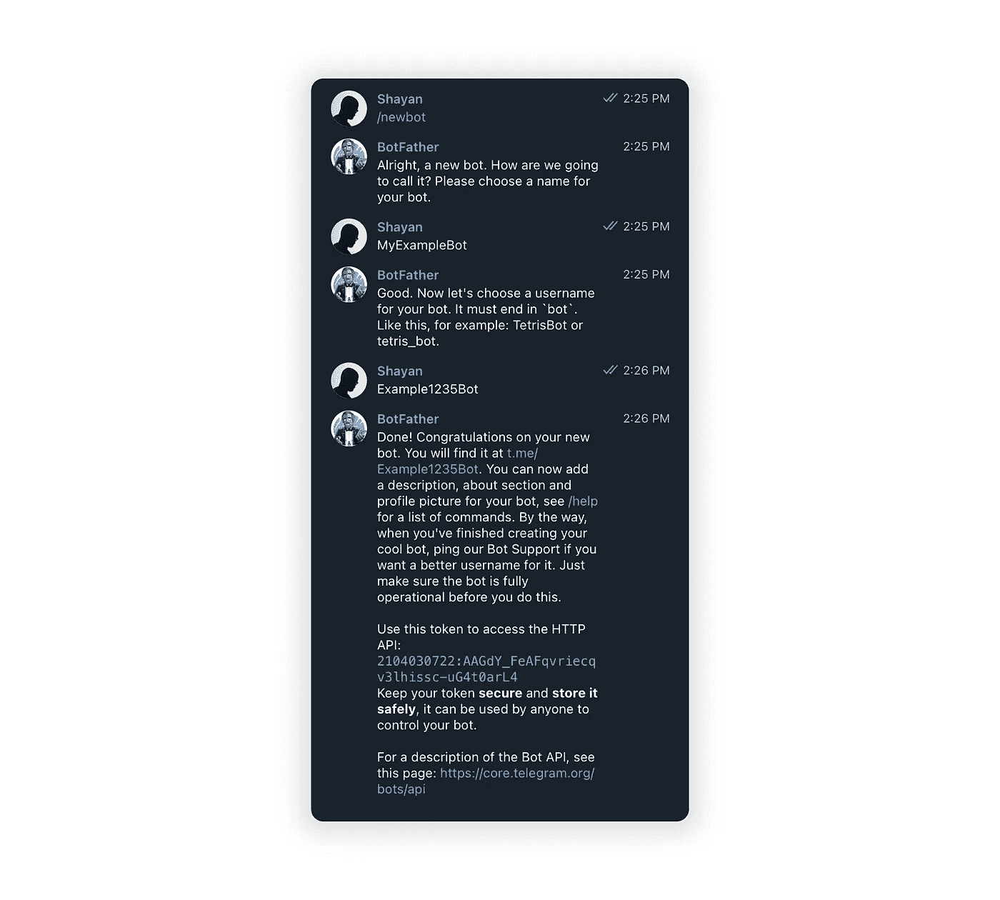
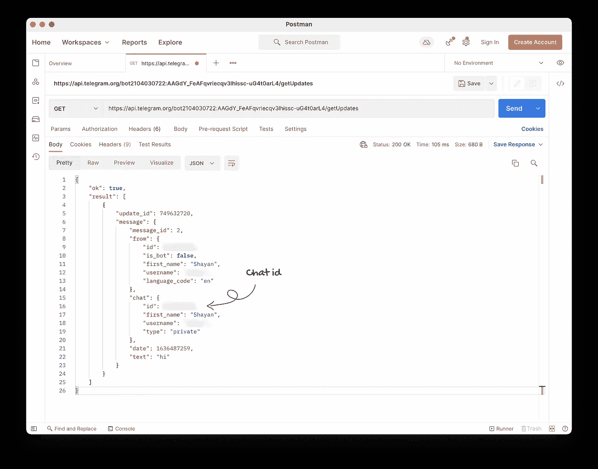
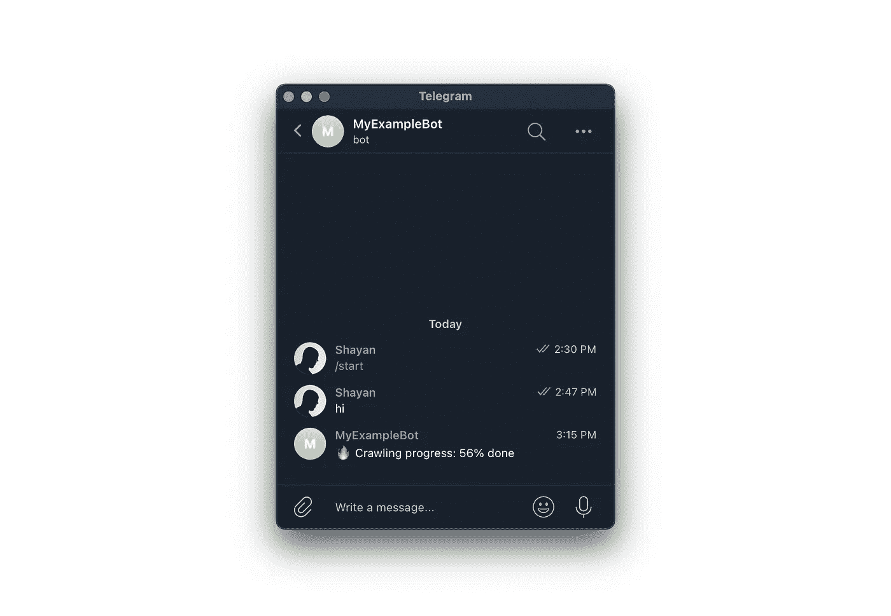
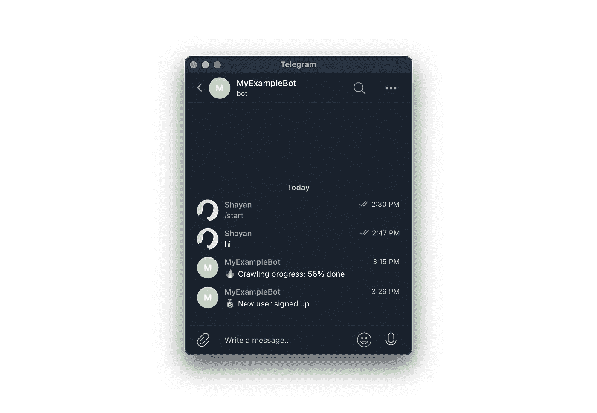

# 使用 Python 或 JavaScript 通过它们的 Chatbot API 将您的事件和日志发送到 Telegram

> 原文：<https://javascript.plainenglish.io/use-python-or-javascript-to-send-your-events-and-logs-to-telegram-via-their-chatbot-api-57f407f2c7e3?source=collection_archive---------6----------------------->



在我看来，Telegram 拥有最好的聊天机器人 API。他们所创造的东西非常容易使用，但却有着难以置信的强大功能。多年来，我已经用它做了几十个小项目。他们 API 的一个突出用例是从我的应用程序和项目中给我自己发送事件和日志。

考虑这个例子；你正在开发一个新项目，你可能需要抓取成百上千的网页或任何其他类似的长期运行的任务。您可以将这个脚本部署到一个 VM，或者您的机器上，让它运行一两天。但是，你通常如何检查进度？您是否通过 ssh 连接到虚拟机，找到正确的 tmux 会话，并读取日志？如果你想离开家，没有电脑怎么办？嗯，这是那些让我思考的情况之一…“嗯，如果我可以使用电报作为远程输出呢？”我的意思是，API 非常非常容易使用，我所需要做的就是向他们的端点发出 HTTP 请求，为什么不呢？

这只是我发现将事件推给自己很方便的几十个例子之一，从那以后，我在许多不同的项目中使用它来更新自己的用户行为、产品销售甚至股票价格。所以在这篇博文中，我将讲述如何设置你的第一个聊天机器人，以及如何通过 Python 或 JavaScript 向你自己发送事件:)

## 注册一个电报聊天机器人。

好的，第一步是在 Telegram 上给 [@botfather](https://t.me/botfather) 发消息，创建你的第一个聊天机器人！这个过程非常简单，你可以在下面的截图中看到。



让我们复制 API 令牌并将其添加到我们的环境变量中。当然，您可以跳过这个过程，直接将其添加到您的代码中。此外，确保这个令牌是私有的！写完这篇文章后，我将撤销我的。

```
export BOT_TOKEN=2104030722:AAGdY_FeAFqvriecqv3lhissc-uG4t0arL4
```

## 查找您的电报聊天 Id

好了，在动手编写代码之前，我们还有一步要做。谢天谢地，这个很简单，我们必须在 Telegram 中找到我们的 **chat_id** ，有多种方法可以找到它。我将使用聊天机器人 API 来找出我的**聊天 id** 。

所以，打开我们刚刚创建的聊天机器人，给它发送消息；什么都有可能。然后，使用您的浏览器或邮递员，用您的 API 令牌向以下 URL 发出 get 请求，它应该会告诉您您的 **chat_id** 。

```
// template
[https://api.telegram.org/bot](https://api.telegram.org/bot)<BOT_TOKEN>/getUpdates// how mine looks like with my bot token
[https://api.telegram.org/bot2104030722:AAGdY_FeAFqvriecqv3lhissc-uG4t0arL4/getUpdates](https://api.telegram.org/bot2104030722:AAGdY_FeAFqvriecqv3lhissc-uG4t0arL4/getUpdates)
```



正如你在截图中看到的，你可以通过下面的路径**result[]message . chat . id**看到你的 **chat_id** 。复制并再次将其添加到您的环境变量中，或者直接粘贴到代码中。

```
export CHAT_ID=<MY_CHAT_ID>
```

好了，这就是我们对 Telegram 所做的全部工作。让我们写一些代码。在这篇文章中，我将提供一个 Python 和 JavaScript 的例子，所以可以随意跳到你喜欢的那一个。

## 通过 Python 发布事件

首先，让我们访问我们的环境变量并将它们赋给变量

```
import osBOT_TOKEN = os.environ.get('BOT_TOKEN')
CHAT_ID = os.environ.get('CHAT_ID')
```

我将使用[请求](https://pypi.org/project/requests/)包来处理我的 HTTP 请求。因此，让我们也通过运行下面的命令来安装 PyPi。

```
pip install requests
```

厉害！现在让我们定义一个将事件发送到 Telegram 的方法。我们将称它为 **send_message** ，它需要接受一个消息字符串。

```
def send_message(msg):
```

然后，我们将添加 Telegram 的发送消息端点，并通过我们的 bot 令牌填充它。

```
url = f”https://api.telegram.org/bot{BOT_TOKEN}/sendMessage"
```

接下来，让我们定义需要发送到 Telegram 的 URL 参数。我们需要一个 chat_id 和文本，现在，我们应该都准备好了。

```
params = { “chat_id”: CHAT_ID, “text”: msg }
```

最后，我们将导入请求并发出 GET 请求，然后传入我们的 URL 参数。

```
requests.get(url, params=params)
```

将这些放在一起，我们的方法应该如下所示。

```
import requestsdef send_message(msg):
   url = f"https://api.telegram.org/bot{BOT_TOKEN}/sendMessage"
   params = { "chat_id": CHAT_ID, "text": msg }
   requests.get(url, params=params)
```

差不多就是这样:)现在我们可以通过电报向自己发送任何事件。还记得爬虫的工作吗？假设我们想要发送定期进度。我们可以这样做:

```
send_message(“🔥 Crawling progress: 56% done”)
```

一旦我们运行我们的代码，如果一切顺利，我们应该看到这样的东西。多酷啊。



## 通过 JavaScript 发布事件

好，我们用 JavaScript 重复同样的过程。首先，让我们访问我们的环境变量，并将它们设置为变量。

```
const BOT_TOKEN = process.env.BOT_TOKEN
const CHAT_ID = process.env.CHAT_ID
```

接下来，我将使用 [Axios](https://www.npmjs.com/package/axios) 包来处理我的 HTTP 请求。您可以通过运行以下命令，通过 NPM 安装。

```
npm i axios
```

现在，让我们定义我们的 sendMessage 方法。它需要将我们的字符串消息作为参数。然后我们将添加端点 URL，并通过我们的 **BOT_TOKEN** 填充它。接下来，我们来定义一下 Telegram 需要的我们的 URL 参数； **chat_id** 和**文本**。最后，我们可以通过 Axios 发出 get 请求，并传入我们的参数。

```
import axios from 'axios';const BOT_TOKEN = process.env.BOT_TOKEN
const CHAT_ID = process.env.CHAT_IDasync function sendMessage(message) {
    const url = `https://api.telegram.org/bot${BOT_TOKEN}/sendMessage`
    const params = { chat_id: CHAT_ID, text: message }
    await axios.get(url, { params: params })
}
```

差不多就是这样！让我们也试试这个。

```
await sendMessage("💰 New user signed up")
```



差不多就是这样！通过添加这几行，我们得到了另一个几乎可以用于任何事情的超能力！

我写过一篇类似的用不和代替电报的文章。如果你感兴趣，可以通过下面的链接查看:)

[](https://sh4yan.medium.com/how-to-send-your-events-and-logs-to-discord-via-python-or-javascript-6be2859234c2) [## 如何通过 Python 或 JavaScript 将您的事件和日志发送到 discord。

### 在我的软件开发生涯中，有很多次我想得到即时更新和提醒，当…

sh4yan.medium.com](https://sh4yan.medium.com/how-to-send-your-events-and-logs-to-discord-via-python-or-javascript-6be2859234c2) 

*更多内容请看*[***plain English . io***](http://plainenglish.io/)