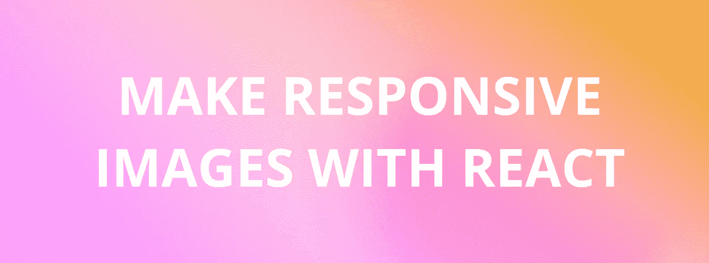
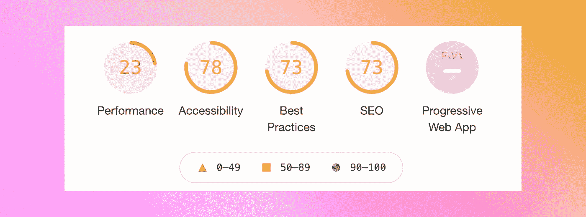

# 如何使用 React 使您的图像具有响应性

> 原文：<https://javascript.plainenglish.io/use-react-to-make-your-images-responsive-a5e6791f19f0?source=collection_archive---------15----------------------->



最近，我和一个客户一起工作，他想提高他们网站的性能。他们是一个交换加密货币的平台，他们的界面加载时间太长，导致用户体验不佳。



我做的第一件事是使用 **Lighthouse 进行评估。**设置[非常简单](https://developers.google.com/web/tools/lighthouse)，他们提供的报告也非常有用。以上是客户网站的初始分数。

如你所见，不是特别好。我开始思考我可以改进的地方，并注意到他们调整图片大小的方式。它们都很大！甚至只需要在桌面上渲染成 200 像素宽的图像也来自 1000 像素的源图像。

在某种程度上，这是有道理的。浏览器可以自动调整图像大小，因此存储高质量的文件可以确保图像在缩小时不会模糊或失真。

但是，浏览器有选择地调整页面上每个图像的大小也需要时间。这个时间加起来会延迟页面的初始呈现。那么有什么更好的选择呢？

# **解决方案:带有“srcSet”的响应式图像**

这是一个非常有用的 HTML 属性，我很惊讶之前没有教过它。使用`srcSet`可以为同一幅图像提供多种尺寸，并根据显示器的尺寸提示浏览器哪幅图像最合适。它真的可以加速页面的初始渲染。

下面是一个为图像提供常规`src`属性的示例:

```

```

以下是 srcSet 的一个示例:

```

```

正如您所看到的，提供一个`srcSet`意味着编写更多的代码，但是它实际上很容易理解。如果您再次查看`srcSet`代码，您可以看到发生了什么。

图像有四个版本:a **小**(image small)**中**(image medium)**大**(image large)**特大** (imageXLarge)。

每个图像旁边都有一个对其大小的引用。 **320w** 表示该图像的宽度为 320 像素，以此类推。这使得浏览器更容易找到要使用的图像版本，而不是自己调整它们的大小。它可以大大节省时间。

# 调整图像大小

为了正确使用`srcSet`属性，您需要为每张图片提供不同的版本。这个过程需要一点时间，但是性能优势是值得的。

我喜欢使用这篇文章中的图表来决定包含哪些图像尺寸。我还使用了[这个](https://www.iloveimg.com/)图像转换器，它根据像素宽度生成图像的多个版本。

虽然设置需要一些时间，但是`srcSet`属性在幕后做了很多工作来帮助 React 站点的性能。

就是这样！希望你能充分利用这篇文章。

*更多内容尽在*[*plain English . io*](http://plainenglish.io/)