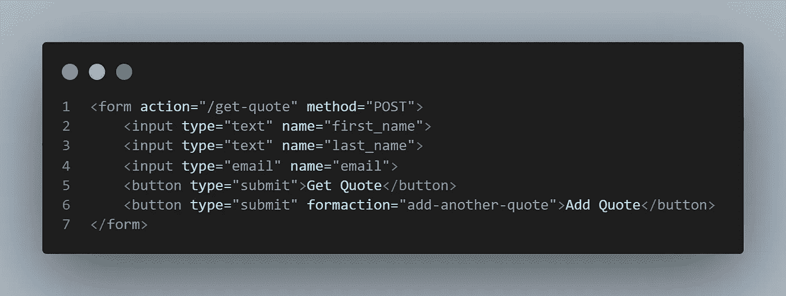

# 请将表单操作属性与按钮的“Form Action”属性结合使用

> 原文：<https://javascript.plainenglish.io/use-the-form-action-attribute-in-conjunction-with-the-button-formaction-attribute-47a7c17e476e?source=collection_archive---------16----------------------->

嘿，你好！欢迎来到我的博客，我在这里发布了我作为一名自学成才的开发人员的历程。你可以点击 [***这里***](https://github.com/Jclewis1989) *找到我的 GitHub。*


[Miguel A. Padrinan](https://www.pexels.com/@padrinan) — [pexels](http://www.pexels.com)

## 快揭秘！

> 这是一个非常简短的帖子，目的是启发那些有特定用例的读者，他们需要在一个表单中有两个或更多具有不同操作的提交按钮。如果这适用于你！这篇文章可能会有所帮助。

你很可能熟悉 HTML 表单，它的开始和结束标签，一些属性，如方法，动作和类。在大多数情况下，这足以生成高质量的 web 应用程序！您还熟悉 HTML 按钮及其属性。然而，HTML 按钮元素有一个不常见的属性，它可以和表单一起使用！下面我们来仔细看看。

大多数情况下，表单只有一个提交按钮，表单就此结束，但是其他情况下，表单可能需要两个或更多的按钮来表示代码中的附加发布路径。无论您的用例是什么，都有一种方法可以做到这一点。看下面的代码截图。



Screenshot by Author — James Lewis

在上面的示例截图中，有一个表单动作属性，它将数据发布到/get-quote。此外，还有一个我们可以使用的按钮属性叫做[**for action**](https://www.w3schools.com/tags/att_input_formaction.asp)。如果我们点击“添加报价”而不是“获取报价”，那么“/添加另一个报价”的路线将优先于“/获取报价”的路线。定义来自下面的 [W3SCHOOLS](https://www.w3schools.com/tags/att_input_formaction.asp) 。

> 属性指定了提交表单时处理输入控件的文件的 URL。`formaction`属性覆盖了`<form>`元素的`[action](https://www.w3schools.com/tags/att_form_action.asp)`属性。

这为什么有用？当然，在某些用例中，客户/用户在提交数据时会希望有两个或更多不同的选项。您可以使用多少个具有 formaction 属性的按钮是没有限制的，在我自己的项目中，我最需要的就是在一个表单中提交两个按钮。但是只要知道这个未知属性是存在的，并且容易实现！

希望这个快速的帖子能帮助到某个人！也许能揭示一个不太为人所知的按钮属性:

```
<button formaction=””>Second Submit</button>
```

编码快乐！

*更多内容尽在*[*plain English . io*](http://plainenglish.io/)