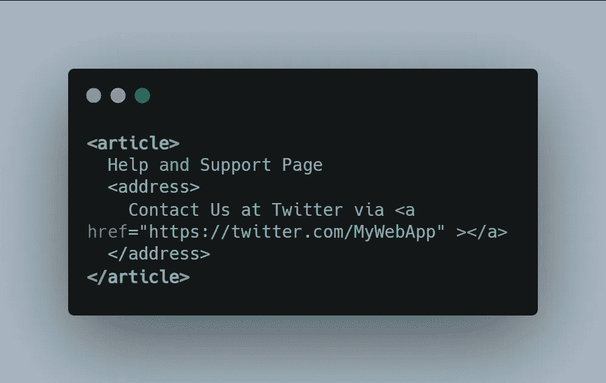
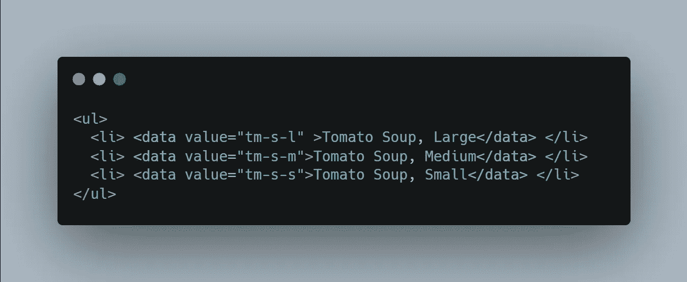
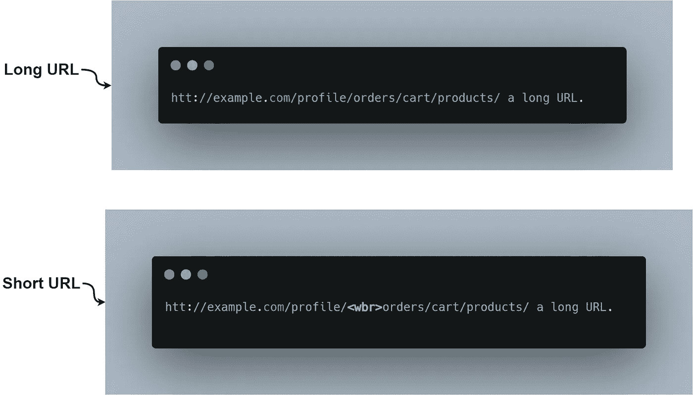

# 6 个 HTML 标签用于改进网络搜索引擎优化

> 原文：<https://javascript.plainenglish.io/use-these-8-html-tags-for-improved-web-seo-ca9763c951b4?source=collection_archive---------7----------------------->

## 改善网络搜索引擎优化的鲜为人知的 HTML 标签

你应该关心你在**网络应用**中使用的 ***HTML 标签*** 的原因有很多，如果你想创建更多用户能够理解 的 ***网页***并且在搜索引擎结果中显示在最前面的级别，那么这里有一些你以前可能从未使用过的不太为人知的 HTML 标签。

## 1.

此标签仅用于基本目的，例如向网站添加地址以及地址格式中其他看起来熟悉的数据。但是，这个标签用来提供一个联系信息给最近的父 **<条>** 或 **<体>** 元素。

***例如:***

*   假设您必须将 ***联系人*** 信息添加到应用程序的帮助&支持页面，为此，您可以简单地使用这个 **<地址>** 标签来添加联系人信息。

*   使用这个标签的一个好处是，万一有人在搜索引擎上搜索你的地址、电话号码等，他们将能够轻松地找到你的信息。

## 2.

如果您真的想以更多机器可读的格式提供时间日期，那么 **<时间>** 标签是一个很好的标签，如果您的应用程序包含博客文章或任何需要时间戳的内容，那么您可以使用这个标签。

***例如:***

*   你一定观察过**Medium.com、**上的一些时间戳，其中时间戳描述了持续时间，这意味着阅读这篇博文可能需要多长时间(阅读时间)。

*   在很多情况下，您可以使用 **< time >** 标签来帮助您以机器可读的格式编写时间戳。

## 3.

在我们的应用程序中，有时我们不得不使用缩写&大多数情况下，用户对缩写很熟悉，但是如果你需要补充一些东西，你可以使用这个标签。这个标签还带有一个 ***标题*** 属性，您可以用它来命名您的短语。

***例如:***

## 4.<data></data>

一个独特的标签&如果你有一个运行在线商店的 Web 应用程序，其中每种商品都有多种变化，那么这个标签将帮助你简化事情。

***例如:***

*   假设您有一个在线订餐的 Web 应用程序，其中有不同数量的食物。在这种情况下，您可以使用 ***<数据>*** 标签来用唯一的 **ID** 来表示每个产品。

## 5.<wbr>

您一定经历过长 URL 是您的应用程序中的一个主要问题，它会导致小设备(移动设备)上的水平滚动。在这种情况下， ***< wbr >*** 标签是表示长 URL 的一个很好的解决方案，你只需要在你想要断开 URL 的地方添加 ***< wbr >*** 标签，这将使在不同屏幕尺寸上的显示更好。

***例如:***

## 6.