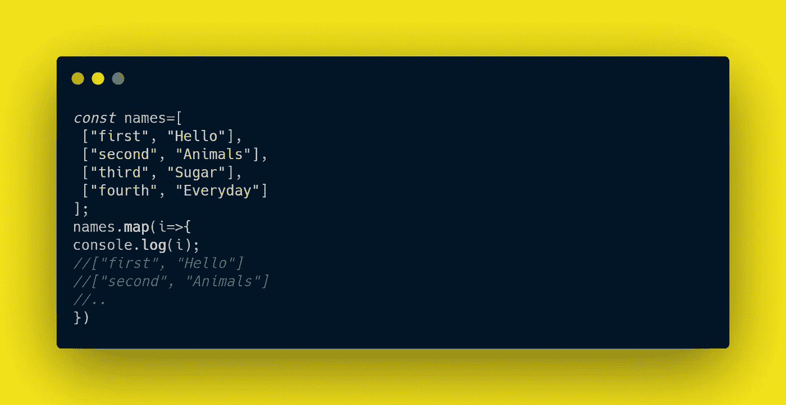

# 使用这些方法可以在 JavaScript 中轻松地迭代对象

> 原文：<https://javascript.plainenglish.io/use-these-methods-to-iterate-over-objects-easily-in-javascript-f085ab4fd111?source=collection_archive---------11----------------------->

Photo by [Roozbeh Eslami](https://unsplash.com/@roozbeheslami?utm_source=medium&utm_medium=referral) on [Unsplash](https://unsplash.com?utm_source=medium&utm_medium=referral)

对象是 JavaScript 中最奇怪的数据收集方法，而且可能是最常用的方法，尽管您可能认为它可能是数组。JavaScript 的核心以及我们如何对待数据都是关于对象的。

在 JavaScript 中，一切都可以被视为一个对象。记住你使用了多少方法来操作字符串，你使用了多少数组方法，或者你是如何通过函数创建对象的。

我不是在用一种奇特的方式说那件事。创建一个函数、数组和一个对象，然后使用`instanceof`操作符测试它们是否是一个对象的实例，如下例所示。结果会让你大吃一惊。

First Example

# 对象方法。

当我第一次学习如何使用对象时，我有一个任何 JavaScript 开发人员在学习对象时都会有的问题——我如何迭代一个对象？嗯，答案是使用`for in`循环。与数组相比，迭代一个对象有点奇怪和混乱。

对于初学者来说，使用`for in`循环在第一次尝试时会很混乱，因为你会混淆获取键值和键值的名称，另外你可能会陷入在迭代时改变对象的陷阱。

内置对象方法承担了编写一个`for in`循环来获取对象的键或值的负担，因此我们可以用一行 *Object.values(* )方法做同样的事情，而不是用三行`for in`循环将对象属性的值存储在一个数组中。

## Object.values()

Second Example

上面的例子使用了 *Object.values()* 方法获取一个对象中的所有值，将它们存储在一个数组中，然后使用 *map()* 方法遍历该数组。

如果我们决定获取一个对象的键呢？嗯，这次我们将使用 *Object.keys()* 方法，就像我们使用 *Object.values()* 方法一样。

## Object.keys()

Third Example

如果我决定同时获取键和值呢？我应该用`for in`循环还是什么回到老风格？不，对象方法也支持我们。您可以使用 Object.entries()方法，但是您应该注意这个方法。

## Object.entries()

Fourth Example

在上面的例子中，我们没有像以前用其他方法那样得到一个值。这一次，我们正在处理一个键值存储。因此，我们将以一个数组的数组结束，其中每个内部数组包含两个项目，第一个是键名称，第二个是键值，如下所示。

Fifth Example

将对象转换成数组时， *Object.entries()* 方法非常方便。

# 一锤定音

现在你有很好的工具来迭代复杂的集合，比如对象，甚至把它们转换成数组，但是试着明智地使用它们或者当它们有意义的时候使用它们。如果它们太复杂，你仍然可以依靠`for in`循环。

[*更多内容尽在 plainenglish.io*](http://plainenglish.io/)